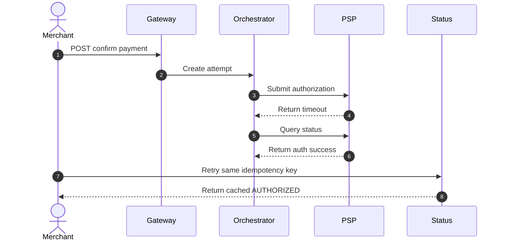

# Idempotency and Double-Charge Protection — Payment Orchestration and Wallet Platform

This document defines the controls that prevent duplicate charges, duplicate captures, duplicate refunds, and duplicate payouts across API retries, background retries, provider callbacks, and operator actions.

## 1. Threat Model

Duplicate financial effects can originate from:

- merchant client retry after socket timeout
- API gateway retry or load balancer reconnect
- provider timeout with unknown result
- provider webhook redelivery or event replay
- operator repeating capture, refund, or payout actions from the console
- scheduler rerunning payout or settlement jobs

## 2. Idempotency Key Model

| Scope | Key Components | TTL | Result |
|---|---|---|---|
| Public API write | tenant, route template, HTTP method, idempotency key | 24 hours minimum | Cached HTTP response plus resource ID |
| Provider callback | provider, provider event ID | 90 days or provider retention window | Single internal event emission |
| Ledger posting | business event type, business event ID, posting version | Permanent | Single effective journal version |
| Batch jobs | job type, merchant, business date, provider, currency | Permanent for closed periods | Deterministic rerun without duplicates |

Recommended idempotency record fields:

- `scope_hash`
- `request_hash`
- `status` with values `IN_PROGRESS`, `SUCCEEDED`, `FAILED_REPLAYABLE`, `FAILED_FINAL`
- `resource_type` and `resource_id`
- `provider_reference`
- `response_code` and serialized response body
- `expires_at`

## 3. Request Handling Algorithm

1. Compute the scope key before any side effect.
2. Attempt transactional insert of `IN_PROGRESS` record.
3. If insert succeeds, continue processing.
4. If a matching scope exists with the same request hash and terminal status, return the stored response.
5. If a matching scope exists with a different request hash, return `409` conflict.
6. If a matching scope exists in `IN_PROGRESS`, return operation status and do not launch a second execution.
7. Persist final response only after business write and outbox write succeed.

## 4. Ambiguous PSP Outcome Rule

The most dangerous duplicate-charge scenario is a timeout after the PSP may already have authorized or captured the payment.

**Mandatory rule:** never fallback to a second PSP while the first PSP could still have produced a successful authorization for the same payment intent.

Required handling:

- mark attempt `PSP_RESULT_UNKNOWN`
- query provider status using idempotency key or merchant reference
- if provider confirms no authorization exists, fallback may proceed
- if provider confirms authorization exists, persist that reference and continue with the original attempt
- if provider status remains unknown, put payment into `PROCESSING` or `OPERATIONS_HOLD` and notify merchant via status API

## 5. Duplicate Capture and Refund Controls

| Operation | Protection |
|---|---|
| Capture | Lock on payment intent plus remaining capturable amount check. Provider capture request reuses a capture-specific idempotency key. |
| Refund | Lock on payment intent plus remaining refundable amount check. Refund ID is created before the provider call. |
| Payout | Lock on merchant wallet and payout schedule key. Bank status is queried before dispatch retry. |
| Chargeback intake | Deduplicate on provider case ID and webhook event ID. |

## 6. Sequence for Timeout and Safe Retry

## 7. Webhook and Callback Deduplication

- Store raw callback payload before parsing.
- Reject invalid signature without mutating payment state.
- Use provider event ID as the primary dedupe key and provider reference as the secondary dedupe key.
- Downstream consumers must still dedupe on business event ID because providers may reissue different callback IDs for the same real-world event.

## 8. Detection Signals

- same merchant reference seen across multiple provider authorizations
- payment intents with more than one successful auth attempt
- multiple payouts with same merchant, date, amount, and destination fingerprint
- repeated `IN_PROGRESS` idempotency records exceeding timeout threshold

## 9. Incident Response

1. Freeze further retries for the affected aggregate.
2. Query provider and ledger authoritative state.
3. Determine whether duplicate external movement occurred or only duplicate internal requests were attempted.
4. If duplicate external charge happened, issue supervised refund and create incident-linked compensating journals.
5. Add the provider reference to the duplicate-prevention watchlist for reconciliation and chargeback monitoring.
