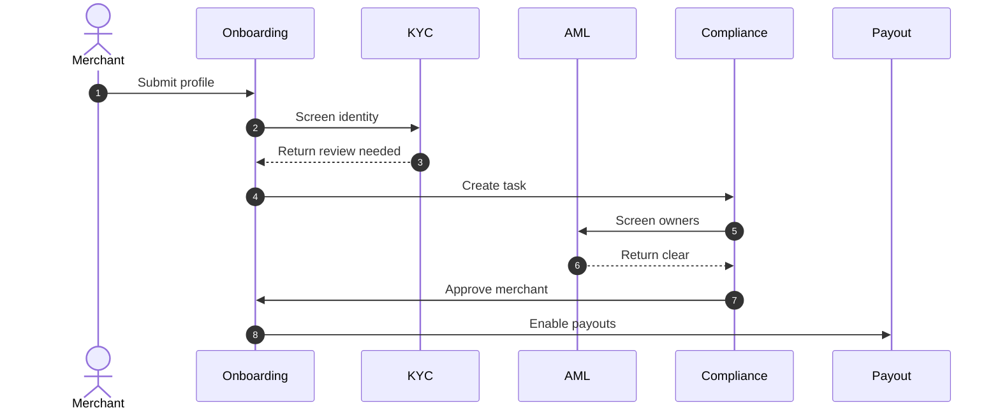

# KYC Onboarding Edge Cases — Payment Orchestration and Wallet Platform

Full KYB document review is out of scope for the platform, but merchant onboarding, payout activation, wallet enablement, and AML gating depend on external KYC and sanctions outcomes. This document covers the edge cases that must be handled so merchants can onboard safely without blocking unrelated platform functions.

## 1. Merchant Onboarding States

| State | Meaning | Allowed Capabilities |
|---|---|---|
| `DRAFT` | Merchant has not submitted required profile data | Read-only config |
| `SUBMITTED` | Initial package received | No payouts, no wallet debits |
| `PROVIDER_PENDING` | External KYC provider has not returned a result | Continue profile edits only |
| `ACTION_REQUIRED` | Missing or inconsistent data | Continue edits, no payouts |
| `VERIFIED` | Required KYC and AML checks passed | Full payout and wallet debit access |
| `RESTRICTED` | Sanctions hit, high-risk review, or legal hold | Credits allowed, payouts blocked |
| `REJECTED` | Merchant cannot be activated | No financial outflows |

## 2. Edge Cases and Required Behavior

| Scenario | Detection | Required Action |
|---|---|---|
| Business legal name mismatch | Provider returns low-confidence match | Move to `ACTION_REQUIRED`; capture provider response details for operator review |
| Beneficial owner threshold changes | Merchant updates ownership structure | Re-open KYC review; keep payouts blocked until refreshed approval |
| Expired identity document | Document expiry falls inside preconfigured window | Notify merchant and set payout release hold while leaving inbound payments enabled |
| Duplicate merchant or bank account | Same registration or bank fingerprint appears on another account | Create compliance case; allow no payouts until resolved |
| Provider outage | KYC provider unavailable beyond SLA | Keep merchant in `PROVIDER_PENDING`; queue retry and alert onboarding ops |
| Sanctions or PEP match | AML provider returns positive match | Move to `RESTRICTED`; require compliance officer decision and rationale |

## 3. Gating Rules

- New wallets may be provisioned before full verification if product policy allows inbound-only accounts.
- Payouts require `VERIFIED` status and a non-blocking AML result at release time, not just at onboarding time.
- Merchant routing configuration may be edited while onboarding is pending, but PSP credential activation must not happen until compliance approval exists.
- Existing merchants with stale KYC keep receiving settlements but cannot initiate payouts or wallet debits that move funds off-platform.

## 4. Onboarding and Payout Hold Sequence

## 5. Recovery Procedures

- Replaying onboarding jobs must preserve previous provider payloads for audit comparison.
- Manual overrides must record the provider case, approver identity, and override expiry.
- If a merchant is downgraded from `VERIFIED` to `RESTRICTED`, all scheduled payouts for that merchant move to `PENDING_REVIEW` and their wallet `available` balance is rechecked.

## 6. Prevention and Monitoring

- Alert on merchants stuck in `PROVIDER_PENDING` or `ACTION_REQUIRED` beyond SLA.
- Run duplicate-bank-account and duplicate-owner fingerprint checks nightly.
- Test onboarding webhooks from providers in sandbox and staging to ensure mapping changes do not silently unblock payouts.
