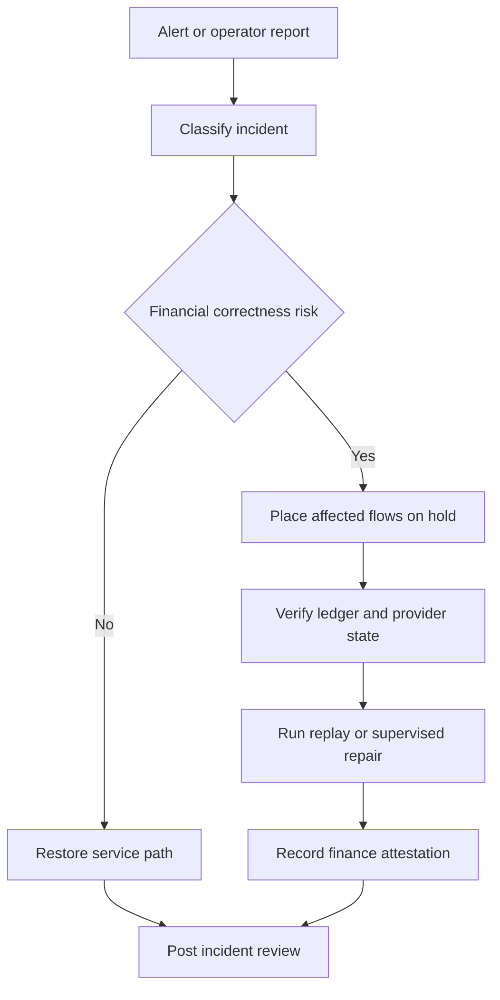

# Operations Edge Cases — Payment Orchestration and Wallet Platform

This document defines day-2 operational procedures for payment, wallet, ledger, settlement, payout, and compliance incidents. It focuses on preserving financial correctness first and customer convenience second.

## 1. Incident Classes

| Class | Examples | First Response |
|---|---|---|
| Availability incident | Gateway outage, Kafka outage, provider connectivity loss | Shift traffic, preserve idempotency state, pause risky retries |
| Financial correctness incident | Ledger imbalance, duplicate payout, settlement batch mismatch | Freeze affected aggregates and block payouts |
| Compliance incident | PAN outside PCI zone, sanctions bypass, audit log gap | Invoke security and compliance response plan |
| Data freshness incident | Stale balance projections, delayed reconciliation files | Switch UI to degraded mode and surface freshness warning |

## 2. Minimum Operational Dashboards

- payment authorization rate, timeout rate, and fallback rate by provider
- ledger posting latency and invariant failure count
- wallet reserve and payout hold aging
- settlement batch progress and rerun count
- reconciliation break count by severity and aging bucket
- webhook retry queue depth and dead-letter count

## 3. Immediate Safety Switches

| Switch | Use |
|---|---|
| Disable PSP route | Remove a degraded provider from routing without redeploy |
| Disable payout release | Stop new bank dispatch while preserving payout creation |
| Pause refund dispatch | Stop outbound refund calls while allowing request intake |
| Freeze repair tooling | Prevent manual ledger adjustments during an active investigation |
| Read-only operator console | Avoid conflicting manual actions during incident response |

## 4. Incident Triage Flow

## 5. Replay and Backfill Rules

- Event replay uses original event IDs and writes a replay audit trail.
- Reconciliation reruns operate on versioned file snapshots; never overwrite old imported files.
- Ledger repair tools may create new journals only. They may not edit balances directly.
- If provider callbacks were missed during downtime, perform provider API backfill before reopening fallback routing.

## 6. Operator Approval Matrix

| Action | Single Approver | Dual Approval |
|---|---|---|
| Replay non-financial webhook | Yes | No |
| Re-open payment in `PSP_RESULT_UNKNOWN` | Yes | No |
| Post ledger adjustment below threshold | Yes | No |
| Post ledger adjustment above threshold | No | Yes |
| Release payout under compliance hold | No | Yes |
| Clear high-severity reconciliation break | No | Yes |

## 7. Edge Cases to Simulate Regularly

- provider returns success after client timeout
- Redis idempotency store failover during online traffic
- Kafka lag delays settlement candidate consumption
- bank return file arrives after payout marked paid
- stale KYC result blocks scheduled payout window
- audit sink unavailable while security-sensitive admin action occurs

## 8. Operational Acceptance Criteria

- Every critical flow has a documented hold, replay, and recovery path.
- Finance on-call can reconcile any payment, refund, chargeback, or payout using correlation and provider references.
- No incident runbook requires direct database updates to mutable financial state.
