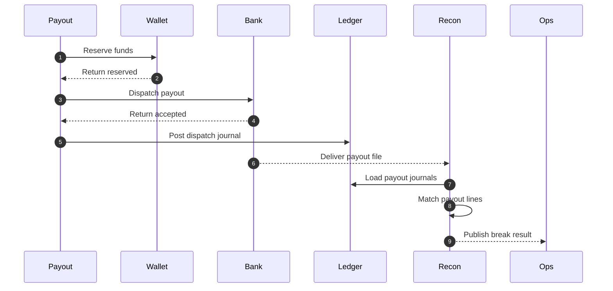

# Payout Reconciliation Edge Cases — Payment Orchestration and Wallet Platform

This document covers payout mismatches, bank returns, duplicate release prevention, and the reconciliation logic that ties payout journals to bank rail outcomes.

## 1. Reconciliation Sources for Payouts

| Source | Required Identifiers |
|---|---|
| Payout aggregate | `payout_id`, merchant, destination fingerprint, amount, currency, payout state |
| Ledger journals | `business_event_id`, reserve journal, dispatch journal, return journal |
| Bank or rail file | bank reference, amount, currency, value date, return code |
| Provider webhook or status API | provider payout reference, final rail status |

## 2. High-Risk Edge Cases

| Scenario | Failure Mode | Required Response |
|---|---|---|
| Scheduler reruns same payout window | Duplicate bank dispatch | Use payout schedule key and wallet reserve lock; replay existing payout objects |
| Bank dispatch times out | Unknown rail outcome | Mark `RAIL_RESULT_UNKNOWN`; poll bank before retry |
| Bank marks payout as paid, later sends return | Merchant was already marked paid | Create payout return journal and reopen reconciliation break |
| Merchant KYC becomes restricted after scheduling | Scheduled payout should not leave platform | Keep funds in reserved state and move payout to `PENDING_REVIEW` |
| Bank deducts unexpected fee | Net amount differs from expected | Classify as `UNMAPPED_FEE` break and require finance review |
| Currency conversion for payout uses stale rate | Wrong merchant debit | Reverse payout quote, refresh rate, and require re-approval |

## 3. Recommended Payout State Model

`CREATED -> RESERVED -> PENDING_REVIEW? -> DISPATCHING -> IN_TRANSIT -> PAID | RETURNED | FAILED | CANCELLED`

Additional rules:

- `RESERVED` means funds already left merchant `available` balance.
- `PENDING_REVIEW` preserves the reserve but forbids bank dispatch.
- `RETURNED` must always have a linked compensating journal.

## 4. Dispatch and Reconciliation Sequence

## 5. Break Categories

| Category | Example | Default Handling |
|---|---|---|
| `TIMING` | Bank file delayed while payout is already `IN_TRANSIT` | Wait inside aging threshold |
| `MISSING_FROM_BANK` | Dispatch journal exists but bank line missing | Query bank status and keep reserve watch |
| `MISSING_FROM_LEDGER` | Bank file shows payout or return with no journal | Create incident and supervised repair |
| `AMOUNT_MISMATCH` | Bank amount differs from reserved amount | Block merchant from instant payouts until resolved |
| `DUPLICATE_PAYOUT` | Two bank lines match one payout key | Freeze merchant payout release and escalate |
| `UNMAPPED_FEE` | Bank deducted fee not represented internally | Post separate fee adjustment after approval |

## 6. Recovery Playbooks

- For `RAIL_RESULT_UNKNOWN`, poll the bank or provider API before any resubmission.
- For payout return, post return journal, release or re-reserve funds based on compliance status, and notify merchant.
- For duplicate payout suspicion, stop all scheduled payouts for the merchant until the bank confirms the true dispatch count.
- For missing ledger journal, reconstruct from payout aggregate and bank evidence using supervised repair tooling.
