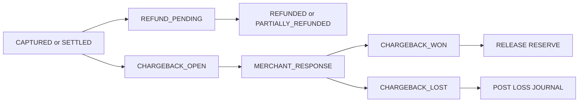

# Refunds and Chargebacks Edge Cases — Payment Orchestration and Wallet Platform

Refunds and chargebacks are financially coupled but operationally different. Refunds are merchant-initiated customer remediations, while chargebacks are network-driven disputes that can override merchant intent. Both require strict amount controls, reserve handling, and auditability.

## 1. Refund Edge Cases

| Scenario | Risk | Required Handling |
|---|---|---|
| Partial capture followed by full refund request | Refund exceeds captured amount | Compute refundable amount from captured totals only |
| Refund requested while capture still pending settlement | Merchant funds not yet available | Post refund against pending settlement liability |
| Provider accepts refund asynchronously | Duplicate callbacks or stale status | Keep refund in `PROCESSING` until provider webhook or poll confirms final state |
| Merchant retries refund after timeout | Duplicate refund | Replay by refund idempotency key and original refund ID |
| Refund after chargeback opened | Double compensation to cardholder | Block or require manual override based on dispute stage |

## 2. Chargeback Edge Cases

| Scenario | Risk | Required Handling |
|---|---|---|
| Duplicate dispute webhook | Double reserve debit | Deduplicate by provider case ID and event ID |
| Dispute arrives after full refund | Merchant could be debited twice | Link chargeback to prior refund and create provider inquiry workflow |
| Merchant balance insufficient on chargeback lost | Platform carries exposure | Move shortfall to recovery receivable and freeze payouts |
| Evidence uploaded after deadline | False expectation of representment | Store evidence but mark it late and do not auto-submit |
| Chargeback later reversed or won after provisional loss | Merchant reserve stuck | Post compensating journal and release reserve |

## 3. Reserve and Hold Rules

- On chargeback open, attempt to move funds from `wallet_available` to `wallet_reserved`.
- If no funds are available, create a reserve deficit record and stop future payouts.
- Refunds should use pending settlement or available balance before touching reserved chargeback funds.
- Platform-configured rolling reserves remain separate from dispute-specific reserves for reporting clarity.

## 4. Lifecycle View

## 5. Detection Signals

- refund total approaching captured total with multiple concurrent requests
- dispute webhook count greater than chargeback case count
- aged reserved balances with no dispute status change
- provider fee spikes tied to chargeback loss events

## 6. Recovery Procedures

1. Rebuild refund or dispute timeline from provider events and internal audit history.
2. Verify merchant liability using journal chain rather than dashboard balances.
3. Post compensating journals for wrongly applied reserves or fees.
4. Notify merchant with clear distinction between refund status and chargeback status.
