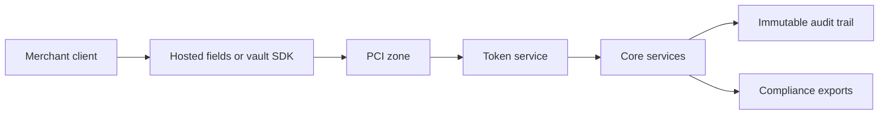

# Security and Compliance Edge Cases — Payment Orchestration and Wallet Platform

This document covers the edge conditions that can compromise PCI scope, secrets management, auditability, sanctions controls, or regulatory reporting. These are not optional controls; they are production gate requirements.

## 1. Sensitive Data Boundaries

| Data Class | Allowed Locations | Never Allowed |
|---|---|---|
| PAN and CVV | Vault or PSP-hosted collection only | Core service logs, analytics stores, support tickets |
| Bank account full details | Bank rail adapter secrets store and tokenized payout profile | General-purpose logs or chat exports |
| PII | Region-pinned transactional stores and compliance exports | Cross-region debug dumps without residency approval |
| Audit evidence | Immutable object storage with retention policy | Editable wiki or ad hoc local files |

## 2. High-Risk Edge Cases

| Scenario | Detection | Required Response |
|---|---|---|
| Raw PAN appears in non-PCI log | DLP alert or log scrubber finding | Treat as Sev-1, rotate affected credentials, quarantine logs, notify compliance |
| API key leak | Unusual source IPs, sudden error spike, leaked credential report | Revoke key, require new key issuance, review impacted requests |
| Webhook secret rotation overlap fails | Merchants start rejecting valid events | Support dual-secret validation window and expose current secret version |
| Audit log sink unavailable | Missing audit trail for admin actions | Fail closed for high-risk admin mutations until audit path is restored |
| Region residency misrouting | Data copied to wrong region | Stop replication, quarantine artifacts, open compliance incident |
| KMS or HSM key rotation mismatch | Old ciphertext can no longer decrypt | Keep decrypt-old and encrypt-new overlap until validation completes |

## 3. PCI and Compliance Boundary Diagram

## 4. Mandatory Control Rules

- Administrative actions affecting payouts, routing, or ledger repairs require strong authentication and immutable audit records.
- Break-glass access must use short-lived credentials, ticket reference, and session recording.
- Secret rotation must be automated and tested in staging with the same mechanism used in production.
- Compliance exports must pseudonymize data not required by the receiving regulator or auditor.
- Audit retention is at least seven years for financial and security events.

## 5. Verification Checklist

| Control Area | Verification |
|---|---|
| Secrets | Quarterly rotation rehearsal and secret age report |
| PCI | Quarterly network segmentation check and annual QSA evidence pack |
| AML and sanctions | Test blocked payout path and override workflow |
| Audit logs | Daily completeness check against admin and financial event counts |
| Data residency | Automated policy test on storage bucket and database placement |

## 6. Recovery and Reporting

- Security incidents touching financial flows require joint ownership from security, payments engineering, and compliance.
- Any manual data repair arising from a security incident must still use the supervised journal or configuration workflow.
- Post-incident reports must record affected merchants, time window, control failure, remediation, and evidence of restored compliance.
