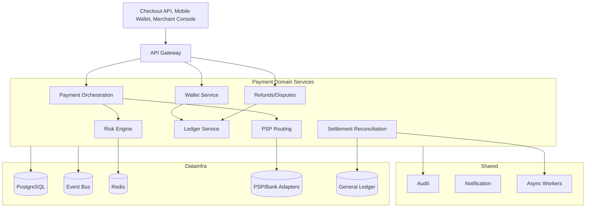

# Architecture Diagram

```mermaid
flowchart TB
    Channels[Checkout API, Mobile Wallet, Merchant Console] --> Edge[API Gateway]

    subgraph Services[Payment Domain Services]
      Orchestration[Payment Orchestration]
      Wallet[Wallet Service]
      Risk[Risk Engine]
      Routing[PSP Routing]
      Refunds[Refunds/Disputes]
      Reconciliation[Settlement Reconciliation]
      Ledger[Ledger Service]
    end

    Edge --> Orchestration
    Edge --> Wallet
    Edge --> Refunds

    Orchestration --> Risk
    Orchestration --> Routing
    Wallet --> Ledger
    Refunds --> Ledger

    subgraph Shared
      Audit[Audit]
      Notify[Notification]
      Jobs[Async Workers]
    end

    Services --> Audit
    Reconciliation --> Jobs

    subgraph DataInfra
      DB[(PostgreSQL)]
      MQ[(Event Bus)]
      Cache[(Redis)]
      PSP[(PSP/Bank Adapters)]
      GL[(General Ledger)]
    end

    Services --> DB
    Services --> MQ
    Routing --> PSP
    Reconciliation --> GL
    Risk --> Cache
```
