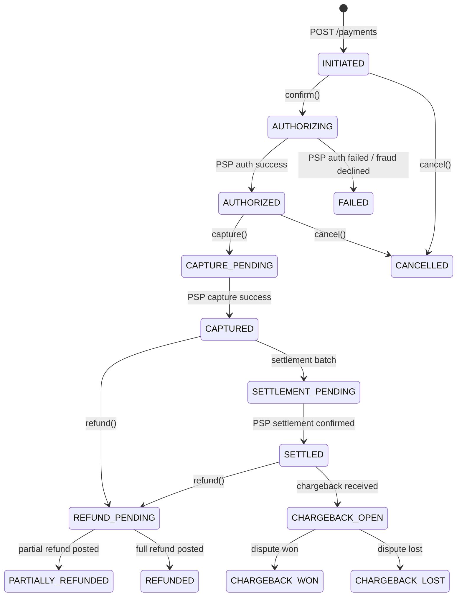

# Architecture Diagram — Payment Orchestration and Wallet Platform

## 1. Architecture Overview

### Guiding Principles

| Principle | Description |
|---|---|
| **Event-Driven** | All state changes produce immutable domain events on Kafka; downstream consumers react asynchronously, decoupling write latency from read models and batch jobs. |
| **Stateless Services** | Every microservice instance holds zero in-process state; all state lives in PostgreSQL, Redis, or Kafka. This enables horizontal scaling and zero-downtime deploys. |
| **CQRS** | Write path (commands) and read path (queries) are separated. Commands mutate state and publish events; read models are materialized into Redis or read replicas for low-latency queries. |
| **Saga Pattern** | Long-running distributed transactions (payment authorization → capture → settlement) are orchestrated via sagas. Each saga step has an explicit compensating transaction to guarantee eventual consistency without distributed locks. |
| **Defense in Depth** | PCI DSS Zone segmentation, WAF at edge, mTLS between services, card data never touches application services (tokenized at vault boundary), RBAC + audit logging on all mutations. |
| **Bulkhead Isolation** | Each PSP adapter runs in its own thread pool / connection pool. A degraded Stripe connection cannot starve Adyen threads. |

---

## 2. Full Microservices Architecture Diagram

```mermaid
flowchart TB
    subgraph External["External Actors"]
      Client["Merchant / Customer Client\n(Web, Mobile, Server SDK)"]
    end

    subgraph Gateway["Edge / Gateway Layer"]
      APIGW["API Gateway + WAF\n(Kong + NGINX)"]
      AuthSvc["Auth Service\n(OAuth2 / JWT / mTLS)"]
    end

    subgraph CoreServices["Core Payment Services"]
      OrchSvc["Payment Orchestration Service\n(Saga Coordinator)"]
      WalletSvc["Wallet Service\n(Balance & Transfers)"]
      FraudSvc["Fraud & Risk Service\n(ML Scoring Engine)"]
      LedgerSvc["Ledger Service\n(Double-Entry Accounting)"]
      VaultSvc["Card Vault / Tokenization\n(PCI DSS Isolated)"]
    end

    subgraph FinancialServices["Financial Services"]
      SettleSvc["Settlement Service\n(Batch Aggregation)"]
      FXSvc["FX Rate Service\n(Rate Caching)"]
      PayoutSvc["Payout Service\n(ACH / SWIFT / Faster Payments)"]
      RecSvc["Reconciliation Service\n(Three-Way Match)"]
    end

    subgraph SupportServices["Support Services"]
      NotifSvc["Notification Service\n(Email / SMS / Push)"]
      WebhookSvc["Webhook Delivery Service\n(Retry + Signing)"]
      ReportSvc["Analytics & Reporting\n(OLAP / BI)"]
      SandboxSvc["Sandbox Service\n(Test Mode Simulator)"]
    end

    subgraph PSPAdapters["PSP Adapter Layer"]
      StripeAdp["Stripe Adapter"]
      AdyenAdp["Adyen Adapter"]
      BraintreeAdp["Braintree Adapter"]
      PayPalAdp["PayPal Adapter"]
    end

    subgraph DataLayer["Data Layer"]
      PrimaryDB[("PostgreSQL Primary\n(Write Path)")]
      ReadReplica[("PostgreSQL Read Replica\n(Query Path)")]
      Redis[("Redis\n(Cache + Rate Limiter + Idempotency)")]
      EventBus[("Kafka Event Bus\n(Event Log)")]
      Vault[("HashiCorp Vault\n(Secrets + Card PAN)")]
      S3[("Object Storage S3\n(Settlement Files + Reports)")]
    end

    Client -->|"HTTPS / REST / gRPC"| APIGW
    APIGW -->|"JWT validation"| AuthSvc
    AuthSvc -.->|"token introspection"| APIGW
    APIGW --> OrchSvc
    APIGW --> WalletSvc
    APIGW --> PayoutSvc
    APIGW --> ReportSvc

    OrchSvc -->|"fraud score request"| FraudSvc
    OrchSvc -->|"tokenize card"| VaultSvc
    OrchSvc -->|"post ledger entry"| LedgerSvc
    OrchSvc -->|"route payment"| StripeAdp
    OrchSvc -->|"route payment"| AdyenAdp
    OrchSvc -->|"route payment"| BraintreeAdp
    OrchSvc -->|"route payment"| PayPalAdp
    OrchSvc -->|"FX rate lookup"| FXSvc

    WalletSvc -->|"post ledger entry"| LedgerSvc
    WalletSvc -->|"FX conversion"| FXSvc
    WalletSvc -->|"risk check"| FraudSvc

    SettleSvc -->|"fetch capture records"| PrimaryDB
    SettleSvc -->|"submit settlement file"| StripeAdp
    SettleSvc -->|"submit settlement file"| AdyenAdp
    SettleSvc -->|"post net settlement"| LedgerSvc
    SettleSvc -->|"upload file"| S3

    RecSvc -->|"download PSP files"| S3
    RecSvc -->|"compare ledger"| LedgerSvc
    RecSvc -->|"publish breaks"| EventBus

    PayoutSvc -->|"ledger debit"| LedgerSvc
    PayoutSvc -->|"bank rail dispatch"| StripeAdp

    NotifSvc -->|"consume events"| EventBus
    WebhookSvc -->|"consume events"| EventBus

    OrchSvc -->|"publish PaymentEvents"| EventBus
    WalletSvc -->|"publish WalletEvents"| EventBus
    LedgerSvc -->|"publish LedgerEvents"| EventBus
    SettleSvc -->|"publish SettlementEvents"| EventBus

    OrchSvc --- PrimaryDB
    WalletSvc --- PrimaryDB
    LedgerSvc --- PrimaryDB
    SettleSvc --- PrimaryDB
    FraudSvc --- PrimaryDB

    OrchSvc --- Redis
    FraudSvc --- Redis
    FXSvc --- Redis
    APIGW --- Redis

    VaultSvc --- Vault
    AuthSvc --- Vault
```



---

## 3. Service Responsibilities

| Service | Responsibility | Data Owned | APIs Exposed | Consumes Events | Produces Events |
|---|---|---|---|---|---|
| **API Gateway** | Edge routing, WAF, rate limiting, TLS termination, JWT validation | Rate limit counters (Redis) | All public `/v1/*` endpoints | — | — |
| **Auth Service** | OAuth2 flows, API key management, token introspection, mTLS cert issuance | `credentials`, `api_keys`, `sessions` | `POST /auth/token`, `POST /auth/refresh`, `GET /auth/introspect` | — | `auth.token.issued`, `auth.token.revoked` |
| **Payment Orchestration** | Saga coordination for payment lifecycle; PSP routing, retry, idempotency | `payment_intents`, `payment_attempts` | `POST /payments`, `POST /payments/:id/confirm`, `POST /payments/:id/capture`, `POST /payments/:id/cancel` | `fraud.decision.completed` | `payment.intent.created`, `payment.authorized`, `payment.captured`, `payment.failed` |
| **Wallet Service** | Multi-currency wallet CRUD, balance management, wallet-to-wallet transfers | `wallets`, `wallet_balances`, `wallet_transactions` | `POST /wallets`, `GET /wallets/:id/balance`, `POST /wallets/:id/transfer`, `POST /wallets/:id/topup` | `payment.captured`, `refund.completed` | `wallet.credited`, `wallet.debited`, `wallet.transfer.completed` |
| **Fraud & Risk Service** | Real-time ML fraud scoring, velocity checks, rule engine, case management | `risk_scores`, `fraud_alerts`, `velocity_counters` | `POST /risk/score`, `GET /risk/cases`, `POST /risk/cases/:id/review` | `payment.intent.created`, `wallet.transfer.initiated` | `fraud.decision.completed`, `fraud.alert.raised` |
| **Ledger Service** | Double-entry immutable journal; balance assertions; GL export | `ledger_entries`, `accounts`, `journal_batches` | `POST /ledger/journals`, `GET /ledger/accounts/:id/balance`, `GET /ledger/entries` | `payment.captured`, `refund.completed`, `settlement.posted` | `ledger.entry.posted`, `ledger.balance.updated` |
| **Card Vault / Tokenization** | PAN storage, network tokenization, card fingerprinting | `tokens`, `card_metadata` (PAN in HSM) | `POST /vault/tokenize`, `POST /vault/detokenize`, `GET /vault/tokens/:id` | — | `vault.token.created` |
| **Settlement Service** | Nightly batch: aggregate captures → calculate fees → submit PSP files | `settlement_batches`, `settlement_records`, `fee_records` | `POST /settlements/runs`, `GET /settlements/:id`, `GET /settlements/:id/records` | `payment.captured` | `settlement.batch.created`, `settlement.submitted`, `settlement.posted` |
| **FX Rate Service** | Live and cached FX rates from providers, currency conversion | `fx_rates`, `currency_conversions` | `GET /fx/rates`, `POST /fx/convert` | — | `fx.rate.updated` |
| **Payout Service** | Merchant payout scheduling, bank rail dispatch, payout status | `payouts`, `payout_instructions` | `POST /payouts`, `GET /payouts/:id`, `POST /payouts/:id/cancel` | `settlement.posted` | `payout.initiated`, `payout.completed`, `payout.failed` |
| **Reconciliation Service** | Three-way match: ledger vs PSP file vs bank statement; break queue | `reconciliation_runs`, `reconciliation_breaks` | `POST /reconciliation/runs`, `GET /reconciliation/breaks` | `settlement.submitted` | `reconciliation.completed`, `reconciliation.break.detected` |
| **Notification Service** | Email/SMS/push delivery with template rendering | `notification_logs` | `POST /notifications/send` (internal) | `payment.captured`, `payout.completed`, `fraud.alert.raised` | — |
| **Webhook Delivery Service** | Reliable outbound webhook dispatch with HMAC signing and retry | `webhook_endpoints`, `webhook_deliveries` | `POST /webhooks/endpoints`, `GET /webhooks/deliveries` | All merchant-relevant domain events | — |
| **Analytics & Reporting** | OLAP aggregations, merchant dashboards, finance exports | `report_snapshots` (read-only from replica) | `GET /reports/transactions`, `GET /reports/settlements` | `ledger.entry.posted`, `settlement.posted` | — |
| **Sandbox Service** | Simulates PSP responses, card networks, and bank rails for test mode | Isolated test-mode mirror DB | All production endpoints (under `/sandbox/v1`) | — | All production domain events (test mode) |

---

## 4. Technology Stack

| Component | Technology | Version | Justification |
|---|---|---|---|
| API Gateway | Kong + NGINX | Kong 3.6 | Plugin ecosystem (JWT, rate-limit, WAF), Lua extensibility, Prometheus metrics |
| Core Microservices | Go (Golang) | 1.22 | Low latency, high concurrency with goroutines, small binary footprint, strong stdlib for HTTP/gRPC |
| Fraud / ML Service | Python + FastAPI | Python 3.12, FastAPI 0.110 | Rich ML ecosystem (scikit-learn, XGBoost, PyTorch), async FastAPI for low-overhead REST |
| Service Communication | gRPC (internal), REST (external) | proto3 | gRPC: typed contracts, multiplexed HTTP/2, streaming; REST: merchant-facing simplicity |
| Primary Database | PostgreSQL | 16 | ACID transactions, advisory locks for idempotency, JSONB for flexible event payloads, logical replication |
| Read Replica | PostgreSQL Streaming Replication | 16 | Sub-second replication lag; read scaling for reporting and reconciliation queries |
| Cache / Rate Limiter | Redis | 7.2 | Atomic Lua scripts for token bucket rate limiting; hash sets for idempotency key deduplication |
| Event Bus | Apache Kafka | 3.7 | Ordered, durable, compacted topics; consumer groups for parallel processing; exactly-once semantics with transactions |
| Secret Management | HashiCorp Vault | 1.16 | Dynamic secrets, PKI CA for mTLS, PAN encryption via Transit engine, audit log |
| Card Vault (PAN) | HashiCorp Vault Transit | 1.16 | AES-256-GCM envelope encryption, PCI DSS P2PE compliant isolation |
| Object Storage | AWS S3 (or compatible) | — | Settlement file archival, report exports, audit log offload |
| Service Mesh | Istio (sidecar mTLS) | 1.21 | Automatic mTLS, traffic policy, circuit breaker via Envoy, distributed tracing |
| Observability | OpenTelemetry → Grafana Stack | OTel 1.x | Unified traces (Tempo), metrics (Prometheus/Mimir), logs (Loki); single pane in Grafana |
| CI/CD | GitHub Actions + ArgoCD | — | Declarative GitOps, progressive delivery, automated rollbacks |
| Container Orchestration | Kubernetes | 1.30 | Autoscaling, rolling deploys, PodDisruptionBudgets for HA |

---

## 5. Communication Patterns

### 5.1 Synchronous (Critical Path)

```
Merchant Client
    │  REST/HTTPS
    ▼
API Gateway  ──JWT validation──►  Auth Service
    │
    │  gRPC
    ▼
Payment Orchestration
    ├──gRPC──► Fraud & Risk Service   (pre-auth score, <100ms SLA)
    ├──gRPC──► Card Vault             (tokenize PAN, <50ms SLA)
    ├──gRPC──► FX Service             (rate lookup if cross-currency)
    └──REST──► PSP Adapter            (network call to PSP, timeout 10s)
                   │
                   └──► Card Network → Issuing Bank (external)
```

All synchronous calls use:
- **Idempotency keys** (UUID v4, stored in Redis with 24-hour TTL)
- **Request IDs** propagated via `X-Request-ID` header / gRPC metadata
- **Context deadlines** enforced end-to-end via `context.WithTimeout`

### 5.2 Asynchronous (Event-Driven)

```
Payment Orchestration ──► Kafka topic: payment.events
                                │
              ┌─────────────────┼──────────────────┐
              ▼                 ▼                  ▼
        Ledger Service    Notification Svc    Webhook Delivery Svc
              │
              └──► Kafka topic: ledger.events
                        │
                        ▼
               Settlement Service
                        │
                        └──► Kafka topic: settlement.events
                                  │
                                  ▼
                        Reconciliation Service
```

**Kafka topic conventions:**
- Topic naming: `{domain}.{entity}.{action}` (e.g., `payment.intent.created`)
- Partitioning key: `payment_intent_id` or `wallet_id` (ensures ordering per entity)
- Retention: 7 days for domain events, 30 days for audit events
- Consumers use consumer groups; at-least-once delivery + idempotent consumers

### 5.3 Saga Orchestration — Payment Flow

The Payment Orchestration Service acts as an orchestrating saga coordinator:

```
STEP 1: Fraud Score Request       → [compensating: no-op if declined]
STEP 2: Tokenize Card             → [compensating: delete token]
STEP 3: Reserve Wallet Balance    → [compensating: release reservation]
STEP 4: Submit to PSP (Authorize) → [compensating: void authorization]
STEP 5: Post Ledger Entry         → [compensating: post reversal journal]
STEP 6: Update Payment State      → [compensating: revert state to FAILED]
STEP 7: Emit PaymentAuthorized    → [compensating: emit PaymentFailed]
```

Each saga step is persisted to the `saga_steps` table before execution. On process crash/restart, incomplete sagas are replayed from the last committed step.

---

## 6. Resilience Patterns

### 6.1 Circuit Breaker

Each PSP adapter is wrapped with Resilience4j (Go port: `go-resilience`) circuit breaker:

| State | Trigger | Behaviour |
|---|---|---|
| **Closed** | Default | Requests pass through |
| **Open** | 50% failure rate over 30s sliding window | Fast-fail with `PSP_UNAVAILABLE`; fallback to next PSP in routing table |
| **Half-Open** | After 60s cooldown | 5 probe requests; success → Closed; failure → Open |

### 6.2 Retry with Exponential Backoff

```
Attempt 1: immediate
Attempt 2: 500ms + jitter
Attempt 3: 1000ms + jitter
Attempt 4: 2000ms + jitter
Max attempts: 4 (configurable per PSP)
Non-retryable: 4xx (except 429), card_declined, do_not_honor
```

### 6.3 Bulkhead Isolation

Each PSP adapter maintains an independent connection pool and goroutine worker pool:

| PSP | Max Connections | Worker Pool Size | Queue Depth |
|---|---|---|---|
| Stripe | 200 | 50 | 500 |
| Adyen | 200 | 50 | 500 |
| Braintree | 100 | 25 | 250 |
| PayPal | 100 | 25 | 250 |

Overflow requests receive `RATE_LIMITED` immediately rather than queuing indefinitely.

### 6.4 Rate Limiting (API Gateway)

| Tier | Limit | Window |
|---|---|---|
| Free | 100 requests | per minute |
| Standard | 1,000 requests | per minute |
| Enterprise | 10,000 requests | per minute |
| Internal services | 100,000 requests | per minute |

Rate limiting uses Redis sliding window counter with atomic Lua scripts.

### 6.5 Idempotency

All mutating endpoints require `Idempotency-Key` header. The key is hashed and stored in Redis with the serialized response. Duplicate requests within 24 hours return the cached response without re-executing business logic.

### 6.6 Database HA

- PostgreSQL primary-standby with synchronous replication for zero data loss
- PgBouncer connection pooling (transaction mode, 1000 max connections)
- Read replicas serve all reporting and reconciliation queries
- Automated failover via Patroni with <30s RTO

---

## 7. Payment State Machine



---

## 8. Security Architecture

| Concern | Control |
|---|---|
| **PCI DSS Scope Reduction** | Card PANs only enter the Card Vault (isolated network segment); all other services receive tokens only |
| **mTLS** | All east-west service communication uses mutual TLS via Istio; certificates rotated every 24 hours |
| **Secrets** | No secrets in environment variables or config files; all secrets injected via Vault Agent sidecar at runtime |
| **WAF** | OWASP ModSecurity rules + custom payment fraud rules at API Gateway |
| **Audit Logging** | Every API call, state transition, and admin action written to append-only audit log (Kafka topic: `audit.events`, 90-day retention) |
| **RBAC** | Merchant API keys scoped to specific operations; internal service accounts with least-privilege Vault policies |

