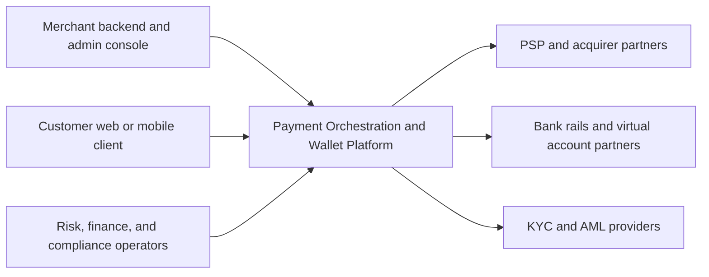
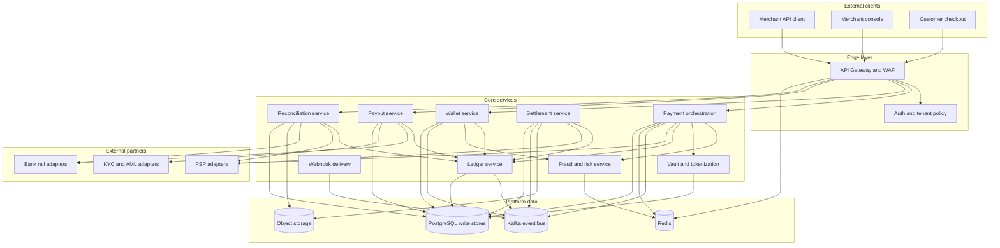
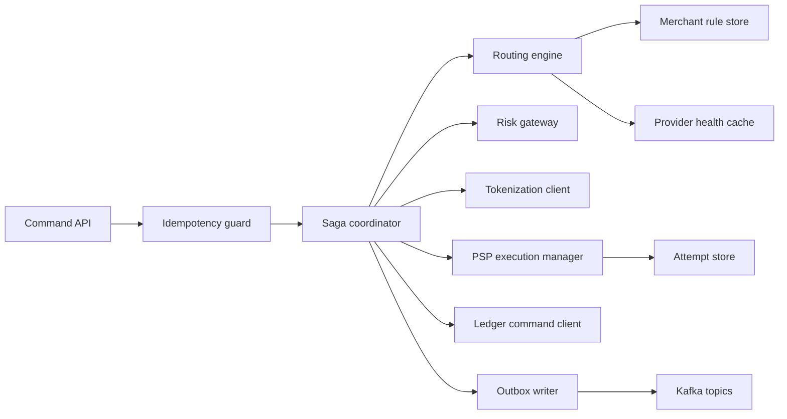
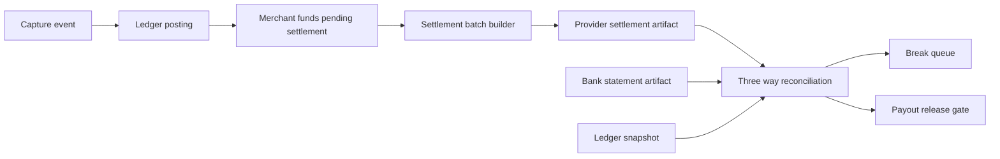

# C4 Diagrams — Payment Orchestration and Wallet Platform

These diagrams describe the payment platform from context through container decomposition, with emphasis on event-driven orchestration, PSP adapters, wallet and ledger isolation, reconciliation, payout controls, and PCI segmentation.

## 1. C1 — System Context

**Context notes:**
- Merchants integrate once with the platform instead of integrating independently with each PSP.
- Customers interact through merchant channels or hosted payment flows.
- Banks and PSPs are external systems of execution; the platform remains the internal system of record for orchestration, ledger, and audit history.

## 2. C2 — Container View

### Container responsibilities

| Container | Responsibilities | Scaling profile |
|---|---|---|
| API Gateway | Authentication, rate limiting, request shaping, WAF, tenant routing | Scale on incoming RPS |
| Payment Orchestration | Payment intent state machine, routing, PSP retry logic, saga coordination | Scale on online transaction TPS |
| Wallet Service | Wallet commands, balance read model, freeze and reserve logic | Scale on wallet command volume |
| Ledger Service | Double-entry journals, account balances, posting API, GL export | Scale on financial event write rate |
| Settlement Service | Batch construction, fee aggregation, provider settlement integration | Scale on nightly batch size |
| Reconciliation Service | Ledger vs PSP vs bank matching, break queue, attestation | Scale on file ingestion and match volume |
| Payout Service | Reserve funds, compliance gates, bank dispatch, return handling | Scale on payout count and payout schedule bursts |
| Fraud and Risk | Real-time rules, velocity checks, manual review, case management | Scale on scoring latency budget |
| Vault and Tokenization | Token lifecycle and PCI-scoped card storage | Isolated scaling inside PCI zone |

## 3. C3 — Payment Orchestration Container Decomposition

**Decomposition notes:**
- `Idempotency guard` is a synchronous gate, not an async best effort cache.
- `Saga coordinator` owns the authoritative payment state machine.
- `PSP execution manager` is responsible for ambiguous outcome handling, provider polling, and fallback eligibility.

## 4. C3 — Finance Domain Decomposition

## 5. Trust Boundaries

| Boundary | Included components | Controls |
|---|---|---|
| Public edge | Gateway, WAF, CDN, webhook ingress | TLS 1.3, bot protection, request signing, DDoS controls |
| Core services | Orchestration, wallet, ledger, payout, settlement, recon | mTLS, service mesh authz, per-service IAM, audit logging |
| PCI zone | Vault, HSM integration, token lifecycle jobs | Network isolation, dedicated secrets, outbound allowlist only |
| Finance evidence zone | Settlement files, bank files, evidence packages, attestation exports | Object lock, restricted IAM roles, checksum validation |

## 6. Design Consequences

- Stateless services and Kafka-backed events allow replay and recovery without distributed transactions.
- Ledger and wallet are separate bounded contexts: wallet owns customer-facing balances, ledger owns accounting truth.
- Settlement and reconciliation are decoupled from online authorization so PSP or bank file delays do not block checkout.
