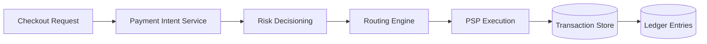
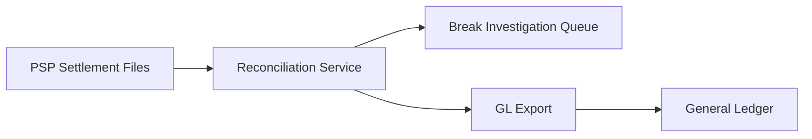

# Data Flow Diagrams

## Payment Data Flow

```mermaid
flowchart LR
    Checkout[Checkout Request] --> Intent[Payment Intent Service]
    Intent --> Risk[Risk Decisioning]
    Risk --> Route[Routing Engine]
    Route --> PSP[PSP Execution]
    PSP --> Txn[(Transaction Store)]
    Txn --> Ledger[(Ledger Entries)]
```

## Settlement and Reconciliation Flow

```mermaid
flowchart LR
    PSPFiles[PSP Settlement Files] --> Recon[Reconciliation Service]
    Recon --> Mismatch[Break Investigation Queue]
    Recon --> GLExport[GL Export]
    GLExport --> GL[General Ledger]
```
