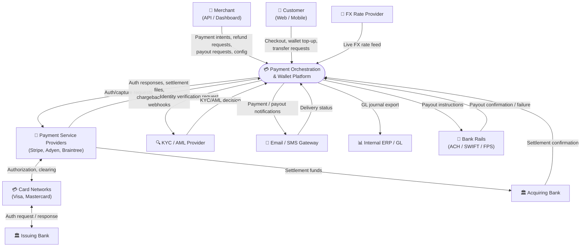
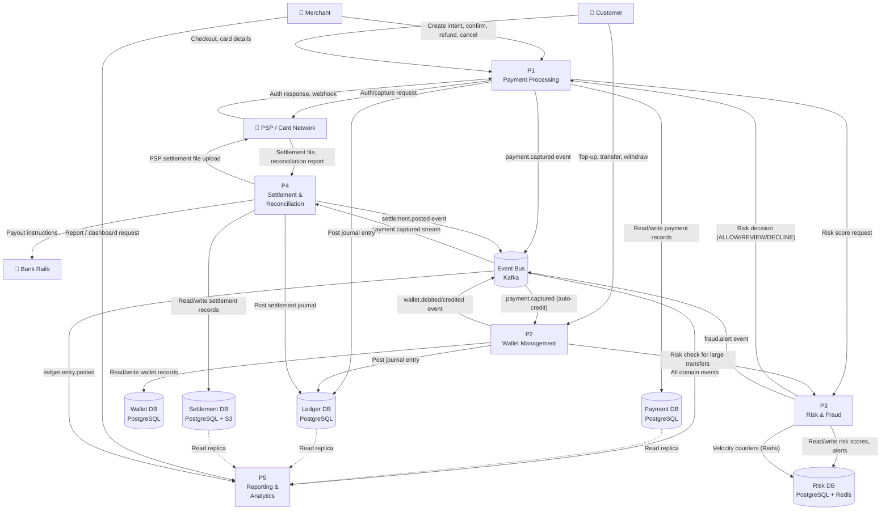
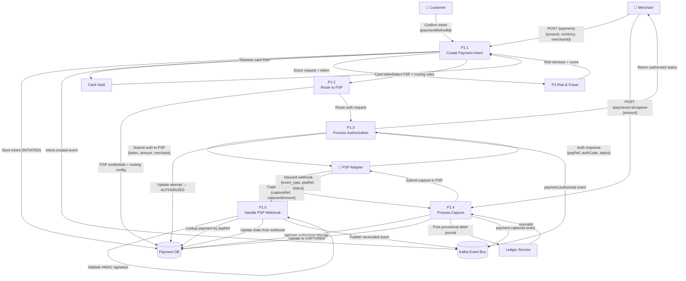

# Data Flow Diagrams — Payment Orchestration and Wallet Platform

## 1. Level 0 — Context DFD (System Context)

The system is treated as a single process ("Payment Platform") with all external entities and data flows shown.



---

## 2. Level 1 — Major Process DFD

Decomposition into 5 major processing subsystems with their data stores.



---

## 3. Level 2 — Payment Processing (P1) Decomposed



---

## 4. Settlement Flow DFD

Shows data flow from captured records through to bank submission and reconciliation.

```mermaid
flowchart LR
    CaptureRecords[("Captured Records\nPayment DB")]
    BatchAgg["Batch Aggregation\n(Group by PSP + Date)"]
    FeeCalc["Fee Calculation\n(Apply FeeRules)"]
    FileGen["Settlement File\nGeneration (CSV/XML)"]
    S3[("S3 Object Store\n(Settlement Files)")]
    PSPSubmit["PSP Submission\n(SFTP / API)"]
    PSP["🏦 PSP / Acquirer"]
    BankFunds["Bank Fund\nCredit"]
    ReconService["Reconciliation\nService"]
    LedgerPost["Ledger Settlement\nPosting"]
    LedgerDB[("Ledger DB")]
    MerchantNotif["Merchant\nNotification"]

    CaptureRecords -->|"SELECT captures WHERE settled=false\nAND capture_date <= T-1"| BatchAgg
    BatchAgg -->|"Group by PSP, currency, settlement_date"| FeeCalc
    FeeCalc -->|"Apply merchant FeeRules\n→ grossAmt, feeAmt, netAmt"| FileGen
    FileGen -->|"Archive settlement file"| S3
    FileGen -->|"Submit settlement batch"| PSPSubmit
    PSPSubmit -->|"POST /settlements or SFTP upload"| PSP
    PSP -->|"Acceptance ACK + file reference"| PSPSubmit
    PSP -->|"Funds transfer (T+1 or T+2)"| BankFunds
    PSP -->|"Download reconciliation report"| ReconService
    S3 -->|"Fetch archived file for comparison"| ReconService
    ReconService -->|"Three-way match:\nledger ↔ PSP file ↔ bank statement"| LedgerDB
    ReconService -->|"Classify breaks:\ntiming / amount / missing / duplicate"| ReconService
    ReconService -->|"Post settlement journal entries"| LedgerPost
    LedgerPost -->|"Append-only journal entries"| LedgerDB
    LedgerPost -->|"settlement.posted event → Kafka"| MerchantNotif
    MerchantNotif -->|"Email / webhook: settlement summary"| MerchantNotif
```



**Settlement SLAs:**
- Batch lock: nightly at 23:00 UTC
- File generation: complete by 23:30 UTC
- PSP submission: complete by 00:30 UTC (T+0 window)
- Reconciliation run: complete by 06:00 UTC (T+1)
- Merchant notification: by 07:00 UTC (T+1)

---

## 5. Fraud Scoring Flow DFD

Shows the real-time fraud scoring pipeline from payment request through decision and feedback loop.

```mermaid
flowchart TB
    PaymentRequest["Payment Request\n{amount, currency, card token,\nmerchantId, customerId, IP}"]

    FeatureExtract["Feature Extraction\n(P3.1)"]
    VelocityCheck["Velocity Check\n(P3.2)\nRedis counters"]
    RuleEngine["Rule Engine\n(P3.3)\nDeterministic rules"]
    MLScoring["ML Scoring\n(P3.4)\nXGBoost model"]
    Aggregator["Score Aggregator\n(P3.5)\nWeighted ensemble"]
    Decision["Decision Engine\n(P3.6)"]

    RiskDB[("Risk DB\nPostgreSQL")]
    FeatureStore[("Feature Store\nRedis + BigQuery")]
    ModelRegistry[("Model Registry\nMLflow")"]
    VelocityDB[("Velocity Counters\nRedis")"]
    CaseQueue[("Case Management\nQueue")"]
    EventBus[("Kafka\nEvent Bus")"]

    PaymentRequest -->|"Raw payment data"| FeatureExtract
    FeatureExtract -->|"Historical features:\ncustomer avg spend, device history"| FeatureStore
    FeatureStore -->|"Feature vector"| FeatureExtract
    FeatureExtract -->|"Enriched feature set"| VelocityCheck
    VelocityCheck -->|"Check: txn count/hour, amount/day\nper card, customer, IP, merchant"| VelocityDB
    VelocityDB -->|"Velocity signals (normal / elevated / exceeded)"| VelocityCheck
    VelocityCheck -->|"Velocity-enriched features"| RuleEngine
    RuleEngine -->|"Deterministic rules:\ncountry mismatch, CVV fail,\nhigh-risk MCC, blocked BIN"| RuleEngine
    RuleEngine -->|"Rule signals + hard blocks"| Aggregator
    RuleEngine -->|"Load active ruleset"| RiskDB
    FeatureExtract -->|"Feature tensor"| MLScoring
    MLScoring -->|"Load model artifact"| ModelRegistry
    MLScoring -->|"Probability score (0.0–1.0)"| Aggregator

    Aggregator -->|"Ensemble: 40% rules + 60% ML"| Decision
    Decision -->|"ALLOW: score < 0.3"| Decision
    Decision -->|"REVIEW: 0.3 ≤ score < 0.7"| Decision
    Decision -->|"DECLINE: score ≥ 0.7 or hard block"| Decision

    Decision -->|"Store risk score record"| RiskDB
    Decision -->|"ALLOW → return to Orchestration"| PaymentRequest
    Decision -->|"REVIEW → queue for human review"| CaseQueue
    Decision -->|"DECLINE → return FRAUD_DECLINED"| PaymentRequest
    Decision -->|"fraud.decision.completed event"| EventBus

    EventBus -->|"Outcome feedback (authorized/declined/chargeback)"| FeatureStore
    EventBus -->|"Chargeback events → label fraudulent transactions"| ModelRegistry
```

**Fraud Scoring SLAs:**
- P99 latency target: < 80ms (in-path with payment authorization)
- Hard block rules: < 5ms (Redis lookup)
- ML inference: < 50ms (batched feature retrieval + model serving)
- REVIEW queue SLA: analyst decision within 4 hours (configurable)

**Feedback Loop:**
- Chargebacks raise `dispute.opened` events
- Reconciliation service labels captured transactions as fraud outcomes
- Weekly model retraining job consumes labelled dataset from BigQuery
- New model promoted via MLflow after precision/recall gate passes (F1 > 0.92)

---

## 6. Data Store Summary

| Data Store | Type | Owned By | Data Stored | Access Pattern |
|---|---|---|---|---|
| **Payment DB** | PostgreSQL (primary) | Payment Orchestration | `payment_intents`, `payment_attempts`, `auth_records`, `capture_records`, `refund_records` | Write-heavy on critical path |
| **Wallet DB** | PostgreSQL (primary) | Wallet Service | `wallets`, `wallet_balances`, `wallet_transactions`, `virtual_accounts` | Mixed read/write |
| **Ledger DB** | PostgreSQL (primary, append-only) | Ledger Service | `ledger_entries`, `accounts`, `journal_batches` | Append-only writes; sequential reads |
| **Risk DB** | PostgreSQL + Redis | Fraud & Risk Service | `risk_scores`, `fraud_alerts`, `rule_sets`; Redis: velocity counters, feature cache | Low-latency reads on critical path |
| **Settlement DB** | PostgreSQL + S3 | Settlement Service | `settlement_batches`, `settlement_records`, `fee_records`; S3: raw files | Batch writes (nightly); archive reads |
| **Reconciliation DB** | PostgreSQL | Reconciliation Service | `reconciliation_runs`, `reconciliation_breaks` | Batch reads/writes |
| **Feature Store** | Redis + BigQuery | Fraud & Risk Service | Real-time feature cache (Redis); historical features (BigQuery) | Ultra-low-latency reads (Redis) |

