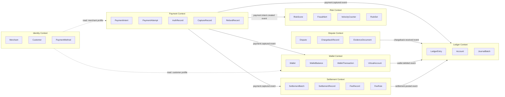
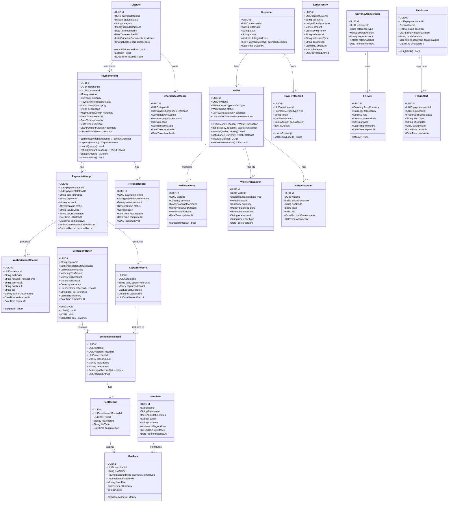

# Domain Model — Payment Orchestration and Wallet Platform

## 1. Domain Overview

This document applies **Domain-Driven Design (DDD)** principles to the Payment Orchestration and Wallet Platform. The domain is decomposed into well-isolated **Bounded Contexts**, each owning its data, language, and invariants. Context integration happens via domain events (published to Kafka) and explicit anti-corruption layer adapters — never through shared database tables.

### DDD Principles Applied

| Principle | Application |
|---|---|
| **Ubiquitous Language** | Every term in code, APIs, and docs matches the payment industry vocabulary (PaymentIntent, not "order"; Capture, not "charge commit") |
| **Bounded Context** | 7 contexts with explicit integration contracts |
| **Aggregate Roots** | Each aggregate enforces its own invariants; external access only through the root |
| **Domain Events** | All state transitions emit immutable events; consumers build their own read models |
| **Value Objects** | Immutable, equality-by-value types for Money, Currency, CardDetails, etc. |
| **Repository Pattern** | Data access abstracted behind repository interfaces; implementation is PostgreSQL |

---

## 2. Bounded Contexts



---

## 3. Full Class Diagram



---

## 4. Aggregate Root Descriptions

### 4.1 PaymentIntent Aggregate

**Root:** `PaymentIntent`
**Owns:** `PaymentAttempt`, `AuthorizationRecord`, `CaptureRecord`, `RefundRecord`

The `PaymentIntent` is the central aggregate of the payment domain. It represents a merchant's intent to collect a specific `Money` amount from a customer. All lifecycle operations route through the root.

**Invariants enforced:**
- Total refunded amount ≤ total captured amount
- Only one active `PaymentAttempt` at a time (others must be in terminal state before retrying)
- `capture()` may only be called when status is `AUTHORIZED`
- `cancel()` is not permitted after `CAPTURED`
- `expiresAt` must be in the future to allow confirmation

**Business Rules:**
- Maximum 3 payment attempts per intent before auto-cancellation
- Capture must happen within 7 days of authorization (configurable per merchant)
- Partial captures allowed; partial refunds allowed; over-refund blocked

### 4.2 Wallet Aggregate

**Root:** `Wallet`
**Owns:** `WalletBalance` (per currency), `WalletTransaction`, `VirtualAccount`

The `Wallet` aggregate manages multi-currency balances. All mutations produce a corresponding `WalletTransaction` for immutable audit trail. The `WalletBalance` is a running balance derived from transactions but cached for fast reads.

**Invariants enforced:**
- `availableAmount + reservedAmount = totalAmount` for each currency balance
- `debit()` only succeeds if `availableAmount >= amount`
- Reservation must be released or consumed; no dangling reservations >24h
- Cross-currency transfers must have a `CurrencyConversion` record attached

### 4.3 Dispute Aggregate

**Root:** `Dispute`
**Owns:** `ChargebackRecord`, `EvidenceDocument`

A `Dispute` is raised when a card issuer initiates a chargeback. The aggregate tracks evidence submission and SLA deadlines.

**Invariants enforced:**
- Evidence can only be submitted when status is `OPEN`
- Evidence deadline is enforced; auto-`accept()` if deadline passes without submission
- Accepting a dispute triggers a ledger reversal via domain event

### 4.4 SettlementBatch Aggregate

**Root:** `SettlementBatch`
**Owns:** `SettlementRecord`, `FeeRecord`

A `SettlementBatch` groups all captured transactions for a given PSP and settlement date into a single file submitted to the acquirer.

**Invariants enforced:**
- Once `locked`, no new `SettlementRecord`s can be added
- `netAmount = grossAmount - feesAmount` must hold after fee calculation
- Cannot re-submit a batch already in `SUBMITTED` state

---

## 5. Domain Events

| Aggregate | Event Name | Payload Key Fields | Consumers |
|---|---|---|---|
| PaymentIntent | `payment.intent.created` | `intentId`, `merchantId`, `amount`, `currency` | Risk Service |
| PaymentIntent | `payment.authorized` | `intentId`, `attemptId`, `authCode`, `pspReference` | Notification, Webhook |
| PaymentIntent | `payment.captured` | `intentId`, `captureId`, `capturedAmount`, `pspReference` | Ledger, Settlement, Wallet, Webhook |
| PaymentIntent | `payment.failed` | `intentId`, `failureCode`, `failureMessage` | Notification, Webhook |
| PaymentIntent | `payment.cancelled` | `intentId`, `reason` | Ledger, Webhook |
| PaymentIntent | `refund.initiated` | `refundId`, `intentId`, `amount` | PSP Adapter |
| PaymentIntent | `refund.completed` | `refundId`, `intentId`, `amount`, `pspRefundReference` | Ledger, Wallet, Notification, Webhook |
| Wallet | `wallet.credited` | `walletId`, `amount`, `currency`, `referenceId` | Ledger, Notification |
| Wallet | `wallet.debited` | `walletId`, `amount`, `currency`, `referenceId` | Ledger, Notification |
| Wallet | `wallet.transfer.initiated` | `sourceWalletId`, `destWalletId`, `amount` | Risk, Ledger |
| Wallet | `wallet.transfer.completed` | `sourceWalletId`, `destWalletId`, `amount` | Notification, Webhook |
| Dispute | `dispute.opened` | `disputeId`, `intentId`, `amount`, `deadline` | Ledger (reserve funds), Notification |
| Dispute | `dispute.evidence.submitted` | `disputeId`, `evidenceCount` | Webhook |
| Dispute | `dispute.won` | `disputeId`, `intentId` | Ledger (release reserved funds) |
| Dispute | `dispute.lost` | `disputeId`, `intentId`, `amount` | Ledger (post chargeback journal) |
| SettlementBatch | `settlement.batch.locked` | `batchId`, `pspName`, `recordCount`, `grossAmount` | — |
| SettlementBatch | `settlement.submitted` | `batchId`, `fileReference` | Reconciliation |
| SettlementBatch | `settlement.posted` | `batchId`, `netAmount` | Ledger, Payout, Notification |

---

## 6. Value Objects

### 6.1 `Money`
```
Money {
  amount: Decimal (precision 18, scale 8)
  currency: Currency
}
```
- Immutable; arithmetic operations return new `Money` instances
- Addition and subtraction require same currency (throws `CurrencyMismatchException`)
- Comparison: `isGreaterThan`, `isLessThan`, `isZero`, `isNegative`
- Storage: integer minor units (e.g., cents) to avoid floating-point errors

### 6.2 `Currency`
```
Currency {
  code: String (ISO 4217, e.g., "USD")
  numericCode: Integer
  minorUnits: Integer (e.g., 2 for USD, 0 for JPY)
  symbol: String
}
```
- Validated against ISO 4217 at construction
- `toMinorUnits(Decimal) → Long` and `fromMinorUnits(Long) → Decimal` helpers

### 6.3 `Address`
```
Address {
  line1: String
  line2: String (optional)
  city: String
  state: String (optional)
  postalCode: String
  country: String (ISO 3166-1 alpha-2)
}
```
- Validated at construction; country must be ISO 3166-1 alpha-2
- Used in AVS checks during authorization

### 6.4 `CardDetails`
```
CardDetails {
  last4: String
  brand: CardBrand (VISA, MASTERCARD, AMEX, DISCOVER)
  expiryMonth: Integer (1–12)
  expiryYear: Integer (4-digit)
  fingerprint: String (SHA-256 of PAN + expiry, used for deduplication)
  country: String
  fundingType: FundingType (CREDIT, DEBIT, PREPAID)
}
```
- **Never contains PAN** — PAN lives only in Card Vault; all downstream code uses token
- `isExpired() → bool` based on current date vs expiry month/year
- `fingerprint` enables detecting duplicate card adds without exposing PAN

### 6.5 `BankAccount`
```
BankAccount {
  accountNumber: String (masked, last 4 digits)
  routingNumber: String (masked)
  iban: String (masked)
  bic: String
  bankName: String
  country: String
  currency: Currency
  accountType: BankAccountType (CHECKING, SAVINGS)
}
```
- Raw account numbers stored only in Vault; value object holds masked representation
- Used for ACH/SEPA payout instructions

