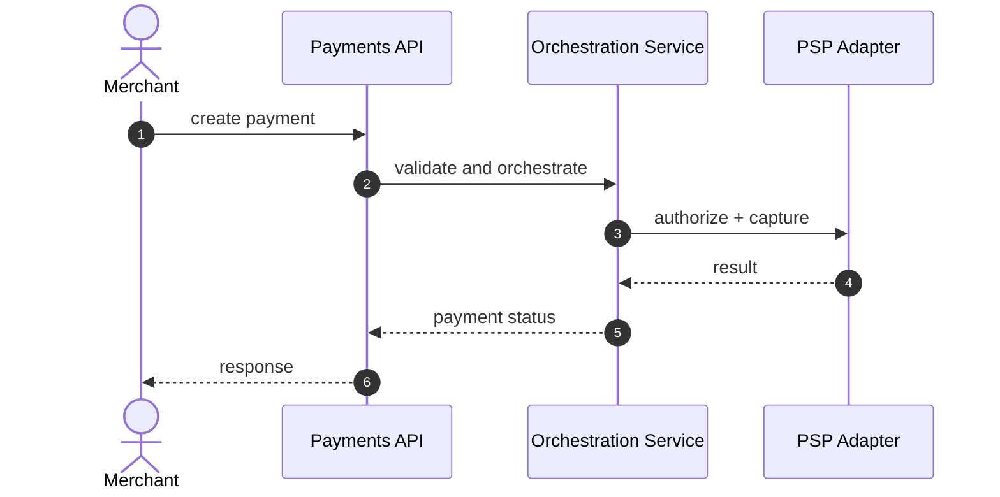
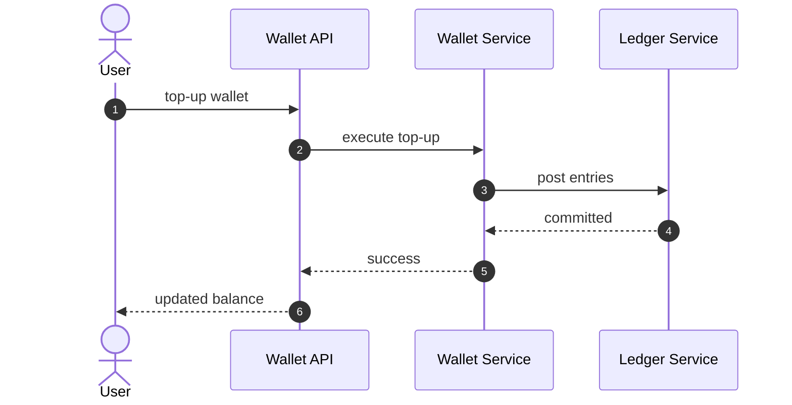

# System Sequence Diagrams

## System Sequence: Create Payment

```mermaid
sequenceDiagram
    autonumber
    actor Merchant
    participant API as Payments API
    participant ORCH as Orchestration Service
    participant PSP as PSP Adapter

    Merchant->>API: create payment
    API->>ORCH: validate and orchestrate
    ORCH->>PSP: authorize + capture
    PSP-->>ORCH: result
    ORCH-->>API: payment status
    API-->>Merchant: response
```

## System Sequence: Wallet Top-up

```mermaid
sequenceDiagram
    autonumber
    actor User
    participant API as Wallet API
    participant WAL as Wallet Service
    participant LEDGER as Ledger Service

    User->>API: top-up wallet
    API->>WAL: execute top-up
    WAL->>LEDGER: post entries
    LEDGER-->>WAL: committed
    WAL-->>API: success
    API-->>User: updated balance
```
