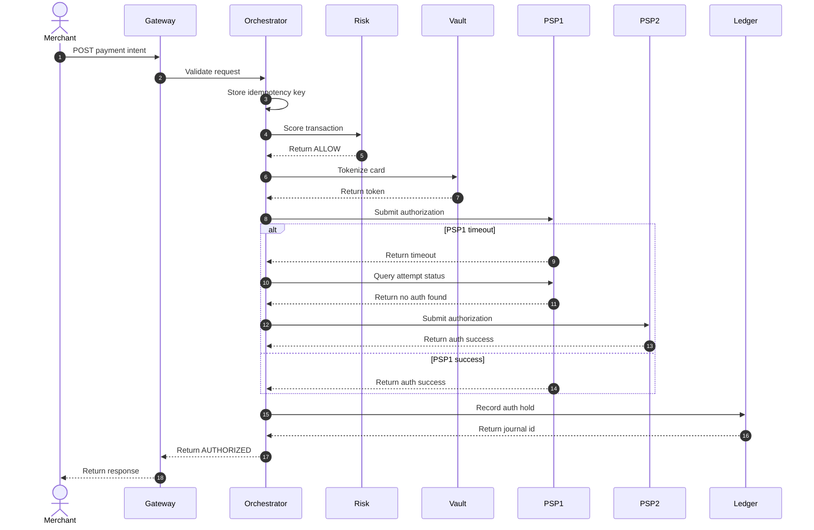
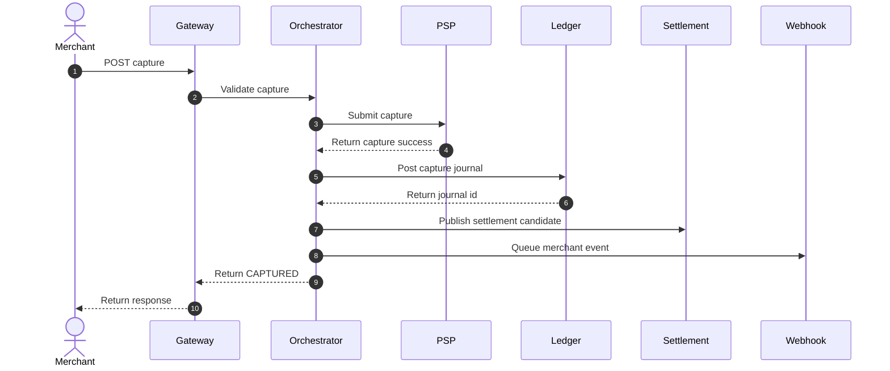
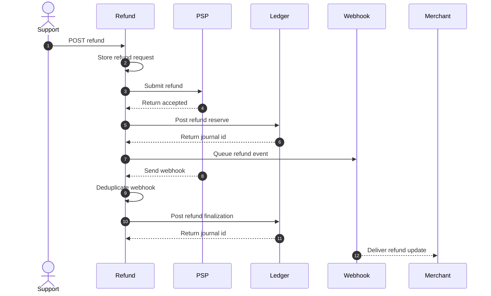
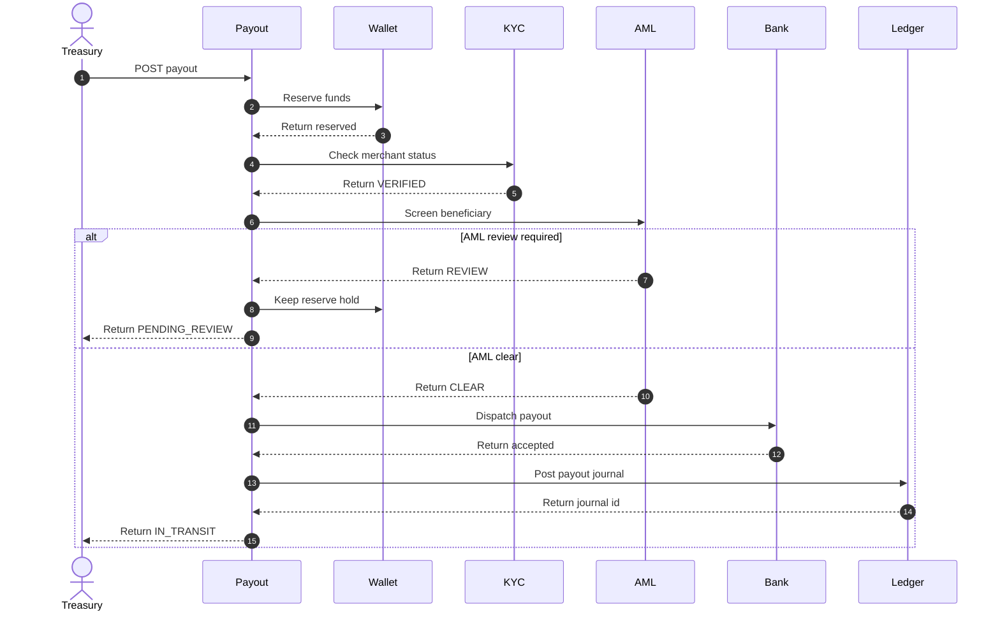
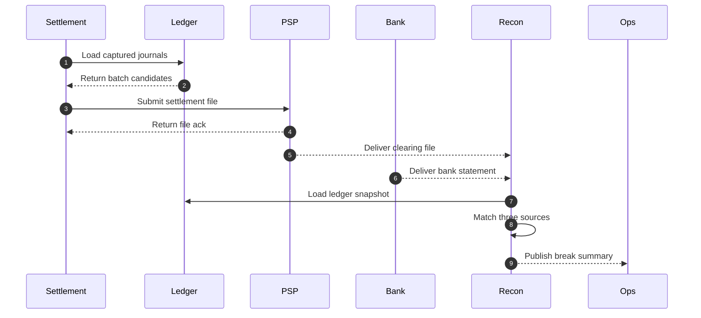

# System Sequence Diagrams — Payment Orchestration and Wallet Platform

These diagrams show the key end-to-end interactions for online payments, capture, wallet posting, refunds, and payout release. Timeout and retry rules are called out below each diagram so teams can implement them consistently.

## 1. Create and Authorize Payment with Fallback

**Timeout and retry policy**
- Gateway request timeout: 6 seconds.
- Risk scoring budget: 150 ms p99.
- Vault tokenization budget: 100 ms p99.
- PSP authorization timeout: 3 seconds per provider.
- Fallback is allowed only after provider status query proves no surviving authorization exists.

## 2. Capture and Ledger Recognition

**Capture notes**
- Capture is rejected if requested amount exceeds remaining authorized amount.
- If PSP capture succeeds but ledger posting fails, the payment enters `OPERATIONS_HOLD` and payout release is blocked until replay completes.
- Partial capture retains the remaining amount on the original authorization until void or expiry.

## 3. Refund and Duplicate Callback Handling

**Refund notes**
- Refund request idempotency is scoped by merchant and payment intent.
- Provider webhook processing is idempotent by provider event ID and refund reference.
- Refund reserve and refund finalization may be separate journals when the provider confirms asynchronously.

## 4. Payout Release with Compliance Hold

## 5. Settlement and Three-Way Reconciliation

**Reconciliation notes**
- Input snapshots are immutable and versioned by file checksum and import timestamp.
- `TIMING` breaks do not block the entire run but do block payout release for affected merchants when exposure thresholds are crossed.
