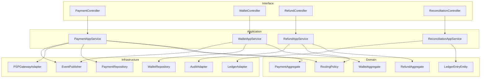

# C4 Code Diagram

```mermaid
flowchart TB
    subgraph Interface
      PaymentController
      WalletController
      RefundController
      ReconciliationController
    end

    subgraph Application
      PaymentAppService
      WalletAppService
      RefundAppService
      ReconciliationAppService
    end

    subgraph Domain
      PaymentAggregate
      WalletAggregate
      RefundAggregate
      LedgerEntryEntity
      RoutingPolicy
    end

    subgraph Infrastructure
      PaymentRepository
      WalletRepository
      PSPGatewayAdapter
      LedgerAdapter
      EventPublisher
      AuditAdapter
    end

    PaymentController --> PaymentAppService --> PaymentAggregate
    WalletController --> WalletAppService --> WalletAggregate
    RefundController --> RefundAppService --> RefundAggregate
    ReconciliationController --> ReconciliationAppService --> LedgerEntryEntity

    PaymentAppService --> RoutingPolicy
    RefundAppService --> RoutingPolicy

    PaymentAppService --> PaymentRepository
    WalletAppService --> WalletRepository
    PaymentAppService --> PSPGatewayAdapter
    ReconciliationAppService --> LedgerAdapter

    PaymentAppService --> EventPublisher
    WalletAppService --> EventPublisher
    RefundAppService --> AuditAdapter
```
