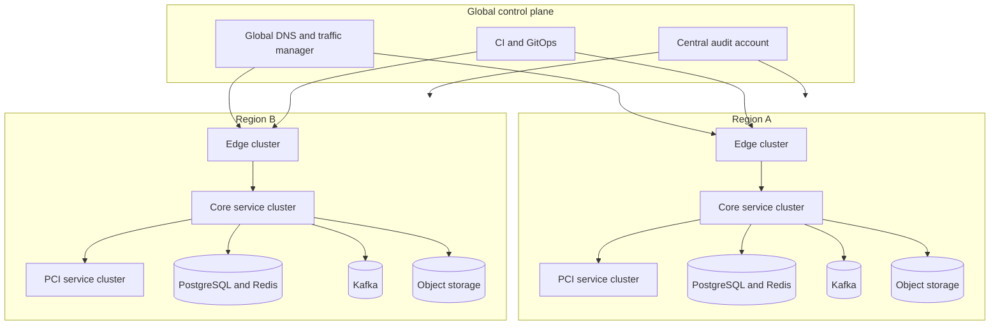

# Cloud Architecture — Payment Orchestration and Wallet Platform

This document defines the target cloud topology for a multi-region, event-driven payment platform with a dedicated PCI zone, stateless services, and strong separation between online transaction processing and finance workloads.

## 1. Deployment Model

- **Cloud provider baseline:** AWS-first deployment with Kubernetes, managed PostgreSQL, managed Kafka, Redis, S3-compatible object storage, and HSM-backed key services.
- **Regional model:** active-active for public APIs in two regions per residency domain. Finance batch processing is active-active capable but may run active-passive when provider file delivery is region-pinned.
- **Account model:** separate cloud accounts for `shared-services`, `prod-core`, `prod-pci`, `prod-data`, `nonprod-core`, and `security-audit`.
- **Environment isolation:** development, staging, and production use separate accounts and separate secrets roots. Production data is never replicated into non-production.

## 2. Regional Architecture

## 3. Service Placement

| Zone | Services | Notes |
|---|---|---|
| Edge cluster | API Gateway, WAF ingress, webhook ingress, auth edge services | Internet-facing only through load balancers and WAF. |
| Core service cluster | Orchestration, wallet, ledger, settlement, payout, reconciliation, webhook delivery, reporting | Private subnets only; outbound egress via controlled NAT or proxy. |
| PCI cluster | Vault, tokenization workers, HSM clients, PAN lifecycle jobs | No direct internet ingress. Outbound access restricted to PSP tokenization endpoints and HSM services. |
| Data plane | PostgreSQL, Kafka, Redis, S3 object storage, evidence storage | Private endpoints only. Separate encryption domains for PCI and non-PCI data. |

## 4. Data Residency and Multi-Tenancy

- Merchant tenancy is logical at the service layer and physical at the data layer where required by regulation.
- EU, UK, US, and India residency domains can run separate database clusters and object-storage buckets.
- Cross-region disaster recovery copies encrypted snapshots into the paired region of the same residency domain only.
- Global control data such as feature flags may replicate globally, but PAN data and residency-pinned transaction data must remain region-local.

## 5. Storage and State Strategy

| State Type | Technology | Backup and DR |
|---|---|---|
| Command stores | PostgreSQL 16 with regional primary and sync standby | PITR with 35-day retention, quarterly restore drill |
| Event topics | Kafka with mirrored topics across paired regions | Topic replication plus checksum validation |
| Idempotency and counters | Redis 7 | Replicated cache with warm restart policy |
| Settlement and evidence artifacts | S3 object storage with object lock | Versioning and legal hold enabled |
| Secrets and keys | Vault plus KMS and HSM | Root key ceremonies and escrowed recovery material |

## 6. Runtime Configuration Rules

- All service configuration is delivered through GitOps-managed Kubernetes manifests and sealed secret references.
- No service stores provider credentials in environment variables. Secrets are projected via Vault agent or CSI driver.
- Feature flags controlling routing, payout release, and repair tooling must be tenant-aware and audit logged.
- Cron-like finance jobs must use leader election and idempotent batch keys so multi-region activations do not double run.

## 7. Scaling and Resilience Targets

| Domain | SLO / Target | Scaling Rule |
|---|---|---|
| Payment API | 99.99% monthly availability | HPA on RPS, CPU, and queue latency |
| Authorization path | p99 < 2 seconds end to end | Separate worker pools per PSP adapter |
| Ledger posting | p99 < 300 ms for online journals | Dedicated writer deployment and connection pools |
| Reconciliation | T+0 intraday awareness, T+1 hard close | Horizontal file workers and partitioned matching |
| Payout dispatch | No duplicate payout creation | Idempotent scheduler plus bank status query before retry |

## 8. Secrets, Keys, and Tokenization

- TLS termination certificates rotate automatically through the platform PKI.
- PCI encryption keys rotate at least quarterly and support decrypt-old or encrypt-new overlap periods.
- Webhook signing secrets support dual-secret overlap for 24 hours.
- Database credentials are short-lived dynamic secrets issued per workload identity.

## 9. Disaster Recovery

- Target `RPO < 1 minute` and `RTO < 5 minutes` for online payment APIs.
- Regional evacuation playbooks include promoting the paired region, replaying Kafka offsets where needed, and running ledger plus reconciliation health checks before re-opening payouts.
- Object-storage artifacts required for settlement and evidence are replicated before attestation is considered complete.

## 10. Implementation Checklist

1. Create per-environment cloud accounts and IAM boundaries.
2. Build core cluster and PCI cluster separately with independent node pools.
3. Provision region-pinned Postgres, Redis, Kafka, and S3 endpoints.
4. Wire Vault, KMS, HSM, and certificate automation.
5. Enable observability stack with tenant-safe logging and finance dashboards.
6. Run failover drill before production cutover.
