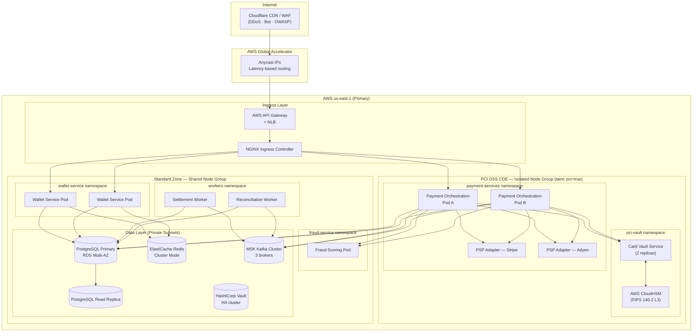
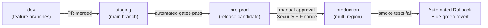

# Kubernetes Deployment Architecture

**Platform:** Payment Orchestration and Wallet Platform  
**Compliance:** PCI DSS v4.0 | SOC 2 Type II  
**Topology:** Multi-Region Active-Active (us-east-1 · eu-west-1 · ap-southeast-1)  
**Last Updated:** 2025-01

---

## 1. Overview

The platform runs across three AWS regions in an active-active configuration. Each region hosts a full copy of all services. Global traffic routing is managed by AWS Global Accelerator with latency-based routing. Regions operate independently and can serve 100% of traffic if another region fails (RTO < 5 min, RPO < 30 s for transactional data).

**PCI DSS Scoping:** The Cardholder Data Environment (CDE) is strictly bounded within the `pci-vault` and `payment-services` namespaces. No card data flows through the standard zone. All services in the CDE run on dedicated node groups with taints and affinity rules that prevent non-PCI workloads from co-scheduling.

---

## 2. Cluster Topology Diagram



---

## 3. Kubernetes Resource Specifications

| Service | Namespace | Replicas | CPU Request | CPU Limit | Mem Request | Mem Limit | HPA Min | HPA Max |
|---|---|---|---|---|---|---|---|---|
| payment-orchestration | payment-services | 2 | 500m | 2000m | 512Mi | 2Gi | 2 | 20 |
| card-vault | pci-vault | 2 | 250m | 1000m | 256Mi | 1Gi | 2 | 4 |
| psp-adapter-stripe | payment-services | 2 | 200m | 500m | 256Mi | 512Mi | 2 | 10 |
| psp-adapter-adyen | payment-services | 2 | 200m | 500m | 256Mi | 512Mi | 2 | 10 |
| wallet-service | wallet-service | 2 | 300m | 1000m | 256Mi | 1Gi | 2 | 15 |
| fraud-service | fraud-service | 2 | 500m | 2000m | 1Gi | 4Gi | 2 | 8 |
| settlement-worker | workers | 1 | 500m | 2000m | 512Mi | 2Gi | 1 | 5 |
| reconciliation-worker | workers | 1 | 500m | 2000m | 512Mi | 2Gi | 1 | 3 |
| notification-service | workers | 1 | 100m | 500m | 128Mi | 512Mi | 1 | 10 |
| reporting-service | workers | 1 | 250m | 1000m | 512Mi | 2Gi | 1 | 5 |

> HPA triggers on CPU utilization > 70% and custom Kafka consumer-lag metric > 1000.

---

## 4. PCI DSS Network Segmentation

### 4.1 CDE Boundary

The CDE encompasses all systems that store, process, or transmit cardholder data (CHD) or sensitive authentication data (SAD):

| Component | Namespace | CDE? | Justification |
|---|---|---|---|
| card-vault | pci-vault | ✅ Yes | Stores tokenized PANs, manages encryption keys |
| payment-orchestration | payment-services | ✅ Yes | Transmits PANs to vault and PSPs |
| psp-adapter-stripe | payment-services | ✅ Yes | Communicates with Stripe; handles card tokens |
| psp-adapter-adyen | payment-services | ✅ Yes | Communicates with Adyen; handles card tokens |
| wallet-service | wallet-service | ❌ No | Uses vault tokens only; never sees raw PANs |
| fraud-service | fraud-service | ❌ No | Receives risk signals, not card data |
| reporting-service | workers | ❌ No | Reads masked data only |

### 4.2 Namespace Network Policies

- Default-deny all ingress and egress on all namespaces.
- `pci-vault` namespace: ingress only from `payment-services`; egress only to AWS CloudHSM endpoint and HashiCorp Vault.
- `payment-services` namespace: ingress only from `ingress-nginx`; egress to `pci-vault`, PSP HTTPS endpoints (allowlisted CIDRs), `fraud-service`.
- Cross-namespace traffic requires explicit `NetworkPolicy` objects with `namespaceSelector` matching namespace labels.

### 4.3 Node Isolation for PCI Workloads

```yaml
# Node taint applied to PCI dedicated node group
taints:
  - key: pci-dss
    value: "true"
    effect: NoSchedule

# Toleration required in pci-vault and payment-services pods
tolerations:
  - key: pci-dss
    operator: Equal
    value: "true"
    effect: NoSchedule

# Node affinity for PCI pods
affinity:
  nodeAffinity:
    requiredDuringSchedulingIgnoredDuringExecution:
      nodeSelectorTerms:
        - matchExpressions:
            - key: node-group
              operator: In
              values: ["pci-dedicated"]
```

---

## 5. Secret Management

### 5.1 HashiCorp Vault Integration

All secrets (PSP API keys, database credentials, encryption keys, OAuth client secrets) are managed in HashiCorp Vault. Pods authenticate using Kubernetes Service Account tokens via the Vault Kubernetes Auth Method.

```yaml
annotations:
  vault.hashicorp.com/agent-inject: "true"
  vault.hashicorp.com/role: "payment-orchestration"
  vault.hashicorp.com/agent-inject-secret-psp-keys: "secret/payment/psp-keys"
  vault.hashicorp.com/agent-inject-template-psp-keys: |
    {{- with secret "secret/payment/psp-keys" -}}
    STRIPE_SECRET_KEY={{ .Data.data.stripe_secret_key }}
    ADYEN_API_KEY={{ .Data.data.adyen_api_key }}
    {{- end }}
```

- **Dynamic credentials:** Database credentials are dynamically generated by Vault's PostgreSQL secrets engine with a 1-hour TTL.
- **Key rotation:** PSP API keys rotate every 90 days with zero-downtime swap via Vault versioned secrets.
- **Encryption at rest:** Kubernetes Secrets are encrypted at rest using AWS KMS (envelope encryption). Vault's storage backend (DynamoDB) is encrypted with a dedicated CMK.

### 5.2 Secret Access Policy (Least Privilege)

| Service | Vault Path | Access |
|---|---|---|
| card-vault | `pki/`, `transit/`, `secret/pci/` | read, encrypt, decrypt |
| payment-orchestration | `secret/payment/psp-keys`, `database/creds/payment-rw` | read |
| wallet-service | `database/creds/wallet-rw`, `secret/wallet/` | read |
| reconciliation-worker | `database/creds/recon-rw` | read |

---

## 6. Health Checks and Probes

```yaml
livenessProbe:
  httpGet:
    path: /healthz/live
    port: 8080
  initialDelaySeconds: 15
  periodSeconds: 20
  failureThreshold: 3
  timeoutSeconds: 5

readinessProbe:
  httpGet:
    path: /healthz/ready
    port: 8080
  initialDelaySeconds: 10
  periodSeconds: 10
  failureThreshold: 3
  timeoutSeconds: 3

startupProbe:
  httpGet:
    path: /healthz/startup
    port: 8080
  failureThreshold: 30
  periodSeconds: 5
```

**Readiness gates include:** database connectivity, Kafka broker reachability, Vault agent sidecar status, and PSP health endpoint (for PSP adapters). A pod that fails its readiness probe is removed from the Service endpoint slice within 10 s.

---

## 7. Deployment Strategy

### 7.1 Payment Services (CDE) — Blue-Green

Payment-critical services use blue-green deployments to achieve zero-downtime with immediate rollback capability:

1. Deploy new version (green) alongside current (blue) — both running.
2. Run automated smoke tests against green on a shadow endpoint.
3. Shift 10% of traffic to green via weighted Ingress annotations.
4. Monitor error rate for 5 minutes; if p99 latency < 500 ms and error rate < 0.1%, shift 100% traffic.
5. Keep blue pods running for 15 minutes post-cutover for instant rollback.
6. Decommission blue after 15-minute hold period.

### 7.2 Supporting Services — Rolling Update

```yaml
strategy:
  type: RollingUpdate
  rollingUpdate:
    maxUnavailable: 0
    maxSurge: 1
```

A `maxUnavailable: 0` ensures no capacity reduction during rollout. Wallet service and workers use rolling updates with a minimum of 2 available replicas enforced by a `PodDisruptionBudget`.

### 7.3 PodDisruptionBudgets

```yaml
apiVersion: policy/v1
kind: PodDisruptionBudget
metadata:
  name: payment-orchestration-pdb
spec:
  minAvailable: 1
  selector:
    matchLabels:
      app: payment-orchestration
```

---

## 8. Environment Promotion Pipeline



**Promotion gates (staging → pre-prod):** unit tests pass, integration tests pass, SAST/DAST scan clean, container image signed (Cosign), no Critical CVEs in image scan.

**Promotion gates (pre-prod → prod):** manual approval from Security Lead + Finance Controller, load test results within p99 SLO, PCI compliance checklist signed off.

