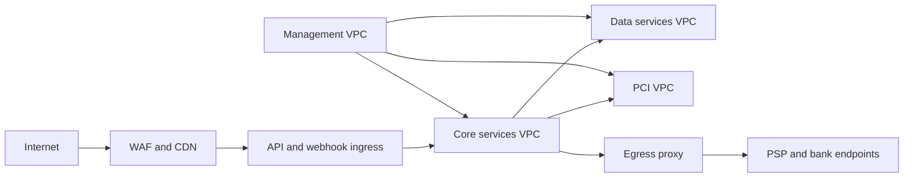
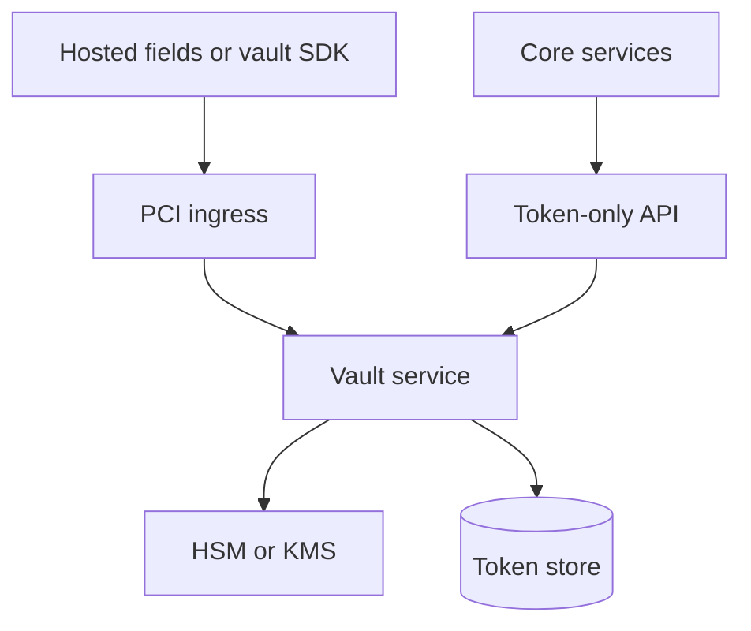

# Network Infrastructure — Payment Orchestration and Wallet Platform

This document defines the network topology, traffic rules, and segmentation controls required to run the payment platform safely. The design isolates public ingress, core services, finance data paths, and PCI-scoped services while preserving low-latency PSP connectivity.

## 1. Network Zones

| Zone | Example CIDR | Purpose |
|---|---|---|
| Public edge VPC | `10.10.0.0/16` | Internet ingress, WAF, API gateway, webhook ingress |
| Core services VPC | `10.20.0.0/16` | Orchestration, wallet, ledger, payout, settlement, reconciliation |
| PCI VPC | `10.30.0.0/16` | Vault, tokenization workers, HSM proxies |
| Data services VPC | `10.40.0.0/16` | PostgreSQL, Kafka, Redis, object storage endpoints |
| Management VPC | `10.50.0.0/16` | Bastionless admin tooling, observability, CI runners, break-glass access |

## 2. High-Level Topology

## 3. Subnet Layout per VPC

| VPC | Public Subnets | Private App Subnets | Private Data Subnets |
|---|---|---|---|
| Public edge | ALB, NLB, NAT, ingress controllers | Edge services | Not used |
| Core services | None | Kubernetes worker nodes and internal load balancers | Internal service caches where needed |
| PCI | None | Vault and tokenization workloads | HSM proxy and token DB |
| Data services | None | Not used | PostgreSQL, Kafka, Redis, object storage endpoints |

## 4. Traffic Rules

| Source | Destination | Ports | Control |
|---|---|---|---|
| Internet | WAF | 443 | CDN plus bot management and geo filters |
| WAF | API ingress | 443 | TLS re-encryption and allowlisted headers only |
| Core services | PostgreSQL | 5432 | Security groups scoped by workload identity |
| Core services | Kafka | 9092 or 9094 | mTLS and SASL |
| Core services | Redis | 6379 | TLS, ACLs, no public route |
| Core services | PCI services | 8443 | mTLS and service mesh authz |
| Core services | PSP or bank endpoints | 443 | Static egress IPs via proxy and allowlist |
| Management plane | Private services | 443 | SSO-authenticated short-lived sessions only |

## 5. East-West Security

- All intra-platform HTTP or gRPC calls use mutual TLS with service identities issued by the mesh PKI.
- NetworkPolicy objects deny traffic by default and allow only declared producer-to-consumer flows.
- PSP adapters run in isolated namespaces with dedicated egress policies so a failing provider integration cannot abuse another provider's credentials or network path.
- Database access is allowed only from application namespaces that own the schema. Cross-service direct database reads are prohibited.

## 6. PCI Boundary

PCI boundary rules:

- Raw PAN may enter only through hosted fields, vault SDK, or provider direct tokenization flows.
- Core services may request tokenization or detokenization only through dedicated token APIs and only with explicit audit context.
- PCI logs are isolated and shipped through a dedicated log pipeline with redaction guards.

## 7. Webhook Ingress and Callback Security

- Separate ingress classes are used for merchant webhooks and PSP callbacks.
- PSP callback paths are protected by provider signature validation, source-range checks where available, and replay-window enforcement.
- Merchant outbound webhooks originate from static egress IPs and include HMAC signatures.
- Duplicate inbound callbacks are handled at the application layer, but the network layer still blocks malformed or oversized payloads.

## 8. DNS, Egress, and Allowlisting

- Public DNS routes `api`, `webhooks`, and `merchant-console` through the global traffic manager.
- Private DNS exposes internal service names only inside the mesh.
- All internet egress from core and PCI zones goes through dedicated egress proxies with URL and certificate validation.
- PSP and bank partners receive a documented list of static egress addresses for allowlisting.

## 9. Observability and Forensics

- Flow logs are enabled for every VPC and retained in the audit account.
- WAF, load balancer, and ingress logs include request IDs that correlate to application audit logs.
- Packet capture is disabled by default in PCI zones and may be enabled only via break-glass workflow with compliance approval.

## 10. Failure and Recovery Rules

- Loss of one NAT gateway or egress proxy must not block PSP traffic; deploy at least one per availability zone.
- If mesh certificate rotation fails, new pod admission is blocked until trust is restored.
- If provider allowlist changes are pending, routing rules must disable that provider before production traffic resumes.
- Regional network isolation events require replay of queued webhooks and PSP callback gaps once connectivity returns.
