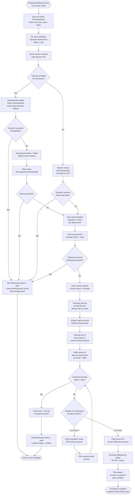

# Activity Diagram — Real Estate Management System

## Overview

This document presents the principal activity flows within the Real Estate Management System using UML-style activity diagrams rendered with Mermaid flowcharts. Three core flows are modelled: the tenant application processing pipeline (including external screening integrations), the monthly rent collection and late fee assessment cycle, and the end-to-end maintenance request lifecycle. Each diagram captures decision branches, parallel execution tracks, system-automated steps, and human decision points.

---

## Diagram 1: Tenant Application Processing Flow

This flow begins when a prospective tenant submits an application and ends when either an active lease is created or the application is definitively rejected. Parallel screening tracks (background check + credit check) run simultaneously after the application fee is collected. The flow captures both automated decision paths and the manual PM review escalation path.

```mermaid
flowchart TD
    A([Tenant submits application via portal]) --> B[Validate application form\ncompleteness and format]
    B --> C{Form valid?}
    C -- No --> D[Return validation errors\nto tenant]
    D --> B
    C -- Yes --> E[Save application\nstatus = draft]
    E --> F[Charge application fee\nvia Stripe PaymentIntent]
    F --> G{Payment successful?}
    G -- No --> H[Set status = payment_failed\nNotify tenant to retry]
    H --> F
    G -- Yes --> I[Set status = submitted\nTimestamp submission]

    I --> J[Enqueue background check job\nCheckr / TransUnion API]
    I --> K[Enqueue credit check job\nEquifax / Experian API]
    I --> L[Verify uploaded identity documents]

    J --> M{Background check\nreturns result?}
    K --> N{Credit check\nreturns result?}
    L --> O{Documents\nverified?}

    M -- Timeout 15 min --> P[Escalate to PM\nstatus = pending_manual_review]
    N -- Timeout 15 min --> P
    O -- No --> P

    M -- Yes --> Q{Background check\npassed?}
    N -- Yes --> R{Credit score ≥\nminimum threshold?}
    O -- Yes --> S[Documents OK]

    Q -- No --> T{Disqualifying finding\ntype?}
    T -- Auto-reject: prior eviction < 5yr --> U[Set status = rejected\nGenerate FCRA adverse\naction notice\nEmail tenant]
    T -- Requires review --> P

    Q -- Yes --> V[Background check OK]
    R -- No --> P
    R -- Yes --> W[Credit check OK]

    V --> X{All checks passed?\nBackground + Credit + Docs}
    W --> X
    S --> X

    X -- No --> P
    X -- Yes --> Y[Set status = auto_approved]

    P --> Z[PM reviews application\nin management dashboard]
    Z --> AA{PM decision}
    AA -- Approve --> Y
    AA -- Reject --> U
    AA -- Request more info --> AB[Send info request\nto tenant]
    AB --> Z

    Y --> AC[Send approval notification\nto tenant]
    AC --> AD[Initiate lease creation\nworkflow — see Diagram below]
    AD --> AE[Generate lease from template\nwith unit + tenant details]
    AE --> AF[PM reviews and confirms\nlease terms]
    AF --> AG[Upload lease to DocuSign\ncreate signing envelope]
    AG --> AH[Send signing link\nto tenant via email]
    AH --> AI{Tenant signs\nwithin 48 hours?}
    AI -- No, 24h elapsed --> AJ[Send reminder\nExtend deadline 24h]
    AJ --> AK{Tenant signs\nwithin extension?}
    AK -- No --> AL[Expire envelope\nvoid lease offer\nNotify PM]
    AK -- Yes --> AM
    AI -- Yes --> AM[Receive DocuSign webhook\nenvelope.completed]
    AM --> AN[Download signed PDF\nstore as Document]
    AN --> AO[Set Lease.status = active\nUnit.status = occupied]
    AO --> AP[Collect security deposit\nvia Stripe]
    AP --> AQ[Generate first RentInvoice]
    AQ --> AR([Application process complete])
```

---

## Diagram 2: Rent Collection and Late Fee Assessment Flow

This flow runs on a scheduled basis each month. The scheduler fires at the billing date configured on the `RentSchedule`, generates invoices, monitors payment, applies grace period logic, assesses late fees for overdue balances, and escalates to collections after repeated non-payment.

---

## Diagram 3: Maintenance Request Lifecycle

This flow begins with a tenant submitting a maintenance request and ends with the request being closed and the tenant optionally rating the service. Emergency requests follow an accelerated path with immediate contractor notification.

```mermaid
flowchart TD
    A([Tenant submits\nmaintenance request]) --> B[Select category\nand sub-category]
    B --> C[Enter description\nand upload photos\nup to 5 images]
    C --> D[Set priority:\nroutine / urgent / emergency]
    D --> E[Submit request]
    E --> F[Create MaintenanceRequest record\nstatus = submitted\nLink to unit and lease]

    F --> G{Priority level?}

    G -- Emergency --> H[Immediately send SMS alert\nto on-call PM and Contractor]
    H --> I[MaintenanceRequest.status\n= emergency_assigned]
    I --> J[Contractor dispatched\nimmediately]

    G -- Urgent --> K[Send push + email\nnotification to PM\nHigh-priority queue]
    K --> L[PM reviews request\nwithin 4 business hours]

    G -- Routine --> M[Send email notification\nto PM\nStandard queue]
    M --> N[PM reviews request\nwithin 2 business days]

    L --> O
    N --> O[PM assesses request:\nscope, cost estimate,\ncontractor selection]
    O --> P{Contractor available\nin system?}
    P -- No --> Q[PM searches for\nnew contractor\nadd to Contractor table]
    Q --> R
    P -- Yes --> R[Create MaintenanceAssignment\nassign to contractor\nstatus = pending_acceptance]
    R --> S[Send work order to contractor\nvia email + SMS:\nunit address, issue detail,\ntenant contact, access instructions]
    S --> T{Contractor accepts\nwork order?}
    T -- Declines --> U[MaintenanceAssignment.status\n= declined\nPM reassigns to alternate]
    U --> R
    T -- No response 24h --> V[Auto-escalate to PM\nfor manual follow-up]
    V --> T

    T -- Accepts --> W[MaintenanceAssignment.status\n= accepted\nNotify tenant of\nscheduled visit date]

    J --> W

    W --> X[Contractor visits property\nperforms inspection and work]
    X --> Y[Contractor updates status\nto in_progress in mobile app]
    Y --> Z[Contractor uploads\nbefore and after photos\nenters materials cost + labor hours]
    Z --> AA[Contractor marks job\ncomplete in mobile app\nMaintenanceAssignment.status = completed]
    AA --> AB[PM receives\ncompletion notification]
    AB --> AC{PM approves\ncompletion?}
    AC -- No: issues found --> AD[Request rework\nContractor revisits]
    AD --> X
    AC -- Yes --> AE[Set MaintenanceRequest.status = closed\nRecord total cost\nLink to property expense ledger]
    AE --> AF[Send tenant closure\nnotification]
    AF --> AG{Tenant submits\nsatisfaction rating?}
    AG -- Yes --> AH[Store rating on\nMaintenanceRequest record\nUpdate contractor score]
    AG -- No response 48h --> AI[Rating window expires\nNo rating recorded]
    AH --> AJ([Request lifecycle complete])
    AI --> AJ
```

