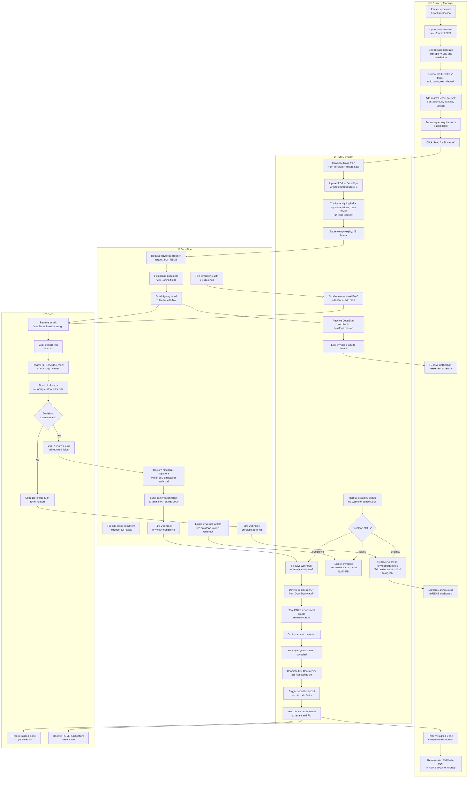

# BPMN Swimlane Diagram — Real Estate Management System

## Overview

This document presents two BPMN-style swimlane process diagrams for the Real Estate Management System. Each process is decomposed by participant lane to clarify which actor or system is responsible for each step, making handoff points and integration touchpoints explicit. The diagrams use Mermaid flowchart syntax with subgraph blocks to represent swimlanes.

---

## Process 1: Lease Signing Process

This process covers the complete lifecycle of lease execution: from the Property Manager initiating the lease document, through DocuSign orchestration, to final activation in the REMS database. Four lanes participate: Tenant, Property Manager, DocuSign, and the REMS System (automated steps).

---

## Process 2: Maintenance Request Process

This process covers the end-to-end maintenance workflow from tenant submission to closure, with a focus on the handoffs between Tenant, Property Manager, Contractor, and the REMS System. Decision points for priority escalation, contractor assignment, and work approval are explicitly modelled.

```mermaid
flowchart TD
    subgraph TN_LANE2["👤 Tenant"]
        TN2_1[Identify maintenance issue\nin unit]
        TN2_2[Log into tenant portal]
        TN2_3[Navigate to\n'New Maintenance Request']
        TN2_4[Select issue category\ne.g. plumbing, electrical, HVAC]
        TN2_5[Enter description\nand upload photos\nup to 5 images]
        TN2_6[Set priority:\nroutine / urgent / emergency]
        TN2_7[Submit request]
        TN2_8[Receive confirmation:\nrequest submitted, reference number]
        TN2_9[Receive notification:\ncontractor assigned, scheduled date]
        TN2_10[Provide property access\nfor contractor visit]
        TN2_11[Receive closure notification]
        TN2_12[Optionally submit\nsatisfaction rating 1–5]
    end

    subgraph PM_LANE2["🧑‍💼 Property Manager"]
        PM2_1[Receive new request\nnotification]
        PM2_2[Review request details:\ndescription, photos, priority]
        PM2_3{Assess scope}
        PM2_4[Minor repair:\nAssign to on-call contractor]
        PM2_5[Major repair:\nRequest cost estimate first]
        PM2_6[Select contractor\nfrom Contractor registry]
        PM2_7[Set estimated completion date]
        PM2_8[Create MaintenanceAssignment\nin REMS]
        PM2_9[Monitor assignment status\nvia PM dashboard]
        PM2_10{Contractor\ndeclines?}
        PM2_11[Reassign to\nalternate contractor]
        PM2_12[Review completion report\nand photos]
        PM2_13{Approve\ncompletion?}
        PM2_14[Request rework\nwith notes]
        PM2_15[Approve and close request\nRecord cost in expense ledger]
        PM2_16[Mark expense billable\nto owner if applicable]
    end

    subgraph CT_LANE["🔧 Contractor"]
        CT2_1[Receive work order\nvia email + SMS]
        CT2_2[Review work order:\nunit address, issue, photos\naccess instructions]
        CT2_3{Accept work order?}
        CT2_4[Confirm acceptance\nin REMS mobile app]
        CT2_5[Decline with reason\nin REMS mobile app]
        CT2_6[Travel to property\non scheduled date]
        CT2_7[Assess issue on-site\nupdate status: in_progress]
        CT2_8[Perform repair or\nschedule follow-up visit]
        CT2_9[Upload before/after photos\nvia REMS mobile app]
        CT2_10[Log materials used\nand labor hours]
        CT2_11[Mark job complete\nin REMS mobile app\nAdd completion notes]
    end

    subgraph SYS_LANE2["⚙️ REMS System"]
        SYS2_1[Create MaintenanceRequest record\nstatus = submitted\nLink to Lease and Unit]
        SYS2_2{Priority = emergency?}
        SYS2_3[Immediately send\nSMS alert to PM\nand on-call contractor]
        SYS2_4[Add to standard\nPM notification queue]
        SYS2_5[Create MaintenanceAssignment\nstatus = pending_acceptance]
        SYS2_6[Send work order\nnotification to contractor]
        SYS2_7[Start 24h acceptance\ntimer]
        SYS2_8{24h no response?}
        SYS2_9[Auto-escalate to PM\nfor manual follow-up]
        SYS2_10[Update assignment status:\naccepted]
        SYS2_11[Notify tenant:\ncontractor assigned + date]
        SYS2_12[Update assignment status:\nin_progress]
        SYS2_13[Update assignment status:\ncompleted]
        SYS2_14[Notify PM:\nwork completed, review required]
        SYS2_15[Set MaintenanceRequest.status\n= closed\nRecord final cost]
        SYS2_16[Update property expense ledger]
        SYS2_17[Send tenant closure\nnotification + rating prompt]
        SYS2_18[Store satisfaction rating\nUpdate contractor score]
    end

    %% Tenant to System
    TN2_1 --> TN2_2 --> TN2_3 --> TN2_4 --> TN2_5 --> TN2_6 --> TN2_7
    TN2_7 --> SYS2_1
    SYS2_1 --> TN2_8
    SYS2_1 --> SYS2_2
    SYS2_2 -- Yes --> SYS2_3
    SYS2_2 -- No --> SYS2_4
    SYS2_3 --> PM2_1
    SYS2_4 --> PM2_1

    %% PM assessment and assignment
    PM2_1 --> PM2_2 --> PM2_3
    PM2_3 -- Minor --> PM2_4
    PM2_3 -- Major --> PM2_5
    PM2_5 --> PM2_6
    PM2_4 --> PM2_6
    PM2_6 --> PM2_7 --> PM2_8
    PM2_8 --> SYS2_5 --> SYS2_6
    SYS2_6 --> CT2_1

    %% Contractor acceptance
    CT2_1 --> CT2_2 --> CT2_3
    CT2_3 -- Yes --> CT2_4
    CT2_3 -- No --> CT2_5
    CT2_4 --> SYS2_10
    CT2_5 --> SYS2_9
    SYS2_9 --> PM2_10
    PM2_10 -- Yes --> PM2_11
    PM2_11 --> PM2_6
    SYS2_6 --> SYS2_7 --> SYS2_8
    SYS2_8 -- Yes --> SYS2_9
    SYS2_10 --> SYS2_11
    SYS2_11 --> TN2_9
    PM2_9 --> PM2_10

    %% Field work
    TN2_9 --> TN2_10
    CT2_4 --> CT2_6 --> CT2_7 --> SYS2_12
    CT2_7 --> CT2_8 --> CT2_9 --> CT2_10 --> CT2_11
    CT2_11 --> SYS2_13 --> SYS2_14

    %% PM completion review
    SYS2_14 --> PM2_12 --> PM2_13
    PM2_13 -- No --> PM2_14
    PM2_14 --> CT2_7
    PM2_13 -- Yes --> PM2_15 --> PM2_16
    PM2_15 --> SYS2_15 --> SYS2_16 --> SYS2_17
    SYS2_17 --> TN2_11 --> TN2_12
    TN2_12 --> SYS2_18
```

