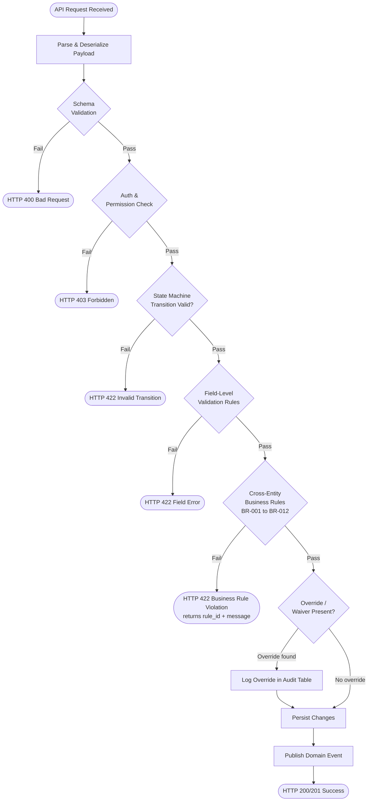

# Business Rules

Authoritative catalogue of domain-level constraints for the Real Estate Management
System. Each rule has a unique identifier, a trigger condition, the system enforcement
mechanism, and the default behavior when the rule is violated.

## Enforceable Rules

### BR-001 — Security Deposit Limits

**Trigger:** Lease creation or lease amendment that changes `security_deposit_amount`.

**Rule:** The security deposit must not exceed the limit imposed by the property's
state law. The system maintains a `state_deposit_rules` reference table that maps each
US state code to a `deposit_limit_multiplier` (e.g., California = 2×, New York = 1×).

**Enforcement:** At the service layer, before persisting the Lease record:

```
IF security_deposit_amount > (monthly_rent × state_deposit_limit_multiplier)
  RAISE validation_error: DEPOSIT_EXCEEDS_STATE_LIMIT
```

Landlords receive the maximum permissible amount in the error response so they can
correct their input without consulting external references.

**Violation outcome:** HTTP 422 Unprocessable Entity; lease is not persisted.

---

### BR-002 — Notice Period Requirements

**Trigger:** Tenant or landlord initiates a lease termination or a maintenance
entry-notification is created.

**Rule (vacating):** A tenant must submit written notice at least `notice_period_days`
(default 30) calendar days before the intended move-out date. Landlords may grant a
waiver that shortens this window, but the waiver must include a documented reason and
is logged immutably.

**Rule (entry notification):** A landlord or maintenance worker must provide at minimum
24 hours advance notice before entering an occupied unit for non-emergency work. The
system enforces this by blocking `MaintenanceRequest.scheduled_date` values that are
less than 24 hours from the creation timestamp, except when `priority = 'emergency'`.

**Enforcement:** Termination requests where `move_out_date − TODAY < notice_period_days`
are blocked unless a landlord waiver record is present.

**Violation outcome:** HTTP 422 with error code `NOTICE_PERIOD_NOT_MET`.

---

### BR-003 — Rent Control Compliance

**Trigger:** Lease renewal or mid-term rent amendment in a rent-controlled
jurisdiction.

**Rule:** In jurisdictions listed in the `rent_control_jurisdictions` reference table,
the proposed new monthly rent must not exceed the prior rent multiplied by
`(1 + allowable_increase_rate)`. Rates are typically CPI + 5% or a fixed statutory
percentage and are updated annually by the compliance team.

**Enforcement:** The renewal service queries `rent_control_jurisdictions` using the
property's `city` + `state` composite key. If a record is found, the maximum allowable
rent is calculated and any proposed rent above that ceiling raises an error.

```
allowable_max = current_rent × (1 + jurisdiction.allowable_increase_rate)
IF proposed_rent > allowable_max
  RAISE validation_error: RENT_INCREASE_EXCEEDS_CONTROL_LIMIT
```

**Violation outcome:** HTTP 422; landlord sees the maximum permissible rent value.

---

### BR-004 — Background Check Required for All New Tenants

**Trigger:** Lease status transition from `draft` → `active`.

**Rule:** Every new Lease activation requires the associated Tenant's
`background_check_status` to be either `passed` or `not_required`. The
`not_required` status may only be set by a landlord or admin with a documented
exemption reason (e.g., existing-tenant renewal, family-member exemption under
specific jurisdictions, or a court-ordered housing placement).

**Enforcement:**

```
IF tenant.background_check_status NOT IN ('passed', 'not_required')
  RAISE validation_error: BACKGROUND_CHECK_INCOMPLETE
```

Exemptions are recorded in the `lease_exemptions` audit table with `exemption_type`,
`granted_by`, `reason`, and `granted_at` fields.

**Violation outcome:** Lease activation is blocked. HTTP 422 with error code
`BACKGROUND_CHECK_INCOMPLETE`.

---

### BR-005 — Maintenance SLAs

**Trigger:** `MaintenanceRequest` record creation; SLA clock starts at `created_at`.

**Rule:** The system enforces the following response and scheduling windows based on
`priority`:

| Priority | Acknowledgement SLA | Scheduling SLA |
|---|---|---|
| emergency | 1 hour | Scheduled within 24 hours |
| high | 4 hours | Scheduled within 72 hours |
| medium | 24 hours | Scheduled within 7 days |
| low | 48 hours | Scheduled within 14 days |

Acknowledgement is defined as `status` moving from `open` to any other value.
Scheduling is defined as `scheduled_date` being populated.

**Enforcement:** A background worker (`MaintenanceSlaMonitor`) runs every 15 minutes.
It queries all open requests and computes time elapsed since `created_at`. When a
deadline is missed, it:

1. Creates an `SlaBreachEvent` record.
2. Publishes an alert notification via SendGrid to the property manager and landlord.
3. Sets a `sla_breached = true` flag on the request.

**Violation outcome:** Breach logged and escalation notification sent. The request
remains open; no auto-assignment occurs.

---

### BR-006 — Late Fee Rules

**Trigger:** Scheduled payment processor job runs daily at 08:00 UTC.

**Rule:** A late fee is assessed when a Payment with `status = 'pending'` has
`due_date + late_fee_grace_period_days < TODAY`. The fee amount is:

```
late_fee_amount = ROUND(monthly_rent × late_fee_percent / 100)
```

The resulting amount must not exceed the state-mandated cap, which is the greater of
5% of monthly rent or $50 (5000 cents). If `late_fee_percent` would yield more than the
cap, the cap value is used.

**Enforcement:** When a late fee is warranted:

1. The original Payment record is updated: `late_fee_applied = true`.
2. A new Payment record is created with `payment_type = 'late_fee'`, referencing
   the same `lease_id` and `tenant_id`.
3. The tenant receives a SendGrid notification.

Late fee enforcement is skipped if the Lease has `late_fee_grace_period_days = -1`
(opt-out sentinel) or if a waiver override exists.

**Violation outcome (if tenant disputes):** Landlord may create a waiver with reason;
the late fee Payment is set to `status = 'waived'`.

---

### BR-007 — Listing Verification

**Trigger:** Unit status transition to `vacant` with the landlord requesting a public
listing, or explicit "Publish Listing" action in the owner portal.

**Rule:** Before a Unit is visible in public search results, it must pass all of:

- `unit_number` is populated.
- `bedrooms`, `bathrooms`, `square_feet`, and `monthly_rent` are all non-null.
- `available_from` is set and is not in the past.
- At least one photo has been uploaded and linked to the unit.
- The parent Property's address has been geocoded successfully
  (`geocode_status = 'success'`).
- Unit `status` is `vacant` (not `under_maintenance` or `off_market`).

**Enforcement:** A `ListingVerificationService` runs the checklist and returns a
structured error list identifying each failing condition. The unit is not published
until all conditions pass.

**Violation outcome:** HTTP 422 with an array of `LISTING_CHECK_FAILED` sub-errors,
one per failing condition.

---

### BR-008 — Renewal Notice

**Trigger:** Scheduled daily job checks all Leases with `status = 'active'` and
upcoming `lease_end_date`.

**Rule:** The system sends automated notifications at the following intervals before
`lease_end_date`:

| Days Before End | Action |
|---|---|
| 90 days | Renewal reminder sent to tenant and landlord |
| 60 days | Second renewal reminder |
| 30 days | Final reminder; lease flagged for PM review if no action taken |
| 7 days | Auto-renewal triggered if `auto_renew = true` and no action taken |

"Action taken" means either a Renewal record exists with `status ≠ 'draft'` or a
termination notice has been submitted by either party.

**Enforcement:** The `LeaseRenewalMonitor` job evaluates every active lease daily.
Notifications are idempotent — a `lease_notifications` table tracks which milestones
have been sent per lease.

**Violation outcome (no action at 30 days):** A `PropertyManagerAlert` is created and
a support ticket is opened automatically for the assigned property manager.

---

### BR-009 — Maximum Lease Duration

**Trigger:** Lease creation or renewal.

**Rule:** The duration between `lease_start_date` and `lease_end_date` must not exceed
36 calendar months (approximately 1096 days, accounting for leap years). This limit
exists to ensure periodic market-rate re-evaluation and is consistent with standard
residential lease law in most US jurisdictions.

**Enforcement:**

```
IF (lease_end_date − lease_start_date) > INTERVAL '36 months'
  RAISE validation_error: LEASE_DURATION_EXCEEDS_MAXIMUM
```

Landlords requiring longer terms for commercial properties may request an admin
override documented with a jurisdiction-specific exemption.

**Violation outcome:** HTTP 422 with error code `LEASE_DURATION_EXCEEDS_MAXIMUM`.

---

### BR-010 — Rent Increase Notice

**Trigger:** Mid-term rent amendment or renewal with a higher rent than the current
Lease's `monthly_rent`.

**Rule:** Any rent increase must be communicated to the tenant at least 30 calendar
days before the new rent takes effect. The system enforces this by preventing a rent
amendment's `effective_date` from being set to less than `TODAY + 30 days`. In
rent-controlled jurisdictions, BR-003 additionally caps the allowable increase amount.

**Enforcement:**

```
IF new_monthly_rent > current_monthly_rent
  AND effective_date < TODAY + INTERVAL '30 days'
  RAISE validation_error: RENT_INCREASE_NOTICE_INSUFFICIENT
```

A SendGrid notification is dispatched to the tenant as soon as the amendment is saved,
regardless of the effective date.

**Violation outcome:** HTTP 422 with error code `RENT_INCREASE_NOTICE_INSUFFICIENT`.

---

### BR-011 — Inspection Required at Move-In and Move-Out

**Trigger:** Lease status transition to `active` (move-in) or `terminated`/`expired`
(move-out).

**Rule:** An Inspection record of the appropriate type must be completed within 3
calendar days of the move-in or move-out date:

- Move-in: `inspection_type = 'move_in'` must have `completed_date ≤ lease_start_date + 3 days`.
- Move-out: `inspection_type = 'move_out'` must have `completed_date ≤ termination_date + 3 days`.

The inspection requirement protects both parties in deposit disputes.

**Enforcement:** If no completed inspection exists within the window, the system
prevents the deposit return workflow from proceeding and raises a
`INSPECTION_OVERDUE` warning. The property manager receives a daily digest of
leases with overdue inspections.

**Violation outcome:** Deposit return blocked; `INSPECTION_OVERDUE` alert generated.

---

### BR-012 — Security Deposit Return Window

**Trigger:** Move-out inspection completed and `Lease.deposit_paid = true`.

**Rule:** The security deposit must be returned (or a detailed itemized deduction
statement sent) within the state-mandated window. The `state_deposit_rules` table
includes a `return_window_days` column (typically 14–30 days depending on state).

```
deposit_return_deadline = move_out_date + state.return_window_days
```

If `deposit_returned = false` and `TODAY > deposit_return_deadline`, the system
flags the lease for compliance review and notifies the landlord via SendGrid.
Failure to comply can result in landlord penalties as defined by state law (up to
2× the deposit amount in some states).

**Enforcement:** The `DepositReturnMonitor` job runs daily and checks all leases
where `status ∈ {terminated, expired}`, `deposit_paid = true`, and
`deposit_returned = false`. Breaches are logged and escalation emails sent.

**Violation outcome:** `DEPOSIT_RETURN_OVERDUE` flag set; landlord escalation
notification sent; compliance dashboard alert raised.

---

## Rule Evaluation Pipeline

Rules are evaluated in a defined order to surface the highest-priority violations
first. Validation is performed at the service layer before any database write.



Rules within the "Cross-Entity Business Rules" node are evaluated in BR-number order
so that the most foundational constraints (deposit limits, background checks) are
surfaced before downstream constraints (late fees, renewals). All violations
encountered are collected into a single error array rather than failing on the first
violation, to reduce round-trips for landlords correcting multiple fields.

---

## Exception and Override Handling

### Waiver Types

| Waiver Type | Who Can Grant | Scope | Documentation Required |
|---|---|---|---|
| `state_exemption` | Admin only | Single lease or lease class in a state | Jurisdiction reference + legal basis |
| `landlord_override` | Landlord (self-service) | Single lease or single payment | Free-text reason, minimum 20 characters |
| `admin_override` | Platform admin | Any rule, any record | Ticket reference + reason + approver |
| `court_order` | Admin only | Background check exemption only | Case number + jurisdiction |

### Audit Logging

Every override is written to the `rule_override_audit` table **before** the
exempted transaction is committed. The audit record includes:

| Field | Description |
|---|---|
| `id` | UUID, PK |
| `rule_id` | e.g. `BR-001` |
| `waiver_type` | From the table above |
| `granted_by` | User ID of the granting party |
| `target_entity_type` | e.g. `Lease`, `Payment` |
| `target_entity_id` | UUID of the affected record |
| `reason` | Free-text justification |
| `expires_at` | When the override ceases to apply |
| `created_at` | Immutable creation timestamp |

Audit records are append-only. Updates and deletes on `rule_override_audit` are
blocked by a database trigger. Records are exported nightly to the compliance data
warehouse in S3.

### Override Expiry

Overrides have an `expires_at` timestamp. The `OverrideExpiryWorker` runs hourly and:

1. Marks expired overrides as `status = 'expired'`.
2. Re-evaluates all entities that relied on the expired override.
3. If re-evaluation fails a rule, creates a `ComplianceAlert` for the property manager.

Landlord-granted overrides expire after 90 days by default. Admin overrides may be
set to never expire only for `court_order` waiver types.

### Suppression vs. Override

An **override** bypasses a specific rule for a specific record but still logs the
violation. A **suppression** (admin-only) removes the rule check entirely for a
defined scope (e.g., a pilot program state). Suppressions require a Jira ticket
reference, a review by the legal team, and a sunset date no more than 180 days out.
