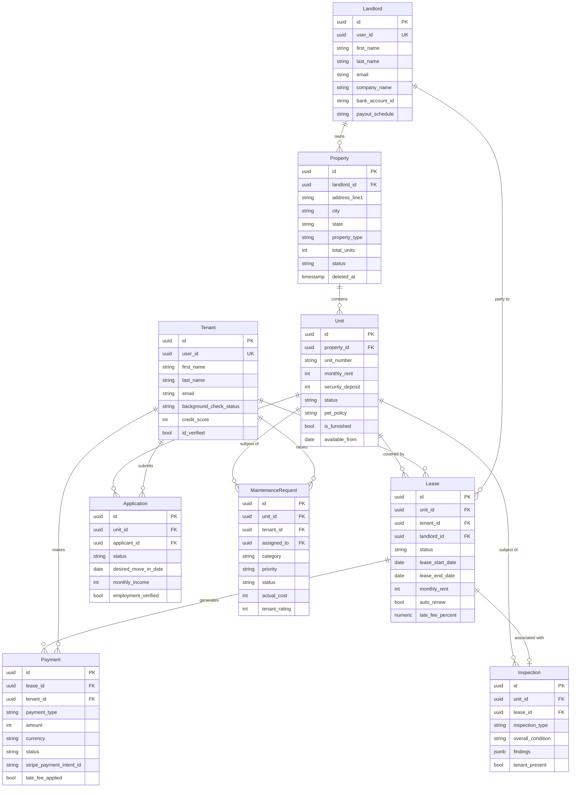

# Data Dictionary

Canonical reference for every persistent entity in the Real Estate Management System.
All monetary values are stored as **integers in cents** (USD) unless noted. Timestamps
are `TIMESTAMPTZ` (UTC). Soft-deletable records carry a `deleted_at` sentinel column.

## Core Entities

### Property

Represents a physical real-estate asset owned by a Landlord. A property contains one
or more Units. Properties with `deleted_at` set are hidden from all public-facing
queries but preserved for audit and historical lease references.

| Field | Type | Nullable | Default | Constraints | Description |
|---|---|---|---|---|---|
| id | UUID | No | gen_random_uuid() | PK | Unique property identifier |
| landlord_id | UUID | No | — | FK → Landlord.id | Owner of the property |
| address_line1 | VARCHAR(255) | No | — | NOT NULL | Primary street address |
| address_line2 | VARCHAR(255) | Yes | NULL | — | Suite, apt, or floor |
| city | VARCHAR(100) | No | — | NOT NULL | City name |
| state | CHAR(2) | No | — | NOT NULL, ISO 3166-2 | US state code |
| zip_code | VARCHAR(10) | No | — | NOT NULL | ZIP or postal code |
| country | CHAR(2) | No | `'US'` | ISO 3166-1 alpha-2 | Country code |
| property_type | ENUM | No | — | single_family / multi_family / condo / commercial | Property classification |
| year_built | SMALLINT | Yes | NULL | CHECK ≥ 1800 | Year of construction |
| total_units | SMALLINT | No | 1 | CHECK > 0 | Count of rentable units |
| status | ENUM | No | `'active'` | active / inactive / listed_for_sale | Lifecycle status |
| created_at | TIMESTAMPTZ | No | NOW() | NOT NULL | Record creation timestamp |
| updated_at | TIMESTAMPTZ | No | NOW() | NOT NULL | Last update timestamp |
| deleted_at | TIMESTAMPTZ | Yes | NULL | Soft-delete sentinel | NULL means record is live |

---

### Unit

An individual rentable space within a Property. Status transitions are governed by the
lease lifecycle: a unit moves to `occupied` when a Lease becomes `active` and back to
`vacant` when a Lease expires or is terminated.

| Field | Type | Nullable | Default | Constraints | Description |
|---|---|---|---|---|---|
| id | UUID | No | gen_random_uuid() | PK | Unique unit identifier |
| property_id | UUID | No | — | FK → Property.id | Parent property |
| unit_number | VARCHAR(20) | No | — | NOT NULL | Label e.g. "2B", "101" |
| floor | SMALLINT | Yes | NULL | — | Floor level |
| bedrooms | NUMERIC(3,1) | No | — | CHECK ≥ 0 | Bedroom count; 0 = studio |
| bathrooms | NUMERIC(3,1) | No | — | CHECK > 0 | Bathroom count |
| square_feet | NUMERIC(8,2) | Yes | NULL | CHECK > 0 | Interior area in sq ft |
| monthly_rent | INTEGER | No | — | CHECK > 0, cents | Asking rent |
| security_deposit | INTEGER | No | — | CHECK ≥ 0, cents | Required deposit amount |
| status | ENUM | No | `'vacant'` | vacant / occupied / under_maintenance / off_market | Availability status |
| amenities | TEXT[] | No | `'{}'` | GIN index | Array of amenity tags |
| pet_policy | ENUM | No | `'not_allowed'` | allowed / not_allowed / case_by_case | Pet rules |
| is_furnished | BOOLEAN | No | FALSE | — | Whether unit comes furnished |
| available_from | DATE | Yes | NULL | — | Earliest possible move-in |
| created_at | TIMESTAMPTZ | No | NOW() | NOT NULL | Record creation timestamp |
| updated_at | TIMESTAMPTZ | No | NOW() | NOT NULL | Last update timestamp |

---

### Lease

The legal agreement binding a Tenant to a Unit for a defined term. The `status` field
drives the lifecycle state machine. Only one Lease may be `active` for a given Unit at
any point in time (enforced via a partial unique index).

| Field | Type | Nullable | Default | Constraints | Description |
|---|---|---|---|---|---|
| id | UUID | No | gen_random_uuid() | PK | Unique lease identifier |
| unit_id | UUID | No | — | FK → Unit.id | Leased unit |
| tenant_id | UUID | No | — | FK → Tenant.id | Lessee |
| landlord_id | UUID | No | — | FK → Landlord.id | Lessor |
| status | ENUM | No | `'draft'` | draft / active / expired / terminated / renewed | Lifecycle state |
| lease_start_date | DATE | No | — | NOT NULL | Tenancy start date |
| lease_end_date | DATE | No | — | CHECK > lease_start_date | Tenancy end date |
| monthly_rent | INTEGER | No | — | CHECK > 0, cents | Agreed monthly rent |
| security_deposit_amount | INTEGER | No | — | CHECK ≥ 0, cents | Deposit collected |
| deposit_paid | BOOLEAN | No | FALSE | — | Whether deposit was received |
| deposit_returned | BOOLEAN | No | FALSE | — | Whether deposit was returned |
| notice_period_days | SMALLINT | No | 30 | CHECK > 0 | Days notice required to vacate |
| auto_renew | BOOLEAN | No | FALSE | — | Auto-renew if no action taken |
| renewal_terms | JSONB | Yes | NULL | — | Override terms for auto-renewal |
| late_fee_percent | NUMERIC(5,2) | No | 5.00 | CHECK 0–100 | Late fee as % of monthly rent |
| late_fee_grace_period_days | SMALLINT | No | 5 | CHECK ≥ 0 | Days past due before fee applies |
| signed_at | TIMESTAMPTZ | Yes | NULL | — | Timestamp of final countersignature |
| terminated_at | TIMESTAMPTZ | Yes | NULL | — | Timestamp of early termination |
| termination_reason | TEXT | Yes | NULL | — | Reason string if terminated early |
| created_at | TIMESTAMPTZ | No | NOW() | NOT NULL | Record creation timestamp |
| updated_at | TIMESTAMPTZ | No | NOW() | NOT NULL | Last update timestamp |

---

### Tenant

A renter identity, linked to an authenticated User account. PII fields are encrypted
at rest using AES-256 via the application-layer encryption service before being written
to PostgreSQL.

| Field | Type | Nullable | Default | Constraints | Description |
|---|---|---|---|---|---|
| id | UUID | No | gen_random_uuid() | PK | Unique tenant identifier |
| user_id | UUID | No | — | FK → User.id, UNIQUE | Auth identity reference |
| first_name | VARCHAR(100) | No | — | NOT NULL, PII-encrypted | Legal first name |
| last_name | VARCHAR(100) | No | — | NOT NULL, PII-encrypted | Legal last name |
| email | VARCHAR(255) | No | — | UNIQUE, RFC 5322, PII-encrypted | Contact email |
| phone | VARCHAR(20) | Yes | NULL | E.164 format, PII-encrypted | Contact phone |
| date_of_birth | DATE | Yes | NULL | PII-encrypted | For age and ID verification |
| employment_status | ENUM | No | — | employed / self_employed / unemployed / student / retired | Employment type |
| annual_income | INTEGER | Yes | NULL | CHECK ≥ 0, cents | Gross annual income |
| credit_score | SMALLINT | Yes | NULL | CHECK 300–850 | FICO credit score |
| id_verified | BOOLEAN | No | FALSE | — | Government ID confirmed |
| background_check_status | ENUM | No | `'pending'` | pending / passed / failed / not_required | Screening outcome |
| emergency_contact_name | VARCHAR(200) | Yes | NULL | — | Emergency contact full name |
| emergency_contact_phone | VARCHAR(20) | Yes | NULL | E.164 format | Emergency contact phone |
| created_at | TIMESTAMPTZ | No | NOW() | NOT NULL | Record creation timestamp |
| updated_at | TIMESTAMPTZ | No | NOW() | NOT NULL | Last update timestamp |

---

### Landlord

A property owner or property management company. Linked to Stripe Connect for
disbursement. `tax_id` is encrypted at rest and never returned in API responses.

| Field | Type | Nullable | Default | Constraints | Description |
|---|---|---|---|---|---|
| id | UUID | No | gen_random_uuid() | PK | Unique landlord identifier |
| user_id | UUID | No | — | FK → User.id, UNIQUE | Auth identity reference |
| first_name | VARCHAR(100) | No | — | NOT NULL | Legal first name |
| last_name | VARCHAR(100) | No | — | NOT NULL | Legal last name |
| email | VARCHAR(255) | No | — | UNIQUE, RFC 5322 | Contact email |
| phone | VARCHAR(20) | Yes | NULL | E.164 format | Contact phone |
| company_name | VARCHAR(255) | Yes | NULL | — | Business entity name if applicable |
| tax_id | VARCHAR(20) | Yes | NULL | Encrypted at rest | EIN or SSN for IRS 1099 |
| bank_account_id | VARCHAR(255) | Yes | NULL | Stripe Connect account ID | Payout destination |
| payout_schedule | ENUM | No | `'monthly'` | monthly / bi_weekly | Rent disbursement cadence |
| created_at | TIMESTAMPTZ | No | NOW() | NOT NULL | Record creation timestamp |
| updated_at | TIMESTAMPTZ | No | NOW() | NOT NULL | Last update timestamp |

---

### MaintenanceRequest

Tracks repair and service work for a Unit. Priority drives SLA enforcement (see
BR-005). Cost fields are populated by the assigned worker and reconciled against
invoices during close-out.

| Field | Type | Nullable | Default | Constraints | Description |
|---|---|---|---|---|---|
| id | UUID | No | gen_random_uuid() | PK | Unique request identifier |
| unit_id | UUID | No | — | FK → Unit.id | Affected unit |
| tenant_id | UUID | No | — | FK → Tenant.id | Requesting tenant |
| assigned_to | UUID | Yes | NULL | FK → User.id | Assigned maintenance worker |
| title | VARCHAR(255) | No | — | NOT NULL | Short summary |
| description | TEXT | No | — | NOT NULL | Full problem description |
| category | ENUM | No | — | plumbing / electrical / hvac / appliance / structural / other | Issue type |
| priority | ENUM | No | `'medium'` | low / medium / high / emergency | Urgency level |
| status | ENUM | No | `'open'` | open / in_progress / pending_parts / resolved / closed | Work status |
| estimated_cost | INTEGER | Yes | NULL | CHECK ≥ 0, cents | Pre-work estimate |
| actual_cost | INTEGER | Yes | NULL | CHECK ≥ 0, cents | Final cost on close |
| scheduled_date | TIMESTAMPTZ | Yes | NULL | — | Planned repair appointment |
| resolved_at | TIMESTAMPTZ | Yes | NULL | — | Timestamp of resolution |
| tenant_rating | SMALLINT | Yes | NULL | CHECK 1–5 | Post-resolution satisfaction |
| created_at | TIMESTAMPTZ | No | NOW() | NOT NULL | Record creation timestamp |
| updated_at | TIMESTAMPTZ | No | NOW() | NOT NULL | Last update timestamp |

---

### Payment

Every financial transaction related to a Lease. Amounts in cents. Stripe Payment
Intent ID is populated for card and ACH transactions; cash/check payments are recorded
manually by the landlord.

| Field | Type | Nullable | Default | Constraints | Description |
|---|---|---|---|---|---|
| id | UUID | No | gen_random_uuid() | PK | Unique payment identifier |
| lease_id | UUID | No | — | FK → Lease.id | Associated lease |
| tenant_id | UUID | No | — | FK → Tenant.id | Paying party |
| payment_type | ENUM | No | `'rent'` | rent / security_deposit / late_fee / maintenance / other | Classification |
| amount | INTEGER | No | — | CHECK > 0, cents | Transaction amount |
| currency | CHAR(3) | No | `'USD'` | ISO 4217 | Currency code |
| due_date | DATE | No | — | NOT NULL | Expected payment date |
| paid_at | TIMESTAMPTZ | Yes | NULL | — | Actual payment timestamp |
| status | ENUM | No | `'pending'` | pending / paid / overdue / failed / waived | Payment state |
| stripe_payment_intent_id | VARCHAR(255) | Yes | NULL | UNIQUE when set | Stripe intent reference |
| payment_method | ENUM | Yes | NULL | bank_transfer / credit_card / cash / check | Payment channel |
| late_fee_applied | BOOLEAN | No | FALSE | — | Whether a late fee was added |
| created_at | TIMESTAMPTZ | No | NOW() | NOT NULL | Record creation timestamp |
| updated_at | TIMESTAMPTZ | No | NOW() | NOT NULL | Last update timestamp |

---

### Application

A prospective tenant's request to rent a Unit. Drives the screening workflow before a
Lease can be created. One Tenant may have multiple Applications across different Units,
but only one non-withdrawn Application per Unit at a time.

| Field | Type | Nullable | Default | Constraints | Description |
|---|---|---|---|---|---|
| id | UUID | No | gen_random_uuid() | PK | Unique application identifier |
| unit_id | UUID | No | — | FK → Unit.id | Applied-for unit |
| applicant_id | UUID | No | — | FK → Tenant.id | Applying tenant |
| status | ENUM | No | `'submitted'` | submitted / under_review / background_check / approved / rejected / withdrawn | Pipeline stage |
| desired_move_in_date | DATE | No | — | NOT NULL | Requested start date |
| monthly_income | INTEGER | No | — | CHECK > 0, cents | Reported gross monthly income |
| employment_verified | BOOLEAN | No | FALSE | — | Income and employer confirmed |
| references_checked | BOOLEAN | No | FALSE | — | Reference calls completed |
| background_check_provider_ref | VARCHAR(255) | Yes | NULL | — | External screening reference ID |
| rejection_reason | TEXT | Yes | NULL | Required if status = rejected | Reason for rejection |
| reviewed_by | UUID | Yes | NULL | FK → User.id | Landlord or PM who decided |
| reviewed_at | TIMESTAMPTZ | Yes | NULL | — | Decision timestamp |
| submitted_at | TIMESTAMPTZ | No | NOW() | NOT NULL | Application submission time |
| created_at | TIMESTAMPTZ | No | NOW() | NOT NULL | Record creation timestamp |
| updated_at | TIMESTAMPTZ | No | NOW() | NOT NULL | Last update timestamp |

---

### Inspection

A structured assessment of a Unit's condition. `findings` stores a JSONB array where
each element has the shape `{ room, condition, notes, photos[] }`. Move-in and
move-out inspections are paired by `lease_id` to support deposit dispute resolution.

| Field | Type | Nullable | Default | Constraints | Description |
|---|---|---|---|---|---|
| id | UUID | No | gen_random_uuid() | PK | Unique inspection identifier |
| unit_id | UUID | No | — | FK → Unit.id | Inspected unit |
| lease_id | UUID | Yes | NULL | FK → Lease.id | Associated lease if applicable |
| inspection_type | ENUM | No | — | move_in / move_out / routine / maintenance | Purpose of inspection |
| scheduled_date | TIMESTAMPTZ | No | — | NOT NULL | Planned inspection time |
| completed_date | TIMESTAMPTZ | Yes | NULL | — | Actual completion timestamp |
| inspector_id | UUID | No | — | FK → User.id | Inspector performing the check |
| overall_condition | ENUM | Yes | NULL | excellent / good / fair / poor | Summary condition rating |
| findings | JSONB | No | `'[]'` | Array of room-level objects | Detailed room-by-room findings |
| recommendations | TEXT | Yes | NULL | — | Suggested follow-up actions |
| tenant_present | BOOLEAN | No | FALSE | — | Whether tenant attended |
| tenant_signature_at | TIMESTAMPTZ | Yes | NULL | — | When tenant acknowledged report |
| report_url | VARCHAR(2048) | Yes | NULL | Valid HTTPS URL | Link to PDF report in S3 |
| created_at | TIMESTAMPTZ | No | NOW() | NOT NULL | Record creation timestamp |
| updated_at | TIMESTAMPTZ | No | NOW() | NOT NULL | Last update timestamp |

---

## Canonical Relationship Diagram

---

## Data Quality Controls

### Field Validation Rules

| Field | Rule | Error Code | Notes |
|---|---|---|---|
| email | RFC 5322 regex; domain must have MX record | `INVALID_EMAIL` | Validated at API layer before persistence |
| phone | E.164 format: `^\+[1-9]\d{7,14}$` | `INVALID_PHONE` | Applied to Tenant, Landlord, emergency contacts |
| credit_score | Integer in range 300–850 inclusive | `INVALID_CREDIT_SCORE` | Only set by background check service, not tenant-supplied |
| state | Two-letter ISO 3166-2 code from approved list | `INVALID_STATE` | Prevents free-text entry |
| zip_code | `^\d{5}(-\d{4})?$` for US; postal regex per country | `INVALID_ZIP` | Country-aware regex applied at service layer |
| currency | ISO 4217 three-letter code from supported list | `INVALID_CURRENCY` | Currently only `USD` accepted |
| lease_end_date | Must be strictly greater than `lease_start_date` | `INVALID_LEASE_DATES` | Minimum term of 1 month also enforced by BR-009 |
| report_url | Must begin with `https://` | `INVALID_URL` | S3 pre-signed URLs expire after 7 days; permanent URLs stored |
| tenant_rating | Integer in range 1–5 inclusive | `INVALID_RATING` | Nullable; only settable once per request |

### Currency Storage

All monetary amounts (rent, deposit, fees, costs) are stored as **32-bit integers
representing cents** to eliminate floating-point rounding errors. API responses convert
cents to decimal using the `amount / 100` transform. The `currency` column gates the
divisor — non-decimal currencies (e.g. JPY) would use divisor 1, but only USD is
currently supported.

### Soft-Delete Pattern

`Property`, `Tenant`, `Landlord`, and `Application` records are soft-deleted by
setting `deleted_at = NOW()`. All ORM queries apply a default scope
`WHERE deleted_at IS NULL`. Hard deletes are prohibited by the application layer.
Retention policy: soft-deleted records are archived to cold storage after 7 years to
satisfy tax and legal hold requirements.

### Address Normalization

On `Property` creation and update, the service calls the AWS Location Service
(HERE geocoder) to:

1. Standardize `address_line1` to USPS format.
2. Derive `latitude` and `longitude` (stored in a separate `property_coordinates`
   table as `POINT` type with PostGIS).
3. Validate that the ZIP code is consistent with `city` and `state`.

Geocoding failure blocks listing creation (see BR-007) but does not block property
creation — the property is flagged with `geocode_status = 'failed'`.

### Tenant PII Encryption at Rest

The following fields on `Tenant` are encrypted before writing and decrypted after
reading using AES-256-GCM with a per-tenant key envelope stored in AWS KMS:

- `first_name`, `last_name`, `email`, `phone`, `date_of_birth`

Encrypted ciphertext is stored as `BYTEA`. A parallel plaintext index column (e.g.
`email_hash` using HMAC-SHA256 with a global HMAC key) supports equality lookups
without decrypting every row. The HMAC key is rotated annually.

### Referential Integrity Constraints

- `ON DELETE RESTRICT` is the default for all foreign keys. Landlord and Tenant
  records cannot be hard-deleted while active Leases exist.
- `ON DELETE CASCADE` is applied from `Property → Unit` only; deleting a property
  cascades unit soft-deletes through the application layer (not DB-level) to preserve
  audit trails.
- A partial unique index enforces at most one `active` lease per unit:
  `CREATE UNIQUE INDEX ON Lease(unit_id) WHERE status = 'active';`
