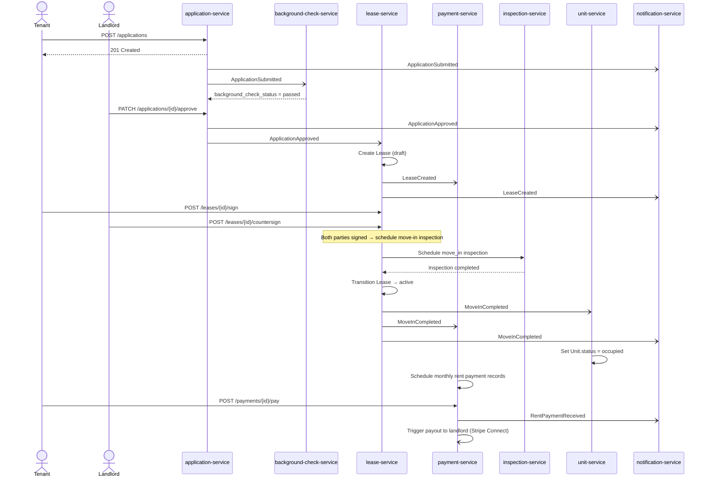

# Event Catalog

Canonical reference for all domain events published by the Real Estate Management
System. Events are the authoritative integration contract between internal services
and external consumers. All producers must conform to the envelope schema below;
payload schemas are versioned independently per event type.

## Contract Conventions

### Event Envelope

Every event, regardless of type, is wrapped in a standard JSON envelope before being
published to the message broker (Amazon MSK / Apache Kafka). Consumers must be able to
route, filter, and audit events using envelope fields alone, without parsing `payload`.

```json
{
  "eventId":        "uuid-v4",
  "eventType":      "com.realestate.lease.LeaseCreated",
  "version":        "1.0.0",
  "timestamp":      "2024-07-15T14:32:00.000Z",
  "aggregateId":    "uuid-of-the-root-aggregate",
  "aggregateType":  "Lease",
  "producerService":"lease-service",
  "correlationId":  "uuid-of-originating-http-request",
  "tenantId":       "uuid-of-platform-landlord-account",
  "payload":        { }
}
```

| Field | Type | Description |
|---|---|---|
| `eventId` | UUIDv4 | Globally unique event identifier; used for idempotency |
| `eventType` | string | Fully qualified reverse-DNS name |
| `version` | semver | Schema version of the `payload` object |
| `timestamp` | ISO 8601 UTC | Wall-clock time the event was produced |
| `aggregateId` | UUIDv4 | ID of the root aggregate the event describes |
| `aggregateType` | string | Root aggregate class name |
| `producerService` | string | Kubernetes service name that published the event |
| `correlationId` | UUIDv4 | Traces back to the originating HTTP request or job run |
| `tenantId` | UUIDv4 | Platform-level landlord account for multi-tenancy filtering |
| `payload` | object | Event-specific data — schema defined per event type below |

### Versioning Strategy

Payload schemas follow [Semantic Versioning](https://semver.org/):

- **Patch** (`1.0.x`): Non-breaking fixes (e.g., corrected field description, no
  schema change). Consumers need not be updated.
- **Minor** (`1.x.0`): Additive, backward-compatible changes (new optional fields).
  Consumers can ignore unknown fields.
- **Major** (`x.0.0`): Breaking change (renamed or removed field, type change).
  The producer publishes to a new topic suffixed with the major version (e.g.,
  `realestate.lease.created.v2`). The v1 topic continues publishing until all
  consumers have migrated.

Schema definitions are stored in the `schemas/events/` directory and registered in
the AWS Glue Schema Registry. Producers validate outbound payloads against the
registered Avro/JSON-Schema before publishing.

### Topic Naming Convention

```
realestate.<domain>.<event-name-kebab-case>
```

Examples:

| Topic | Event |
|---|---|
| `realestate.property.property-listed` | PropertyListed |
| `realestate.application.application-submitted` | ApplicationSubmitted |
| `realestate.application.application-approved` | ApplicationApproved |
| `realestate.lease.lease-created` | LeaseCreated |
| `realestate.lease.move-in-completed` | MoveInCompleted |
| `realestate.maintenance.request-created` | MaintenanceRequestCreated |
| `realestate.payment.rent-payment-received` | RentPaymentReceived |
| `realestate.lease.lease-terminated` | LeaseTerminated |

Partition keys default to `aggregateId` to preserve per-aggregate ordering.
Cross-aggregate ordering is not guaranteed by design.

---

## Domain Events

### PropertyListed

Published when a Unit passes the listing verification checklist (BR-007) and becomes
publicly visible on the rental marketplace.

**Producer:** `property-service`
**Topic:** `realestate.property.property-listed`
**Version:** `1.0.0`

**Payload Schema:**

| Field | Type | Nullable | Description |
|---|---|---|---|
| `propertyId` | UUID | No | Owning Property record |
| `landlordId` | UUID | No | Landlord who owns the property |
| `unitId` | UUID | No | Unit being listed |
| `monthlyRent` | integer | No | Asking rent in cents |
| `availableFrom` | ISO 8601 date | No | Earliest move-in date |
| `listingUrl` | string | No | Public canonical URL for the listing |
| `photos` | string[] | No | Ordered array of S3 photo URLs |

```json
{
  "propertyId":   "prop-uuid",
  "landlordId":   "landlord-uuid",
  "unitId":       "unit-uuid",
  "monthlyRent":  250000,
  "availableFrom":"2024-08-01",
  "listingUrl":   "https://app.realestate.io/listings/unit-uuid",
  "photos":       ["https://cdn.realestate.io/photos/unit-uuid/01.jpg"]
}
```

**Consumers:** `search-indexer-service`, `notification-service`

---

### ApplicationSubmitted

Published when a prospective tenant submits a rental application for a Unit.

**Producer:** `application-service`
**Topic:** `realestate.application.application-submitted`
**Version:** `1.0.0`

**Payload Schema:**

| Field | Type | Nullable | Description |
|---|---|---|---|
| `applicationId` | UUID | No | Application record |
| `unitId` | UUID | No | Applied-for unit |
| `applicantId` | UUID | No | Tenant ID of the applicant |
| `desiredMoveInDate` | ISO 8601 date | No | Requested tenancy start |
| `monthlyIncome` | integer | No | Reported gross monthly income in cents |
| `submittedAt` | ISO 8601 UTC | No | Submission timestamp |

```json
{
  "applicationId":     "app-uuid",
  "unitId":            "unit-uuid",
  "applicantId":       "tenant-uuid",
  "desiredMoveInDate": "2024-09-01",
  "monthlyIncome":     600000,
  "submittedAt":       "2024-07-15T10:00:00.000Z"
}
```

**Consumers:** `notification-service` (alerts landlord), `background-check-service`

---

### ApplicationApproved

Published when a landlord or property manager approves a rental application and the
tenant is cleared to proceed to lease creation.

**Producer:** `application-service`
**Topic:** `realestate.application.application-approved`
**Version:** `1.0.0`

**Payload Schema:**

| Field | Type | Nullable | Description |
|---|---|---|---|
| `applicationId` | UUID | No | Approved application record |
| `unitId` | UUID | No | Approved unit |
| `applicantId` | UUID | No | Approved tenant's ID |
| `approvedBy` | UUID | No | User ID of the approving landlord or PM |
| `approvedAt` | ISO 8601 UTC | No | Approval timestamp |
| `conditionalNotes` | string | Yes | Optional conditions attached to approval |

```json
{
  "applicationId":  "app-uuid",
  "unitId":         "unit-uuid",
  "applicantId":    "tenant-uuid",
  "approvedBy":     "landlord-uuid",
  "approvedAt":     "2024-07-16T09:00:00.000Z",
  "conditionalNotes": "Co-signer required within 5 days."
}
```

**Consumers:** `lease-service` (triggers draft lease creation), `notification-service`

---

### LeaseCreated

Published when a new Lease record is persisted in `draft` status and the tenant has
been sent the digital lease document for signature.

**Producer:** `lease-service`
**Topic:** `realestate.lease.lease-created`
**Version:** `1.0.0`

**Payload Schema:**

| Field | Type | Nullable | Description |
|---|---|---|---|
| `leaseId` | UUID | No | New lease record |
| `unitId` | UUID | No | Leased unit |
| `tenantId` | UUID | No | Lessee |
| `landlordId` | UUID | No | Lessor |
| `leaseStartDate` | ISO 8601 date | No | Tenancy start |
| `leaseEndDate` | ISO 8601 date | No | Tenancy end |
| `monthlyRent` | integer | No | Agreed rent in cents |
| `securityDeposit` | integer | No | Deposit amount in cents |

```json
{
  "leaseId":        "lease-uuid",
  "unitId":         "unit-uuid",
  "tenantId":       "tenant-uuid",
  "landlordId":     "landlord-uuid",
  "leaseStartDate": "2024-09-01",
  "leaseEndDate":   "2025-08-31",
  "monthlyRent":    250000,
  "securityDeposit":500000
}
```

**Consumers:** `payment-service` (creates security deposit payment record),
`notification-service`, `document-service`

---

### MoveInCompleted

Published when a move-in inspection is completed, keys are handed over, and the
Lease transitions from `draft` to `active`.

**Producer:** `lease-service`
**Topic:** `realestate.lease.move-in-completed`
**Version:** `1.0.0`

**Payload Schema:**

| Field | Type | Nullable | Description |
|---|---|---|---|
| `leaseId` | UUID | No | Activated lease |
| `unitId` | UUID | No | Occupied unit |
| `tenantId` | UUID | No | Tenant taking occupancy |
| `moveInDate` | ISO 8601 date | No | Actual move-in date |
| `inspectionId` | UUID | No | Completed move-in inspection record |
| `keyHandedOver` | boolean | No | Confirms physical key transfer |

```json
{
  "leaseId":      "lease-uuid",
  "unitId":       "unit-uuid",
  "tenantId":     "tenant-uuid",
  "moveInDate":   "2024-09-01",
  "inspectionId": "inspection-uuid",
  "keyHandedOver": true
}
```

**Consumers:** `unit-service` (sets unit status → occupied), `notification-service`,
`payment-service` (schedules first month rent reminder)

---

### MaintenanceRequestCreated

Published when a tenant or property manager creates a new maintenance request.
Downstream services use `priority` to enforce SLA timers (BR-005).

**Producer:** `maintenance-service`
**Topic:** `realestate.maintenance.request-created`
**Version:** `1.0.0`

**Payload Schema:**

| Field | Type | Nullable | Description |
|---|---|---|---|
| `requestId` | UUID | No | MaintenanceRequest record |
| `unitId` | UUID | No | Affected unit |
| `tenantId` | UUID | No | Requesting tenant |
| `category` | string | No | Issue category enum value |
| `priority` | string | No | Urgency level enum value |
| `description` | string | No | Full problem description |
| `photos` | string[] | No | Array of S3 photo URLs (may be empty) |
| `createdAt` | ISO 8601 UTC | No | SLA clock start time |

```json
{
  "requestId":   "req-uuid",
  "unitId":      "unit-uuid",
  "tenantId":    "tenant-uuid",
  "category":    "plumbing",
  "priority":    "high",
  "description": "Hot water heater not producing hot water.",
  "photos":      ["https://cdn.realestate.io/maint/req-uuid/photo1.jpg"],
  "createdAt":   "2024-07-20T08:15:00.000Z"
}
```

**Consumers:** `sla-monitor-service`, `notification-service`
(alerts landlord and assigned worker), `scheduling-service`

---

### RentPaymentReceived

Published when a Payment of `payment_type = 'rent'` transitions to `status = 'paid'`.
Triggers landlord payout scheduling and tenant receipt generation.

**Producer:** `payment-service`
**Topic:** `realestate.payment.rent-payment-received`
**Version:** `1.0.0`

**Payload Schema:**

| Field | Type | Nullable | Description |
|---|---|---|---|
| `paymentId` | UUID | No | Payment record |
| `leaseId` | UUID | No | Associated lease |
| `tenantId` | UUID | No | Paying tenant |
| `amount` | integer | No | Amount paid in cents |
| `currency` | string | No | ISO 4217 currency code |
| `paidAt` | ISO 8601 UTC | No | Confirmed payment timestamp |
| `paymentMethod` | string | No | Channel used (bank_transfer / credit_card / etc.) |
| `dueDate` | ISO 8601 date | No | Original due date for the payment period |

```json
{
  "paymentId":     "pay-uuid",
  "leaseId":       "lease-uuid",
  "tenantId":      "tenant-uuid",
  "amount":        250000,
  "currency":      "USD",
  "paidAt":        "2024-09-01T12:00:00.000Z",
  "paymentMethod": "bank_transfer",
  "dueDate":       "2024-09-01"
}
```

**Consumers:** `payout-service` (disburses to landlord via Stripe Connect),
`notification-service` (tenant receipt, landlord income alert), `ledger-service`

---

### LeaseTerminated

Published when a Lease transitions to `terminated` or `expired`. Triggers move-out
inspection scheduling, deposit return workflow, and unit status reset.

**Producer:** `lease-service`
**Topic:** `realestate.lease.lease-terminated`
**Version:** `1.0.0`

**Payload Schema:**

| Field | Type | Nullable | Description |
|---|---|---|---|
| `leaseId` | UUID | No | Terminated lease |
| `unitId` | UUID | No | Vacated unit |
| `tenantId` | UUID | No | Departing tenant |
| `landlordId` | UUID | No | Property owner |
| `terminationDate` | ISO 8601 date | No | Effective move-out date |
| `terminationReason` | string | No | Reason for termination |
| `initiatedBy` | string | No | Who triggered: tenant / landlord / system |
| `depositReturnAmount` | integer | Yes | Planned deposit return in cents; null if not yet calculated |

```json
{
  "leaseId":             "lease-uuid",
  "unitId":              "unit-uuid",
  "tenantId":            "tenant-uuid",
  "landlordId":          "landlord-uuid",
  "terminationDate":     "2025-08-31",
  "terminationReason":   "Lease end — no renewal",
  "initiatedBy":         "system",
  "depositReturnAmount": 500000
}
```

**Consumers:** `unit-service` (resets status → vacant), `inspection-service`
(schedules move-out inspection), `payment-service` (initiates deposit return),
`notification-service`

---

## Publish and Consumption Sequence

The following diagram traces the complete tenant lifecycle from application to move-in,
showing which service publishes each event and which services consume it.



---

## Operational SLOs

Service-level objectives for event production and end-to-end delivery. Measured over
a 30-day rolling window. Breaches trigger PagerDuty alerts to the platform on-call.

| Event Type | Producer Service | Consumer Services | Max Publish Latency | Retention | Partition Key |
|---|---|---|---|---|---|
| PropertyListed | property-service | search-indexer, notification-service | 500 ms (p99) | 30 days | `unitId` |
| ApplicationSubmitted | application-service | notification-service, background-check-service | 500 ms (p99) | 90 days | `applicationId` |
| ApplicationApproved | application-service | lease-service, notification-service | 500 ms (p99) | 90 days | `applicationId` |
| LeaseCreated | lease-service | payment-service, notification-service, document-service | 500 ms (p99) | 7 years | `leaseId` |
| MoveInCompleted | lease-service | unit-service, payment-service, notification-service | 1 s (p99) | 7 years | `leaseId` |
| MaintenanceRequestCreated | maintenance-service | sla-monitor-service, notification-service, scheduling-service | 500 ms (p99) | 1 year | `unitId` |
| RentPaymentReceived | payment-service | payout-service, notification-service, ledger-service | 200 ms (p99) | 7 years | `leaseId` |
| LeaseTerminated | lease-service | unit-service, inspection-service, payment-service, notification-service | 500 ms (p99) | 7 years | `leaseId` |

### SLO Definitions

| SLO | Target | Measurement |
|---|---|---|
| Producer publish success rate | ≥ 99.9% | Events published / attempted over 30 days |
| End-to-end delivery (producer → consumer acknowledged) | ≤ 2 s (p99) | Kafka consumer lag metric per consumer group |
| Consumer processing success rate | ≥ 99.5% | Messages without DLQ routing over 30 days |
| Dead Letter Queue drain time | ≤ 4 hours | Time from DLQ write to manual/automated resolution |

### Dead Letter Queue Policy

Events that fail consumer processing after 3 retry attempts (with exponential back-off:
1 s, 4 s, 16 s) are routed to a DLQ topic named
`realestate.<domain>.<event-name-kebab-case>.dlq`. A DLQ monitor Lambda function:

1. Alerts the on-call engineer via PagerDuty if queue depth exceeds 10 messages.
2. Exports DLQ messages to S3 for manual replay via the `event-replayer` CLI tool.
3. Auto-retries messages once after 30 minutes for transient infrastructure failures
   (identified by `error_code = 'TIMEOUT'` in the consumer error context).
