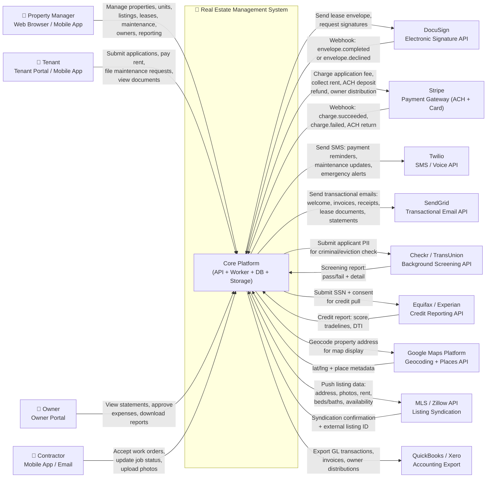

# System Context Diagram — Real Estate Management System

## Overview

The Real Estate Management System (REMS) sits at the intersection of property operations and a constellation of third-party services. At its core, REMS orchestrates data flows between human actors — property managers, tenants, owners, and contractors — and external platforms that handle specialized capabilities: identity screening, electronic signatures, payment processing, SMS/email delivery, mapping, and accounting. This document defines the C4 context-level boundary of the system, catalogues every external integration, and specifies the data exchanged at each interface.

REMS does not re-implement commodity services. It acts as an orchestration hub: receiving commands from human actors through web and mobile interfaces, executing business logic, persisting state in its own data store, and delegating specialized work to best-of-breed external systems via authenticated API connections. All integrations are asynchronous where possible (webhook-driven), with synchronous calls reserved for operations that require an immediate user response (e.g., real-time payment authorization).

---

## C4 Context-Level Diagram

---

## External Systems Catalogue

| # | External System | Category | Protocol | Auth Method | SLA |
|---|---|---|---|---|---|
| 1 | DocuSign eSignature API | Digital Signatures | REST / HTTPS | OAuth 2.0 JWT Grant | 99.9% uptime |
| 2 | Stripe Payments | Payment Processing | REST / HTTPS + Webhooks | API Key (Secret) | 99.99% uptime |
| 3 | Twilio SMS / Voice | Notifications | REST / HTTPS | API Key + Auth Token | 99.95% uptime |
| 4 | SendGrid Email | Notifications | REST / HTTPS + SMTP | API Key | 99.95% uptime |
| 5 | Checkr / TransUnion | Background Screening | REST / HTTPS | API Key + Secret | Best-effort 10 min |
| 6 | Equifax / Experian | Credit Reporting | REST / HTTPS | OAuth 2.0 Client Creds | Best-effort 5 min |
| 7 | Google Maps Platform | Geocoding & Maps | REST / HTTPS | API Key | 99.9% uptime |
| 8 | MLS / Zillow API | Listing Syndication | REST / HTTPS | OAuth 2.0 | 99.5% uptime |
| 9 | QuickBooks / Xero | Accounting | REST / HTTPS | OAuth 2.0 | 99.5% uptime |

---

## Integration Descriptions

### 1. DocuSign eSignature API

REMS uses DocuSign to handle all legally binding electronic signatures for leases, lease amendments, lease renewal agreements, and inspection reports requiring tenant acknowledgment. When the Property Manager confirms lease terms, REMS calls the DocuSign Envelopes API to create a signing envelope, attach the generated PDF, define recipient roles (tenant + PM), and place signature/date field anchors. DocuSign then delivers the signing workflow directly to the tenant's email. Upon completion, DocuSign fires a webhook to a REMS endpoint; REMS downloads the signed document, stores it in object storage, and transitions the lease state to `active`.

### 2. Stripe Payment Gateway

Stripe processes all monetary transactions within REMS: one-time application fees (card), monthly rent collection (ACH bank debit or card), security deposit collection, deposit refunds (ACH payout), and owner distributions (ACH payout). REMS creates Stripe Customers at tenant registration and attaches payment methods. For recurring rent, REMS creates a Stripe PaymentIntent each billing cycle rather than a Subscription, preserving control over the invoicing lifecycle. Webhook events (`charge.succeeded`, `charge.failed`, `payment_intent.payment_failed`) drive state transitions in REMS, ensuring the UI reflects real-time payment status.

### 3. Twilio SMS / Voice

Twilio delivers time-sensitive SMS notifications: rent due reminders (3 days before due date), payment confirmation texts, emergency maintenance alerts to contractors and PMs, lease expiry warnings, and inspection schedule reminders. REMS uses Twilio's Messaging API via server-side REST calls. Phone numbers are verified at tenant and contractor onboarding. Delivery receipts are stored on the REMS notification log for audit purposes.

### 4. SendGrid Transactional Email

SendGrid handles all outbound email: welcome emails, application status updates, invoice PDFs, payment receipts, lease document links, owner statements, and inspection reports. REMS uses SendGrid's Dynamic Templates with handlebars-style variables populated at send time. Bounce, unsubscribe, and spam events are processed via SendGrid's Event Webhook and stored on the REMS contact record to prevent future invalid sends.

### 5. Checkr / TransUnion Background Screening

On application approval, REMS calls the Checkr (or TransUnion SmartMove) API with the applicant's full name, date of birth, SSN (encrypted in transit), and FCRA consent token. The API runs criminal record checks, national eviction history, sex offender registry checks, and identity verification. Results are returned asynchronously (webhook or polling) and stored encrypted in the `BackgroundCheck` table. REMS evaluates results against configurable underwriting rules and updates application status automatically.

### 6. Equifax / Experian Credit Reporting

REMS calls Equifax's Application Programming Interface or Experian's Connect API with the applicant's SSN and consent record to retrieve a tri-merge credit report including FICO score, payment history, open tradelines, derogatory marks, and debt-to-income calculation inputs. The raw credit report payload is stored encrypted. REMS applies the configured minimum score threshold and DTI limit to determine auto-approval or manual review routing.

### 7. Google Maps Platform

REMS calls the Google Maps Geocoding API whenever a new property address is saved, converting the text address into latitude/longitude coordinates stored on the `Property` record. These coordinates drive the listing map display in the tenant portal, allowing prospective tenants to explore available units geographically. The Places API is also used for address autocomplete during property data entry to reduce input errors.

### 8. MLS / Zillow Listing Syndication

When a Property Manager publishes a listing, REMS pushes the listing payload (address, unit details, rent, photos, availability date, amenities) to the configured MLS data feed and the Zillow API. This ensures maximum visibility for available units without manual re-entry in external platforms. REMS stores the external listing IDs returned by each platform for future status updates (price changes, deactivation on lease execution).

### 9. QuickBooks / Xero Accounting Export

At the end of each month, REMS exports a structured journal entry file (or uses the QuickBooks API) to push rent income, maintenance expenses, management fees, and owner distributions to the property management company's general ledger. This eliminates manual bookkeeping and ensures financial statements in the accounting system match REMS records. The export is reconciliation-safe: REMS includes unique transaction IDs so duplicate prevention works on the accounting system side.

---

## Data Flows Table

| Flow Direction | Source | Destination | Data Exchanged | Trigger | Frequency |
|---|---|---|---|---|---|
| REMS → DocuSign | Lease record | DocuSign Envelopes API | Lease PDF, recipient emails, signing field anchors | PM confirms lease terms | Per lease |
| DocuSign → REMS | DocuSign webhook | REMS /webhooks/docusign | Envelope ID, status, signed PDF URL | Signing complete/declined | Per envelope |
| REMS → Stripe | Rent invoice | Stripe PaymentIntents API | Amount, currency, customer ID, payment method | Invoice due date | Monthly per tenant |
| Stripe → REMS | Stripe webhook | REMS /webhooks/stripe | Payment intent ID, status, amount, failure code | Charge processed | Per payment |
| REMS → Twilio | Notification service | Twilio Messages API | Phone number, message body | System event (invoice, maintenance) | Event-driven |
| REMS → SendGrid | Notification service | SendGrid Mail Send API | Template ID, dynamic data, recipient email | System event | Event-driven |
| REMS → Checkr | Application processor | Checkr Candidates API | Name, DOB, SSN (encrypted), consent token | Application fee paid | Per application |
| Checkr → REMS | Checkr webhook | REMS /webhooks/checkr | Candidate ID, report status, result | Screening complete | Per applicant |
| REMS → Equifax | Application processor | Equifax API | SSN (encrypted), consent token | Application fee paid | Per application |
| Equifax → REMS | Equifax callback | REMS /webhooks/credit | Credit report JSON (encrypted) | Report ready | Per applicant |
| REMS → Google Maps | Property service | Geocoding API | Street address string | Property address saved | Per property save |
| Google Maps → REMS | Geocoding response | Synchronous REST response | Latitude, longitude, formatted address | Geocoding request | Per request |
| REMS → MLS/Zillow | Listing service | MLS API / Zillow API | Listing payload: address, photos, rent, amenities | Listing published | Per listing publish |
| MLS/Zillow → REMS | Syndication callback | REMS /webhooks/mls | External listing ID, syndication status | Publication confirmed | Per listing |
| REMS → QuickBooks | Finance export job | QuickBooks Accounting API | Journal entries: income, expenses, fees | Monthly job (1st of month) | Monthly |

---

## Security and Compliance Considerations

All external API credentials are stored in a secrets manager (e.g., AWS Secrets Manager or HashiCorp Vault) and never hard-coded. Communication with all external systems uses TLS 1.2+ with certificate validation. PII transmitted to screening services (SSN, DOB) is encrypted in transit and at rest using AES-256. FCRA compliance is enforced by storing consent records before initiating any credit or background check, and adverse action notices are generated automatically from screening results. Payment card data never touches REMS servers — tokenization is handled entirely by Stripe.js on the client side before submission.
