# Use-Case Diagram — Real Estate Management System

## Overview

The Real Estate Management System serves multiple distinct actor groups operating across the full property lifecycle: from listing and tenant acquisition through active lease management, financial operations, and maintenance coordination. Property managers occupy the central role, orchestrating workflows that touch every other actor, while tenants, owners, and contractors interact through dedicated portals aligned with their responsibilities.

External service integrations extend the system boundary to include background and credit screening providers, digital signature platforms, payment gateways, and listing syndication networks. These integrations are modelled as external actors that the core system communicates with on behalf of human actors, enabling end-to-end automation of tenant onboarding, rent collection, and lease execution without requiring manual handoffs.

---

## Actors

| Actor | Type | Description |
|---|---|---|
| Property Manager | Primary Human | Staff member responsible for day-to-day property operations: listings, applications, leases, rent collection, maintenance scheduling, and owner reporting. |
| Tenant | Primary Human | Current or prospective resident who submits applications, signs leases, pays rent, files maintenance requests, and accesses their documents via the tenant portal. |
| Owner | Primary Human | Property owner who views financial statements, monitors occupancy, approves capital expenditures, and receives owner distributions through the owner portal. |
| Contractor | Primary Human | Third-party tradesperson or maintenance company that receives work orders, updates job status, uploads completion photos, and logs hours and material costs. |
| System Admin | Primary Human | Platform administrator responsible for user and role management, system configuration, integration credential management, and audit log review. |
| Background Check Service | External System | Third-party API (e.g., Checkr, TransUnion) that receives applicant data and returns criminal, eviction, and identity screening results. |
| Credit Check Service | External System | Credit bureau API (e.g., Equifax, Experian) that returns applicant credit score, debt-to-income ratio, and tradeline details. |
| DocuSign | External System | Electronic signature platform that receives lease documents, manages signing workflows, and delivers signed copies back to the system. |
| Payment Gateway | External System | Payment processor (e.g., Stripe) that handles ACH bank transfers and card payments for rent, deposits, and application fees. |
| Email / SMS Service | External System | Notification delivery services (SendGrid + Twilio) that dispatch transactional messages triggered by system events. |

---

## Use-Case Diagram

```mermaid
graph TD
    %% Actors
    PM([Property Manager])
    TN([Tenant])
    OW([Owner])
    CT([Contractor])
    SA([System Admin])
    EXT_BGC([Background Check Service])
    EXT_CRC([Credit Check Service])
    EXT_DS([DocuSign])
    EXT_PG([Payment Gateway])
    EXT_NOTIF([Email / SMS Service])

    %% ── Property & Unit Management ──
    PM --> UC1[Manage Properties & Units]
    PM --> UC2[Manage Listings & Photos]
    PM --> UC3[Process Tenant Applications]
    PM --> UC4[Create & Execute Leases]
    PM --> UC5[Manage Rent Schedules & Invoices]
    PM --> UC6[Manage Security Deposits]
    PM --> UC7[Assign & Track Maintenance Work]
    PM --> UC8[Schedule & Conduct Inspections]
    PM --> UC9[Generate Owner Statements]
    PM --> UC10[Calculate & Apply Late Fees]
    PM --> UC11[Manage Lease Renewals]
    PM --> UC12[Process Lease Terminations]
    PM --> UC13[Manage Utility Billing]

    %% ── Tenant Interactions ──
    TN --> UC14[Submit Rental Application]
    TN --> UC15[Sign Lease Digitally]
    TN --> UC16[Pay Rent Online]
    TN --> UC17[Submit Maintenance Request]
    TN --> UC18[View Lease & Documents]
    TN --> UC19[Request Lease Renewal]
    TN --> UC20[View Payment History]

    %% ── Owner Interactions ──
    OW --> UC21[View Financial Statements]
    OW --> UC22[Approve Capital Expenses]
    OW --> UC23[View Occupancy & Revenue Analytics]
    OW --> UC24[Download Tax Documents]

    %% ── Contractor Interactions ──
    CT --> UC25[Accept / Decline Work Order]
    CT --> UC26[Update Maintenance Job Status]
    CT --> UC27[Upload Work Completion Photos]
    CT --> UC28[Submit Job Cost & Time Log]

    %% ── System Admin ──
    SA --> UC29[Manage Users & Roles]
    SA --> UC30[Configure System Settings]
    SA --> UC31[View Audit Logs]
    SA --> UC32[Manage Integration Credentials]

    %% ── External System Interactions ──
    UC3 -->|Applicant data| EXT_BGC
    UC3 -->|Applicant data| EXT_CRC
    UC4 -->|Lease document| EXT_DS
    UC16 -->|Payment details| EXT_PG
    UC6 -->|Deposit collection| EXT_PG
    EXT_BGC -->|Screening result| UC3
    EXT_CRC -->|Credit report| UC3
    EXT_DS -->|Signed document callback| UC4
    EXT_PG -->|Payment confirmation| UC16
    UC3 -->|Status notifications| EXT_NOTIF
    UC5 -->|Invoice notifications| EXT_NOTIF
    UC7 -->|Work order notifications| EXT_NOTIF
```

---

## Use-Case Groups

### Group 1: Property & Unit Management (UC1–UC2)

Covers the foundational setup and ongoing management of the physical asset hierarchy. Property managers create and maintain property records, configure floors and units with attributes such as bedroom count, square footage, and amenity associations, and publish or unpublish listings with photos and descriptions. Unit status transitions (available → occupied → vacant → under renovation) are tracked here.

- UC1: Manage Properties & Units
- UC2: Manage Listings & Photos

### Group 2: Tenant Lifecycle (UC3, UC14–UC15, UC19)

Encompasses the end-to-end journey of bringing a tenant into the system: application submission, automated screening, lease generation, and digital signing. Background and credit checks are triggered automatically on application approval and results feed the underwriting decision workflow.

- UC3: Process Tenant Applications
- UC14: Submit Rental Application
- UC15: Sign Lease Digitally
- UC19: Request Lease Renewal

### Group 3: Financial Operations (UC5–UC6, UC10–UC13, UC16, UC20)

All money-related workflows: rent schedule generation, monthly invoice dispatch, online payment collection via ACH or card, late fee assessment after grace period expiry, security deposit collection and escrow tracking, deposit refund calculation, utility charge billing, and lease termination final reconciliation.

- UC5: Manage Rent Schedules & Invoices
- UC6: Manage Security Deposits
- UC10: Calculate & Apply Late Fees
- UC13: Manage Utility Billing
- UC16: Pay Rent Online
- UC20: View Payment History

### Group 4: Maintenance & Inspections (UC7–UC8, UC17, UC25–UC28)

Covers the full maintenance lifecycle from tenant-initiated request through contractor assignment, field execution with photo documentation, and closure. Inspections (move-in, move-out, periodic) use digital checklists attached to units; completed inspections feed into deposit refund calculations.

- UC7: Assign & Track Maintenance Work
- UC8: Schedule & Conduct Inspections
- UC17: Submit Maintenance Request
- UC25–UC28: Contractor Work Order Actions

### Group 5: Owner Portal (UC9, UC21–UC24)

Read-heavy workflows for property owners: monthly owner statements with income/expense breakdown, occupancy rates, net operating income trends, capital expenditure approval workflows, and tax document downloads (1099 forms, rent roll exports).

- UC9: Generate Owner Statements
- UC21: View Financial Statements
- UC22: Approve Capital Expenses
- UC23: View Occupancy & Revenue Analytics
- UC24: Download Tax Documents

---

## Actor-to-Use-Case Matrix

| Use Case | Property Manager | Tenant | Owner | Contractor | System Admin |
|---|---|---|---|---|---|
| UC1 Manage Properties & Units | ✓ | | | | |
| UC2 Manage Listings & Photos | ✓ | | | | |
| UC3 Process Tenant Applications | ✓ | | | | |
| UC4 Create & Execute Leases | ✓ | | | | |
| UC5 Manage Rent Schedules | ✓ | | | | |
| UC6 Manage Security Deposits | ✓ | | | | |
| UC7 Assign Maintenance Work | ✓ | | | | |
| UC8 Schedule Inspections | ✓ | | | | |
| UC9 Generate Owner Statements | ✓ | | ✓ | | |
| UC10 Calculate Late Fees | ✓ | | | | |
| UC11 Manage Lease Renewals | ✓ | | | | |
| UC12 Process Lease Terminations | ✓ | | | | |
| UC13 Manage Utility Billing | ✓ | | | | |
| UC14 Submit Application | | ✓ | | | |
| UC15 Sign Lease Digitally | | ✓ | | | |
| UC16 Pay Rent Online | | ✓ | | | |
| UC17 Submit Maintenance Request | | ✓ | | | |
| UC18 View Lease & Documents | | ✓ | | | |
| UC19 Request Lease Renewal | | ✓ | | | |
| UC20 View Payment History | | ✓ | | | |
| UC21 View Financial Statements | | | ✓ | | |
| UC22 Approve Capital Expenses | | | ✓ | | |
| UC23 View Occupancy Analytics | ✓ | | ✓ | | |
| UC24 Download Tax Documents | ✓ | | ✓ | | |
| UC25 Accept / Decline Work Order | | | | ✓ | |
| UC26 Update Job Status | | | | ✓ | |
| UC27 Upload Work Photos | | | | ✓ | |
| UC28 Submit Cost & Time Log | | | | ✓ | |
| UC29 Manage Users & Roles | | | | | ✓ |
| UC30 Configure System Settings | | | | | ✓ |
| UC31 View Audit Logs | | | | | ✓ |
| UC32 Manage Integration Credentials | | | | | ✓ |

---

## System Boundaries

**In Scope:**
The Real Estate Management System owns the full workflow from property setup through tenant offboarding. In-scope capabilities include property and unit data management, listing publication, tenant application processing (with automated screening orchestration), lease creation and digital execution, rent invoicing and payment collection, security deposit escrow, maintenance request management, inspection lifecycle, utility billing, owner financial reporting, and lease renewal/termination processing.

**Out of Scope:**
The system does not act as a payment processor or digital signature provider — it integrates with Stripe and DocuSign respectively. It does not directly access credit bureau raw data feeds; it calls intermediary screening APIs. Property accounting (GL, AP/AR subledgers) is handled by integrated systems such as QuickBooks or Xero. MLS listing syndication is a one-way push; the system does not ingest leads or inquiries from Zillow/MLS directly (external lead capture is out of scope for v1). Tax preparation and statutory reporting are outside scope; the system provides data exports to support these activities.
