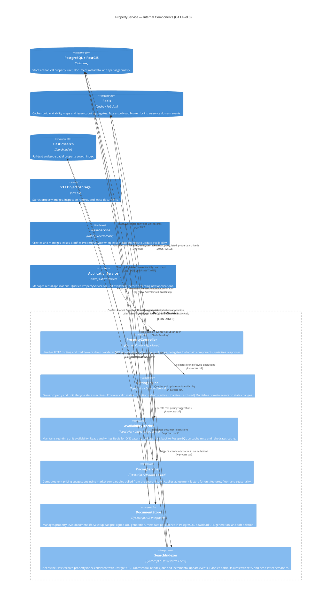

# C4 Component Diagram — PropertyService

## Introduction

This document describes the internal component architecture of the **PropertyService** at C4 Level 3 (Component diagram). The scope is strictly the PropertyService process boundary — it does not describe the wider microservice mesh, infrastructure topology, or client-facing concerns beyond what is necessary to understand the contracts each component exposes and consumes.

The PropertyService is the authoritative source of truth for all property and unit data within the Real Estate Management System. It owns the `properties` and `units` tables in PostgreSQL, maintains the Elasticsearch property search index, keeps unit availability state in Redis, and manages the lifecycle of property documents in S3. Other microservices (LeaseService, ApplicationService) interact with PropertyService exclusively via its internal HTTP API; they never touch the underlying datastores directly.

The six internal components described here are logical boundaries within a single deployable Node.js process. They are not separate services. They communicate through direct TypeScript function calls and shared in-process event emitters rather than network hops, which eliminates a class of distributed-system failure modes for intra-component coordination.

---

## Component Diagram



---

## Component Descriptions

### PropertyController

**Responsibilities**

PropertyController is the single entry point for all inbound HTTP traffic to PropertyService. It is implemented as a set of Express `Router` instances grouped by resource type (`/properties`, `/units`). Each route handler follows a strict three-phase pattern: authenticate → validate → delegate.

**Authentication and authorisation** is performed by the `jwtMiddleware` and `scopeGuard` middleware attached to each route. `jwtMiddleware` verifies the RS256 JWT signature against the public key fetched from the Auth Service JWKS endpoint (cached in memory for 5 minutes). `scopeGuard` extracts the `scopes` claim and rejects requests missing the required scope.

**Request validation** is handled by `zod` schemas co-located with each route file. Schema parse failures are transformed into the standard `VALIDATION_ERROR` response via an error-mapping utility before the error reaches the global Express error handler.

**Delegation** is a thin pass-through: the controller constructs plain TypeScript DTO objects from validated request data and calls the appropriate domain component. It does not contain business logic. All response serialisation happens in a dedicated `serialize` function per resource type, ensuring that internal domain objects (which may contain sensitive fields) are never accidentally leaked.

**Key methods:**

```typescript
// src/http/PropertyController.ts
class PropertyController {
  listProperties(req: AuthenticatedRequest, res: Response): Promise<void>
  createProperty(req: AuthenticatedRequest, res: Response): Promise<void>
  getProperty(req: AuthenticatedRequest, res: Response): Promise<void>
  updateProperty(req: AuthenticatedRequest, res: Response): Promise<void>
  archiveProperty(req: AuthenticatedRequest, res: Response): Promise<void>
  listUnits(req: AuthenticatedRequest, res: Response): Promise<void>
  createUnit(req: AuthenticatedRequest, res: Response): Promise<void>
  handleInternalAvailabilityUpdate(req: Request, res: Response): Promise<void>
}
```

**Error handling:** Unhandled errors bubble to the Express global error handler, which maps known domain error types to HTTP status codes using a registry table. Unknown errors produce `500 INTERNAL_SERVER_ERROR` with a `traceId` generated from the OpenTelemetry span context.

---

### ListingEngine

**Responsibilities**

ListingEngine encapsulates all business rules governing the lifecycle of a property or unit from initial creation through archival. It is the only component permitted to mutate `status` on a `Property` or `Unit` record.

**State machine** for Property:

```
draft → active → inactive → archived
         ↑          ↓
         └──────────┘  (reactivation)
```

**State machine** for Unit:

```
vacant ←→ occupied
  ↓
maintenance_hold
  ↓
vacant
```

ListingEngine enforces these transitions by throwing a typed `InvalidStatusTransitionError` when a caller attempts an illegal move. Callers (PropertyController, automated jobs) catch this error and translate it to `400 INVALID_STATUS_TRANSITION`.

On every successful status transition, ListingEngine emits a domain event to the `rems:properties` Redis channel. Downstream components (SearchIndexer, AvailabilityTracker) subscribe to this channel and react asynchronously.

**Key methods:**

```typescript
// src/domain/ListingEngine.ts
class ListingEngine {
  activateListing(propertyId: string, actorId: string): Promise<Property>
  deactivateListing(propertyId: string, actorId: string, reason: string): Promise<Property>
  archiveListing(propertyId: string, actorId: string): Promise<Property>
  reactivateListing(propertyId: string, actorId: string): Promise<Property>
  setUnitMaintenanceHold(unitId: string, requestId: string): Promise<Unit>
  releaseUnitMaintenanceHold(unitId: string, requestId: string): Promise<Unit>
  private assertTransitionAllowed(current: PropertyStatus, next: PropertyStatus): void
}
```

**Data flow:** All writes go through a PostgreSQL transaction that updates the status column and inserts an audit row into `property_status_history` atomically. The domain event is published only after the transaction commits, preventing consumers from reacting to a state change that could be rolled back.

---

### AvailabilityTracker

**Responsibilities**

AvailabilityTracker is the performance-critical path for unit availability queries, which are called on every search request and application check. It implements the **cache-aside pattern** against Redis, keeping an in-memory hash map per property with the shape `{ [unitId]: "vacant" | "occupied" | "maintenance_hold" }`.

**Cache structure:**

```
Redis key:  availability:prop_01HXYZ
Redis type: HASH
Fields:     unit_01HABC → "vacant"
            unit_01HDEF → "occupied"
TTL:        3600 seconds (refreshed on write)
```

**Cache miss path:** On a Redis miss (key absent or unit absent in hash), AvailabilityTracker issues a targeted PostgreSQL query to load the availability status for all units of the property, writes the full hash back to Redis with HSET, and returns the requested value. This "bulk load on miss" strategy avoids the thundering herd that arises when many units miss the cache simultaneously after a TTL expiry.

**Write path:** When ListingEngine transitions a unit's availability, it calls `AvailabilityTracker.setUnitStatus()`. This method writes to PostgreSQL first (via ListingEngine's transaction), then updates the Redis hash. If the Redis write fails, a background reconciliation job (runs every 60 s) compares Redis and PostgreSQL and patches divergences.

**Key methods:**

```typescript
// src/domain/AvailabilityTracker.ts
class AvailabilityTracker {
  getUnitAvailability(unitId: string, propertyId: string): Promise<UnitAvailabilityStatus>
  getPropertyAvailabilitySummary(propertyId: string): Promise<AvailabilitySummary>
  setUnitStatus(unitId: string, propertyId: string, status: UnitAvailabilityStatus): Promise<void>
  invalidatePropertyCache(propertyId: string): Promise<void>
  reconcile(propertyId: string): Promise<ReconciliationReport>
}
```

**Circuit breaker:** AvailabilityTracker wraps all Redis calls with a `opossum` circuit breaker configured with a 2-second timeout and a 50% error threshold over a 30-second rolling window. When the circuit opens, all availability queries fall back directly to PostgreSQL and an alert fires to PagerDuty via the observability pipeline.

---

### PricingService

**Responsibilities**

PricingService generates suggested monthly rent values and market comparable reports for a given unit. It is an advisory component — it never persists data, and its output is always clearly labelled as a suggestion, not a requirement.

**Pricing algorithm:**

1. Fetch the target unit's features: `bedrooms`, `bathrooms`, `sqFt`, `floorNumber`, `features[]`.
2. Query Elasticsearch for `comparable` properties within a configurable geo-radius (default 2 miles) with a matching bedroom count and ±15% sqFt variance, filtering on `status: active`.
3. Compute the p25, median, and p75 rent per sqFt across the comparables.
4. Apply adjustment multipliers defined in the tenant's `PricingRuleSet` (stored in PostgreSQL): amenity premiums (e.g. +5% for `washer_dryer`), floor level adjustments (e.g. +1.5% per floor above ground), and a seasonal coefficient derived from month-of-year.
5. Return the base suggestion at median with a range spanning p25–p75 after adjustments.

**Elasticsearch query:**

```json
{
  "query": {
    "bool": {
      "must": [
        { "term": { "status": "active" } },
        { "term": { "bedrooms": 2 } }
      ],
      "filter": [
        { "geo_distance": { "distance": "2mi", "address.coordinates": { "lat": 34.098, "lon": -118.327 } } },
        { "range": { "sqFt": { "gte": 807, "lte": 1092 } } }
      ]
    }
  },
  "aggs": {
    "rent_stats": { "percentiles": { "field": "monthlyRent", "percents": [25, 50, 75] } }
  },
  "size": 0
}
```

**Key methods:**

```typescript
// src/domain/PricingService.ts
class PricingService {
  getSuggestion(unitId: string, propertyId: string): Promise<PricingSuggestion>
  getComparables(unitId: string, radiusMiles: number): Promise<ComparableUnit[]>
  private applyAdjustments(base: number, unit: Unit, rules: PricingRuleSet): number
}
```

**Error handling:** If Elasticsearch is unavailable, PricingService returns a `ServiceUnavailableError` rather than a fallback, because a stale or zero-based price suggestion would be more harmful than no suggestion at all.

---

### DocumentStore

**Responsibilities**

DocumentStore manages all binary assets attached to a property: listing photos, floor plans, inspection reports, and compliance certificates. It does not handle lease documents — those are owned by LeaseService.

**Upload flow:**

1. Client requests an upload pre-signed URL via `DocumentStore.createUploadSession()`.
2. DocumentStore validates the requested MIME type against an allowlist (`image/jpeg`, `image/png`, `image/webp`, `application/pdf`), generates a unique S3 object key, and calls `s3.getSignedUrlPromise('putObject', ...)` with a 15-minute expiry.
3. The pre-signed URL and a `documentId` are returned to the caller.
4. DocumentStore inserts a `documents` row with `status: pending_upload`.
5. An S3 event notification (via SQS) triggers the `DocumentStore.confirmUpload()` handler once the client has PUT the file directly to S3.
6. `confirmUpload` validates the uploaded file size and checksum, updates `status` to `available`, and enqueues a thumbnail generation job for images.

**Download flow:**

1. Client calls `DocumentStore.getDownloadUrl(documentId)`.
2. DocumentStore checks `tenantId` ownership in PostgreSQL.
3. Returns a 1-hour pre-signed `getObject` URL. The URL is never stored — it is generated fresh on each request.

**Key methods:**

```typescript
// src/domain/DocumentStore.ts
class DocumentStore {
  createUploadSession(req: UploadSessionRequest): Promise<UploadSession>
  confirmUpload(documentId: string, s3Event: S3EventRecord): Promise<Document>
  getDownloadUrl(documentId: string, actorId: string): Promise<SignedUrl>
  deleteDocument(documentId: string, actorId: string): Promise<void>
  listPropertyDocuments(propertyId: string): Promise<Document[]>
}
```

**Error handling:** If S3 is unreachable during URL generation, `DocumentStore` throws `StorageUnavailableError`. Pending-upload documents older than 24 hours are automatically expired by a scheduled cleanup job.

---

### SearchIndexer

**Responsibilities**

SearchIndexer owns the bidirectional synchronisation between the PostgreSQL canonical store and the Elasticsearch search index. It handles two modes of operation:

**Incremental update mode:** SearchIndexer subscribes to the `rems:properties` Redis channel. On receiving a domain event (e.g. `property.updated`, `unit.availability_changed`), it fetches the affected document from PostgreSQL, transforms it into the Elasticsearch document schema, and issues an indexed upsert.

**Full reindex mode:** Triggered via an internal API call or a scheduled weekly job. SearchIndexer pages through all properties in PostgreSQL (1 000 records per page using keyset pagination), transforms each record, and writes batches of 100 via the Elasticsearch `_bulk` API. Progress is tracked in a Redis key `reindex:progress:{jobId}` to enable resumable reindexes after pod restarts.

**Elasticsearch document schema:**

```json
{
  "id": "prop_01HXYZ",
  "tenantId": "ten_01HABC",
  "ownerId": "usr_01HXYZ",
  "name": "Sunset Apartments",
  "propertyType": "multi_family",
  "status": "active",
  "address": {
    "street1": "1234 Sunset Blvd",
    "city": "Los Angeles",
    "state": "CA",
    "zip": "90028",
    "coordinates": { "lat": 34.098, "lon": -118.327 }
  },
  "unitCount": 12,
  "vacantUnitCount": 2,
  "minRent": 1850.00,
  "maxRent": 3200.00,
  "bedrooms": [1, 2, 3],
  "amenities": ["pool", "gym", "parking"],
  "updatedAt": "2024-04-20T14:30:00Z"
}
```

**Key methods:**

```typescript
// src/domain/SearchIndexer.ts
class SearchIndexer {
  indexProperty(propertyId: string): Promise<IndexResult>
  removeProperty(propertyId: string): Promise<void>
  fullReindex(jobId: string): Promise<ReindexReport>
  handleDomainEvent(event: PropertyDomainEvent): Promise<void>
  private buildDocument(property: PropertyWithUnits): ElasticPropertyDoc
}
```

**Error handling:** Individual document index failures during full reindex are written to a dead-letter list in Redis (`reindex:dlq:{jobId}`). After the full reindex, the indexer retries each DLQ item up to 3 times. Persistent failures trigger an alert and are logged for manual inspection. The dead-letter approach ensures a single bad record never aborts a full reindex.

---

## Key Interaction Flows

### Flow: List a Property

This flow describes what happens when a landlord publishes a property from `draft` to `active` status.

```
PropertyController
      │
      │  PUT /api/v1/properties/prop_01HXYZ
      │  Authorization: Bearer <jwt>
      │  { "status": "active" }
      │
      ▼
jwtMiddleware          → Verify RS256 signature, extract tenantId + scopes
scopeGuard             → Assert scope includes "properties:write"
requestValidator       → Parse and validate request body against Zod schema
      │
      ▼
ListingEngine.activateListing("prop_01HXYZ", "usr_landlord_01")
      │
      ├─► PostgreSQL (BEGIN TRANSACTION)
      │     UPDATE properties SET status='active', updated_at=now() WHERE id='prop_01HXYZ'
      │     INSERT INTO property_status_history (property_id, from_status, to_status, actor_id, changed_at)
      │   (COMMIT TRANSACTION)
      │
      ├─► Redis PUBLISH rems:properties
      │     { "event": "property.listed", "propertyId": "prop_01HXYZ", "tenantId": "ten_01HABC" }
      │
      └─► Return Property domain object
      │
      ▼
SearchIndexer (async, Redis subscriber)
      │
      ├─► PostgreSQL: SELECT property + units WHERE id='prop_01HXYZ'
      ├─► Build Elasticsearch document
      └─► Elasticsearch: PUT /properties/_doc/prop_01HXYZ

PropertyController
      └─► Serialize Property → HTTP 200 response
```

Total synchronous critical path: ~20–40 ms (two SQL writes + Redis publish). Elasticsearch indexing is asynchronous and does not block the response.

---

### Flow: Search Properties

This flow describes a geo-spatial property search request from a prospective tenant via the web client.

```
PropertyController
      │
      │  GET /api/v1/properties?city=Los+Angeles&propertyType=multi_family&available=true
      │
      ▼
jwtMiddleware + scopeGuard → Assert "properties:read"
requestValidator           → Parse query parameters
      │
      ▼
ListingEngine.searchProperties(SearchQuery)
      │
      ├─► SearchIndexer.search(query)
      │       │
      │       └─► Elasticsearch POST /properties/_search
      │             {
      │               "query": {
      │                 "bool": {
      │                   "must": [
      │                     { "term": { "tenantId": "ten_01HABC" } },
      │                     { "term": { "status": "active" } },
      │                     { "term": { "propertyType": "multi_family" } }
      │                   ],
      │                   "filter": [
      │                     { "term": { "address.city": "los angeles" } },
      │                     { "range": { "vacantUnitCount": { "gt": 0 } } }
      │                   ]
      │                 }
      │               },
      │               "sort": [{ "_score": "desc" }, { "updatedAt": "desc" }],
      │               "search_after": [<cursor>],
      │               "size": 25
      │             }
      │       │
      │       └─► Returns hits[] with _source and sort values
      │
      ├─► For each hit: AvailabilityTracker.getPropertyAvailabilitySummary(propertyId)
      │       │
      │       └─► Redis HMGET availability:{propertyId}
      │             (Cache hit: ~1 ms per property)
      │             (Cache miss: PostgreSQL fallback + Redis HSET rehydrate)
      │
      └─► Merge availability data into search results
      │
      ▼
PropertyController
      └─► Serialize paginated list → HTTP 200 response
```

Cache-warm P99 latency target: < 80 ms end-to-end. Cold-cache P99 (all PostgreSQL fallbacks): < 200 ms.

---

### Flow: Update Availability

This flow is triggered when LeaseService activates a new lease, marking the associated unit as occupied.

```
LeaseService
      │
      │  POST /api/v1/internal/unit-availability
      │  X-Internal-Token: <service-token>
      │  { "unitId": "unit_01HABC", "propertyId": "prop_01HXYZ",
      │    "status": "occupied", "leaseId": "lease_01HJKL" }
      │
      ▼
PropertyController.handleInternalAvailabilityUpdate()
      │
      ├─► serviceTokenMiddleware → Verify HMAC-signed service token
      │
      ▼
AvailabilityTracker.setUnitStatus("unit_01HABC", "prop_01HXYZ", "occupied")
      │
      ├─► PostgreSQL: UPDATE units SET availability_status='occupied' WHERE id='unit_01HABC'
      │               UPDATE properties SET occupied_units = occupied_units + 1 WHERE id='prop_01HXYZ'
      │   (Wrapped in transaction from ListingEngine)
      │
      ├─► Redis: HSET availability:prop_01HXYZ unit_01HABC "occupied"
      │          EXPIRE availability:prop_01HXYZ 3600
      │
      └─► Redis PUBLISH rems:properties
            { "event": "unit.availability_changed", "unitId": "unit_01HABC",
              "propertyId": "prop_01HXYZ", "newStatus": "occupied" }
      │
      ▼
SearchIndexer (async, Redis subscriber)
      │
      ├─► PostgreSQL: SELECT COUNT(*) WHERE property_id='prop_01HXYZ' AND status='vacant'
      └─► Elasticsearch: POST /properties/_update/prop_01HXYZ
            { "doc": { "vacantUnitCount": 1 } }
      │
      ▼
PropertyController → HTTP 200 { "updated": true }
```

---

## Interface Contracts

The following TypeScript interfaces define the contracts between components. These are the boundaries that must remain stable across refactors.

```typescript
// src/types/domain.ts

export type PropertyStatus = 'draft' | 'active' | 'inactive' | 'archived';
export type UnitAvailabilityStatus = 'vacant' | 'occupied' | 'maintenance_hold';
export type DocumentType = 'photo' | 'floor_plan' | 'inspection_report' | 'compliance_cert' | 'other';

export interface Property {
  id: string;
  tenantId: string;
  ownerId: string;
  name: string;
  propertyType: 'single_family' | 'multi_family' | 'condo' | 'townhouse' | 'commercial';
  status: PropertyStatus;
  address: Address;
  unitCount: number;
  occupiedUnits: number;
  yearBuilt: number | null;
  totalSqFt: number | null;
  amenities: string[];
  description: string | null;
  createdAt: Date;
  updatedAt: Date;
}

export interface Unit {
  id: string;
  propertyId: string;
  unitNumber: string;
  floorNumber: number | null;
  bedrooms: number;
  bathrooms: number;
  sqFt: number;
  monthlyRent: number;
  depositAmount: number;
  availabilityStatus: UnitAvailabilityStatus;
  features: string[];
  activeLeaseId: string | null;
  createdAt: Date;
  updatedAt: Date;
}

export interface Address {
  street1: string;
  street2: string | null;
  city: string;
  state: string;
  zip: string;
  country: string;
  coordinates: GeoPoint | null;
}

export interface GeoPoint {
  lat: number;
  lng: number;
}

export interface Document {
  id: string;
  propertyId: string;
  type: DocumentType;
  fileName: string;
  mimeType: string;
  sizeBytes: number;
  s3Key: string;
  status: 'pending_upload' | 'available' | 'deleted';
  uploadedById: string;
  uploadedAt: Date;
}

export interface AvailabilitySummary {
  propertyId: string;
  totalUnits: number;
  vacantUnits: number;
  occupiedUnits: number;
  maintenanceHoldUnits: number;
  source: 'cache' | 'database';
}

export interface PricingSuggestion {
  unitId: string;
  suggestedRent: number;
  rangeLow: number;
  rangeHigh: number;
  comparableCount: number;
  radiusMiles: number;
  computedAt: Date;
  adjustments: PricingAdjustment[];
}

export interface PricingAdjustment {
  factor: string;
  multiplier: number;
  appliedAmount: number;
}

export interface ElasticPropertyDoc {
  id: string;
  tenantId: string;
  ownerId: string;
  name: string;
  propertyType: string;
  status: PropertyStatus;
  address: {
    street1: string;
    city: string;
    state: string;
    zip: string;
    coordinates: { lat: number; lon: number } | null;
  };
  unitCount: number;
  vacantUnitCount: number;
  minRent: number | null;
  maxRent: number | null;
  bedrooms: number[];
  amenities: string[];
  updatedAt: string;
}

export interface PropertyDomainEvent {
  event:
    | 'property.listed'
    | 'property.deactivated'
    | 'property.archived'
    | 'unit.created'
    | 'unit.availability_changed';
  propertyId: string;
  unitId?: string;
  tenantId: string;
  actorId: string;
  timestamp: string;
  metadata: Record<string, unknown>;
}

export interface IndexResult {
  propertyId: string;
  operation: 'create' | 'update' | 'delete';
  success: boolean;
  error?: string;
}

export interface ReindexReport {
  jobId: string;
  totalProcessed: number;
  totalSucceeded: number;
  totalFailed: number;
  deadLetterKeys: string[];
  durationMs: number;
}

export interface UploadSession {
  documentId: string;
  uploadUrl: string;
  uploadFields: Record<string, string>;
  expiresAt: Date;
}

export interface SignedUrl {
  url: string;
  expiresAt: Date;
}
```

---

## Component Resilience Patterns

### Circuit Breaker — Redis (AvailabilityTracker)

AvailabilityTracker wraps all Redis I/O with an `opossum` circuit breaker. When the error rate in the rolling window exceeds the threshold or a call times out, the circuit opens and the fallback (direct PostgreSQL query) is used for the duration of the half-open probe interval.

```typescript
// src/infrastructure/RedisCircuitBreaker.ts
import CircuitBreaker from 'opossum';

const redisOptions: CircuitBreaker.Options = {
  timeout: 2000,               // 2 s per call
  errorThresholdPercentage: 50, // open after 50% errors in window
  resetTimeout: 30_000,         // try half-open after 30 s
  rollingCountTimeout: 30_000,  // 30 s rolling window
  volumeThreshold: 5,           // min 5 calls before evaluating
};

export function wrapRedisCall<T>(
  fn: () => Promise<T>,
  fallback: () => Promise<T>
): CircuitBreaker<[], T> {
  const breaker = new CircuitBreaker(fn, redisOptions);
  breaker.fallback(fallback);
  breaker.on('open', () => metrics.increment('redis.circuit_breaker.open'));
  breaker.on('halfOpen', () => metrics.increment('redis.circuit_breaker.half_open'));
  breaker.on('close', () => metrics.increment('redis.circuit_breaker.closed'));
  return breaker;
}
```

### Cache-Aside Pattern — AvailabilityTracker

```typescript
// src/domain/AvailabilityTracker.ts (excerpt)
async getUnitAvailability(
  unitId: string,
  propertyId: string
): Promise<UnitAvailabilityStatus> {
  const cached = await this.redisBreaker.fire(
    () => this.redis.hget(`availability:${propertyId}`, unitId)
  );

  if (cached) {
    metrics.increment('availability.cache.hit');
    return cached as UnitAvailabilityStatus;
  }

  metrics.increment('availability.cache.miss');

  // Bulk load all units for property to avoid N+1 on subsequent misses
  const rows = await this.db.query<{ unit_id: string; status: string }>(
    `SELECT id AS unit_id, availability_status AS status
     FROM units WHERE property_id = $1 AND deleted_at IS NULL`,
    [propertyId]
  );

  const hashPayload: Record<string, string> = {};
  for (const row of rows) {
    hashPayload[row.unit_id] = row.status;
  }

  await this.redis.hset(`availability:${propertyId}`, hashPayload);
  await this.redis.expire(`availability:${propertyId}`, 3600);

  return (hashPayload[unitId] ?? 'vacant') as UnitAvailabilityStatus;
}
```

### Retry with Exponential Backoff — SearchIndexer

SearchIndexer uses an exponential backoff with jitter for Elasticsearch write operations. Retries are only attempted on transient errors (HTTP 429, 503, network timeout); validation errors (HTTP 400) are sent directly to the dead-letter list.

```typescript
// src/infrastructure/RetryPolicy.ts
const RETRYABLE_STATUS_CODES = new Set([429, 503, 502, 504]);
const MAX_ATTEMPTS = 3;

export async function withRetry<T>(
  fn: () => Promise<T>,
  context: string
): Promise<T> {
  let lastError: Error | undefined;

  for (let attempt = 1; attempt <= MAX_ATTEMPTS; attempt++) {
    try {
      return await fn();
    } catch (err: unknown) {
      const httpStatus = (err as { statusCode?: number }).statusCode;

      if (httpStatus && !RETRYABLE_STATUS_CODES.has(httpStatus)) {
        throw err; // Non-retryable, fail fast
      }

      lastError = err as Error;
      const delay = Math.min(100 * 2 ** attempt + Math.random() * 100, 5000);
      logger.warn({ context, attempt, delay }, 'Retrying after transient failure');
      await sleep(delay);
    }
  }

  throw lastError;
}
```

### Dead-Letter Queue — SearchIndexer Full Reindex

```typescript
// src/domain/SearchIndexer.ts (excerpt)
async fullReindex(jobId: string): Promise<ReindexReport> {
  const dlqKey = `reindex:dlq:${jobId}`;
  let cursor: string | null = null;
  let totalProcessed = 0;
  let totalFailed = 0;

  do {
    const { rows, nextCursor } = await this.fetchPropertiesPage(cursor, 1000);
    cursor = nextCursor;

    const bulkBody = rows.flatMap((p) => [
      { index: { _index: 'properties', _id: p.id } },
      this.buildDocument(p),
    ]);

    const { body: bulkResponse } = await withRetry(
      () => this.elastic.bulk({ body: bulkBody }),
      `reindex:bulk:${jobId}`
    );

    if (bulkResponse.errors) {
      for (const item of bulkResponse.items) {
        if (item.index?.error) {
          await this.redis.rpush(dlqKey, JSON.stringify({
            propertyId: item.index._id,
            error: item.index.error,
          }));
          totalFailed++;
        }
      }
    }

    await this.redis.set(`reindex:progress:${jobId}`, JSON.stringify({ cursor, totalProcessed }));
    totalProcessed += rows.length;
  } while (cursor !== null);

  return { jobId, totalProcessed, totalSucceeded: totalProcessed - totalFailed, totalFailed, deadLetterKeys: [dlqKey], durationMs: Date.now() - startTime };
}
```

### Idempotent Domain Event Processing — SearchIndexer

Since Redis Pub/Sub delivers at-most-once, SearchIndexer uses Elasticsearch's optimistic concurrency control (`if_seq_no` / `if_primary_term`) to prevent double-writes when events are replayed during a reindex. If the document's sequence number has advanced since the event was captured, the update is a no-op rather than an overwrite.

```typescript
async handleDomainEvent(event: PropertyDomainEvent): Promise<void> {
  if (event.event === 'property.archived') {
    await this.removeProperty(event.propertyId);
    return;
  }

  await withRetry(
    () => this.indexProperty(event.propertyId),
    `event:${event.event}:${event.propertyId}`
  );
}
```
