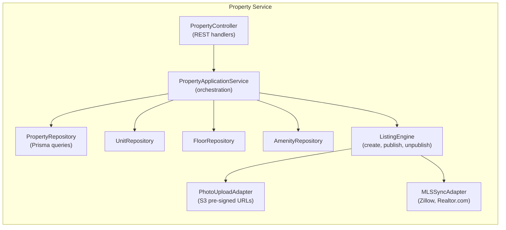
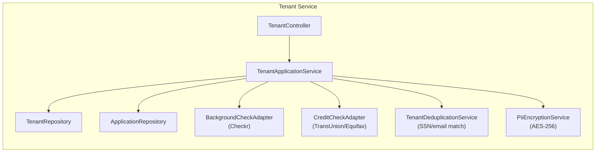
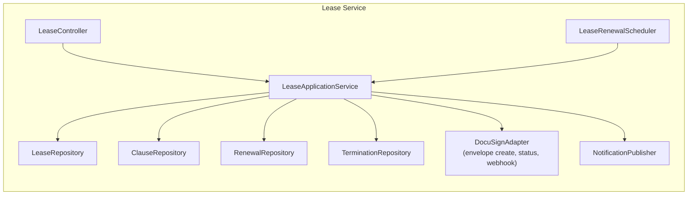
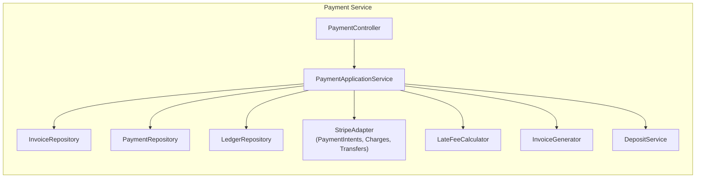
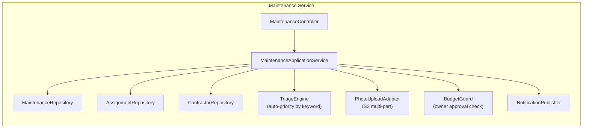

# Component Diagram — Real Estate Management System

## Overview

The Real Estate Management System is structured as a **modular monolith** with clearly bounded service modules that can be extracted into microservices as scale demands. All modules share a single PostgreSQL database but communicate through well-defined service interfaces rather than direct cross-module queries.

---

## High-Level Component Map

```mermaid
graph TB
    subgraph "Client Applications"
        WEB["Web App\n(Next.js)"]
        MOBILE["Mobile App\n(React Native)"]
        OWNER_PORTAL["Owner Portal\n(Next.js)"]
    end

    subgraph "API Gateway"
        GW["API Gateway\n(Express / tRPC)\nAuth Middleware | Rate Limiter | Logger"]
    end

    subgraph "Core Services"
        PROP_SVC["Property Service"]
        TENANT_SVC["Tenant Service"]
        LEASE_SVC["Lease Service"]
        PAYMENT_SVC["Payment Service"]
        MAINT_SVC["Maintenance Service"]
        INSP_SVC["Inspection Service"]
        OWNER_SVC["Owner Statement Service"]
        DOC_SVC["Document Service"]
        NOTIF_SVC["Notification Service"]
        AUTH_SVC["Auth Service"]
    end

    subgraph "Background Jobs"
        SCHEDULER["Job Scheduler\n(pg-cron / BullMQ)"]
        INVOICE_JOB["Invoice Generator Job"]
        LATEFEE_JOB["Late Fee Engine Job"]
        RENEWAL_JOB["Lease Renewal Reminder Job"]
        STATEMENT_JOB["Owner Statement Job"]
    end

    subgraph "Third-Party Integrations"
        DOCUSIGN["DocuSign API"]
        STRIPE["Stripe API"]
        CHECKR["Checkr API"]
        TRANSUNION["TransUnion/Equifax API"]
        MLS["MLS / Zillow Syndication"]
        S3["AWS S3 / Cloudfront"]
        SENDGRID["SendGrid Email"]
        TWILIO["Twilio SMS"]
    end

    subgraph "Data Layer"
        PG[("PostgreSQL 15+")]
        REDIS[("Redis Cache")]
        S3_STORE[("S3 Object Store")]
    end

    WEB --> GW
    MOBILE --> GW
    OWNER_PORTAL --> GW

    GW --> PROP_SVC
    GW --> TENANT_SVC
    GW --> LEASE_SVC
    GW --> PAYMENT_SVC
    GW --> MAINT_SVC
    GW --> INSP_SVC
    GW --> OWNER_SVC
    GW --> DOC_SVC
    GW --> AUTH_SVC

    LEASE_SVC --> DOCUSIGN
    LEASE_SVC --> NOTIF_SVC
    LEASE_SVC --> PAYMENT_SVC

    PAYMENT_SVC --> STRIPE
    TENANT_SVC --> CHECKR
    TENANT_SVC --> TRANSUNION
    PROP_SVC --> MLS
    DOC_SVC --> S3
    NOTIF_SVC --> SENDGRID
    NOTIF_SVC --> TWILIO

    SCHEDULER --> INVOICE_JOB
    SCHEDULER --> LATEFEE_JOB
    SCHEDULER --> RENEWAL_JOB
    SCHEDULER --> STATEMENT_JOB

    INVOICE_JOB --> PAYMENT_SVC
    LATEFEE_JOB --> PAYMENT_SVC
    RENEWAL_JOB --> LEASE_SVC
    STATEMENT_JOB --> OWNER_SVC

    PROP_SVC --> PG
    TENANT_SVC --> PG
    LEASE_SVC --> PG
    PAYMENT_SVC --> PG
    MAINT_SVC --> PG
    INSP_SVC --> PG
    OWNER_SVC --> PG
    DOC_SVC --> S3_STORE
    AUTH_SVC --> REDIS
```

---

## Internal Components per Service

### Property Service

### Tenant Service

### Lease Service

### Payment Service

### Maintenance Service

---

## Inter-Service Dependency Table

| Consumer Service | Depends On | Interaction | Pattern |
|-----------------|-----------|-------------|---------|
| Lease Service | Tenant Service | Validate tenant exists and is approved | Synchronous function call |
| Lease Service | Property Service | Check unit availability, mark OCCUPIED | Synchronous function call |
| Lease Service | Payment Service | Create deposit invoice after signing | Synchronous function call |
| Lease Service | Notification Service | Send signing email, activation email | Async event |
| Payment Service | Lease Service | Get lease/tenant for invoice validation | Synchronous function call |
| Payment Service | Notification Service | Send receipt, failure, late fee notices | Async event |
| Maintenance Service | Property Service | Validate unit/property ownership | Synchronous function call |
| Maintenance Service | Notification Service | Send assignment, completion notices | Async event |
| Inspection Service | Property Service | Get unit details for checklist | Synchronous function call |
| Inspection Service | Document Service | Generate and store PDF report | Synchronous function call |
| Owner Statement Service | Payment Service | Get rent collected for period | Synchronous function call |
| Owner Statement Service | Maintenance Service | Get expenses for period | Synchronous function call |
| Owner Statement Service | Document Service | Generate PDF statement | Synchronous function call |
| Owner Statement Service | Notification Service | Email statement to owner | Async event |
| Tenant Service | Notification Service | Send application updates | Async event |
| Document Service | S3 Adapter | Upload and retrieve files | HTTP/SDK |

---

## Shared Libraries / Packages

| Package | Contents | Consumers |
|---------|----------|-----------|
| `@rems/db` | Prisma client, schema, migrations | All services |
| `@rems/auth` | JWT validation middleware, RBAC helpers | All controllers |
| `@rems/errors` | Custom error classes, HTTP error mapper | All services |
| `@rems/validation` | Zod schemas for all request/response types | All controllers |
| `@rems/events` | Domain event types, event bus interface | All services |
| `@rems/logger` | Pino logger with request context | All services |
| `@rems/encryption` | AES-256 encrypt/decrypt for PII fields | Tenant, Owner services |
| `@rems/pagination` | Cursor-based pagination helpers | All repositories |
| `@rems/money` | Decimal arithmetic, currency formatting | Payment, Lease, Owner services |
| `@rems/dates` | Date range, period, timezone utilities | Lease, Invoice, Statement services |
