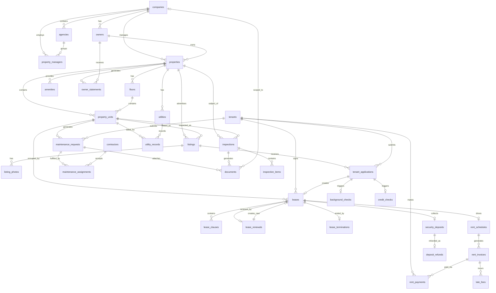

# ERD & Database Schema — Real Estate Management System

## Overview

This document defines the full relational database schema for the Real Estate Management System. The primary datastore is **PostgreSQL 15+** with the **Prisma ORM** for migrations and query building.

---

## Entity Relationship Diagram



---

## Table Schemas

### companies

| Column | Type | Nullable | Default | Constraints | Description |
|--------|------|----------|---------|-------------|-------------|
| id | UUID | NO | gen_random_uuid() | PK | Unique company identifier |
| name | VARCHAR(255) | NO | — | NOT NULL | Legal company name |
| subdomain | VARCHAR(100) | NO | — | UNIQUE, NOT NULL | SaaS subdomain (e.g. acme) |
| email | VARCHAR(255) | NO | — | UNIQUE, NOT NULL | Primary contact email |
| phone | VARCHAR(30) | YES | NULL | — | Primary phone number |
| address_line1 | VARCHAR(255) | YES | NULL | — | Street address |
| city | VARCHAR(100) | YES | NULL | — | City |
| state | VARCHAR(50) | YES | NULL | — | State/province |
| zip_code | VARCHAR(20) | YES | NULL | — | Postal code |
| country | CHAR(2) | YES | 'US' | — | ISO 3166-1 alpha-2 country code |
| status | company_status | NO | 'active' | NOT NULL | active, suspended, cancelled |
| plan_tier | plan_tier | NO | 'starter' | NOT NULL | starter, growth, enterprise |
| stripe_customer_id | VARCHAR(100) | YES | NULL | — | Stripe customer reference |
| created_at | TIMESTAMPTZ | NO | now() | NOT NULL | Record creation timestamp |
| updated_at | TIMESTAMPTZ | NO | now() | NOT NULL | Last update timestamp |
| deleted_at | TIMESTAMPTZ | YES | NULL | — | Soft delete timestamp |

### property_managers

| Column | Type | Nullable | Default | Constraints | Description |
|--------|------|----------|---------|-------------|-------------|
| id | UUID | NO | gen_random_uuid() | PK | Unique manager identifier |
| company_id | UUID | NO | — | FK → companies.id, NOT NULL | Owning company |
| agency_id | UUID | YES | NULL | FK → agencies.id | Optional agency grouping |
| first_name | VARCHAR(100) | NO | — | NOT NULL | Manager first name |
| last_name | VARCHAR(100) | NO | — | NOT NULL | Manager last name |
| email | VARCHAR(255) | NO | — | UNIQUE, NOT NULL | Login email |
| phone | VARCHAR(30) | YES | NULL | — | Contact phone |
| role | manager_role | NO | 'manager' | NOT NULL | owner, manager, leasing_agent, maintenance_coordinator |
| status | manager_status | NO | 'active' | NOT NULL | active, inactive, suspended |
| auth_user_id | VARCHAR(255) | YES | NULL | UNIQUE | External auth provider user ID |
| avatar_url | TEXT | YES | NULL | — | Profile picture URL |
| created_at | TIMESTAMPTZ | NO | now() | NOT NULL | Record creation timestamp |
| updated_at | TIMESTAMPTZ | NO | now() | NOT NULL | Last update timestamp |
| deleted_at | TIMESTAMPTZ | YES | NULL | — | Soft delete timestamp |

### owners

| Column | Type | Nullable | Default | Constraints | Description |
|--------|------|----------|---------|-------------|-------------|
| id | UUID | NO | gen_random_uuid() | PK | Unique owner identifier |
| company_id | UUID | NO | — | FK → companies.id, NOT NULL | Owning company |
| first_name | VARCHAR(100) | NO | — | NOT NULL | Owner first name |
| last_name | VARCHAR(100) | NO | — | NOT NULL | Owner last name |
| email | VARCHAR(255) | NO | — | UNIQUE, NOT NULL | Login email |
| phone | VARCHAR(30) | YES | NULL | — | Contact phone |
| tax_id_encrypted | TEXT | YES | NULL | — | AES-256 encrypted EIN or SSN |
| bank_account_id | VARCHAR(255) | YES | NULL | — | Stripe connected account or bank ref |
| bank_routing_number | VARCHAR(20) | YES | NULL | — | ACH routing number |
| status | owner_status | NO | 'active' | NOT NULL | active, inactive |
| auth_user_id | VARCHAR(255) | YES | NULL | UNIQUE | External auth provider user ID |
| created_at | TIMESTAMPTZ | NO | now() | NOT NULL | Record creation timestamp |
| updated_at | TIMESTAMPTZ | NO | now() | NOT NULL | Last update timestamp |
| deleted_at | TIMESTAMPTZ | YES | NULL | — | Soft delete timestamp |

### properties

| Column | Type | Nullable | Default | Constraints | Description |
|--------|------|----------|---------|-------------|-------------|
| id | UUID | NO | gen_random_uuid() | PK | Unique property identifier |
| company_id | UUID | NO | — | FK → companies.id, NOT NULL | Owning company |
| owner_id | UUID | NO | — | FK → owners.id, NOT NULL | Legal owner |
| manager_id | UUID | YES | NULL | FK → property_managers.id | Assigned manager |
| name | VARCHAR(255) | NO | — | NOT NULL | Property display name |
| property_type | property_type | NO | — | NOT NULL | apartment_complex, single_family, commercial, condo |
| address_line1 | VARCHAR(255) | NO | — | NOT NULL | Street address |
| address_line2 | VARCHAR(100) | YES | NULL | — | Suite, building, floor |
| city | VARCHAR(100) | NO | — | NOT NULL | City |
| state | VARCHAR(50) | NO | — | NOT NULL | State/province |
| zip_code | VARCHAR(20) | NO | — | NOT NULL | Postal code |
| country | CHAR(2) | NO | 'US' | NOT NULL | Country code |
| latitude | DECIMAL(10,7) | YES | NULL | — | GPS latitude |
| longitude | DECIMAL(10,7) | YES | NULL | — | GPS longitude |
| status | property_status | NO | 'active' | NOT NULL | active, inactive, archived |
| total_units | INTEGER | NO | 0 | NOT NULL, >= 0 | Total unit count |
| occupied_units | INTEGER | NO | 0 | NOT NULL, >= 0 | Currently occupied units |
| year_built | SMALLINT | YES | NULL | — | Year property was built |
| description | TEXT | YES | NULL | — | Public property description |
| created_at | TIMESTAMPTZ | NO | now() | NOT NULL | Record creation timestamp |
| updated_at | TIMESTAMPTZ | NO | now() | NOT NULL | Last update timestamp |
| deleted_at | TIMESTAMPTZ | YES | NULL | — | Soft delete timestamp |

### property_units

| Column | Type | Nullable | Default | Constraints | Description |
|--------|------|----------|---------|-------------|-------------|
| id | UUID | NO | gen_random_uuid() | PK | Unique unit identifier |
| property_id | UUID | NO | — | FK → properties.id, NOT NULL | Parent property |
| floor_id | UUID | YES | NULL | FK → floors.id | Floor this unit belongs to |
| unit_number | VARCHAR(50) | NO | — | NOT NULL | Display unit number (e.g. "2A", "101") |
| unit_type | unit_type | NO | — | NOT NULL | studio, 1br, 2br, 3br, 4br, commercial |
| monthly_rent | DECIMAL(10,2) | NO | — | NOT NULL, > 0 | Advertised monthly rent |
| bedrooms | SMALLINT | NO | 0 | NOT NULL, >= 0 | Bedroom count |
| bathrooms | DECIMAL(3,1) | NO | 0 | NOT NULL, >= 0 | Bathroom count (1.5, 2.0, etc.) |
| square_feet | DECIMAL(8,2) | YES | NULL | >= 0 | Interior square footage |
| status | unit_status | NO | 'vacant' | NOT NULL | vacant, occupied, maintenance, unlisted |
| pet_friendly | BOOLEAN | NO | false | NOT NULL | Whether pets are allowed |
| is_accessible | BOOLEAN | NO | false | NOT NULL | ADA/accessibility compliant |
| available_from | DATE | YES | NULL | — | Date unit becomes available |
| floor_number | SMALLINT | YES | NULL | — | Denormalized floor number for display |
| created_at | TIMESTAMPTZ | NO | now() | NOT NULL | Record creation timestamp |
| updated_at | TIMESTAMPTZ | NO | now() | NOT NULL | Last update timestamp |
| deleted_at | TIMESTAMPTZ | YES | NULL | — | Soft delete timestamp |

### tenants

| Column | Type | Nullable | Default | Constraints | Description |
|--------|------|----------|---------|-------------|-------------|
| id | UUID | NO | gen_random_uuid() | PK | Unique tenant identifier |
| company_id | UUID | NO | — | FK → companies.id, NOT NULL | Owning company |
| first_name | VARCHAR(100) | NO | — | NOT NULL | Tenant first name |
| last_name | VARCHAR(100) | NO | — | NOT NULL | Tenant last name |
| email | VARCHAR(255) | NO | — | UNIQUE, NOT NULL | Login and contact email |
| phone | VARCHAR(30) | YES | NULL | — | Contact phone |
| ssn_encrypted | TEXT | YES | NULL | — | AES-256 encrypted SSN (PII) |
| ssn_last4 | CHAR(4) | YES | NULL | — | Last 4 digits for display |
| date_of_birth | DATE | YES | NULL | — | Date of birth |
| current_address | TEXT | YES | NULL | — | Pre-move current address |
| annual_income | DECIMAL(12,2) | YES | NULL | >= 0 | Self-reported annual income |
| employer_name | VARCHAR(255) | YES | NULL | — | Current employer |
| status | tenant_status | NO | 'active' | NOT NULL | active, inactive, blacklisted |
| auth_user_id | VARCHAR(255) | YES | NULL | UNIQUE | External auth provider user ID |
| stripe_customer_id | VARCHAR(100) | YES | NULL | — | Stripe customer reference |
| created_at | TIMESTAMPTZ | NO | now() | NOT NULL | Record creation timestamp |
| updated_at | TIMESTAMPTZ | NO | now() | NOT NULL | Last update timestamp |
| deleted_at | TIMESTAMPTZ | YES | NULL | — | Soft delete timestamp (GDPR erasure) |

### leases

| Column | Type | Nullable | Default | Constraints | Description |
|--------|------|----------|---------|-------------|-------------|
| id | UUID | NO | gen_random_uuid() | PK | Unique lease identifier |
| tenant_id | UUID | NO | — | FK → tenants.id, NOT NULL | Signing tenant |
| unit_id | UUID | NO | — | FK → property_units.id, NOT NULL | Leased unit |
| property_id | UUID | NO | — | FK → properties.id, NOT NULL | Parent property |
| manager_id | UUID | YES | NULL | FK → property_managers.id | Assigned manager |
| application_id | UUID | YES | NULL | FK → tenant_applications.id | Source application |
| start_date | DATE | NO | — | NOT NULL | Lease start date |
| end_date | DATE | NO | — | NOT NULL | Lease end date |
| monthly_rent | DECIMAL(10,2) | NO | — | NOT NULL, > 0 | Agreed monthly rent |
| security_deposit | DECIMAL(10,2) | NO | — | NOT NULL, >= 0 | Security deposit amount |
| grace_period_days | SMALLINT | NO | 5 | NOT NULL, >= 0 | Days before late fee applies |
| lease_type | lease_type | NO | — | NOT NULL | fixed_term, month_to_month, commercial |
| status | lease_status | NO | 'draft' | NOT NULL | draft, pending_signature, signed, active, expiring_soon, renewed, terminated, expired |
| docusign_envelope_id | VARCHAR(255) | YES | NULL | UNIQUE | DocuSign envelope reference |
| sent_for_signing_at | TIMESTAMPTZ | YES | NULL | — | When envelope was sent |
| signed_at | TIMESTAMPTZ | YES | NULL | — | When all parties signed |
| activated_at | TIMESTAMPTZ | YES | NULL | — | When lease was activated |
| terminated_at | TIMESTAMPTZ | YES | NULL | — | When lease was terminated |
| created_at | TIMESTAMPTZ | NO | now() | NOT NULL | Record creation timestamp |
| updated_at | TIMESTAMPTZ | NO | now() | NOT NULL | Last update timestamp |

### rent_invoices

| Column | Type | Nullable | Default | Constraints | Description |
|--------|------|----------|---------|-------------|-------------|
| id | UUID | NO | gen_random_uuid() | PK | Unique invoice identifier |
| schedule_id | UUID | NO | — | FK → rent_schedules.id, NOT NULL | Parent schedule |
| lease_id | UUID | NO | — | FK → leases.id, NOT NULL | Associated lease |
| tenant_id | UUID | NO | — | FK → tenants.id, NOT NULL | Billed tenant |
| amount | DECIMAL(10,2) | NO | — | NOT NULL, > 0 | Base rent amount |
| late_fee_amount | DECIMAL(10,2) | NO | 0 | NOT NULL, >= 0 | Accumulated late fee |
| total_amount | DECIMAL(10,2) | NO | — | NOT NULL | amount + late_fee_amount |
| due_date | DATE | NO | — | NOT NULL | Payment due date |
| period_start | DATE | NO | — | NOT NULL | Start of billing period |
| period_end | DATE | NO | — | NOT NULL | End of billing period |
| status | invoice_status | NO | 'pending' | NOT NULL | pending, paid, overdue, cancelled, waived |
| payment_link | TEXT | YES | NULL | — | Stripe payment link URL |
| generated_at | TIMESTAMPTZ | NO | now() | NOT NULL | When invoice was created |
| paid_at | TIMESTAMPTZ | YES | NULL | — | When payment was confirmed |

### rent_payments

| Column | Type | Nullable | Default | Constraints | Description |
|--------|------|----------|---------|-------------|-------------|
| id | UUID | NO | gen_random_uuid() | PK | Unique payment identifier |
| invoice_id | UUID | NO | — | FK → rent_invoices.id, NOT NULL | Invoice being paid |
| tenant_id | UUID | NO | — | FK → tenants.id, NOT NULL | Paying tenant |
| amount | DECIMAL(10,2) | NO | — | NOT NULL, > 0 | Amount paid |
| method | payment_method | NO | — | NOT NULL | stripe_card, ach, bank_transfer, cash |
| status | payment_status | NO | — | NOT NULL | pending, succeeded, failed, refunded |
| stripe_payment_intent_id | VARCHAR(255) | YES | NULL | UNIQUE | Stripe PaymentIntent ID |
| stripe_charge_id | VARCHAR(255) | YES | NULL | UNIQUE | Stripe Charge ID |
| idempotency_key | VARCHAR(255) | YES | NULL | UNIQUE | Idempotency key for dedup |
| failure_code | VARCHAR(100) | YES | NULL | — | Stripe failure code |
| failure_reason | TEXT | YES | NULL | — | Human-readable failure description |
| processed_at | TIMESTAMPTZ | YES | NULL | — | When payment succeeded |
| failed_at | TIMESTAMPTZ | YES | NULL | — | When payment failed |
| created_at | TIMESTAMPTZ | NO | now() | NOT NULL | Record creation timestamp |

### security_deposits

| Column | Type | Nullable | Default | Constraints | Description |
|--------|------|----------|---------|-------------|-------------|
| id | UUID | NO | gen_random_uuid() | PK | Unique deposit identifier |
| lease_id | UUID | NO | — | FK → leases.id, UNIQUE, NOT NULL | Associated lease |
| tenant_id | UUID | NO | — | FK → tenants.id, NOT NULL | Paying tenant |
| amount | DECIMAL(10,2) | NO | — | NOT NULL, > 0 | Total deposit collected |
| held_amount | DECIMAL(10,2) | NO | — | NOT NULL | Amount currently held |
| status | deposit_status | NO | 'pending' | NOT NULL | pending, collected, partially_refunded, fully_refunded |
| stripe_payment_intent_id | VARCHAR(255) | YES | NULL | UNIQUE | Stripe payment reference |
| received_at | TIMESTAMPTZ | YES | NULL | — | When deposit was received |
| held_until | DATE | YES | NULL | — | Date deposit may be refunded (move-out) |
| created_at | TIMESTAMPTZ | NO | now() | NOT NULL | Record creation timestamp |
| updated_at | TIMESTAMPTZ | NO | now() | NOT NULL | Last update timestamp |

### maintenance_requests

| Column | Type | Nullable | Default | Constraints | Description |
|--------|------|----------|---------|-------------|-------------|
| id | UUID | NO | gen_random_uuid() | PK | Unique request identifier |
| unit_id | UUID | NO | — | FK → property_units.id, NOT NULL | Affected unit |
| property_id | UUID | NO | — | FK → properties.id, NOT NULL | Affected property |
| tenant_id | UUID | YES | NULL | FK → tenants.id | Submitting tenant (NULL if PM-initiated) |
| assigned_contractor_id | UUID | YES | NULL | FK → contractors.id | Assigned contractor |
| title | VARCHAR(255) | NO | — | NOT NULL | Short description |
| description | TEXT | NO | — | NOT NULL | Full description of issue |
| priority | maintenance_priority | NO | 'normal' | NOT NULL | emergency, high, normal, low |
| category | maintenance_category | NO | — | NOT NULL | plumbing, electrical, hvac, appliance, structural, pest, general |
| status | maintenance_status | NO | 'submitted' | NOT NULL | submitted, triaged, assigned, in_progress, pending_review, completed, cancelled |
| photo_urls | TEXT[] | YES | '{}' | — | Array of S3 photo URLs |
| estimated_cost | DECIMAL(10,2) | YES | NULL | >= 0 | PM cost estimate |
| actual_cost | DECIMAL(10,2) | YES | NULL | >= 0 | Final actual cost |
| owner_approved_budget | DECIMAL(10,2) | YES | NULL | >= 0 | Owner-approved spend limit |
| submitted_at | TIMESTAMPTZ | NO | now() | NOT NULL | When request was submitted |
| resolved_at | TIMESTAMPTZ | YES | NULL | — | When request was resolved |
| created_at | TIMESTAMPTZ | NO | now() | NOT NULL | Record creation timestamp |
| updated_at | TIMESTAMPTZ | NO | now() | NOT NULL | Last update timestamp |

### inspections

| Column | Type | Nullable | Default | Constraints | Description |
|--------|------|----------|---------|-------------|-------------|
| id | UUID | NO | gen_random_uuid() | PK | Unique inspection identifier |
| property_id | UUID | NO | — | FK → properties.id, NOT NULL | Inspected property |
| unit_id | UUID | YES | NULL | FK → property_units.id | Specific unit (NULL for whole-property) |
| inspector_id | UUID | NO | — | FK → property_managers.id, NOT NULL | Inspector (manager or contractor) |
| inspection_type | inspection_type | NO | — | NOT NULL | move_in, move_out, routine, annual, post_repair |
| status | inspection_status | NO | 'scheduled' | NOT NULL | scheduled, in_progress, completed, cancelled |
| scheduled_date | DATE | NO | — | NOT NULL | Planned inspection date |
| started_at | TIMESTAMPTZ | YES | NULL | — | When inspection started |
| completed_at | TIMESTAMPTZ | YES | NULL | — | When inspection was finalized |
| notes | TEXT | YES | NULL | — | General inspector notes |
| report_document_id | UUID | YES | NULL | FK → documents.id | Generated PDF report |
| created_at | TIMESTAMPTZ | NO | now() | NOT NULL | Record creation timestamp |
| updated_at | TIMESTAMPTZ | NO | now() | NOT NULL | Last update timestamp |

### owner_statements

| Column | Type | Nullable | Default | Constraints | Description |
|--------|------|----------|---------|-------------|-------------|
| id | UUID | NO | gen_random_uuid() | PK | Unique statement identifier |
| owner_id | UUID | NO | — | FK → owners.id, NOT NULL | Statement recipient |
| property_id | UUID | NO | — | FK → properties.id, NOT NULL | Property covered |
| period_start | DATE | NO | — | NOT NULL | Statement period start date |
| period_end | DATE | NO | — | NOT NULL | Statement period end date |
| total_rent_collected | DECIMAL(12,2) | NO | 0 | NOT NULL | Total rent collected this period |
| total_expenses | DECIMAL(12,2) | NO | 0 | NOT NULL | Total expenses (maintenance, utilities) |
| management_fee_rate | DECIMAL(5,4) | NO | 0.0800 | NOT NULL | Management fee as decimal (e.g. 0.08 = 8%) |
| management_fee | DECIMAL(12,2) | NO | 0 | NOT NULL | Calculated management fee |
| net_income | DECIMAL(12,2) | NO | 0 | NOT NULL | Net owner income |
| status | statement_status | NO | 'draft' | NOT NULL | draft, published, distributed |
| generated_at | TIMESTAMPTZ | YES | NULL | — | When statement was generated |
| sent_at | TIMESTAMPTZ | YES | NULL | — | When statement was emailed to owner |
| document_id | UUID | YES | NULL | FK → documents.id | PDF document reference |
| created_at | TIMESTAMPTZ | NO | now() | NOT NULL | Record creation timestamp |

---

## Enum Type Definitions

```sql
-- Company / Agency
CREATE TYPE company_status AS ENUM ('active', 'suspended', 'cancelled');
CREATE TYPE plan_tier AS ENUM ('starter', 'growth', 'enterprise');
CREATE TYPE agency_status AS ENUM ('active', 'inactive');

-- Manager / Owner
CREATE TYPE manager_role AS ENUM ('owner', 'manager', 'leasing_agent', 'maintenance_coordinator');
CREATE TYPE manager_status AS ENUM ('active', 'inactive', 'suspended');
CREATE TYPE owner_status AS ENUM ('active', 'inactive');

-- Property / Unit
CREATE TYPE property_type AS ENUM ('apartment_complex', 'single_family', 'condo', 'townhouse', 'commercial', 'mixed_use');
CREATE TYPE property_status AS ENUM ('active', 'inactive', 'archived');
CREATE TYPE unit_type AS ENUM ('studio', '1br', '2br', '3br', '4br', '5br_plus', 'commercial');
CREATE TYPE unit_status AS ENUM ('vacant', 'occupied', 'maintenance', 'unlisted', 'reserved');

-- Listing
CREATE TYPE listing_status AS ENUM ('draft', 'active', 'paused', 'expired', 'rented');

-- Tenant / Application
CREATE TYPE tenant_status AS ENUM ('active', 'inactive', 'blacklisted');
CREATE TYPE application_status AS ENUM ('submitted', 'under_review', 'background_check', 'approved', 'rejected', 'lease_offered', 'lease_signed', 'active', 'withdrawn');
CREATE TYPE background_check_status AS ENUM ('pending', 'running', 'completed', 'failed', 'expired');
CREATE TYPE credit_check_status AS ENUM ('pending', 'running', 'completed', 'failed', 'expired');

-- Lease
CREATE TYPE lease_type AS ENUM ('fixed_term', 'month_to_month', 'commercial');
CREATE TYPE lease_status AS ENUM ('draft', 'pending_signature', 'signed', 'active', 'expiring_soon', 'renewed', 'terminated', 'expired');
CREATE TYPE renewal_status AS ENUM ('offered', 'accepted', 'declined', 'expired');
CREATE TYPE termination_reason AS ENUM ('non_payment', 'lease_violation', 'mutual_agreement', 'early_termination', 'natural_expiry', 'property_sale');
CREATE TYPE termination_status AS ENUM ('pending', 'confirmed', 'disputed');

-- Financial
CREATE TYPE invoice_status AS ENUM ('pending', 'paid', 'overdue', 'cancelled', 'waived', 'partially_paid');
CREATE TYPE payment_status AS ENUM ('pending', 'succeeded', 'failed', 'refunded', 'partially_refunded');
CREATE TYPE payment_method AS ENUM ('stripe_card', 'ach', 'bank_transfer', 'cash', 'check');
CREATE TYPE late_fee_type AS ENUM ('flat', 'percentage');
CREATE TYPE late_fee_status AS ENUM ('calculated', 'applied', 'waived', 'collected');
CREATE TYPE deposit_status AS ENUM ('pending', 'collected', 'partially_refunded', 'fully_refunded', 'disputed');
CREATE TYPE refund_status AS ENUM ('pending', 'processing', 'completed', 'failed', 'disputed');
CREATE TYPE schedule_status AS ENUM ('active', 'paused', 'cancelled');

-- Maintenance
CREATE TYPE maintenance_priority AS ENUM ('emergency', 'high', 'normal', 'low');
CREATE TYPE maintenance_category AS ENUM ('plumbing', 'electrical', 'hvac', 'appliance', 'structural', 'pest', 'landscaping', 'general');
CREATE TYPE maintenance_status AS ENUM ('submitted', 'triaged', 'assigned', 'in_progress', 'pending_review', 'completed', 'cancelled');
CREATE TYPE assignment_status AS ENUM ('pending', 'confirmed', 'in_progress', 'completed', 'cancelled');
CREATE TYPE contractor_status AS ENUM ('active', 'inactive', 'suspended');

-- Inspection
CREATE TYPE inspection_type AS ENUM ('move_in', 'move_out', 'routine', 'annual', 'post_repair');
CREATE TYPE inspection_status AS ENUM ('scheduled', 'in_progress', 'completed', 'cancelled');
CREATE TYPE item_condition AS ENUM ('excellent', 'good', 'fair', 'poor', 'damaged', 'missing');

-- Documents / Utilities / Statements
CREATE TYPE document_type AS ENUM ('lease', 'inspection_report', 'owner_statement', 'receipt', 'id_document', 'income_proof', 'insurance', 'other');
CREATE TYPE utility_type AS ENUM ('electric', 'gas', 'water', 'sewer', 'trash', 'internet', 'cable');
CREATE TYPE record_status AS ENUM ('pending', 'billed', 'paid', 'disputed');
CREATE TYPE statement_status AS ENUM ('draft', 'published', 'distributed');
```

---

## Index Strategy

| Table | Index | Type | Columns | Reason |
|-------|-------|------|---------|--------|
| companies | idx_companies_subdomain | UNIQUE B-Tree | (subdomain) | Subdomain lookup on every request |
| property_managers | idx_pm_company_status | B-Tree | (company_id, status) | Filter active managers per company |
| property_managers | idx_pm_auth_user | UNIQUE B-Tree | (auth_user_id) | Auth login lookup |
| properties | idx_properties_company | B-Tree | (company_id, status) | List properties per company |
| properties | idx_properties_owner | B-Tree | (owner_id) | Owner dashboard |
| property_units | idx_units_property_status | B-Tree | (property_id, status) | Vacancy queries |
| property_units | idx_units_available | B-Tree | (available_from) WHERE status = 'vacant' | Availability search |
| listings | idx_listings_unit | B-Tree | (unit_id, status) | Active listing per unit |
| listings | idx_listings_city_state | B-Tree | (city, state, status) | Geographic search |
| tenant_applications | idx_apps_tenant | B-Tree | (tenant_id, status) | Tenant's applications |
| tenant_applications | idx_apps_unit | B-Tree | (unit_id, status) | Unit's applications |
| leases | idx_leases_tenant | B-Tree | (tenant_id, status) | Tenant portal |
| leases | idx_leases_unit | B-Tree | (unit_id, status) | Unit occupancy check |
| leases | idx_leases_expiring | B-Tree | (end_date, status) WHERE status = 'active' | Renewal job |
| leases | idx_leases_envelope | UNIQUE B-Tree | (docusign_envelope_id) | DocuSign webhook lookup |
| rent_invoices | idx_invoices_tenant_status | B-Tree | (tenant_id, status) | Tenant portal |
| rent_invoices | idx_invoices_due_date | B-Tree | (due_date, status) | Late fee job |
| rent_invoices | idx_invoices_lease | B-Tree | (lease_id) | Lease ledger |
| rent_payments | idx_payments_intent | UNIQUE B-Tree | (stripe_payment_intent_id) | Idempotency check |
| rent_payments | idx_payments_idempotency | UNIQUE B-Tree | (idempotency_key) | Deduplication |
| maintenance_requests | idx_maint_property_status | B-Tree | (property_id, status) | Property dashboard |
| maintenance_requests | idx_maint_tenant | B-Tree | (tenant_id) | Tenant portal |
| maintenance_requests | idx_maint_priority | B-Tree | (priority, status) | Emergency triage |
| inspections | idx_insp_unit_type | B-Tree | (unit_id, inspection_type) | Move-in/out checks |
| owner_statements | idx_stmt_owner_period | B-Tree | (owner_id, period_start) | Owner portal |

---

## Partition Strategy

Large, time-series tables are partitioned by month using PostgreSQL declarative range partitioning.

### rent_invoices — Monthly Range Partition by due_date

```sql
CREATE TABLE rent_invoices (
    id UUID NOT NULL,
    ...
    due_date DATE NOT NULL,
    ...
) PARTITION BY RANGE (due_date);

CREATE TABLE rent_invoices_2024_01 PARTITION OF rent_invoices
    FOR VALUES FROM ('2024-01-01') TO ('2024-02-01');

CREATE TABLE rent_invoices_2024_02 PARTITION OF rent_invoices
    FOR VALUES FROM ('2024-02-01') TO ('2024-03-01');
-- Monthly partitions created by migration job
```

### rent_payments — Monthly Range Partition by created_at

```sql
CREATE TABLE rent_payments (
    id UUID NOT NULL,
    ...
    created_at TIMESTAMPTZ NOT NULL,
    ...
) PARTITION BY RANGE (created_at);
```

### maintenance_requests — Range Partition by submitted_at (quarterly)

```sql
CREATE TABLE maintenance_requests (
    id UUID NOT NULL,
    ...
    submitted_at TIMESTAMPTZ NOT NULL DEFAULT now(),
    ...
) PARTITION BY RANGE (submitted_at);

CREATE TABLE maintenance_requests_2024_q1 PARTITION OF maintenance_requests
    FOR VALUES FROM ('2024-01-01') TO ('2024-04-01');
```

**Partition Management**: A scheduled PostgreSQL job (pg_cron) creates the next period's partition 7 days before the current period ends, ensuring zero-downtime partition creation.
