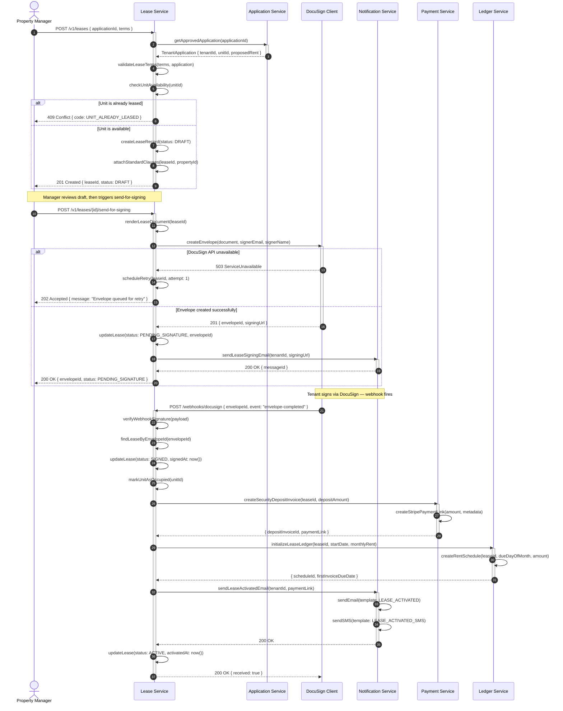

# Sequence Diagrams — Real Estate Management System

## Overview

This document contains detailed service-level sequence diagrams for three critical workflows in the Real Estate Management System. Each diagram shows the exact message flow, activation lifetimes, conditional branches, and error paths across microservices.

---

## Diagram 1: Create and Activate Lease

This flow begins after a TenantApplication has been approved. The LeaseSvc orchestrates DocuSign envelope creation, digital signing notifications, rent schedule setup, and ledger initialization.



---

## Diagram 2: Process Rent Payment

This flow covers the full monthly rent collection cycle: automated invoice generation, tenant payment via Stripe, ledger reconciliation, and late fee calculation if payment is overdue.

```mermaid
sequenceDiagram
    autonumber
    participant SchedulerJob as Cron Scheduler
    participant RentSvc as Rent Service
    participant StripeSvc as Stripe Service
    participant LedgerSvc as Ledger Service
    participant NotificationSvc as Notification Service
    participant LateFeeEngine as Late Fee Engine
    actor Tenant

    note over SchedulerJob: Runs on 1st of each month at 00:01 UTC

    SchedulerJob ->> RentSvc: triggerMonthlyInvoiceGeneration(month)
    activate RentSvc

    RentSvc ->> RentSvc: getActiveRentSchedules()

    loop For each active RentSchedule
        RentSvc ->> RentSvc: generateRentInvoice(scheduleId, dueDate)
        RentSvc ->> LedgerSvc: postInvoiceToLedger(invoiceId, amount, dueDate)
        activate LedgerSvc
        LedgerSvc -->> RentSvc: { ledgerEntryId }
        deactivate LedgerSvc
        RentSvc ->> NotificationSvc: sendInvoiceReadyEmail(tenantId, invoiceId, amount)
        activate NotificationSvc
        NotificationSvc -->> RentSvc: 200 OK
        deactivate NotificationSvc
    end

    RentSvc -->> SchedulerJob: { invoicesGenerated: N }
    deactivate RentSvc

    note over Tenant, StripeSvc: Tenant initiates payment via portal

    Tenant ->> RentSvc: POST /v1/rent-payments { invoiceId, paymentMethodId }
    activate RentSvc

    RentSvc ->> RentSvc: validateInvoice(invoiceId)

    alt Invoice already paid
        RentSvc -->> Tenant: 409 Conflict { code: INVOICE_ALREADY_PAID }
    else Invoice valid
        RentSvc ->> StripeSvc: createPaymentIntent(amount, customerId, paymentMethodId, idempotencyKey)
        activate StripeSvc

        alt Stripe charge fails (insufficient funds / card declined)
            StripeSvc -->> RentSvc: { status: FAILED, failureCode: card_declined }
            deactivate StripeSvc
            RentSvc ->> RentSvc: recordPaymentAttempt(status: FAILED, reason)
            RentSvc ->> NotificationSvc: sendPaymentFailedEmail(tenantId, invoiceId, reason)
            activate NotificationSvc
            NotificationSvc -->> RentSvc: 200 OK
            deactivate NotificationSvc
            RentSvc -->> Tenant: 402 Payment Required { code: PAYMENT_FAILED, reason }
        else Stripe charge succeeds
            StripeSvc -->> RentSvc: { status: SUCCEEDED, chargeId, paymentIntentId }
            deactivate StripeSvc

            RentSvc ->> RentSvc: createRentPaymentRecord(invoiceId, chargeId, SUCCEEDED)
            RentSvc ->> RentSvc: markInvoicePaid(invoiceId, paidAt: now())

            RentSvc ->> LedgerSvc: recordPayment(leaseId, invoiceId, amount, chargeId)
            activate LedgerSvc
            LedgerSvc ->> LedgerSvc: updateLedgerBalance(leaseId, credit: amount)
            LedgerSvc -->> RentSvc: { ledgerEntryId, balance }
            deactivate LedgerSvc

            RentSvc ->> NotificationSvc: sendPaymentConfirmation(tenantId, amount, receiptUrl)
            activate NotificationSvc
            NotificationSvc -->> RentSvc: 200 OK
            deactivate NotificationSvc

            RentSvc -->> Tenant: 200 OK { paymentId, receiptUrl, balance: 0 }
        end
    end

    deactivate RentSvc

    note over SchedulerJob, LateFeeEngine: Late fee job runs on grace period expiry day

    SchedulerJob ->> LateFeeEngine: evaluateOverdueInvoices(asOfDate)
    activate LateFeeEngine

    LateFeeEngine ->> LateFeeEngine: getUnpaidInvoicesPastGracePeriod(asOfDate)

    loop For each overdue invoice
        LateFeeEngine ->> LateFeeEngine: lookupLeaseLateFeePolicy(leaseId)

        alt Late fee already applied
            LateFeeEngine ->> LateFeeEngine: skip(invoiceId)
        else Late fee not yet applied
            LateFeeEngine ->> LateFeeEngine: calculateLateFee(policy, invoiceAmount)
            LateFeeEngine ->> RentSvc: applyLateFee(invoiceId, lateFeeAmount)
            activate RentSvc
            RentSvc ->> RentSvc: createLateFeeRecord(invoiceId, amount)
            RentSvc ->> RentSvc: updateInvoiceTotal(invoiceId, totalWithFee)
            RentSvc -->> LateFeeEngine: 200 OK
            deactivate RentSvc
            LateFeeEngine ->> NotificationSvc: sendLateFeeNotice(tenantId, invoiceId, feeAmount)
            activate NotificationSvc
            NotificationSvc -->> LateFeeEngine: 200 OK
            deactivate NotificationSvc
        end
    end

    LateFeeEngine -->> SchedulerJob: { feesApplied: N, totalRevenue: X }
    deactivate LateFeeEngine
```

---

## Diagram 3: Maintenance Request Assignment

This flow covers a tenant submitting a maintenance request through the portal, triage and priority assignment, contractor assignment, notification, and optional inspection trigger on completion.

```mermaid
sequenceDiagram
    autonumber
    actor Tenant
    participant TenantPortal as Tenant Portal (API)
    participant MaintenanceSvc as Maintenance Service
    participant NotificationSvc as Notification Service
    participant ContractorSvc as Contractor Service
    participant InspectionSvc as Inspection Service
    actor PM as Property Manager

    Tenant ->> TenantPortal: POST /v1/maintenance-requests { title, description, category, photos[] }
    activate TenantPortal

    TenantPortal ->> TenantPortal: validateRequest(payload)
    TenantPortal ->> TenantPortal: uploadPhotosToS3(photos[])

    loop For each photo
        alt Photo upload fails
            TenantPortal ->> TenantPortal: logUploadFailure(photoId)
            note over TenantPortal: Continue with remaining photos
        else Upload succeeds
            TenantPortal ->> TenantPortal: storePhotoUrl(s3Url)
        end
    end

    TenantPortal ->> MaintenanceSvc: createRequest(unitId, tenantId, title, description, category, photoUrls)
    activate MaintenanceSvc

    MaintenanceSvc ->> MaintenanceSvc: createMaintenanceRecord(status: SUBMITTED)
    MaintenanceSvc ->> MaintenanceSvc: autoTriagePriority(category, keywords)

    alt Emergency category detected (burst pipe, no heat, gas leak)
        MaintenanceSvc ->> MaintenanceSvc: setPriority(EMERGENCY)
        MaintenanceSvc ->> NotificationSvc: sendEmergencyAlert(managerId, propertyId, requestId)
        activate NotificationSvc
        NotificationSvc ->> NotificationSvc: sendSMS(manager, EMERGENCY_TEMPLATE)
        NotificationSvc ->> NotificationSvc: sendPushNotification(manager, requestId)
        NotificationSvc -->> MaintenanceSvc: 200 OK
        deactivate NotificationSvc
    else Routine maintenance
        MaintenanceSvc ->> MaintenanceSvc: setPriority(NORMAL)
        MaintenanceSvc ->> NotificationSvc: sendNewRequestEmail(managerId, requestId)
        activate NotificationSvc
        NotificationSvc -->> MaintenanceSvc: 200 OK
        deactivate NotificationSvc
    end

    MaintenanceSvc -->> TenantPortal: { requestId, status: SUBMITTED, priority }
    deactivate MaintenanceSvc
    TenantPortal -->> Tenant: 201 Created { requestId, trackingUrl }
    deactivate TenantPortal

    note over PM, MaintenanceSvc: Manager reviews and assigns contractor

    PM ->> MaintenanceSvc: POST /v1/maintenance-requests/{id}/assign { contractorId, scheduledAt }
    activate MaintenanceSvc

    MaintenanceSvc ->> ContractorSvc: getContractorAvailability(contractorId, scheduledAt)
    activate ContractorSvc

    alt Contractor not available at scheduled time
        ContractorSvc -->> MaintenanceSvc: { available: false, nextAvailable: DateTime }
        deactivate ContractorSvc
        MaintenanceSvc -->> PM: 409 Conflict { code: CONTRACTOR_UNAVAILABLE, nextAvailable }
    else Contractor available
        ContractorSvc -->> MaintenanceSvc: { available: true, contractorDetails }
        deactivate ContractorSvc

        MaintenanceSvc ->> MaintenanceSvc: createAssignment(requestId, contractorId, scheduledAt)
        MaintenanceSvc ->> MaintenanceSvc: updateRequest(status: ASSIGNED)

        MaintenanceSvc ->> NotificationSvc: sendAssignmentNotification(contractorId, requestId, scheduledAt)
        activate NotificationSvc
        NotificationSvc ->> NotificationSvc: sendEmail(contractor, ASSIGNMENT_TEMPLATE)
        NotificationSvc ->> NotificationSvc: sendSMS(contractor, scheduledAt)
        NotificationSvc -->> MaintenanceSvc: 200 OK
        deactivate NotificationSvc

        MaintenanceSvc ->> NotificationSvc: sendTenantUpdateEmail(tenantId, scheduledAt)
        activate NotificationSvc
        NotificationSvc -->> MaintenanceSvc: 200 OK
        deactivate NotificationSvc

        MaintenanceSvc -->> PM: 200 OK { assignmentId, scheduledAt }
    end

    deactivate MaintenanceSvc

    note over ContractorSvc, MaintenanceSvc: Contractor marks job complete

    ContractorSvc ->> MaintenanceSvc: PUT /v1/maintenance-requests/{id} { status: COMPLETED, notes, actualCost }
    activate MaintenanceSvc

    MaintenanceSvc ->> MaintenanceSvc: updateRequest(status: PENDING_REVIEW, completionNotes, actualCost)

    opt actualCost > ownerApprovedBudget
        MaintenanceSvc ->> NotificationSvc: sendBudgetExceededAlert(managerId, ownerId, overage)
        activate NotificationSvc
        NotificationSvc -->> MaintenanceSvc: 200 OK
        deactivate NotificationSvc
    end

    MaintenanceSvc ->> NotificationSvc: sendCompletionNotice(tenantId, requestId)
    activate NotificationSvc
    NotificationSvc -->> MaintenanceSvc: 200 OK
    deactivate NotificationSvc

    opt Inspection required after repair
        MaintenanceSvc ->> InspectionSvc: schedulePostRepairInspection(unitId, requestId, managerId)
        activate InspectionSvc
        InspectionSvc ->> InspectionSvc: createInspection(type: POST_REPAIR, scheduledDate: now()+2days)
        InspectionSvc -->> MaintenanceSvc: { inspectionId, scheduledDate }
        deactivate InspectionSvc
    end

    MaintenanceSvc -->> ContractorSvc: 200 OK { requestId, status: PENDING_REVIEW }
    deactivate MaintenanceSvc

    PM ->> MaintenanceSvc: PUT /v1/maintenance-requests/{id} { status: COMPLETED }
    activate MaintenanceSvc
    MaintenanceSvc ->> MaintenanceSvc: updateRequest(status: COMPLETED, resolvedAt: now())
    MaintenanceSvc ->> NotificationSvc: sendResolvedConfirmation(tenantId, requestId)
    activate NotificationSvc
    NotificationSvc -->> MaintenanceSvc: 200 OK
    deactivate NotificationSvc
    MaintenanceSvc -->> PM: 200 OK { requestId, status: COMPLETED }
    deactivate MaintenanceSvc
```
