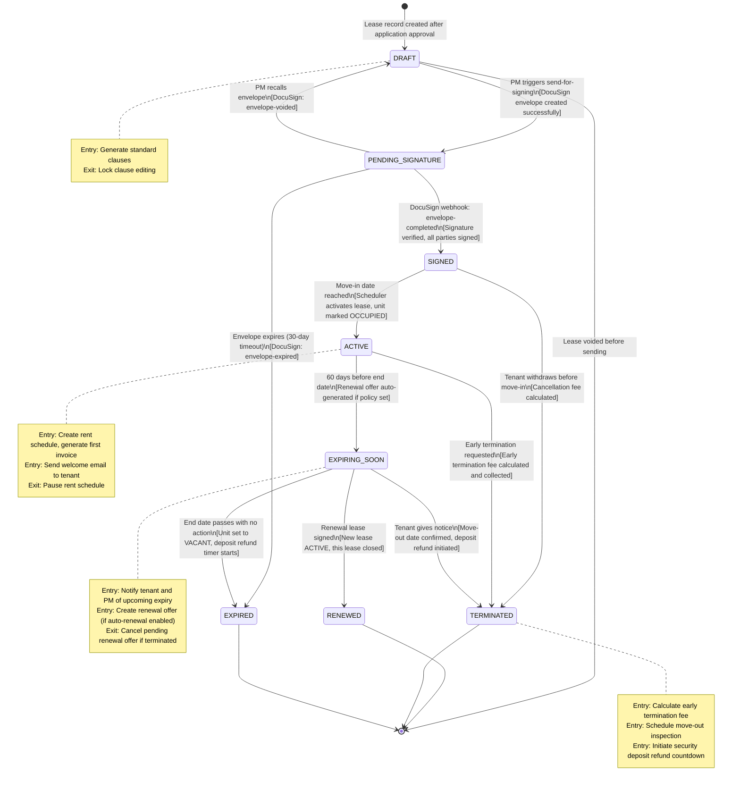

# State Machine Diagrams — Real Estate Management System

## Overview

This document defines the state machines for three core entities: **Lease**, **Maintenance Request**, and **Tenant Application**. Each state machine specifies valid states, transition triggers, guard conditions, and entry/exit actions. These state machines are implemented as server-side state machines to prevent invalid transitions.

---

## State Machine 1: Lease

The Lease state machine governs the full lifecycle from initial draft creation through DocuSign signing, active occupancy, and eventual expiry or termination.

### States Summary

| State | Description |
|-------|-------------|
| `DRAFT` | Lease document created but not yet sent to tenant |
| `PENDING_SIGNATURE` | DocuSign envelope sent; awaiting tenant digital signature |
| `SIGNED` | Tenant has signed; awaiting activation (move-in date) |
| `ACTIVE` | Lease is live; rent schedule running |
| `EXPIRING_SOON` | Within 60 days of end date; renewal offer may be outstanding |
| `RENEWED` | Lease replaced by a new lease via formal renewal |
| `TERMINATED` | Ended early by landlord or tenant before end date |
| `EXPIRED` | End date passed without renewal; tenancy has ended |

---

## State Machine 2: Maintenance Request

The Maintenance Request state machine tracks the lifecycle of a repair job from tenant submission through contractor work and final resolution.

### States Summary

| State | Description |
|-------|-------------|
| `SUBMITTED` | Request received from tenant portal |
| `TRIAGED` | PM has reviewed and set priority |
| `ASSIGNED` | Contractor assigned with scheduled date/time |
| `IN_PROGRESS` | Contractor has started work on site |
| `PENDING_REVIEW` | Contractor marked work done; PM review required |
| `COMPLETED` | PM confirmed resolution |
| `CANCELLED` | Request cancelled by tenant or PM |

```mermaid
stateDiagram-v2
    [*] --> SUBMITTED : Tenant submits request via portal

    SUBMITTED --> TRIAGED : PM reviews and sets priority\n[Priority: EMERGENCY, HIGH, NORMAL, LOW]
    SUBMITTED --> CANCELLED : PM determines invalid request\n[Cancellation reason recorded]

    TRIAGED --> ASSIGNED : PM assigns contractor and schedules\n[Contractor availability confirmed]
    TRIAGED --> TRIAGED : PM re-triages (priority change)
    TRIAGED --> CANCELLED : Request withdrawn by tenant

    ASSIGNED --> IN_PROGRESS : Contractor confirms and starts work\n[Timestamp recorded]
    ASSIGNED --> TRIAGED : Contractor declines or cancels\n[Re-assignment required]
    ASSIGNED --> CANCELLED : PM cancels before work begins

    IN_PROGRESS --> PENDING_REVIEW : Contractor marks work complete\n[Completion notes and actual cost submitted]
    IN_PROGRESS --> ASSIGNED : Work paused; parts on order\n[New scheduled date set]

    PENDING_REVIEW --> COMPLETED : PM approves resolution\n[resolvedAt timestamp set]
    PENDING_REVIEW --> ASSIGNED : PM rejects completion\n[Additional work required, reassigned]

    COMPLETED --> [*]
    CANCELLED --> [*]

    note right of SUBMITTED
        Entry: Auto-triage by keyword (emergency detection)
        Entry: Notify PM via email/push
        Exit: Lock photo uploads
    end note

    note right of ASSIGNED
        Entry: Notify contractor via email + SMS
        Entry: Notify tenant of scheduled date
        Exit: Send reminder 24h before scheduled time
    end note

    note right of PENDING_REVIEW
        Entry: Notify PM of completion
        Entry: Check if actualCost > ownerApprovedBudget
        Entry: Auto-complete after 48h if no PM action
    end note

    note right of COMPLETED
        Entry: Notify tenant of resolution
        Entry: Trigger post-repair inspection if flagged
        Entry: Update unit maintenance history
    end note
```

---

## State Machine 3: Tenant Application

The Tenant Application state machine manages the full screening pipeline from submission through background/credit checks to lease offer acceptance.

### States Summary

| State | Description |
|-------|-------------|
| `SUBMITTED` | Application received, documents collected |
| `UNDER_REVIEW` | PM is manually reviewing income and documents |
| `BACKGROUND_CHECK` | Background (Checkr) and credit (TransUnion/Equifax) checks running |
| `APPROVED` | All checks passed; lease offer ready to be created |
| `REJECTED` | Application denied; reason recorded |
| `LEASE_OFFERED` | PM created lease and sent DocuSign envelope to tenant |
| `LEASE_SIGNED` | Tenant signed the lease |
| `ACTIVE` | Tenant moved in; lease is active |
| `WITHDRAWN` | Applicant withdrew their own application |

```mermaid
stateDiagram-v2
    [*] --> SUBMITTED : Tenant submits application via listing portal

    SUBMITTED --> UNDER_REVIEW : PM opens application for review\n[Income verification, references checked]
    SUBMITTED --> WITHDRAWN : Applicant withdraws\n[No further action needed]

    UNDER_REVIEW --> BACKGROUND_CHECK : PM initiates background and credit checks\n[Checkr + TransUnion/Equifax APIs called]
    UNDER_REVIEW --> REJECTED : PM rejects without screening\n[Reason must be Fair Housing compliant]
    UNDER_REVIEW --> WITHDRAWN : Applicant withdraws during review

    BACKGROUND_CHECK --> APPROVED : All checks passed\n[Score >= threshold, no disqualifying records]
    BACKGROUND_CHECK --> REJECTED : Check results fail policy\n[Reason stored; adverse action notice sent]
    BACKGROUND_CHECK --> UNDER_REVIEW : Inconclusive results\n[Manual review required]

    APPROVED --> LEASE_OFFERED : PM creates and sends lease\n[DocuSign envelope dispatched]
    APPROVED --> REJECTED : PM overrides approval\n[Documented reason required]

    LEASE_OFFERED --> LEASE_SIGNED : Tenant signs lease via DocuSign\n[Webhook received: envelope-completed]
    LEASE_OFFERED --> APPROVED : Lease recalled by PM\n[DocuSign envelope voided]
    LEASE_OFFERED --> WITHDRAWN : Applicant declines lease offer\n[Unit relisted]

    LEASE_SIGNED --> ACTIVE : Lease activation date reached\n[Unit status: OCCUPIED]

    ACTIVE --> [*]
    REJECTED --> [*]
    WITHDRAWN --> [*]

    note right of SUBMITTED
        Entry: Send confirmation email to applicant
        Entry: Notify PM of new application
        Exit: Lock application form fields
    end note

    note right of BACKGROUND_CHECK
        Entry: POST to Checkr API for criminal/eviction check
        Entry: POST to TransUnion/Equifax for credit pull
        Entry: Set 48h timeout; escalate if not returned
        Exit: Store encrypted raw report to S3
    end note

    note right of REJECTED
        Entry: Send adverse action notice (FCRA required within 30 days)
        Entry: Log rejection reason for Fair Housing audit
        Entry: Notify tenant via email with reason
    end note

    note right of LEASE_OFFERED
        Entry: Send lease offer notification to tenant
        Entry: Start 7-day acceptance countdown
        Exit: Cancel countdown timer
    end note
```

