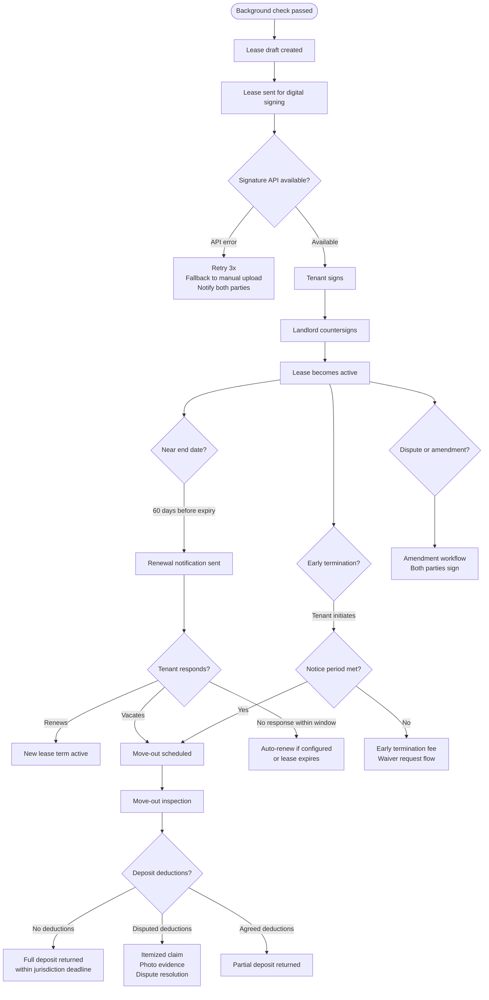

# Lease Lifecycle — Edge Cases

## Overview

This file documents edge cases across the full lease lifecycle in the Real Estate Management System: from draft creation and digital signing through active tenancy, renewal, and termination, including security deposit return. Lease operations carry direct legal weight — a signed lease is a legally binding contract, and errors in state transitions, document generation, or financial settlement can result in landlord liability, tenant harm, or regulatory penalties.

---

---

## EC-01: Digital Lease Signature Fails

**Failure Mode**: The DocuSign or HelloSign (Dropbox Sign) API returns an error when attempting to send a lease for signature, or the signing session fails mid-signature due to an API timeout, a webhook delivery failure confirming signature completion, or an invalid document template.

**Impact**: The lease cannot be activated. The unit remains in a limbo state — the tenant believes the lease is proceeding while no legal contract has been created. If the landlord re-signs the unit to another tenant in the meantime, a dispute arises. If month-start is approaching, the payment setup is delayed.

**Detection**:
- DocuSign API returns 4xx or 5xx; the client SDK throws a `SignatureRequestError`
- The `leases.signature_status` field remains `pending` for more than 24 hours without a completed webhook event
- Monitoring: `lease_signature_failure_rate` gauge exceeds 2% over a 30-minute window; P2 alert

**Mitigation**:
- Retry the signature request up to 3 times with 5-minute intervals before declaring failure
- On persistent failure, email both the landlord and the tenant: "There was a problem sending the lease for signature. You can upload a signed PDF manually using the link below."
- Enable the **manual upload fallback**: allow a PDF signed outside the platform to be uploaded and attached to the lease record; a property manager must verify the signatures
- The lease remains in `pending_signature` state and the unit is not released for new applications until either the signature is completed or the lease is cancelled

**Recovery**:
- Once the DocuSign API recovers, retry failed signature requests automatically using the queued lease IDs stored in the dead-letter queue
- Run: `npm run jobs:retry-signature-requests --since=<failure-timestamp>`
- Verify each recovered lease's `signature_status` via the DocuSign status poll endpoint before transitioning the lease to `active`

**Prevention**:
- Contract with a backup e-signature provider (HelloSign as fallback if DocuSign fails); configure automatic provider failover
- Test the fallback flow in staging monthly using the chaos engineering suite
- Monitor the DocuSign status page and set up a PagerDuty integration for their incident notifications

---

## EC-02: Tenant Initiates Early Termination Without Meeting Notice Period

**Failure Mode**: A tenant notifies the landlord of intent to vacate but gives fewer than the required 30-day (or jurisdiction-specific) notice. The tenant may have submitted a notice on day 1 intending to vacate on day 15, or simply may not have read the lease terms.

**Impact**: The landlord loses 15+ days of notice during which they would normally re-list the unit and find a replacement tenant. This causes a vacancy gap. The tenant may be legally liable for an early termination fee or for continued rent through the notice period.

**Detection**:
- Tenant submits early termination request via the tenant portal
- Termination service calculates: `required_vacate_date = notice_submitted_at + jurisdiction_notice_period`
- If `requested_vacate_date < required_vacate_date`, the system flags a notice period violation
- The fee calculator computes: `early_termination_fee = monthly_rent × lease_terms.early_termination_months` (typically 1–2 months)

**Mitigation**:
- Display the calculated required vacate date and the applicable fee immediately on the early termination submission form, before the tenant confirms
- If the tenant submits anyway, transition the lease to `termination_pending` and create a pending early termination fee charge
- Notify the landlord immediately: "Tenant {name} has submitted an early termination notice with a vacate date that does not meet the required notice period. An early termination fee of {amount} has been assessed."
- Allow the tenant to submit a **waiver request** with a reason (job loss, medical emergency, domestic situation); property manager reviews and can waive the fee

**Recovery**:
- If the tenant pays the early termination fee, proceed with move-out scheduling for the requested date
- If the tenant cancels the early termination (wants to stay through the required date), revert the lease to `active` and cancel the pending fee charge
- If the fee is waived, create an audit log entry with the waiver reason and approver ID

**Prevention**:
- Prominently display the notice period and early termination fee on the lease signing page, and require the tenant to explicitly acknowledge these terms
- Send a reminder to tenants 90 days before lease end reminding them of their notice obligation and the required submission date

---

## EC-03: Dispute Over Security Deposit Deductions at Move-Out

**Failure Mode**: After move-out inspection, the landlord submits a claim for security deposit deductions (e.g., for carpet replacement, wall repainting, appliance damage), and the tenant disputes the deductions as excessive, fraudulent, or outside normal wear-and-tear.

**Impact**: Landlord withholds deposit; tenant files a small claims court case. Many jurisdictions require the landlord to return the deposit within 14–21 days with an itemized statement; failure to do so can result in the landlord forfeiting the deposit and paying tenant attorney fees. REMS faces reputational risk if the dispute process is inadequate.

**Detection**:
- Landlord submits deduction claim via the owner portal
- Tenant receives notification and has a configurable window (default 7 days) to dispute
- If tenant clicks "Dispute" within the window, the lease enters `deposit_disputed` status
- Monitoring: `deposit_dispute_rate` gauge; alert if > 15% of closed leases have disputes (potential systemic landlord over-claiming behavior)

**Mitigation**:
- Require landlords to submit an itemized deduction claim with:
  - Line item descriptions and amounts
  - Photo evidence attached to each line item (timestamped photos from move-out inspection)
  - Contractor quotes or receipts for repair costs
- Send the tenant the itemized claim with photos through the tenant portal; allow the tenant to accept, partially dispute, or fully dispute each line item
- If disputed, route to a **structured mediation workflow**:
  1. Both parties submit their evidence and position statements (3 business days each)
  2. A REMS property management advisor reviews and issues a non-binding recommendation
  3. If unresolved, provide tenant with documentation needed for small claims court

**Recovery**:
- Return the undisputed portion of the deposit within the jurisdiction-mandated deadline, even while the disputed portion is being resolved
- If the dispute is resolved in the tenant's favor, return the additional amount within 48 hours
- All deduction claims, photos, and communications are retained for 5 years in the audit log

**Prevention**:
- Require a **pre-move-in photo inspection** at lease start, with landlord and tenant both signing off on the unit's condition
- Compare move-out photos to move-in photos automatically using the photo storage metadata and prompt the landlord to reference specific before/after comparisons
- Display jurisdiction-specific wear-and-tear guidelines to landlords before they submit deductions

---

## EC-04: Lease Auto-Renews While Tenant Intended to Vacate

**Failure Mode**: The lease has an auto-renew clause configured. The tenant intended to vacate at the end of the term but did not submit a non-renewal notice within the required window (typically 30–60 days before end date). The lease auto-renews, and the tenant is now obligated for another term.

**Impact**: Tenant is legally bound to rent they did not intend to pay. If they have already moved out or signed a lease elsewhere, the landlord may pursue rent arrears. Tenant feels misled, resulting in disputes and potential regulatory complaints about auto-renew practices.

**Detection**:
- Renewal notification was sent 60 days before end date per the standard flow
- The auto-renew override window closes at `end_date - 30 days`
- If no response was recorded from the tenant, the batch job processes auto-renewal at `end_date - 7 days`
- Monitoring: `auto_renewal_complaint_count` counter; any complaint triggers a manual review

**Mitigation**:
- Send **three** renewal reminder notifications: 60 days, 30 days, and 14 days before the override window closes
- The 14-day reminder explicitly states: "If you do not respond by {date}, your lease will automatically renew for {duration} at {rent_amount}."
- Provide a one-click response in the email (renew / do not renew) to minimize friction
- Allow landlords to grant a grace period override: if the tenant contacts support within 14 days of accidental auto-renewal, the landlord can agree to a corrective lease amendment at no penalty

**Recovery**:
- If the tenant contacts within the grace period, create a lease amendment transitioning from `active` back to `termination_pending` with the original end date
- Cancel any rent invoices already generated for the unintended renewal period
- If the landlord has already signed a new tenant for the unit (in anticipation of vacancy), escalate to a property management advisor to mediate the conflict

**Prevention**:
- Require explicit opt-in for auto-renew clauses; default to manual renewal requiring tenant action
- Include auto-renew terms in the renewal notification subject line, not buried in body text

---

## EC-05: Rent Amount Changes Mid-Lease Due to Rent Control Adjustment

**Failure Mode**: After a lease is active, the jurisdiction's rent control authority announces an allowable annual rent increase (e.g., CPI + 1%, capped at 3%). The landlord is entitled to increase rent, or in some jurisdictions is prohibited from charging more than the CPI increase. This requires a lease amendment and changes to Stripe's recurring payment configuration.

**Impact**: If rent is increased without proper notice (typically 30–90 days depending on jurisdiction), the increase is legally unenforceable. If Stripe's subscription amount is updated without amending the lease, billing and lease records diverge, causing reconciliation failures.

**Detection**:
- Jurisdiction data sync flags leases in rent-controlled jurisdictions approaching their annual renewal date
- Landlord manually initiates a rent increase request via the owner portal
- The rent increase service validates: requested increase % ≤ jurisdiction's allowable cap for the current year

**Mitigation**:
- Block the rent increase if it exceeds the jurisdiction cap; display the maximum allowable amount to the landlord
- Require the landlord to submit the rent increase notice to the tenant through REMS (timestamped for legal defensibility)
- Enforce the jurisdiction-specific notice period: do not update the Stripe subscription amount until `notice_sent_at + required_notice_days`
- Create a **lease amendment** document reflecting the new rent amount; both parties must sign before the new amount becomes effective

**Recovery**:
- If a rent increase was processed before the notice period elapsed (system bug), immediately revert the Stripe payment amount and issue a refund for any over-charged payments
- Regenerate and re-issue the rent increase notice with the correct effective date
- Log the error in the audit trail with the corrective actions taken

**Prevention**:
- Make rent increase scheduling a two-step process: (1) landlord schedules the increase, (2) system sends notice and enforces the wait period, (3) system activates the new amount automatically on the effective date
- Validate that the `effective_date` is at least `notice_sent_date + jurisdiction.rent_increase_notice_days` before scheduling

---

## EC-06: Lease Transfer When Property Is Sold to a New Owner

**Failure Mode**: The landlord sells a property to a new owner mid-tenancy. The existing tenant's lease is legally transferred to the new owner by operation of law in most jurisdictions. However, on the REMS platform, the lease's `landlord_id`, Stripe Connect account for rent routing, and owner portal access must all be updated. Without proper handling, rent payments continue flowing to the previous landlord.

**Impact**: Rent paid to the wrong landlord cannot be easily clawed back via Stripe after the funds have settled. The new owner has no visibility into active leases or maintenance requests. The old owner retains unauthorized access to tenant data after the sale.

**Detection**:
- Triggered manually: old landlord or new landlord initiates a "Property Transfer" workflow in the owner portal
- A transfer request is created linking the `property_id`, the selling `landlord_id`, and the purchasing `landlord_id`

**Mitigation**:
- Create a structured **property transfer workflow**:
  1. Old landlord initiates transfer and invites new landlord to the platform (if not already a user)
  2. New landlord completes Stripe Connect onboarding (required before transfer completes)
  3. Both parties confirm the transfer
  4. REMS legal team (or automated document service) generates a lease assignment notice for each active tenant
  5. Each tenant is notified: their lease is assigned to the new landlord, new payment details, new maintenance contact
  6. Stripe payment routing is updated: all future payments route to the new landlord's `stripe_account_id`
- No rent payment is routed to the new account until their Stripe Connect account is fully verified

**Recovery**:
- If rent was paid to the old landlord after the transfer date, create a manual payout transfer in Stripe from the old landlord's Connect account to the new landlord's account
- Revoke the old landlord's access to the property, its units, tenant PII, and lease documents immediately upon transfer confirmation
- Archive the old landlord's association with the property in the audit log (access history retained)

**Prevention**:
- Block rent payment processing for any unit with a pending property transfer until the transfer is complete and the new Stripe account is confirmed
- Require 5 business days advance notice for property transfers to allow payment routing to be updated before the next rent cycle
