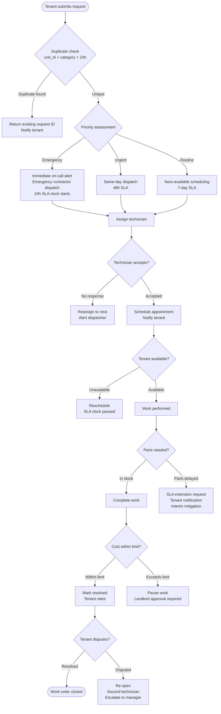

# Maintenance Requests — Edge Cases

## Overview

This file documents edge cases for the maintenance work order system in the Real Estate Management System. Maintenance management spans tenant-submitted requests, priority assessment, SLA enforcement, contractor dispatch, scheduling, completion verification, and cost management. Failures in this subsystem directly affect tenant habitability and satisfaction, landlord costs, and compliance with implied warranty of habitability laws in most jurisdictions.

---

---

## EC-01: Emergency Maintenance Request Submitted at 2AM

**Failure Mode**: A tenant submits an emergency maintenance request (e.g., burst pipe, gas leak, no heat in winter) outside business hours, when the regular dispatcher and assigned contractors are unavailable. The standard dispatch queue is not monitored outside 8 AM–8 PM.

**Impact**: Without immediate response to a burst pipe, water damage can escalate from hundreds to tens of thousands of dollars within hours. A gas leak is a life-safety emergency. Failure to respond to habitability-critical issues within 24 hours violates implied warranty of habitability in most jurisdictions and exposes the landlord to tenant claims and potential rent withholding.

**Detection**:
- Request submitted with `priority = EMERGENCY` (set automatically if category is gas_leak, no_heat, flooding, electrical_fire, or set manually by tenant)
- Submission timestamp falls outside the configured business hours window
- `emergency_request_unacknowledged` alert fires if no dispatcher has acknowledged the request within 15 minutes

**Mitigation**:
- Emergency requests trigger an immediate **PagerDuty** alert to the on-call maintenance dispatcher — not a next-business-day email
- The on-call dispatcher has access to the **emergency contractor network** (pre-vetted vendors with 24/7 availability and pre-negotiated emergency rates)
- A cost pre-authorization of up to `$500` (configurable per property) is automatically granted for emergency work; the landlord is notified within 15 minutes with the option to raise or lower the pre-auth limit
- An automated text and app push notification is sent to the tenant: "Your emergency request has been received. A technician will contact you within 1 hour."

**Recovery**:
- Track response SLA in the work order: `first_contact_at` must be within 1 hour of `submitted_at` for emergency requests
- If the on-call dispatcher fails to acknowledge within 15 minutes, escalate to the secondary on-call and to the property management team lead
- After resolution, conduct a post-incident review if response exceeded the 1-hour SLA, document the root cause and corrective actions

**Prevention**:
- Maintain an on-call rotation for maintenance dispatch 365 days per year; ensure rotation is filled in PagerDuty at least 2 weeks in advance
- Pre-authorize emergency contractors at property onboarding time, before an emergency occurs
- Send landlords a quarterly reminder to verify their emergency contractor list is current

---

## EC-02: Maintenance Request for a Unit with No Active Lease

**Failure Mode**: A maintenance request is submitted for a unit that is currently vacant (between tenancies), has a lease in `draft` or `pending_signature` state, or belongs to a property that has been taken off-market. The standard dispatch flow requires an associated active tenant and active lease.

**Impact**: If ignored, a maintenance issue in a vacant unit can worsen (e.g., a slow leak becomes flood damage; a rodent entry point grows). If processed through the standard flow without a tenant, SLA notifications and tenant-side scheduling prompts go nowhere.

**Detection**:
- Work order creation service queries: `SELECT status FROM leases WHERE unit_id = $1 AND status = 'active'`
- If no active lease is found, the request is flagged as `VACANCY_MAINTENANCE`
- Monitoring: `vacancy_maintenance_count` gauge; a spike may indicate a batch import created requests for the wrong units

**Mitigation**:
- Route `VACANCY_MAINTENANCE` requests directly to the **property manager's queue** instead of the tenant-facing dispatch flow
- Skip all tenant-facing notifications, scheduling prompts, and tenant satisfaction ratings (no tenant to notify)
- Allow the property manager or landlord to assign the work directly, bypassing the tenant availability check
- Apply a modified SLA appropriate for vacancy work (typically 5 business days vs. the standard urgency-based SLA)

**Recovery**:
- If a new lease is signed for the unit while a vacancy maintenance request is pending, associate the work order with the new tenant automatically so they can see open work items before moving in
- If the work order was created in error (wrong unit ID), allow the property manager to reassign or close it with a note

**Prevention**:
- When creating a maintenance request via the API, validate `unit_id` exists and route appropriately based on occupancy status before dispatching
- Include a "Vacancy Maintenance" category in the request form so landlords can self-identify these and bypass the tenant flow

---

## EC-03: Tenant Repeatedly Submits Duplicate Maintenance Requests

**Failure Mode**: A tenant, frustrated by a lack of perceived progress on an open work order, submits the same request multiple times. This creates duplicate work orders in the dispatch queue, confuses technicians, and inflates work order metrics.

**Impact**: Technicians may show up multiple times for the same issue. Dispatcher workload increases. Work order counts are artificially inflated. If the deduplication logic is over-aggressive, a legitimately different issue in the same category is erroneously merged with an unrelated open request.

**Detection**:
- On work order creation, query: `SELECT id FROM work_orders WHERE unit_id = $1 AND category = $2 AND status NOT IN ('completed', 'closed') AND created_at > NOW() - INTERVAL '24 hours'`
- If a match is found, return the existing work order ID without creating a new record
- Monitoring: `duplicate_work_order_attempt_count` counter; if > 20 per day, review deduplication thresholds

**Mitigation**:
- When a duplicate is detected, show the tenant their existing open work order with its current status, assigned technician, and estimated completion date
- Provide a "This isn't resolved yet / Escalate" button that adds an escalation flag to the existing work order without creating a duplicate
- Allow the tenant to add a comment to the existing work order explaining why they are re-submitting (e.g., "Technician came but the problem came back")

**Recovery**:
- If duplicate work orders were created before deduplication logic was in place, run: `npm run jobs:merge-duplicate-work-orders` — which merges records by `unit_id + category + same week` and notifies the dispatcher of the consolidation
- Preserve all comments from duplicate records on the merged work order

**Prevention**:
- Show the tenant a list of their open work orders in the same category before submitting a new request
- Implement a 24-hour deduplication window; extend to 7 days for categories where recurring issues are common (e.g., plumbing, HVAC)
- Send tenant proactive status updates at 48-hour intervals for open work orders to reduce the impulse to re-submit

---

## EC-04: Technician Marks Request Resolved But Tenant Disputes Resolution

**Failure Mode**: A technician marks a work order as `completed`, triggering an automated closure and tenant satisfaction survey. The tenant believes the issue was not actually fixed (e.g., the faucet leak stopped during the visit but recurred hours later, or the HVAC was "working" at time of visit but broke again overnight).

**Impact**: The work order is closed prematurely. The issue persists for the tenant. If the tenant must re-submit, they experience friction. If the recurring issue is related to a habitability defect, the landlord's liability increases with each failed resolution.

**Detection**:
- Tenant selects "Issue not resolved" in the post-completion satisfaction survey
- Or tenant submits a new work order in the same category within 72 hours of a completion
- `tenant_dispute_rate` gauge: if > 10% of completions result in disputes, alert for review

**Mitigation**:
- When the tenant disputes resolution, the work order transitions from `completed` to `re_opened` automatically
- The original technician is notified immediately; if they do not respond within 4 hours, the work order is escalated to the dispatcher for reassignment to a second technician
- The landlord and property manager are notified of the re-open event with the tenant's dispute reason
- SLA clock restarts from the re-open timestamp with the same priority tier as the original request

**Recovery**:
- The second technician's visit is documented in the work order history as a separate visit record, preserving the full resolution timeline
- If the issue is re-opened more than twice, the work order is automatically escalated to the property manager and flagged as a `recurring_issue` — which may indicate a systemic property defect rather than a one-off maintenance need
- `recurring_issue` work orders are reviewed monthly by the property manager for potential capital improvement planning

**Prevention**:
- Require technicians to submit a completion report with photos before marking resolved; photos must be newer than the appointment timestamp
- Add a 48-hour "soft close" window: the work order transitions to `pending_confirmation` rather than `completed`; if the tenant does not dispute within 48 hours, it auto-closes

---

## EC-05: Maintenance Cost Exceeds Pre-Authorized Limit

**Failure Mode**: A technician arrives on-site and determines that the actual repair cost will significantly exceed the pre-authorized spending limit (e.g., what was expected to be a $150 HVAC filter replacement turns out to require a $2,000 compressor replacement). The technician cannot proceed without approval, but work has already been partially started.

**Impact**: If work is paused, the unit may be left in an unsafe or uninhabitable state (e.g., HVAC system disassembled in winter). If work proceeds without approval, the landlord faces an unexpected bill they did not authorize. If the technician leaves without fixing the issue, the tenant is without a functioning system indefinitely.

**Detection**:
- Technician submits a cost estimate update via the technician mobile app
- The cost estimate service compares the new estimate to `work_order.pre_authorized_amount`
- If `estimate > pre_authorized_amount × 1.2` (20% buffer), an approval request is automatically raised
- Monitoring: `cost_overrun_approval_queue_depth` gauge; alert if > 10 pending approvals

**Mitigation**:
- Send an immediate push notification and email to the landlord: "Maintenance cost update requires your approval. Estimated cost: ${amount}. Pre-authorized: ${authorized}. Approve or decline within 2 hours."
- The technician is instructed to pause non-critical work and perform only emergency-safety work (e.g., isolating a water supply) while awaiting approval
- If the approval deadline passes without landlord response, escalate to the property manager
- Include an **emergency exception path**: if the issue is life-safety (gas leak, electrical fire hazard), the property manager can authorize work up to `$1,000` without landlord approval

**Recovery**:
- If the landlord declines the extra cost, the technician documents the outstanding work and marks the order `partial_completion` with a detailed notes field
- The system schedules a follow-up work order for the remaining work, flagged for when the landlord has sourced an alternative quote
- Tenant is notified with a realistic timeline for full resolution

**Prevention**:
- Require technicians to provide a cost estimate range (low/high) before starting work, not after disassembly
- Train dispatchers to request detailed problem descriptions from tenants before dispatching, enabling more accurate pre-authorization amounts
- Store historical cost data by category and property age to improve pre-authorization amount recommendations

---

## EC-06: Parts Delay Pushes Maintenance Beyond SLA

**Failure Mode**: A work order is in progress, but a required part is back-ordered from the supplier. The technician cannot complete the repair, the SLA deadline passes, and the tenant is left waiting indefinitely without a clear resolution timeline.

**Impact**: SLA breach triggers a landlord SLA penalty under REMS's service-level commitments. If the issue affects habitability (e.g., broken heating unit in winter, non-functional refrigerator), the tenant may have legal grounds for rent reduction or rent withholding under implied warranty of habitability.

**Detection**:
- Technician logs a `PARTS_DELAY` status update with an estimated parts arrival date via the technician app
- `sla_breach_at` is computed from `submitted_at + sla_hours` for the assigned priority; if `NOW() > sla_breach_at` and status is not `completed`, an SLA breach event is raised
- Monitoring: `maintenance_sla_breach_count` counter; > 5 per hour triggers P2 alert

**Mitigation**:
- On `PARTS_DELAY` status, the system calculates a revised SLA based on the estimated parts arrival date and notifies the tenant with a transparent explanation and the new expected completion date
- Issue an **SLA extension request** to the landlord portal, documenting the delay reason and the revised timeline
- For habitability-critical parts delays, offer interim mitigation measures:
  - Broken heating: arrange temporary space heaters, reimbursable to the landlord
  - Broken refrigerator: arrange a mini-fridge loaner or a grocery reimbursement allowance
  - Broken major appliance: document the landlord's obligation under the lease and jurisdiction law

**Recovery**:
- Once parts arrive, the system automatically re-notifies the technician and the tenant to reschedule
- If the delay exceeded 7 days for a habitability issue, log for potential insurance claim processing: `npm run jobs:flag-habitability-claims`
- Landlord receives a parts delay report monthly showing average delay time by category for their portfolio

**Prevention**:
- Require preferred contractors to maintain minimum inventory of the 20 most common replacement parts (HVAC filters, water heater elements, faucet cartridges) for each property they service
- Track parts order ETA at the dispatcher level so SLA breach risks can be surfaced before the breach occurs, not after
- Integrate with contractor supply chain APIs (e.g., Ferguson, Grainger) to get real-time parts availability estimates at dispatch time
