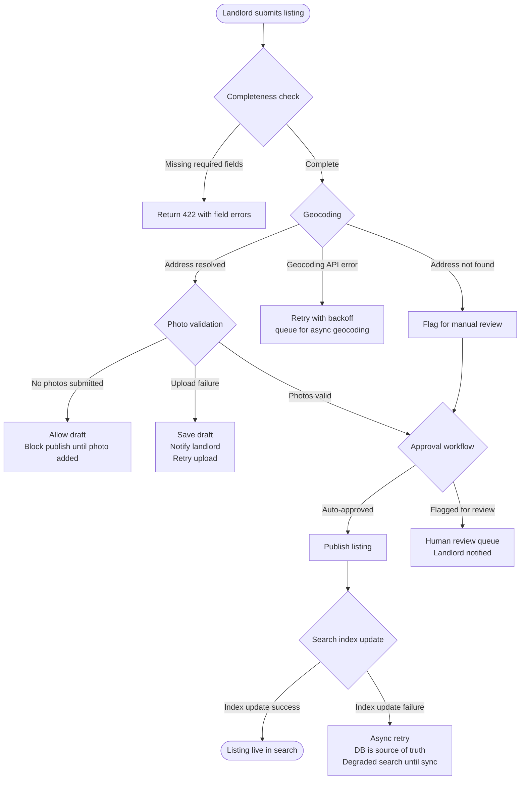

# Property Listings — Edge Cases

## Overview

This file documents edge cases for the property listing creation, validation, geocoding, and search subsystems in the Real Estate Management System. A listing represents a rentable unit that has been made publicly available. Failures in this subsystem affect landlord revenue (unit stays vacant longer), search accuracy (tenants see incorrect availability), and legal compliance (rent control violations).

---

---

## EC-01: Landlord Submits Listing with Invalid or Unverifiable Address

**Failure Mode**: The landlord enters a malformed or entirely fictitious address (e.g., "123 Fake Street, Springfield") that the Google Maps Geocoding API cannot resolve to a verified location. Alternatively, the API returns a low-confidence result or a result that matches to the wrong state.

**Impact**: If published without verification, the unit will appear at the wrong map coordinates, degrading search results and causing tenant confusion. Tenants searching by radius from a landmark will not find the unit, or will find it at a location far from the actual property.

**Detection**:
- Geocoding API returns `ZERO_RESULTS` status
- Geocoding API returns a result with `geometry.location_type` of `APPROXIMATE` when `ROOFTOP` is expected for a residential address
- Confidence score falls below the configured threshold (`GEOCODING_MIN_CONFIDENCE=0.8`)
- Monitoring alert: `geocoding_failure_rate` gauge rises above 5% over a 10-minute window

**Mitigation**:
- Do not block listing creation; allow the landlord to save a draft
- If geocoding fails after 3 retries, move the listing to a `pending_geocoding_review` state
- Route the listing to the manual review queue with the original address and the geocoding error details
- Send the landlord an in-app and email notification explaining that the address could not be verified and prompting them to correct it
- Allow address normalization: suggest the nearest verified address from the USPS Address Validation API before returning an error

**Recovery**:
- A property manager or admin can manually confirm coordinates for a listing in the `pending_geocoding_review` state via the admin portal
- Once coordinates are confirmed, the listing transitions normally through the approval workflow
- If the landlord provides a corrected address, the geocoding step is re-triggered automatically

**Prevention**:
- Validate address format on the frontend using the Google Places Autocomplete API, which ensures only recognized addresses are submitted
- Require the landlord to confirm the pin on a map before submitting, making coordinate mismatch visible before save

---

## EC-02: Duplicate Listing Created for the Same Unit

**Failure Mode**: A landlord submits a listing creation request twice — due to double-clicking, a network retry, or a frontend bug — resulting in two active listings for the same `unit_id`. Alternatively, a landlord manually creates a second listing without realizing one already exists.

**Impact**: Tenants may apply to both listings for the same unit. Landlords receive duplicate applications. Search results show the unit twice with potentially different prices or availability dates, creating confusion and eroding trust in the platform.

**Detection**:
- Unique constraint on `(unit_id, status)` where `status IN ('draft', 'active')` — a database-level duplicate raises an error
- Listing creation API checks for an existing non-expired listing for the same `unit_id` before inserting
- Monitoring: `duplicate_listing_attempt_count` counter alert if > 10 per hour

**Mitigation**:
- The `POST /listings` API enforces idempotency via the `Idempotency-Key` header. If the same key is submitted twice within 24 hours, the second request returns the original response without creating a new record.
- Before inserting a new listing, the service queries `SELECT id FROM listings WHERE unit_id = $1 AND status NOT IN ('expired', 'archived')` and returns a `409 Conflict` with the ID of the existing listing if one is found.
- Frontend disables the submit button and shows a spinner until the API responds to prevent double submission.

**Recovery**:
- If duplicates are detected in production, run the deduplication job: `npm run jobs:deduplicate-listings`
- The job retains the listing with the earlier `created_at` and archives the duplicate, notifying the landlord of the action taken
- Any applications submitted against the archived listing are migrated to the canonical listing

**Prevention**:
- Add a unique partial index on `unit_id` for active/draft listings at the database level
- Include a `unit_id` check in the listing creation domain service, with a specific `DUPLICATE_LISTING` error code for clear client handling

---

## EC-03: Listing Goes Live But Unit Is Still Occupied

**Failure Mode**: A landlord publishes a listing with an `available_from` date that is before the current tenant's lease end date. The unit is listed as available but is legally occupied, and tenants may attempt to schedule viewings or sign leases for a unit that cannot be vacated in time.

**Impact**: Landlord faces legal liability if a new tenancy is signed that overlaps with an existing lease. Tenant experience is damaged if they discover the overlap after submitting an application. Possible wrongful eviction risk.

**Detection**:
- On publish, the listing service queries: `SELECT end_date FROM leases WHERE unit_id = $1 AND status = 'active'`
- If `listing.available_from < lease.end_date`, publish is blocked with a `UNIT_OCCUPIED` error
- Nightly reconciliation job: `npm run jobs:audit-listing-availability` cross-checks all live listings against active leases

**Mitigation**:
- Block the publish action and return a clear error message: "This unit has an active lease ending on {date}. Set the available date to {lease_end_date + 1} or later."
- If the landlord has already been granted an exception (tenant gave early notice but lease hasn't formally ended), allow a manager override with a mandatory audit log entry
- Show a warning on the listing preview step in the landlord portal before the landlord submits for publish

**Recovery**:
- If a listing goes live with an occupied unit (e.g., due to a race condition between lease creation and listing publish), the reconciliation job archives the listing automatically and sends a notification to the landlord
- Any pending applications for the affected listing are put on hold with a tenant notification

**Prevention**:
- Apply a database check constraint in the listing publish trigger
- Run the reconciliation job nightly and on every lease status change via an event-driven update

---

## EC-04: Photos Fail to Upload Mid-Listing

**Failure Mode**: A landlord is mid-way through uploading photos when the S3/MinIO upload fails — due to a network interruption, an S3 service degradation, or a file size/format validation failure. The landlord loses their progress and the listing is left in an incomplete state.

**Impact**: Landlord frustration and support tickets. If the landlord abandons the listing, the unit stays vacant longer. If the listing is published without photos, it will perform significantly worse in search rankings and tenant engagement.

**Detection**:
- S3 `PutObject` operation returns a 5xx error or times out after 30 seconds
- The frontend upload progress bar stalls and the upload SDK emits an error event
- Monitoring: `photo_upload_failure_rate` gauge alert

**Mitigation**:
- Use multipart upload for all photos larger than 5 MB so partial uploads can be resumed
- Implement client-side retry: on network error, retry up to 3 times with exponential backoff before showing an error to the user
- Preserve the draft state: all successfully uploaded photos are associated with the listing draft immediately, so only the failed files need to be re-uploaded
- Use presigned S3 upload URLs that are valid for 1 hour, reducing the server's involvement in the upload path and eliminating server-side upload timeouts

**Recovery**:
- Notify the landlord via in-app message: "Photo upload failed. Your draft has been saved. Click here to resume uploading."
- List only the failed file names so the landlord knows exactly what to re-upload
- Store upload progress metadata in Redis so the frontend can resume a session from where it left off, even after a page refresh

**Prevention**:
- Validate file type (JPEG, PNG, HEIC only), dimensions (minimum 800×600), and size (maximum 20 MB) before initiating upload
- Test S3 upload flow in CI using MinIO, ensuring retry logic is covered by integration tests

---

## EC-05: Search Index Becomes Stale After Bulk Property Update

**Failure Mode**: A landlord or admin performs a bulk update to many listings (e.g., updating rent amounts for 50 units across a portfolio due to a lease cycle), and the OpenSearch index is not updated synchronously. Tenants searching the platform see stale rent amounts and availability.

**Impact**: Tenants apply for units with outdated rent prices, leading to disputes or withdrawn offers. Search result inaccuracy erodes trust.

**Detection**:
- `search_index_lag_seconds` Prometheus gauge exceeds the alert threshold (300 seconds)
- Canary query: after every bulk update, sample 5 random listings and compare their OpenSearch document to the PostgreSQL record; alert on mismatch
- Listing view page always reads from PostgreSQL (source of truth) and shows a discrepancy warning if it differs from the search result that led the user there

**Mitigation**:
- For bulk updates > 10 listings, route to a background re-index job instead of synchronous index updates
- Display an informational banner on search results: "Availability data last updated X minutes ago"
- The listing detail page always reflects the database state, so tenants acting on a listing always see accurate data even if the search index is stale

**Recovery**:
- Trigger manual re-index: `npm run jobs:reindex-listings --since=<timestamp>`
- The job reads all listings updated since the given timestamp and re-indexes them in batches of 100 using the OpenSearch bulk API
- Monitor `search_index_lag_seconds` until it returns to < 30 seconds

**Prevention**:
- Use event-sourcing: every `listing.updated` domain event triggers an index update message on the Redis queue; the index worker processes messages in order
- Implement a scheduled full re-index every 24 hours as a consistency safety net

---

## EC-06: Rent Control Validation Fails After Jurisdiction Data Update

**Failure Mode**: A city updates its rent control ordinance (e.g., lowers the maximum allowable annual rent increase for a jurisdiction), and the REMS jurisdiction data feed is updated. Listings already live with rent amounts that now exceed the legal cap are retroactively non-compliant.

**Impact**: Landlords face potential regulatory fines or tenant disputes if non-compliant rent amounts are collected. REMS faces reputational risk for facilitating illegal listings.

**Detection**:
- Jurisdiction data sync job (`npm run jobs:sync-jurisdictions`) compares updated rent caps to all active listing rent amounts
- Any listing where `rent_amount > jurisdiction.max_rent` is flagged automatically
- Monitoring alert: `rent_control_violation_count` gauge > 0 triggers P2 alert

**Mitigation**:
- Flag affected listings as `rent_control_review` immediately on jurisdiction update — do not unpublish, but add a compliance warning visible only to the landlord and property managers
- Send the landlord an email with the new cap, the current listed rent, and the deadline to remedy (typically 30-day grace period per jurisdiction)
- Prevent new lease creation on flagged listings until the landlord updates the rent amount or provides a documented exemption

**Recovery**:
- Once the landlord updates the rent amount to comply, remove the `rent_control_review` flag and update the listing
- If the landlord does not remedy within the grace period, automatically suspend the listing and notify the landlord with a link to the jurisdiction's rent board

**Prevention**:
- Validate rent control compliance at listing publish time and at every rent amount update, not just during jurisdiction data syncs
- Include jurisdiction-specific rent cap information in the landlord portal's listing form so landlords can see the cap before entering a price
