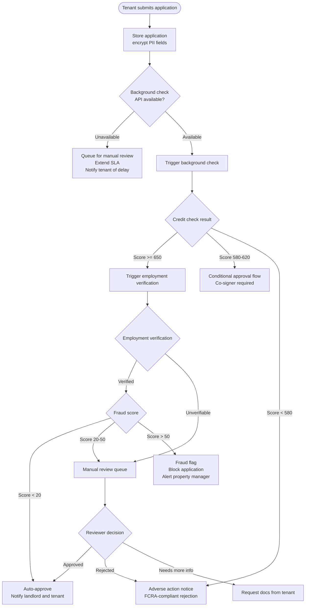

# Tenant Management — Edge Cases

## Overview

This file documents edge cases for tenant screening, application management, onboarding, and PII management within the Real Estate Management System. Tenant management intersects with the Fair Housing Act, the Fair Credit Reporting Act (FCRA), and GDPR/CCPA, making failures here both operationally disruptive and legally consequential. Every decision in the tenant screening workflow must be defensible, auditable, and consistent.

---

---

## EC-01: Background Check Provider API Is Unavailable

**Failure Mode**: The third-party background check provider (e.g., TransUnion SmartMove, Checkr) returns 5xx errors or is unresponsive due to a planned maintenance window or an unplanned outage. The screening workflow cannot progress automatically.

**Impact**: Tenant applications are stuck in `pending_screening` state. Landlords cannot make leasing decisions. If multiple properties are affected simultaneously, the platform appears broken and support volume spikes. Extended delays risk losing qualified tenants to competing properties.

**Detection**:
- Background check API client throws a connection timeout or receives a 5xx response after 3 retries with exponential backoff
- Circuit breaker on the screening service opens after 5 consecutive failures within 60 seconds
- `background_check_api_error_rate` Prometheus gauge exceeds 10%; triggers P2 alert
- Dead-letter queue depth for `screening.requested` events rises above 50

**Mitigation**:
- When the circuit breaker is open, route all new applications to the **manual review queue** instead of attempting API calls
- Extend the screening SLA from the standard 24 hours to 72 hours automatically and update the tenant-facing status message
- Send an automated email to the tenant: "Your application is under review. Due to a processing delay, results may take up to 72 hours."
- Notify property managers of affected applications in the owner portal with a "Manual Review Required" badge

**Recovery**:
- When the circuit breaker closes (background check API recovers), process queued applications in order of submission time, not priority
- Run: `npm run jobs:reprocess-screening-queue` to drain the dead-letter queue
- Update tenant and landlord on status change once results are available
- Review all manual review decisions made during the outage for consistency once automated screening resumes

**Prevention**:
- Contract with a secondary background check provider as a hot standby; configure provider failover in the screening service
- Test circuit breaker behavior in staging using the chaos engineering toolkit (`npm run chaos:screening-api-down`)
- Include background check API availability in the monitoring dashboard with a dedicated Grafana panel

---

## EC-02: Tenant Submits Application with Fraudulent Income Documents

**Failure Mode**: A tenant uploads falsified pay stubs, fabricated bank statements, or a doctored employment letter. The document appears legitimate to visual inspection but contains manipulated figures that do not match the employer's actual payroll records.

**Impact**: A tenant is approved for a unit they cannot afford. The landlord faces rent arrears, potential eviction proceedings (costly and time-consuming), and property damage if the tenant defaults and disputes the eviction. Legal liability exposure for REMS if the fraud detection system is demonstrably inadequate.

**Detection**:
- The document verification service (e.g., Persona, Plaid Income) analyzes uploaded documents for:
  - Metadata anomalies (PDF created in Photoshop, font inconsistencies)
  - Income figures inconsistent with stated employer's publicly available pay scales
  - Bank statement balance trajectory inconsistent with stated income
- A composite **fraud score** (0–100) is computed per application; scores > 50 block automated approval
- Unusual pattern: income documents from tenant closely match formatting of documents previously flagged for fraud (document hash similarity check)

**Mitigation**:
- Applications with fraud score > 50 are quarantined in the fraud review queue; they cannot be approved automatically
- Property manager is notified immediately with a summary of the anomalies detected
- The tenant is not informed that fraud was detected; they receive a generic "your application requires additional review" message to prevent tip-off
- Optional: request additional verification directly from the employer using the employer's HR contact on file

**Recovery**:
- If fraud is confirmed by the human reviewer, reject the application with an FCRA-compliant adverse action notice (the notice references the information used, as required by law, even if the specific fraud flag is not disclosed)
- Document the fraud indicators in the audit log for potential use in civil or criminal proceedings
- If the tenant disputes the decision (see EC-05), the appeal reviewer has access to the full fraud analysis

**Prevention**:
- Use Plaid Income or similar bank-linked income verification as the primary income check to reduce reliance on uploaded documents
- Implement document hash deduplication: if the same document is submitted across multiple applications on the platform (different tenants), flag for review
- Train property managers on recognizing common document fraud patterns

---

## EC-03: Tenant Has Multiple Active Applications Across Properties

**Failure Mode**: A tenant submits applications to multiple units simultaneously. This is common and legal, but it creates management complexity: landlords may incur background check costs for a tenant who ultimately signs with a competitor, and if two landlords simultaneously approve the same tenant, one approval is wasted.

**Impact**: Landlords pay for background checks on tenants who will not sign their lease. If a landlord holds a unit off-market for an applicant who accepts elsewhere, the unit sits vacant longer. If the platform's policy is to restrict multiple applications and that restriction is not enforced, tenant expectations are violated.

**Detection**:
- Query: `SELECT COUNT(*) FROM applications WHERE tenant_id = $1 AND status IN ('pending', 'approved')` on each application submission
- If count > 1, the system flags the applicant as having concurrent active applications
- Landlords can opt in to see a "competing applications" indicator on the applicant's profile

**Mitigation**:
- REMS policy (configurable per landlord): allow up to 3 concurrent active applications per tenant
- If the tenant's active application count equals the configured limit, display a warning to the tenant before allowing a new submission
- Landlords who have opted in to compete-visibility can see a count of other active applications on the tenant's profile page (but not which properties)
- Background check cost is charged per application; the tenant and landlord share this cost as configured in the landlord's billing settings

**Recovery**:
- When a tenant accepts one offer, their remaining pending applications should be automatically withdrawn with a notification: "This applicant has accepted another tenancy."
- If the tenant fails to respond within the offer-acceptance window, the application expires automatically
- Background check charges for withdrawn applications are not refunded (as screening work was already performed); this is disclosed in the tenant application terms

**Prevention**:
- Display the tenant's active application count on the application form so they are aware before submitting
- Send tenants a weekly digest of their active applications to encourage them to withdraw applications they are no longer pursuing
- Enforce the concurrency limit at the API level, not just the UI

---

## EC-04: Background Check Returns Borderline Credit Score

**Failure Mode**: The background check returns a credit score in the borderline range (580–620 for the configured thresholds). This range is neither a clear approval nor a clear rejection, and automatic handling is error-prone — over-approving risks non-payment; over-rejecting risks Fair Housing Act complaints if the policy is applied inconsistently.

**Impact**: Inconsistent handling of borderline applications exposes the platform to Fair Housing Act challenges (applicants in protected classes could claim discriminatory outcomes if human reviewers apply different standards). Incorrect auto-rejection of a creditworthy tenant damages the platform's reputation with tenants.

**Detection**:
- Screening service detects credit score in the `BORDERLINE` band (580–620) and routes to the `conditional_approval` workflow
- Monitoring: `conditional_approval_queue_depth` gauge; alert if > 20 applications pending > 48 hours

**Mitigation**:
- Route all borderline applications to a structured **conditional approval workflow**:
  1. Landlord is notified that the applicant is in the conditional band
  2. Landlord is offered a standardized menu of conditions: co-signer required, higher security deposit (if permitted by jurisdiction), or pre-paid first+last month
  3. Landlord must select a condition from the menu (no free-text to reduce inconsistency risk)
  4. Tenant is notified of the condition and given 5 business days to respond
- All conditional approval decisions are logged with the landlord ID and the condition applied for FHA audit trail purposes

**Recovery**:
- If the tenant provides a co-signer, the co-signer's details are screened using the same background check flow
- If the tenant cannot meet the condition within 5 business days, the application is rejected with a standard FCRA adverse action notice
- Landlords who do not respond to the conditional approval prompt within 3 business days have the application auto-escalated to their property manager

**Prevention**:
- Use a clear, written, consistently applied screening criteria document that landlords must acknowledge before using the platform
- Log the screening criteria version applied to each decision; if criteria change, existing pending applications are evaluated under the criteria version in effect at submission time
- Quarterly audit of borderline application outcomes by risk and compliance team to detect potential Fair Housing Act patterns

---

## EC-05: Tenant Disputes a Rejection Decision

**Failure Mode**: A tenant receives an adverse action notice and believes the rejection was based on inaccurate information, discriminatory reasoning, or a violation of Fair Housing Act protected class protections (race, color, national origin, religion, sex, familial status, disability).

**Impact**: Regulatory investigation by HUD or state housing authorities. Civil litigation. Reputational damage to both the landlord and the REMS platform. Potential platform-level liability if REMS facilitated discriminatory screening or failed to provide adequate process.

**Detection**:
- Tenant submits a dispute via the application portal within 60 days of the adverse action notice
- High volume of disputes from a single landlord or screening criteria set triggers an automated compliance alert

**Mitigation**:
- On rejection, always issue an FCRA-compliant adverse action notice disclosing:
  - The decision
  - The consumer reporting agency (CRA) used and its contact details
  - The tenant's right to a free copy of their report within 60 days
  - The tenant's right to dispute the accuracy of the report with the CRA
- All rejection reason codes are drawn from a pre-approved list; free-text reasons are not permitted
- Disputed decisions are reviewed by a designated compliance reviewer (not the original decision-maker) within 5 business days

**Recovery**:
- If the dispute is upheld (e.g., the credit score used was based on an error in the CRA's data), rescind the rejection and re-run screening with corrected data
- If the dispute is rejected, send the tenant a written explanation of the grounds for upholding the decision
- Retain all dispute documentation for a minimum of 5 years per FCRA and Fair Housing Act recordkeeping requirements

**Prevention**:
- Apply screening criteria uniformly; use REMS's rule engine (not landlord free-form criteria) for all screening decisions
- Conduct regular Fair Housing Act training for property managers
- Use an automated FHA compliance checker to scan screening criteria before they are activated

---

## EC-06: Tenant Profile Contains Incorrect PII, Discovered After Lease Signing

**Failure Mode**: After a lease is signed, it is discovered that the tenant's profile contains incorrect PII — for example, a misspelled legal name, an incorrect date of birth, or a wrong Social Security Number. The error may have originated from a typo at application time or from a data entry error during document verification.

**Impact**: The signed lease uses an incorrect legal name, potentially making it unenforceable. A wrong SSN means the background check was run on a different person. A wrong DOB can create credit report mismatches. Correcting PII after lease signing requires a legal lease amendment and careful audit trail management.

**Detection**:
- Tenant contacts support reporting a mismatch between their government-issued ID and the name on their lease
- The background check result references a person with a different name or DOB than the tenant's stated identity, flagged by the screening service's identity match score
- Identity verification service (e.g., Persona) detects a discrepancy between the submitted ID document and the profile data

**Mitigation**:
- Immediately suspend lease-related actions (e.g., rent payment setup, key handover) pending PII correction
- Log the correction request with the original values and the requested corrections in the audit log
- Require supporting documentation (government-issued ID) to authorize any PII change on a signed lease
- Issue a lease amendment that references the original lease and corrects the legal name; both landlord and tenant must sign the amendment

**Recovery**:
- Update the tenant profile with verified correct PII after document review
- Re-run background check if the SSN or DOB was incorrect (the original check may have returned results for the wrong person)
- Amend the lease with the corrected legal name and re-execute digitally via DocuSign
- Notify all parties (landlord, property manager) of the correction and update all downstream records (payment setup, maintenance contact info)

**Prevention**:
- Perform identity verification at application submission time using a government-ID scan (Persona or equivalent)
- Display a confirmation step that shows the tenant their full legal name, DOB, and last 4 of SSN before submitting the application
- Store the verified-identity snapshot alongside the tenant profile with a `verified_at` timestamp so any subsequent modification is flagged as a change from a verified state
