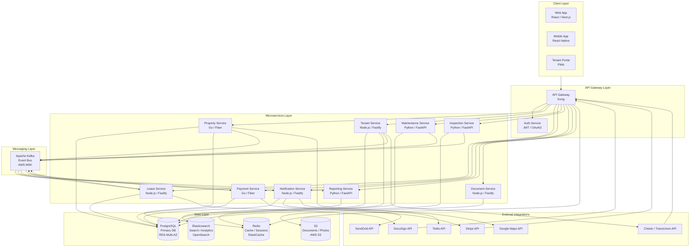

# Architecture Diagram — Real Estate Management System

## Architecture Overview

The Real Estate Management System (REMS) is built on a **microservices, event-driven, cloud-native** architecture deployed on AWS EKS. Each service owns its bounded context data store, communicates synchronously through REST/gRPC for request/response flows, and asynchronously through Apache Kafka for domain event propagation.

Key architectural principles:
- **Event sourcing** for all financial ledger entries — every credit and debit is an immutable append-only event.
- **CQRS** for the Reporting Service — a dedicated read model is built from domain events, enabling complex analytics queries without impacting the write path.
- **Async processing** for background and credit checks — screening is non-blocking; the Application Service subscribes to result events rather than polling.
- **API Gateway as the single entry point** — handles JWT validation, rate limiting, request routing, and TLS termination.
- **Zero-trust networking** — all inter-service communication uses mTLS; no service is directly accessible from the public internet except through the gateway.

---

## Architecture Diagram

---

## Technology Stack

| Service | Language | Framework | Database | Messaging | Notes |
|---|---|---|---|---|---|
| API Gateway | — | Kong (NGINX-based) | Redis (rate limit) | — | JWT validation, routing, rate limiting |
| Auth Service | Go | Fiber | PostgreSQL + Redis | — | OAuth2, JWT issuance, session management |
| Property Service | Go | Fiber | PostgreSQL | Kafka producer | Google Maps geocoding integration |
| Tenant Service | Node.js | Fastify | PostgreSQL | Kafka producer/consumer | Checkr webhook receiver |
| Lease Service | Node.js | Fastify | PostgreSQL | Kafka producer/consumer | DocuSign SDK integration |
| Payment Service | Go | Fiber | PostgreSQL | Kafka producer/consumer | Stripe SDK, event-sourced ledger |
| Maintenance Service | Python | FastAPI | PostgreSQL | Kafka producer | Background task queue with Celery |
| Inspection Service | Python | FastAPI | PostgreSQL | Kafka producer | PDF report generation with WeasyPrint |
| Notification Service | Node.js | Fastify | PostgreSQL | Kafka consumer | SendGrid + Twilio multi-channel delivery |
| Reporting Service | Python | FastAPI | OpenSearch / ES | Kafka consumer | CQRS read model, QuickSight integration |
| Document Service | Node.js | Fastify | S3 (no SQL) | — | PDF generation, pre-signed URL issuance |

---

## Key Architecture Decisions

### Event Sourcing — Financial Ledger
All financial events (`RentPaymentReceived`, `LateFeeAssessed`, `DepositCollected`, `DepositRefunded`) are stored as immutable events in the `financial_events` table before any balance or statement is computed. The current state of any account is derived by replaying its event stream. This provides a complete audit trail for accounting, dispute resolution, and regulatory compliance.

### CQRS — Reporting Service
The Reporting Service maintains a dedicated read model in OpenSearch. It subscribes to all relevant domain events (from Kafka) and maintains pre-aggregated projections:
- Occupancy rate per property (updated on `LeaseActivated` / `LeaseTerminated`)
- Monthly income summaries per owner (updated on `RentPaymentReceived`)
- Maintenance cost tracking per unit (updated on `MaintenanceCompleted`)

Complex reporting queries hit OpenSearch only — never the primary PostgreSQL databases — ensuring zero impact on transaction processing.

### Async Background Checks
When the Tenant Service receives an application, it dispatches screening requests to Checkr/TransUnion and returns immediately with status `SCREENING_IN_PROGRESS`. Checkr posts results to a webhook endpoint when ready. The Tenant Service handles the webhook, updates the application status, and publishes a `ScreeningCompleted` Kafka event. This prevents blocking the application HTTP response on potentially multi-minute external API calls.

### Circuit Breaker Pattern
All inter-service HTTP calls and external API calls (Stripe, DocuSign, Checkr) are wrapped with circuit breakers (Resilience4j / `pybreaker`) to prevent cascade failures. Payment Service maintains a local retry queue for failed Stripe charges, using exponential back-off.

### Multi-Tenancy
The system uses a **shared-database, schema-per-tenant** model. Each `company_id` maps to a PostgreSQL schema, providing data isolation with lower operational overhead than separate databases. The API Gateway injects the `company_id` claim from the JWT into every downstream request header.

---

## Service Communication Patterns

| Pattern | Used For | Technology |
|---|---|---|
| Sync REST | Client → Gateway → Services | HTTPS / Kong |
| Async Event | Service → Service domain events | Apache Kafka / AWS MSK |
| Sync gRPC | Auth Service → all services (token validation) | gRPC / TLS |
| Webhook (inbound) | Stripe, DocuSign, Checkr callbacks | HTTPS POST to Gateway |
| WebSocket | Real-time dashboard notifications | Socket.IO via Notification Service |
| Pre-signed URL | Document/photo uploads from client | AWS S3 Pre-signed URLs |

---

*Last updated: 2025 | Real Estate Management System v1.0*
