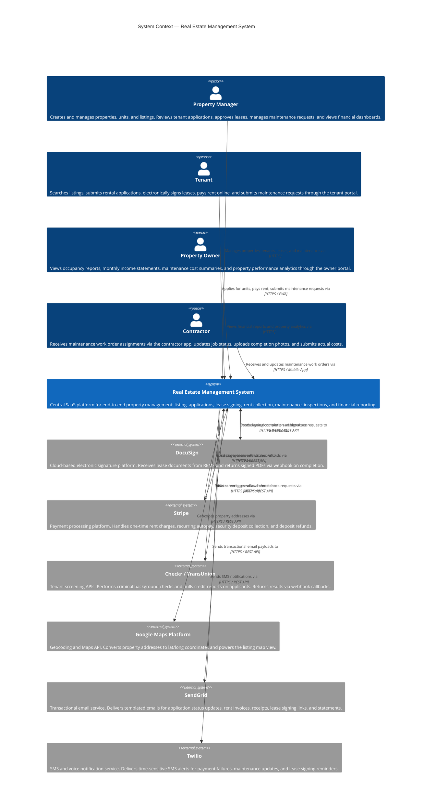

# C4 Architecture Diagrams — Real Estate Management System

This document provides the C4 model views at Level 1 (System Context) and Level 2 (Container) for the Real Estate Management System (REMS).

---

## C4 Level 1 — System Context Diagram

The system context diagram shows REMS as a single black box surrounded by its users and the external systems it depends on.

---

## C4 Level 2 — Container Diagram

The container diagram decomposes REMS into its deployable containers (applications, services, and data stores) and shows the key interactions between them and external systems.

```mermaid
C4Container
    title Container Diagram — Real Estate Management System

    Person(pm, "Property Manager", "Web browser or admin dashboard")
    Person(tenant, "Tenant", "Web browser or mobile app")
    Person(owner, "Owner", "Web browser")
    Person(contractor, "Contractor", "Mobile app")

    System_Ext(stripe, "Stripe", "Payment processing")
    System_Ext(docusign, "DocuSign", "E-signature")
    System_Ext(checkr, "Checkr/TU", "Tenant screening")
    System_Ext(sendgrid, "SendGrid", "Email delivery")
    System_Ext(twilio, "Twilio", "SMS delivery")

    System_Boundary(rems, "Real Estate Management System") {

        Container(web, "Web Application", "React / Next.js", "Property manager and owner-facing dashboard. Handles property management, lease workflows, maintenance oversight, and financial reporting views.")
        Container(pwa, "Tenant Portal", "React / PWA", "Progressive web app for tenants. Application submission, lease signing, rent payment, and maintenance request management.")
        Container(mobileapp, "Contractor Mobile App", "React Native", "Native mobile app for contractors. Work order acceptance, status updates, and photo upload on job completion.")

        Container(gateway, "API Gateway", "Kong", "Single HTTPS entry point. Handles JWT authentication, request routing, rate limiting, SSL termination, and webhook ingestion.")
        Container(authsvc, "Auth Service", "Go / Fiber", "Issues and validates JWT tokens. Manages user sessions, OAuth2 flows, role-based access control, and multi-tenant context injection.")

        Container(propertysvc, "Property Service", "Go / Fiber", "CRUD for Companies, Agencies, PropertyManagers, Properties, PropertyUnits, Floors, Amenities, Listings, and ListingPhotos. Geocodes addresses via Google Maps.")
        Container(tenantsvc, "Tenant Service", "Node.js / Fastify", "Manages Tenant profiles and TenantApplications. Orchestrates screening by calling Checkr/TransUnion and processing result webhooks.")
        Container(leasesvc, "Lease Service", "Node.js / Fastify", "Creates and manages Leases, LeaseClauses, RentSchedules, SecurityDeposits, LeaseRenewals, and LeaseTerminations. Integrates with DocuSign for signing.")
        Container(paymentsvc, "Payment Service", "Go / Fiber", "Manages RentInvoices, RentPayments, LateFees, DepositRefunds, and the financial Ledger. Processes charges and refunds via Stripe.")
        Container(maintsvc, "Maintenance Service", "Python / FastAPI", "Handles MaintenanceRequests, MaintenanceAssignments, and Contractors. Manages the full work order lifecycle.")
        Container(inspectsvc, "Inspection Service", "Python / FastAPI", "Schedules and records property Inspections and InspectionItems. Generates PDF inspection reports.")
        Container(notifysvc, "Notification Service", "Node.js / Fastify", "Consumes domain events from Kafka and delivers multi-channel notifications via SendGrid (email) and Twilio (SMS). Manages notification templates and delivery logs.")
        Container(reportsvc, "Reporting Service", "Python / FastAPI", "CQRS read model. Consumes events from Kafka and maintains pre-aggregated projections in OpenSearch. Serves owner statements, occupancy dashboards, and KPI reports.")
        Container(docsvc, "Document Service", "Node.js / Fastify", "Generates PDF documents (leases, inspection reports, owner statements). Stores and retrieves files via AWS S3. Issues pre-signed upload URLs.")

        ContainerDb(pgdb, "PostgreSQL", "AWS RDS PostgreSQL Multi-AZ", "Primary relational data store. Each bounded context owns its schema (schema-per-tenant multi-tenancy). Stores all transactional data.")
        ContainerDb(redis, "Redis Cache", "AWS ElastiCache Redis Cluster", "Session tokens, rate-limit counters, API response caches, and distributed locks.")
        ContainerDb(kafka, "Apache Kafka", "AWS MSK — 3 brokers", "Durable event bus for asynchronous domain event propagation between microservices. Topics per bounded context.")
        ContainerDb(s3, "AWS S3", "AWS S3 + CloudFront", "Object storage for lease PDFs, inspection reports, listing photos, maintenance photos, and owner statement PDFs.")
        ContainerDb(opensearch, "OpenSearch", "AWS OpenSearch Service", "Reporting read model. Stores pre-aggregated occupancy, financial, and maintenance projections consumed by the Reporting Service.")
    }

    Rel(pm, web, "Uses", "HTTPS")
    Rel(owner, web, "Uses", "HTTPS")
    Rel(tenant, pwa, "Uses", "HTTPS / PWA")
    Rel(contractor, mobileapp, "Uses", "HTTPS / Mobile")

    Rel(web, gateway, "API calls", "HTTPS / JSON")
    Rel(pwa, gateway, "API calls", "HTTPS / JSON")
    Rel(mobileapp, gateway, "API calls", "HTTPS / JSON")

    Rel(gateway, authsvc, "Validates tokens via", "gRPC")
    Rel(gateway, propertysvc, "Routes property requests to", "HTTP")
    Rel(gateway, tenantsvc, "Routes tenant requests to", "HTTP")
    Rel(gateway, leasesvc, "Routes lease requests to", "HTTP")
    Rel(gateway, paymentsvc, "Routes payment requests to", "HTTP")
    Rel(gateway, maintsvc, "Routes maintenance requests to", "HTTP")
    Rel(gateway, inspectsvc, "Routes inspection requests to", "HTTP")
    Rel(gateway, reportsvc, "Routes reporting requests to", "HTTP")
    Rel(gateway, docsvc, "Routes document requests to", "HTTP")

    Rel(propertysvc, pgdb, "Reads/writes property data", "SQL / TLS")
    Rel(tenantsvc, pgdb, "Reads/writes tenant data", "SQL / TLS")
    Rel(leasesvc, pgdb, "Reads/writes lease data", "SQL / TLS")
    Rel(paymentsvc, pgdb, "Reads/writes financial data", "SQL / TLS")
    Rel(maintsvc, pgdb, "Reads/writes maintenance data", "SQL / TLS")
    Rel(inspectsvc, pgdb, "Reads/writes inspection data", "SQL / TLS")
    Rel(authsvc, pgdb, "Reads/writes auth data", "SQL / TLS")

    Rel(gateway, redis, "Caches sessions and rate limits in", "Redis Protocol / TLS")
    Rel(propertysvc, redis, "Caches property listings in", "Redis Protocol / TLS")

    Rel(propertysvc, kafka, "Publishes UnitListed, PropertyUpdated", "Kafka / TLS")
    Rel(tenantsvc, kafka, "Publishes ApplicationApproved/Rejected", "Kafka / TLS")
    Rel(leasesvc, kafka, "Publishes LeaseActivated, LeaseTerminated", "Kafka / TLS")
    Rel(paymentsvc, kafka, "Publishes RentPaymentReceived, LateFeeAssessed", "Kafka / TLS")
    Rel(maintsvc, kafka, "Publishes MaintenanceCompleted", "Kafka / TLS")

    Rel(kafka, notifysvc, "Delivers all notification events to", "Kafka / TLS")
    Rel(kafka, reportsvc, "Delivers all domain events for projection", "Kafka / TLS")

    Rel(notifysvc, sendgrid, "Sends emails via", "HTTPS")
    Rel(notifysvc, twilio, "Sends SMS via", "HTTPS")
    Rel(leasesvc, docusign, "Sends lease docs for signing via", "HTTPS")
    Rel(paymentsvc, stripe, "Processes payments via", "HTTPS")
    Rel(tenantsvc, checkr, "Requests tenant screening via", "HTTPS")
    Rel(docsvc, s3, "Stores and retrieves documents from", "HTTPS / AWS SDK")
    Rel(reportsvc, opensearch, "Reads/writes projections to", "HTTPS / REST")
```

---

## Container Responsibilities Summary

| Container | Owns | Key Integration |
|---|---|---|
| Web App | UI for PM and Owner | API Gateway |
| Tenant Portal PWA | UI for Tenant | API Gateway |
| Contractor Mobile | UI for Contractor | API Gateway |
| API Gateway | Routing, Auth, Rate Limiting | All services + Redis |
| Auth Service | JWT tokens, RBAC, sessions | PostgreSQL, Redis |
| Property Service | Properties, Units, Listings | PostgreSQL, Redis, Kafka, Google Maps |
| Tenant Service | Tenants, Applications, Screening | PostgreSQL, Kafka, Checkr |
| Lease Service | Leases, Clauses, Deposits | PostgreSQL, Kafka, DocuSign |
| Payment Service | Invoices, Payments, Ledger | PostgreSQL, Kafka, Stripe |
| Maintenance Service | Requests, Assignments | PostgreSQL, Kafka |
| Inspection Service | Inspections, Items, Reports | PostgreSQL, Kafka, Document Service |
| Notification Service | Email/SMS delivery | Kafka, SendGrid, Twilio |
| Reporting Service | Analytics read model | Kafka, OpenSearch |
| Document Service | PDF generation, file storage | S3 |
| PostgreSQL | All transactional data | — |
| Redis | Cache, sessions, locks | — |
| Kafka | Event bus | — |
| S3 | Binary object storage | CloudFront CDN |
| OpenSearch | Analytics projections | — |

---

*Last updated: 2025 | Real Estate Management System v1.0*
