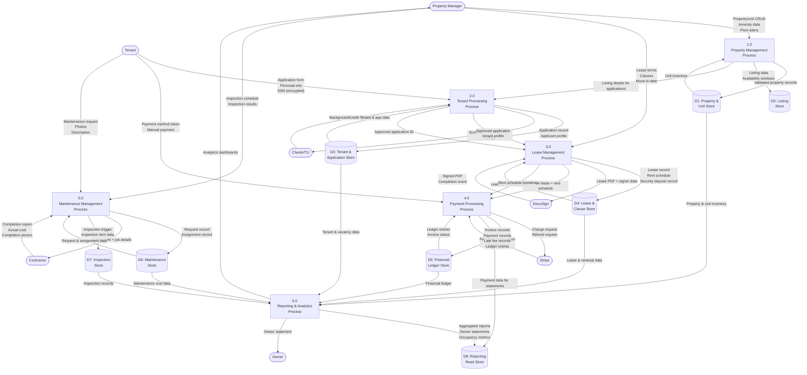

# Data Flow Diagrams — Real Estate Management System

This document presents the data flow architecture of the Real Estate Management System (REMS) at two levels of abstraction: Level 0 (context/black-box view) and Level 1 (decomposed internal processes).

---

## Level 0 — Context Data Flow Diagram

The Level 0 DFD treats REMS as a single system and shows all external actors, the data they send into the system, and the data the system returns to them or to external services.

```mermaid
flowchart TB
    PM([Property Manager])
    TENANT([Tenant])
    OWNER([Property Owner])
    CONTRACTOR([Contractor])
    STRIPE([Stripe\nPayment Gateway])
    DOCUSIGN([DocuSign\nE-Signature])
    CHECKR([Checkr / TransUnion\nScreening API])
    GMAPS([Google Maps\nGeocoding API])
    SENDGRID([SendGrid\nEmail Service])
    TWILIO([Twilio\nSMS Service])
    S3([AWS S3\nDocument Storage])

    REMS[["Real Estate\nManagement System"]]

    PM -- "Property/unit data\nTenant approvals\nMaintenance decisions\nInspection reports" --> REMS
    REMS -- "Dashboards & reports\nOccupancy analytics\nAlert notifications" --> PM

    TENANT -- "Rental applications\nRent payments\nMaintenance requests\nLease signatures" --> REMS
    REMS -- "Application status\nSigned lease PDFs\nPayment receipts\nRequest updates" --> TENANT

    OWNER -- "Property ownership info\nFinancial queries" --> REMS
    REMS -- "Owner statements\nOccupancy & income reports\nMaintenance cost summaries" --> OWNER

    CONTRACTOR -- "Work order acceptance\nJob completion reports\nCompletion photos" --> REMS
    REMS -- "Work assignments\nJob details & access info\nPayment instructions" --> CONTRACTOR

    REMS -- "Charge/refund requests\nPayment method tokens" --> STRIPE
    STRIPE -- "Payment confirmations\nWebhook events\nDecline codes" --> REMS

    REMS -- "Lease document + signer info\nSignature requests" --> DOCUSIGN
    DOCUSIGN -- "Signed PDF\nSignature completion webhook" --> REMS

    REMS -- "SSN + personal info\nScreening requests" --> CHECKR
    CHECKR -- "Background check result\nCredit score report\nWebhook callbacks" --> REMS

    REMS -- "Street address\nGeocoding requests" --> GMAPS
    GMAPS -- "Latitude/longitude\nFormatted address" --> REMS

    REMS -- "Email payload\nTemplate + recipient" --> SENDGRID
    SENDGRID -- "Delivery status\nBounce/open events" --> REMS

    REMS -- "SMS message\nRecipient phone number" --> TWILIO
    TWILIO -- "Delivery receipts\nError callbacks" --> REMS

    REMS -- "Document uploads\nPhoto storage requests" --> S3
    S3 -- "Pre-signed URLs\nStorage confirmations" --> REMS
```

---

## Level 1 — Functional Data Flow Diagram

The Level 1 DFD decomposes REMS into its six major internal processes and shows how data flows between them, the external actors, and the primary data stores.

---

## Key Data Entities by Process

| Process | Primary Input Data | Primary Output Data | Data Stores Used |
|---|---|---|---|
| 1.0 Property Management | Property details, unit specs, floor plans, amenity lists | Property records, listings, geocoded addresses | D1, D2 |
| 2.0 Tenant Processing | Application forms, SSNs, income docs, employer refs | Approved/rejected applications, screening reports | D2, D3 |
| 3.0 Lease Management | Approved applications, lease terms, signed PDFs | Active leases, rent schedules, signed documents | D3, D4 |
| 4.0 Payment Processing | Stripe webhooks, rent schedules, manual payments | Invoices, receipts, ledger entries, late fees | D4, D5 |
| 5.0 Maintenance Mgmt | Maintenance requests, contractor updates, inspection forms | Work orders, assignment records, inspection reports | D6, D7 |
| 6.0 Reporting & Analytics | All domain data stores | Owner statements, occupancy dashboards, KPI reports | D1–D7 → D8 |

---

## Data Classification

| Data Category | Sensitivity | Storage | Encryption |
|---|---|---|---|
| SSN / National ID | PII — High | PostgreSQL (encrypted column) | AES-256 at field level |
| Credit scores | PII — High | PostgreSQL | AES-256 at field level |
| Bank / card tokens | PCI-DSS | Stripe Vault only (not stored locally) | Tokenised |
| Lease PDF documents | Confidential | AWS S3 (private bucket) | S3 SSE-KMS |
| Property photos / listings | Public | AWS S3 (public-read bucket via CDN) | S3 SSE-S3 |
| Ledger / financial entries | Confidential | PostgreSQL | TLS in transit, AES-256 at rest |
| Maintenance photos | Internal | AWS S3 (private bucket) | S3 SSE-KMS |
| Email / phone | PII — Medium | PostgreSQL | TLS in transit |

---

*Last updated: 2025 | Real Estate Management System v1.0*
