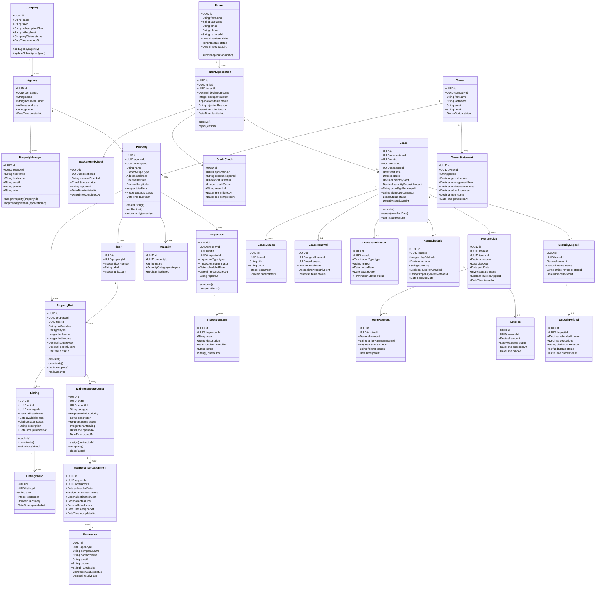

# Domain Model — Real Estate Management System

## Overview

The Real Estate Management System (REMS) is decomposed into six bounded contexts, each owning its data and communicating with other contexts through domain events published on Apache Kafka. This separation enforces clear ownership, independent deployability, and loose coupling.

---

## Bounded Contexts

### 1. Property Management Context
Owns the physical asset hierarchy — companies, agencies, property managers, properties, units, floors, amenities, listings, and listing photos. Responsible for all lifecycle transitions of a unit (vacant → listed → occupied → under-maintenance). Publishes events like `UnitListed`, `UnitActivated`, `ListingPublished`.

### 2. Tenant Management Context
Owns tenant profiles, applications, and screening results. Orchestrates the application pipeline: intake → background check → credit check → approval/rejection. Subscribes to `BackgroundCheckCompleted` and `CreditCheckCompleted` events from third-party webhooks. Publishes `ApplicationApproved`, `ApplicationRejected`, `TenantProfileCreated`.

### 3. Lease Management Context
Owns the entire lease lifecycle — creation, signing, renewal, and termination. Integrates with DocuSign for electronic signatures and the Document Service for PDF generation. Manages clauses, rent schedules, security deposits, and deposit refunds. Publishes `LeaseActivated`, `LeaseExpiringSoon`, `LeaseRenewed`, `LeaseTerminated`.

### 4. Financial Operations Context
Owns all financial records — rent invoices, payments, late fees, ledger entries, and owner statements. Subscribes to `LeaseActivated` to bootstrap the rent schedule, and to Stripe webhooks for payment confirmation. Uses event sourcing for the financial ledger to maintain a complete immutable audit trail. Publishes `RentInvoiceIssued`, `RentPaymentReceived`, `LateFeeAssessed`, `OwnerStatementGenerated`.

### 5. Maintenance & Inspections Context
Owns maintenance requests, assignments, contractors, inspections, and inspection items. Independent of the lease context — a property can have maintenance work regardless of tenancy status. Subscribes to `LeaseTerminated` to trigger a move-out inspection. Publishes `MaintenanceRequestCreated`, `MaintenanceCompleted`, `InspectionScheduled`, `InspectionCompleted`.

### 6. Owner Portal Context
A read-optimised projection context (CQRS read side) that aggregates data from all other contexts into owner-friendly views: occupancy rates, income statements, maintenance cost summaries, and unit performance metrics. Subscribes to financial and maintenance events to keep its materialized views current. Publishes `OwnerStatementReady`.

---

## Domain Class Diagram

---

## Domain Event Flows Between Bounded Contexts

| Event | Producer Context | Consumer Context(s) | Purpose |
|---|---|---|---|
| `UnitListed` | Property Management | Tenant Management | Enable unit to appear in application flow |
| `ApplicationApproved` | Tenant Management | Lease Management | Trigger lease generation |
| `LeaseActivated` | Lease Management | Financial Operations | Bootstrap rent schedule + deposit collection |
| `LeaseTerminated` | Lease Management | Financial Operations, Maintenance | Stop rent schedule; trigger move-out inspection |
| `RentInvoiceIssued` | Financial Operations | Notification Service | Send invoice email/SMS to tenant |
| `RentPaymentReceived` | Financial Operations | Owner Portal | Update income projections |
| `LateFeeAssessed` | Financial Operations | Notification Service | Alert tenant to outstanding late fee |
| `MaintenanceCompleted` | Maintenance | Financial Operations | Record maintenance cost against property |
| `InspectionCompleted` | Maintenance | Lease Management | Attach inspection report to lease record |
| `OwnerStatementGenerated` | Financial Operations | Owner Portal | Publish monthly statement to owner dashboard |
| `LeaseExpiringSoon` | Lease Management | Notification Service | Send renewal prompt to tenant and PM |

---

*Last updated: 2025 | Real Estate Management System v1.0*
