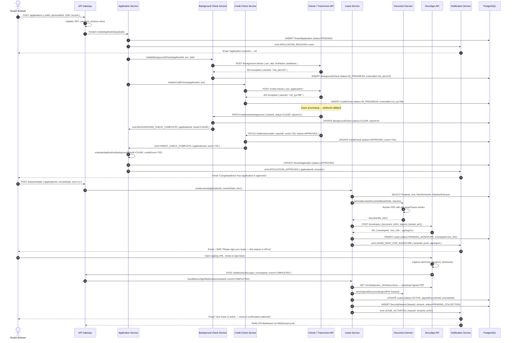
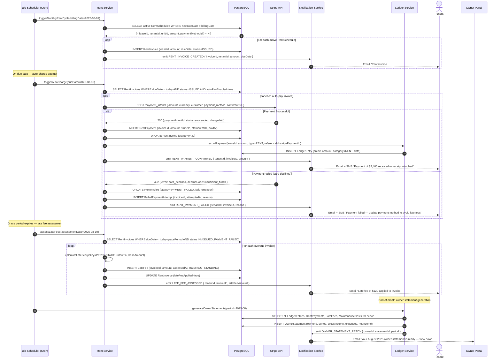
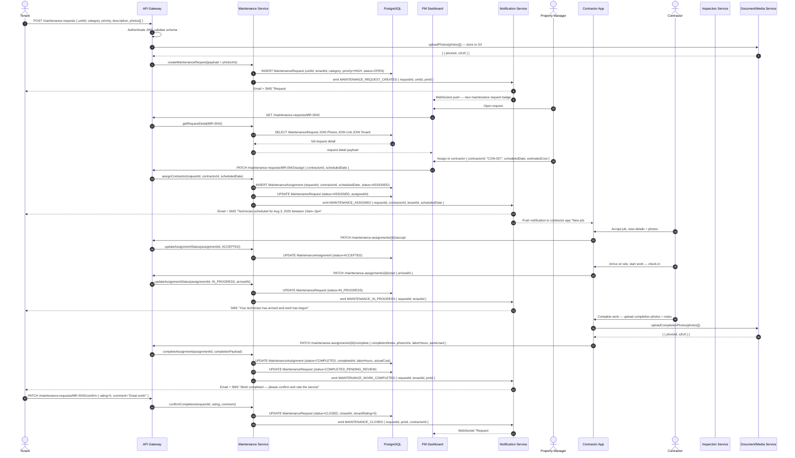

# System Sequence Diagrams — Real Estate Management System

This document captures the three primary end-to-end system-level sequence flows in the Real Estate Management System (REMS): the tenant application and lease signing lifecycle, the monthly automated rent collection cycle, and the maintenance request workflow.

---

## 1. Tenant Application & Lease Signing Sequence

This flow covers the complete journey from a prospective tenant submitting an application through background/credit checks, lease generation, DocuSign-based digital signing, and final activation of the tenancy.

---

## 2. Monthly Rent Collection Sequence

This flow describes the fully automated monthly rent cycle — from invoice generation triggered by the scheduler, through Stripe charge processing, payment reconciliation in the ledger, and late-fee assessment for overdue invoices.

---

## 3. Maintenance Request Flow

This flow covers the full lifecycle of a maintenance request — from tenant submission through property manager triage, contractor assignment, work completion, and final tenant confirmation.

---

*Last updated: 2025 | Real Estate Management System v1.0*
