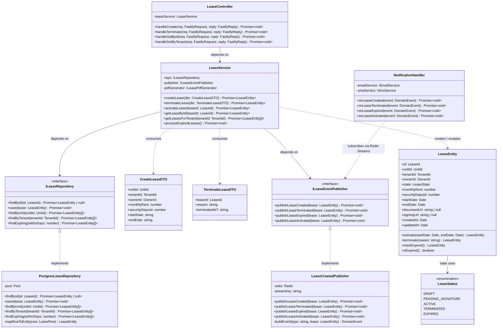
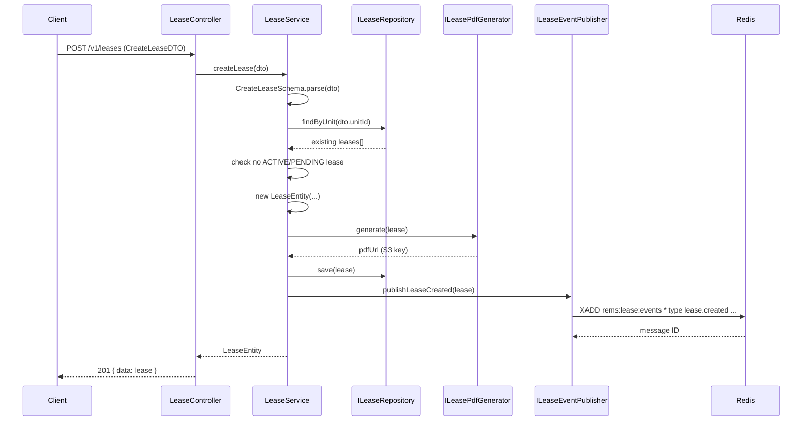
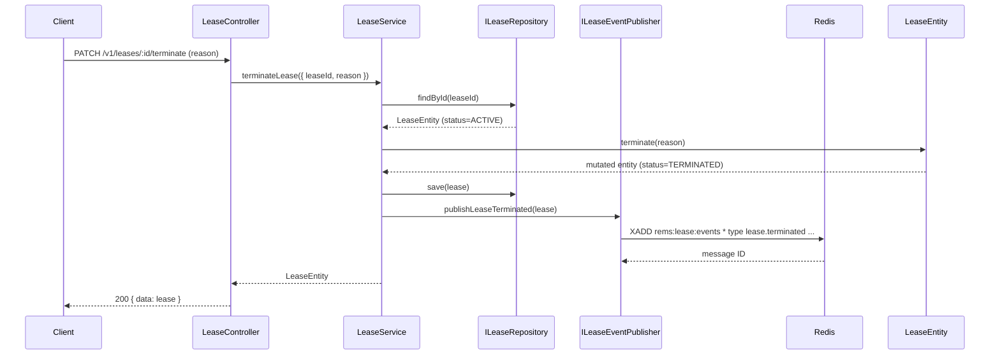
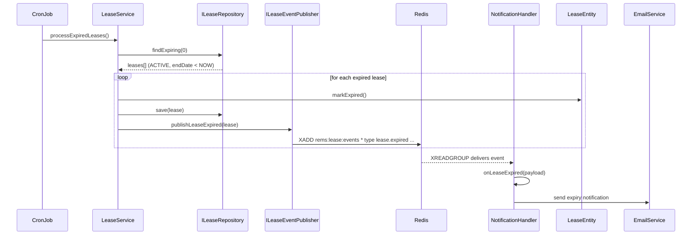

# C4 Code Diagram — LeaseService (Level 4)

## Introduction

This document presents a **C4 Level 4 (Code)** diagram for the `LeaseService` within the Real Estate Management System. Level 4 diagrams zoom into a single component and show the internal code-level elements: classes, interfaces, their relationships, and data flows.

The `LeaseService` lives in `packages/lease-service` and is responsible for the full lifecycle of a rental lease: creation, signature collection, activation, termination, and expiry. It orchestrates domain logic, persistence, event publishing, and document generation without depending on HTTP or infrastructure concerns directly — all external dependencies are injected as interfaces.

The diagrams and definitions below are the authoritative reference for developers working on this component.

---

## Class Diagram



---

## Class and Interface Definitions

### LeaseStatus

```typescript
// packages/lease-service/src/domain/enums/lease-status.enum.ts

/**
 * Represents all possible states of a lease document in its lifecycle.
 * States transition strictly in one direction; no backwards transitions are permitted.
 *
 * DRAFT             → PENDING_SIGNATURE (document generated, sent for signing)
 * PENDING_SIGNATURE → ACTIVE            (all parties signed)
 * ACTIVE            → TERMINATED        (early termination by either party)
 * ACTIVE            → EXPIRED           (natural end date reached)
 */
export enum LeaseStatus {
  DRAFT             = 'DRAFT',
  PENDING_SIGNATURE = 'PENDING_SIGNATURE',
  ACTIVE            = 'ACTIVE',
  TERMINATED        = 'TERMINATED',
  EXPIRED           = 'EXPIRED',
}
```

### LeaseEntity

```typescript
// packages/lease-service/src/domain/entities/lease.entity.ts
import type { LeaseId, UnitId, TenantId, OwnerId } from '@rems/shared';
import { ConflictError } from '@rems/shared';
import { LeaseStatus } from '../enums/lease-status.enum';

/**
 * Aggregate root for a rental lease.
 *
 * All state mutations are performed via method calls, never by direct field assignment,
 * to ensure business rules are enforced consistently regardless of caller.
 */
export class LeaseEntity {
  readonly id: LeaseId;
  readonly unitId: UnitId;
  readonly tenantId: TenantId;
  readonly ownerId: OwnerId;

  status: LeaseStatus;
  monthlyRent: number;
  securityDeposit: number;
  startDate: Date;
  endDate: Date;
  documentUrl: string | null;
  signingUrl: string | null;
  terminationReason: string | null;
  terminatedAt: Date | null;
  readonly createdAt: Date;
  updatedAt: Date;

  constructor(params: LeaseConstructorParams) {
    this.id                = params.id;
    this.unitId            = params.unitId;
    this.tenantId          = params.tenantId;
    this.ownerId           = params.ownerId;
    this.status            = params.status ?? LeaseStatus.DRAFT;
    this.monthlyRent       = params.monthlyRent;
    this.securityDeposit   = params.securityDeposit;
    this.startDate         = params.startDate;
    this.endDate           = params.endDate;
    this.documentUrl       = params.documentUrl ?? null;
    this.signingUrl        = params.signingUrl   ?? null;
    this.terminationReason = params.terminationReason ?? null;
    this.terminatedAt      = params.terminatedAt ?? null;
    this.createdAt         = params.createdAt    ?? new Date();
    this.updatedAt         = params.updatedAt    ?? new Date();
  }

  /**
   * Transition to ACTIVE status once all parties have signed.
   * Permitted only from PENDING_SIGNATURE state.
   */
  activate(): this {
    if (this.status !== LeaseStatus.PENDING_SIGNATURE) {
      throw new ConflictError(
        `Cannot activate lease in status ${this.status}. Expected PENDING_SIGNATURE.`,
      );
    }
    this.status    = LeaseStatus.ACTIVE;
    this.updatedAt = new Date();
    return this;
  }

  /**
   * Terminate an active lease early.
   * @param reason  Human-readable reason for termination (stored for audit).
   */
  terminate(reason: string): this {
    if (this.status !== LeaseStatus.ACTIVE) {
      throw new ConflictError(
        `Cannot terminate lease in status ${this.status}. Expected ACTIVE.`,
      );
    }
    this.status            = LeaseStatus.TERMINATED;
    this.terminationReason = reason;
    this.terminatedAt      = new Date();
    this.updatedAt         = new Date();
    return this;
  }

  /**
   * Mark lease as expired. Called by the scheduled expiry job when endDate < NOW().
   */
  markExpired(): this {
    if (this.status !== LeaseStatus.ACTIVE) {
      throw new ConflictError(
        `Cannot expire lease in status ${this.status}. Expected ACTIVE.`,
      );
    }
    this.status    = LeaseStatus.EXPIRED;
    this.updatedAt = new Date();
    return this;
  }

  /** Returns true when the natural end date has passed. */
  isExpired(): boolean {
    return this.endDate < new Date();
  }
}
```

### ILeaseRepository

```typescript
// packages/lease-service/src/domain/repositories/lease.repository.ts
import type { LeaseId, UnitId, TenantId } from '@rems/shared';
import type { LeaseEntity } from '../entities/lease.entity';

/**
 * Port (outbound) for persisting and retrieving LeaseEntity aggregates.
 * Implementations: PostgresLeaseRepository (production), InMemoryLeaseRepository (tests).
 */
export interface ILeaseRepository {
  /**
   * Retrieve a single lease by its ID.
   * Returns null when the lease does not exist.
   */
  findById(id: LeaseId): Promise<LeaseEntity | null>;

  /**
   * Persist a new or updated lease.
   * Uses UPSERT semantics: insert if not exists, update otherwise.
   */
  save(lease: LeaseEntity): Promise<void>;

  /**
   * Return all leases (including historical) associated with a unit.
   * Ordered by startDate descending.
   */
  findByUnit(unitId: UnitId): Promise<LeaseEntity[]>;

  /**
   * Return all leases associated with a tenant.
   * Ordered by startDate descending.
   */
  findByTenant(tenantId: TenantId): Promise<LeaseEntity[]>;

  /**
   * Return ACTIVE leases whose endDate falls within the next `withinDays` days.
   * Used by the expiry notification scheduled job.
   */
  findExpiring(withinDays: number): Promise<LeaseEntity[]>;
}
```

### PostgresLeaseRepository

```typescript
// packages/lease-service/src/infrastructure/db/postgres-lease.repository.ts
import { injectable, inject } from 'tsyringe';
import type { Pool } from 'pg';
import { TOKENS } from '../../container/tokens';
import type { ILeaseRepository } from '../../domain/repositories/lease.repository';
import type { LeaseEntity } from '../../domain/entities/lease.entity';
import type { LeaseId, UnitId, TenantId } from '@rems/shared';
import { NotFoundError } from '@rems/shared';
import { mapRowToLease, mapLeaseToRow } from './mappers/lease.mapper';

/**
 * PostgreSQL implementation of ILeaseRepository.
 *
 * Responsibilities:
 *  - Execute parameterized SQL queries against the `leases` table.
 *  - Map raw database rows to LeaseEntity via the mapper module.
 *  - Handle `deleted_at` soft-delete convention.
 *
 * Dependencies:
 *  - pg.Pool (injected via tsyringe token TOKENS.PgPool)
 */
@injectable()
export class PostgresLeaseRepository implements ILeaseRepository {
  constructor(@inject(TOKENS.PgPool) private readonly pool: Pool) {}

  async findById(id: LeaseId): Promise<LeaseEntity | null> {
    const { rows } = await this.pool.query<LeaseRow>(
      `SELECT * FROM leases WHERE id = $1 AND deleted_at IS NULL`,
      [id],
    );
    return rows[0] ? mapRowToLease(rows[0]) : null;
  }

  async save(lease: LeaseEntity): Promise<void> {
    const row = mapLeaseToRow(lease);
    await this.pool.query(
      `INSERT INTO leases (
         id, unit_id, tenant_id, owner_id, status,
         monthly_rent, security_deposit, start_date, end_date,
         document_url, signing_url, termination_reason, terminated_at,
         created_at, updated_at
       ) VALUES (
         $1,  $2,  $3,  $4,  $5,
         $6,  $7,  $8,  $9,
         $10, $11, $12, $13,
         $14, $15
       )
       ON CONFLICT (id) DO UPDATE SET
         status             = EXCLUDED.status,
         monthly_rent       = EXCLUDED.monthly_rent,
         security_deposit   = EXCLUDED.security_deposit,
         document_url       = EXCLUDED.document_url,
         signing_url        = EXCLUDED.signing_url,
         termination_reason = EXCLUDED.termination_reason,
         terminated_at      = EXCLUDED.terminated_at,
         updated_at         = NOW()`,
      [
        row.id,             row.unit_id,        row.tenant_id,     row.owner_id,
        row.status,         row.monthly_rent,   row.security_deposit,
        row.start_date,     row.end_date,       row.document_url,
        row.signing_url,    row.termination_reason, row.terminated_at,
        row.created_at,     row.updated_at,
      ],
    );
  }

  async findByUnit(unitId: UnitId): Promise<LeaseEntity[]> {
    const { rows } = await this.pool.query<LeaseRow>(
      `SELECT * FROM leases
        WHERE unit_id = $1 AND deleted_at IS NULL
        ORDER BY start_date DESC`,
      [unitId],
    );
    return rows.map(mapRowToLease);
  }

  async findByTenant(tenantId: TenantId): Promise<LeaseEntity[]> {
    const { rows } = await this.pool.query<LeaseRow>(
      `SELECT * FROM leases
        WHERE tenant_id = $1 AND deleted_at IS NULL
        ORDER BY start_date DESC`,
      [tenantId],
    );
    return rows.map(mapRowToLease);
  }

  async findExpiring(withinDays: number): Promise<LeaseEntity[]> {
    const { rows } = await this.pool.query<LeaseRow>(
      `SELECT * FROM leases
        WHERE status = 'ACTIVE'
          AND end_date BETWEEN NOW() AND NOW() + ($1 || ' days')::interval
          AND deleted_at IS NULL
        ORDER BY end_date ASC`,
      [withinDays],
    );
    return rows.map(mapRowToLease);
  }
}
```

### ILeaseEventPublisher

```typescript
// packages/lease-service/src/domain/events/lease-event-publisher.interface.ts
import type { LeaseEntity } from '../entities/lease.entity';

/**
 * Port (outbound) for publishing lease lifecycle domain events.
 * Implementations publish to Redis Streams (primary) or Kafka (future).
 */
export interface ILeaseEventPublisher {
  publishLeaseCreated(lease: LeaseEntity): Promise<void>;
  publishLeaseActivated(lease: LeaseEntity): Promise<void>;
  publishLeaseTerminated(lease: LeaseEntity): Promise<void>;
  publishLeaseExpired(lease: LeaseEntity): Promise<void>;
}
```

### LeaseCreatedPublisher

```typescript
// packages/lease-service/src/infrastructure/events/redis-lease-event-publisher.ts
import { injectable, inject } from 'tsyringe';
import type { Redis } from 'ioredis';
import { randomUUID } from 'crypto';
import { TOKENS } from '../../container/tokens';
import type { ILeaseEventPublisher } from '../../domain/events/lease-event-publisher.interface';
import type { LeaseEntity } from '../../domain/entities/lease.entity';
import type { DomainEvent } from '@rems/shared';

const STREAM_KEY = 'rems:lease:events';

/**
 * Publishes lease domain events to a Redis Stream.
 *
 * Responsibilities:
 *  - Serialize LeaseEntity into a DomainEvent payload.
 *  - Append the event to the Redis Stream using XADD.
 *  - Generate a unique event ID and timestamp per event.
 *
 * Consumers of `rems:lease:events`:
 *  - NotificationHandler  (sends email/SMS on lifecycle changes)
 *  - AvailabilityUpdater  (marks unit available/unavailable)
 *  - AnalyticsWorker      (feeds occupancy and revenue dashboards)
 */
@injectable()
export class RedisLeaseEventPublisher implements ILeaseEventPublisher {
  constructor(@inject(TOKENS.Redis) private readonly redis: Redis) {}

  async publishLeaseCreated(lease: LeaseEntity): Promise<void> {
    await this.publish('lease.created', lease);
  }

  async publishLeaseActivated(lease: LeaseEntity): Promise<void> {
    await this.publish('lease.activated', lease);
  }

  async publishLeaseTerminated(lease: LeaseEntity): Promise<void> {
    await this.publish('lease.terminated', lease);
  }

  async publishLeaseExpired(lease: LeaseEntity): Promise<void> {
    await this.publish('lease.expired', lease);
  }

  private async publish(type: string, lease: LeaseEntity): Promise<void> {
    const event: DomainEvent<LeaseEventPayload> = {
      id:            randomUUID(),
      type,
      occurredAt:    new Date().toISOString(),
      correlationId: lease.id,
      payload: {
        leaseId:    lease.id,
        unitId:     lease.unitId,
        tenantId:   lease.tenantId,
        ownerId:    lease.ownerId,
        status:     lease.status,
        endDate:    lease.endDate.toISOString(),
        monthlyRent: lease.monthlyRent,
      },
    };

    await this.redis.xadd(
      STREAM_KEY, '*',
      'event_id',    event.id,
      'type',        event.type,
      'occurred_at', event.occurredAt,
      'correlation', event.correlationId,
      'payload',     JSON.stringify(event.payload),
    );
  }
}
```

### LeaseService

```typescript
// packages/lease-service/src/application/services/lease.service.ts
import { injectable, inject } from 'tsyringe';
import { TOKENS } from '../../container/tokens';
import type { ILeaseRepository } from '../../domain/repositories/lease.repository';
import type { ILeaseEventPublisher } from '../../domain/events/lease-event-publisher.interface';
import type { ILeasePdfGenerator } from '../../domain/services/lease-pdf-generator.interface';
import { LeaseEntity } from '../../domain/entities/lease.entity';
import { LeaseStatus } from '../../domain/enums/lease-status.enum';
import type { CreateLeaseDTO } from '../dtos/create-lease.dto';
import type { TerminateLeaseDTO } from '../dtos/terminate-lease.dto';
import type { LeaseId, TenantId } from '@rems/shared';
import { NotFoundError, ConflictError, newLeaseId } from '@rems/shared';
import { CreateLeaseSchema } from '../validation/lease.schemas';

/**
 * Application service for lease lifecycle management.
 *
 * Responsibilities:
 *  - Validate inbound DTOs using Zod schemas.
 *  - Enforce business rules (e.g., no two ACTIVE leases for the same unit).
 *  - Orchestrate repository reads/writes and domain event publishing.
 *  - Trigger PDF generation after lease creation.
 *
 * This class has no knowledge of HTTP or database specifics.
 * All side effects are delegated to injected interfaces.
 */
@injectable()
export class LeaseService {
  constructor(
    @inject(TOKENS.LeaseRepository) private readonly repo: ILeaseRepository,
    @inject(TOKENS.EventPublisher)   private readonly publisher: ILeaseEventPublisher,
    @inject(TOKENS.PdfGenerator)     private readonly pdfGenerator: ILeasePdfGenerator,
  ) {}

  /**
   * Create a new lease in DRAFT status and generate the initial PDF document.
   *
   * Business rules:
   *  - The unit must not already have an ACTIVE or PENDING_SIGNATURE lease.
   *  - startDate must be before endDate.
   *  - monthlyRent and securityDeposit must be positive.
   */
  async createLease(dto: CreateLeaseDTO): Promise<LeaseEntity> {
    CreateLeaseSchema.parse(dto);

    const existing = await this.repo.findByUnit(dto.unitId);
    const hasActiveLease = existing.some(
      (l) => l.status === LeaseStatus.ACTIVE || l.status === LeaseStatus.PENDING_SIGNATURE,
    );
    if (hasActiveLease) {
      throw new ConflictError(`Unit ${dto.unitId} already has an active or pending lease.`);
    }

    const lease = new LeaseEntity({
      id:              newLeaseId(),
      unitId:          dto.unitId,
      tenantId:        dto.tenantId,
      ownerId:         dto.ownerId,
      status:          LeaseStatus.DRAFT,
      monthlyRent:     dto.monthlyRent,
      securityDeposit: dto.securityDeposit,
      startDate:       new Date(dto.startDate),
      endDate:         new Date(dto.endDate),
    });

    const pdfUrl = await this.pdfGenerator.generate(lease);
    lease.documentUrl = pdfUrl;

    await this.repo.save(lease);
    await this.publisher.publishLeaseCreated(lease);

    return lease;
  }

  /**
   * Terminate an active lease early.
   *
   * Business rules:
   *  - Lease must be in ACTIVE status.
   *  - Reason must be provided (minimum 10 characters).
   */
  async terminateLease(dto: TerminateLeaseDTO): Promise<LeaseEntity> {
    const lease = await this.repo.findById(dto.leaseId);
    if (!lease) throw new NotFoundError(`Lease ${dto.leaseId} not found.`);

    lease.terminate(dto.reason);
    await this.repo.save(lease);
    await this.publisher.publishLeaseTerminated(lease);

    return lease;
  }

  /**
   * Activate a lease that is in PENDING_SIGNATURE status.
   * Typically called via DocuSign webhook after all parties have signed.
   */
  async activateLease(leaseId: LeaseId): Promise<LeaseEntity> {
    const lease = await this.repo.findById(leaseId);
    if (!lease) throw new NotFoundError(`Lease ${leaseId} not found.`);

    lease.activate();
    await this.repo.save(lease);
    await this.publisher.publishLeaseActivated(lease);

    return lease;
  }

  /** Retrieve a lease by ID, throwing NotFoundError if absent. */
  async getLeaseById(leaseId: LeaseId): Promise<LeaseEntity> {
    const lease = await this.repo.findById(leaseId);
    if (!lease) throw new NotFoundError(`Lease ${leaseId} not found.`);
    return lease;
  }

  async getLeasesForTenant(tenantId: TenantId): Promise<LeaseEntity[]> {
    return this.repo.findByTenant(tenantId);
  }

  /**
   * Called by the daily scheduled job.
   * Finds all ACTIVE leases past their endDate and transitions them to EXPIRED.
   */
  async processExpiredLeases(): Promise<void> {
    const expiring = await this.repo.findExpiring(0);
    await Promise.all(
      expiring
        .filter((l) => l.isExpired())
        .map(async (lease) => {
          lease.markExpired();
          await this.repo.save(lease);
          await this.publisher.publishLeaseExpired(lease);
        }),
    );
  }
}
```

### LeaseController

```typescript
// packages/lease-service/src/http/controllers/lease.controller.ts
import { injectable, inject } from 'tsyringe';
import type { FastifyRequest, FastifyReply } from 'fastify';
import { TOKENS } from '../../container/tokens';
import { LeaseService } from '../../application/services/lease.service';
import type { CreateLeaseDTO } from '../../application/dtos/create-lease.dto';
import type { TerminateLeaseDTO } from '../../application/dtos/terminate-lease.dto';
import { toLeaseId, toTenantId } from '@rems/shared';

/**
 * HTTP adapter that translates Fastify requests into LeaseService calls.
 *
 * Responsibilities:
 *  - Extract and cast request parameters (no business logic here).
 *  - Delegate to LeaseService.
 *  - Map service results to HTTP response format.
 *  - Errors thrown by LeaseService propagate to the global Fastify error handler.
 */
@injectable()
export class LeaseController {
  constructor(@inject(TOKENS.LeaseService) private readonly leaseService: LeaseService) {}

  async handleCreate(
    req: FastifyRequest<{ Body: CreateLeaseDTO }>,
    reply: FastifyReply,
  ): Promise<void> {
    const lease = await this.leaseService.createLease(req.body);
    await reply.status(201).send({ data: lease });
  }

  async handleTerminate(
    req: FastifyRequest<{ Params: { id: string }; Body: { reason: string } }>,
    reply: FastifyReply,
  ): Promise<void> {
    const dto: TerminateLeaseDTO = {
      leaseId: toLeaseId(req.params.id),
      reason:  req.body.reason,
    };
    const lease = await this.leaseService.terminateLease(dto);
    await reply.status(200).send({ data: lease });
  }

  async handleGetById(
    req: FastifyRequest<{ Params: { id: string } }>,
    reply: FastifyReply,
  ): Promise<void> {
    const lease = await this.leaseService.getLeaseById(toLeaseId(req.params.id));
    await reply.status(200).send({ data: lease });
  }

  async handleGetByTenant(
    req: FastifyRequest<{ Params: { tenantId: string } }>,
    reply: FastifyReply,
  ): Promise<void> {
    const leases = await this.leaseService.getLeasesForTenant(toTenantId(req.params.tenantId));
    await reply.status(200).send({ data: leases });
  }
}
```

### NotificationHandler

```typescript
// packages/lease-service/src/infrastructure/events/notification.handler.ts
import { injectable, inject } from 'tsyringe';
import type { Redis } from 'ioredis';
import { TOKENS } from '../../container/tokens';
import type { IEmailService } from '../../domain/services/email.service.interface';
import type { ISmsService } from '../../domain/services/sms.service.interface';
import type { DomainEvent } from '@rems/shared';
import type { LeaseEventPayload } from '../events/lease-event.types';

const CONSUMER_GROUP = 'notification-handler';
const CONSUMER_NAME  = `notification-handler-${process.pid}`;

/**
 * Subscribes to `rems:lease:events` Redis Stream via a consumer group.
 * Sends email and SMS notifications on lease lifecycle events.
 *
 * Responsibilities:
 *  - Consume events from the Redis Stream without blocking other consumers.
 *  - Dispatch email and SMS via injected service interfaces.
 *  - Acknowledge messages after successful delivery.
 *  - Retry on failure using the PEL (Pending Entry List).
 */
@injectable()
export class NotificationHandler {
  constructor(
    @inject(TOKENS.Redis)        private readonly redis: Redis,
    @inject(TOKENS.EmailService) private readonly emailService: IEmailService,
    @inject(TOKENS.SmsService)   private readonly smsService: ISmsService,
  ) {}

  async start(): Promise<void> {
    await this.redis.xgroup('CREATE', 'rems:lease:events', CONSUMER_GROUP, '$', 'MKSTREAM')
      .catch(() => { /* group already exists */ });
    void this.poll();
  }

  private async poll(): Promise<void> {
    while (true) {
      const results = await this.redis.xreadgroup(
        'GROUP', CONSUMER_GROUP, CONSUMER_NAME,
        'COUNT', '10', 'BLOCK', '5000',
        'STREAMS', 'rems:lease:events', '>',
      );

      if (!results) continue;

      for (const [, messages] of results) {
        for (const [msgId, fields] of messages) {
          await this.handle(fields).catch((err) =>
            console.error('NotificationHandler error', err),
          );
          await this.redis.xack('rems:lease:events', CONSUMER_GROUP, msgId);
        }
      }
    }
  }

  private async handle(fields: string[]): Promise<void> {
    const type    = fields[fields.indexOf('type') + 1];
    const payload = JSON.parse(fields[fields.indexOf('payload') + 1]) as LeaseEventPayload;

    switch (type) {
      case 'lease.created':
        await this.onLeaseCreated(payload);
        break;
      case 'lease.terminated':
        await this.onLeaseTerminated(payload);
        break;
      case 'lease.expired':
        await this.onLeaseExpired(payload);
        break;
      case 'lease.activated':
        await this.onLeaseActivated(payload);
        break;
    }
  }

  async onLeaseCreated(payload: LeaseEventPayload): Promise<void> {
    await this.emailService.send({
      to:      payload.tenantId,   // resolved to email by EmailService
      subject: 'Your lease is ready for review',
      template: 'lease-created',
      data:    payload,
    });
  }

  async onLeaseTerminated(payload: LeaseEventPayload): Promise<void> {
    await Promise.all([
      this.emailService.send({ to: payload.tenantId, subject: 'Lease terminated', template: 'lease-terminated', data: payload }),
      this.smsService.send({ to: payload.tenantId, message: 'Your lease has been terminated. Check your email for details.' }),
    ]);
  }

  async onLeaseExpired(payload: LeaseEventPayload): Promise<void> {
    await this.emailService.send({ to: payload.tenantId, subject: 'Your lease has expired', template: 'lease-expired', data: payload });
  }

  async onLeaseActivated(payload: LeaseEventPayload): Promise<void> {
    await this.emailService.send({ to: payload.tenantId, subject: 'Lease activated — welcome!', template: 'lease-activated', data: payload });
  }
}
```

---

## Key Sequence Diagrams

### createLease() Flow



### terminateLease() Flow



### handleLeaseExpiry() Scheduled Job Flow



---

## Dependency Injection Setup

```typescript
// packages/lease-service/src/container/tokens.ts
export const TOKENS = {
  PgPool:            Symbol('PgPool'),
  Redis:             Symbol('Redis'),
  LeaseRepository:   Symbol('LeaseRepository'),
  EventPublisher:    Symbol('EventPublisher'),
  PdfGenerator:      Symbol('PdfGenerator'),
  EmailService:      Symbol('EmailService'),
  SmsService:        Symbol('SmsService'),
  LeaseService:      Symbol('LeaseService'),
  NotificationHandler: Symbol('NotificationHandler'),
} as const;
```

```typescript
// packages/lease-service/src/container/setup.ts
import 'reflect-metadata';
import { container } from 'tsyringe';
import { createPool } from '@rems/shared';
import { Redis } from 'ioredis';
import { TOKENS } from './tokens';
import { PostgresLeaseRepository } from '../infrastructure/db/postgres-lease.repository';
import { RedisLeaseEventPublisher } from '../infrastructure/events/redis-lease-event-publisher';
import { LeasePdfGenerator } from '../infrastructure/documents/lease-pdf.generator';
import { SendGridEmailService } from '../infrastructure/notifications/sendgrid-email.service';
import { TwilioSmsService } from '../infrastructure/notifications/twilio-sms.service';
import { LeaseService } from '../application/services/lease.service';
import { NotificationHandler } from '../infrastructure/events/notification.handler';

export function registerDependencies(): void {
  const pool  = createPool({ databaseUrl: process.env.DATABASE_URL! });
  const redis = new Redis({ host: process.env.REDIS_HOST, port: 6379 });

  container.registerInstance(TOKENS.PgPool, pool);
  container.registerInstance(TOKENS.Redis, redis);

  container.register(TOKENS.LeaseRepository,    { useClass: PostgresLeaseRepository });
  container.register(TOKENS.EventPublisher,     { useClass: RedisLeaseEventPublisher });
  container.register(TOKENS.PdfGenerator,       { useClass: LeasePdfGenerator });
  container.register(TOKENS.EmailService,       { useClass: SendGridEmailService });
  container.register(TOKENS.SmsService,         { useClass: TwilioSmsService });
  container.register(TOKENS.LeaseService,       { useClass: LeaseService });
  container.register(TOKENS.NotificationHandler,{ useClass: NotificationHandler });
}
```

---

## Unit Test Examples

```typescript
// packages/lease-service/src/__tests__/lease.service.spec.ts
import { LeaseService } from '../application/services/lease.service';
import type { ILeaseRepository } from '../domain/repositories/lease.repository';
import type { ILeaseEventPublisher } from '../domain/events/lease-event-publisher.interface';
import type { ILeasePdfGenerator } from '../domain/services/lease-pdf-generator.interface';
import { LeaseStatus } from '../domain/enums/lease-status.enum';
import { NotFoundError, ConflictError } from '@rems/shared';
import type { LeaseId, UnitId, TenantId, OwnerId } from '@rems/shared';

// ---- Factories ----

function makeRepo(): jest.Mocked<ILeaseRepository> {
  return {
    findById:     jest.fn(),
    save:         jest.fn(),
    findByUnit:   jest.fn(),
    findByTenant: jest.fn(),
    findExpiring: jest.fn(),
  };
}

function makePublisher(): jest.Mocked<ILeaseEventPublisher> {
  return {
    publishLeaseCreated:    jest.fn(),
    publishLeaseActivated:  jest.fn(),
    publishLeaseTerminated: jest.fn(),
    publishLeaseExpired:    jest.fn(),
  };
}

function makePdfGenerator(): jest.Mocked<ILeasePdfGenerator> {
  return { generate: jest.fn().mockResolvedValue('https://s3.example.com/lease.pdf') };
}

function makeActiveLeaseEntity() {
  return {
    id:              'lease-1' as LeaseId,
    unitId:          'unit-1' as UnitId,
    tenantId:        'tenant-1' as TenantId,
    ownerId:         'owner-1' as OwnerId,
    status:          LeaseStatus.ACTIVE,
    monthlyRent:     2000,
    securityDeposit: 4000,
    startDate:       new Date('2024-01-01'),
    endDate:         new Date('2025-01-01'),
    documentUrl:     'https://s3.example.com/lease.pdf',
    signingUrl:      null,
    terminationReason: null,
    terminatedAt:    null,
    createdAt:       new Date(),
    updatedAt:       new Date(),
    activate:        jest.fn(),
    terminate:       jest.fn().mockImplementation(function(this: any, reason: string) {
      this.status = LeaseStatus.TERMINATED;
      this.terminationReason = reason;
    }),
    markExpired:     jest.fn(),
    isExpired:       jest.fn().mockReturnValue(true),
  };
}

// ---- Tests ----

describe('LeaseService', () => {
  let svc: LeaseService;
  let repo: jest.Mocked<ILeaseRepository>;
  let publisher: jest.Mocked<ILeaseEventPublisher>;
  let pdfGen: jest.Mocked<ILeasePdfGenerator>;

  beforeEach(() => {
    repo      = makeRepo();
    publisher = makePublisher();
    pdfGen    = makePdfGenerator();
    svc       = new LeaseService(repo, publisher, pdfGen);
  });

  // ---- createLease ----

  describe('createLease', () => {
    const validDto = {
      unitId:          'unit-1' as UnitId,
      tenantId:        'tenant-1' as TenantId,
      ownerId:         'owner-1' as OwnerId,
      monthlyRent:     2000,
      securityDeposit: 4000,
      startDate:       '2025-06-01',
      endDate:         '2026-06-01',
    };

    it('saves the lease and publishes lease.created', async () => {
      repo.findByUnit.mockResolvedValue([]);
      repo.save.mockResolvedValue();
      publisher.publishLeaseCreated.mockResolvedValue();

      const lease = await svc.createLease(validDto);

      expect(repo.save).toHaveBeenCalledTimes(1);
      expect(publisher.publishLeaseCreated).toHaveBeenCalledWith(
        expect.objectContaining({ status: LeaseStatus.DRAFT }),
      );
      expect(lease.status).toBe(LeaseStatus.DRAFT);
    });

    it('throws ConflictError when unit already has an ACTIVE lease', async () => {
      repo.findByUnit.mockResolvedValue([makeActiveLeaseEntity() as any]);

      await expect(svc.createLease(validDto)).rejects.toBeInstanceOf(ConflictError);
      expect(repo.save).not.toHaveBeenCalled();
    });
  });

  // ---- terminateLease ----

  describe('terminateLease', () => {
    it('persists TERMINATED status and publishes event', async () => {
      const entity = makeActiveLeaseEntity();
      repo.findById.mockResolvedValue(entity as any);
      repo.save.mockResolvedValue();
      publisher.publishLeaseTerminated.mockResolvedValue();

      await svc.terminateLease({ leaseId: entity.id, reason: 'Tenant requested early exit' });

      expect(entity.terminate).toHaveBeenCalledWith('Tenant requested early exit');
      expect(repo.save).toHaveBeenCalledTimes(1);
      expect(publisher.publishLeaseTerminated).toHaveBeenCalledTimes(1);
    });

    it('throws NotFoundError when lease does not exist', async () => {
      repo.findById.mockResolvedValue(null);

      await expect(
        svc.terminateLease({ leaseId: 'ghost' as LeaseId, reason: 'any' }),
      ).rejects.toBeInstanceOf(NotFoundError);
    });
  });

  // ---- processExpiredLeases ----

  describe('processExpiredLeases', () => {
    it('marks each expired lease and publishes lease.expired', async () => {
      const entity = makeActiveLeaseEntity();
      repo.findExpiring.mockResolvedValue([entity as any]);
      repo.save.mockResolvedValue();
      publisher.publishLeaseExpired.mockResolvedValue();

      await svc.processExpiredLeases();

      expect(entity.markExpired).toHaveBeenCalledTimes(1);
      expect(repo.save).toHaveBeenCalledTimes(1);
      expect(publisher.publishLeaseExpired).toHaveBeenCalledTimes(1);
    });

    it('does not process leases that are not yet past endDate', async () => {
      const entity = { ...makeActiveLeaseEntity(), isExpired: jest.fn().mockReturnValue(false) };
      repo.findExpiring.mockResolvedValue([entity as any]);

      await svc.processExpiredLeases();

      expect(repo.save).not.toHaveBeenCalled();
    });
  });
});
```
