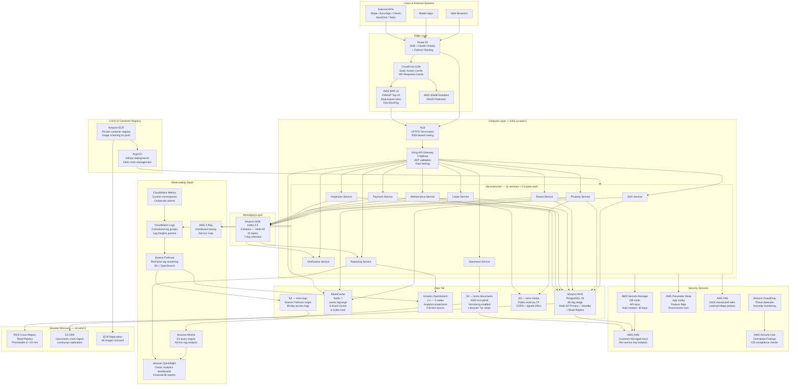

# Cloud Architecture — Real Estate Management System

## Overview

The REMS cloud architecture is built entirely on **AWS** using managed services to maximise reliability, minimise operational overhead, and support independent scaling of each concern. The architecture follows the **AWS Well-Architected Framework** pillars: Operational Excellence, Security, Reliability, Performance Efficiency, and Cost Optimisation.

The system targets:
- **RTO (Recovery Time Objective):** 15 minutes for critical services (Auth, Payment, Lease)
- **RPO (Recovery Point Objective):** 5 minutes for financial data, 1 hour for non-financial data
- **Availability SLA:** 99.9% uptime (≤ 8.7 hours downtime per year)

---

## Full Cloud Architecture Diagram

---

## AWS Services Inventory

| Service | AWS Resource | Tier | Purpose | Cost Tier |
|---|---|---|---|---|
| DNS | Route 53 | Edge | DNS routing, health checks, failover | Low |
| CDN | CloudFront | Edge | Static asset delivery, API caching, SSL | Medium |
| WAF | AWS WAF v2 | Edge | OWASP protection, rate limiting, geo-blocking | Medium |
| DDoS | AWS Shield Standard | Edge | Layer 3/4 DDoS protection (included) | Free |
| Load Balancer | Application Load Balancer | Compute | HTTPS termination, path routing | Low |
| Container Orchestration | Amazon EKS | Compute | Kubernetes cluster management (v1.29) | High |
| Worker Nodes | EC2 (t3.large, m5.xlarge) | Compute | EKS node groups — application workloads | High |
| Container Registry | Amazon ECR | Compute | Private Docker image storage, vulnerability scan | Low |
| Primary Database | Amazon RDS PostgreSQL 15 | Data | Transactional OLTP data — Multi-AZ | High |
| Read Replica | Amazon RDS (read-only) | Data | Reporting queries, read-heavy operations | Medium |
| Cache | Amazon ElastiCache Redis 7 | Data | Session cache, API cache, rate-limit counters | Medium |
| Event Streaming | Amazon MSK (Kafka 3.5) | Messaging | Domain event bus between microservices | High |
| Search / Analytics | Amazon OpenSearch 2.x | Data | Reporting projections, full-text property search | Medium |
| Object Storage — Docs | Amazon S3 (Standard) | Data | Lease PDFs, inspection reports, signed documents | Low |
| Object Storage — Media | Amazon S3 (Standard) | Data | Property photos, maintenance photos | Low |
| Object Storage — Logs | Amazon S3 (Glacier IR) | Data | Archived logs — 90-day retention | Very Low |
| Secrets | AWS Secrets Manager | Security | API keys, DB passwords, OAuth secrets | Low |
| Config | AWS Systems Manager Parameter Store | Security | App config, feature flags, non-secret config | Very Low |
| Encryption Keys | AWS KMS (CMK) | Security | Envelope encryption for S3, RDS, Secrets Manager | Low |
| Identity | AWS IAM + OIDC | Security | Pod-level IAM roles via IRSA, least-privilege | Free |
| Threat Detection | Amazon GuardDuty | Security | Anomaly and threat detection for AWS account | Low |
| Compliance | AWS Security Hub | Security | Centralised security findings, CIS benchmarks | Low |
| Log Aggregation | Amazon CloudWatch Logs | Observability | Centralised log groups per service | Medium |
| Metrics & Alarms | Amazon CloudWatch Metrics | Observability | Custom metrics, composite alarms, dashboards | Low |
| Distributed Tracing | AWS X-Ray | Observability | Request traces, service dependency map | Low |
| Log Streaming | Amazon Kinesis Firehose | Observability | Real-time log delivery to S3 and OpenSearch | Low |
| Ad-hoc Analytics | Amazon Athena | Analytics | SQL queries over S3 logs for incident analysis | Pay-per-query |
| Business Intelligence | Amazon QuickSight | Analytics | Owner financial dashboards, KPI reports | Medium |
| GitOps Deployment | ArgoCD (self-hosted on EKS) | CI/CD | Helm chart-based GitOps deployments | Compute only |
| DR Database | RDS Cross-Region Replica | DR | Promotable replica in us-west-2 (15-min RTO) | Medium |
| DR Storage | S3 Cross-Region Replication | DR | Continuous document replication to us-west-2 | Low |

---

## High Availability & Disaster Recovery

### High Availability Design
- **EKS pods** are distributed across all three AZs using pod anti-affinity rules (`topologyKey: topology.kubernetes.io/zone`). No AZ hosts more than 50% of replicas for any single service.
- **RDS PostgreSQL** is deployed in Multi-AZ mode. AWS manages synchronous replication to the standby. Failover is automatic and typically completes in 60–120 seconds.
- **ElastiCache Redis** runs in cluster mode with 3 shards and 2 replicas per shard (6 nodes total) across all 3 AZs.
- **MSK Kafka** uses 3 brokers (one per AZ) with a replication factor of 3 and `min.insync.replicas = 2` to tolerate single-broker failure without data loss.
- **ALB** is inherently multi-AZ; it distributes traffic across healthy pods in any AZ.

### Disaster Recovery Strategy

| Tier | RTO Target | RPO Target | Strategy |
|---|---|---|---|
| Payment / Financial data | 15 min | 5 min | RDS cross-region replica (promotable) + event sourcing replay |
| Lease / Tenant data | 15 min | 5 min | RDS cross-region replica |
| Property / Listing data | 30 min | 1 hour | RDS cross-region replica + S3 CRR |
| Documents / Media | 30 min | Near-zero | S3 CRR (continuous replication) |
| Application Services | 15 min | N/A (stateless) | Pre-built ECR images redeployed to standby EKS cluster |

The DR runbook (stored in Confluence) covers:
1. Promote RDS cross-region replica to standalone primary
2. Update Route 53 DNS to point to `us-west-2` ALB
3. Deploy all microservices to standby EKS cluster using existing ECR images
4. Validate Kafka topic offsets and replay any missed events from MSK backup

---

## Security Architecture

### Encryption
- **In transit:** All traffic uses TLS 1.2+ minimum. Kong enforces TLS for all downstream service calls. Inter-pod communication uses mTLS via Istio service mesh.
- **At rest — PostgreSQL:** RDS storage is encrypted using a KMS Customer Managed Key (`rems-rds-key`). Automated backups and snapshots inherit the same encryption.
- **At rest — S3:** `rems-documents` bucket uses SSE-KMS with `rems-s3-docs-key`. `rems-media` uses SSE-S3 (AES-256).
- **At rest — ElastiCache:** Encryption at rest is enabled using AWS-managed keys.
- **Field-level encryption:** SSN and national ID fields are encrypted at the application layer using AES-256 before being written to PostgreSQL. The data key is fetched from Secrets Manager and cached in memory (never written to disk).

### IAM & Pod Identity
Every microservice pod is assigned an **IAM Role via IRSA (IAM Roles for Service Accounts)**. Each role grants only the minimum permissions required:
- Payment Service: `s3:PutObject` on `rems-documents`, `secretsmanager:GetSecretValue` for Stripe key only
- Document Service: `s3:PutObject`, `s3:GetObject`, `s3:DeleteObject` on `rems-documents` and `rems-media`
- Reporting Service: `es:ESHttp*` on the OpenSearch domain only

No service runs with `AdministratorAccess`. Node-level EC2 instance profiles have only the minimum permissions for EKS worker node operation (ECR pull, CloudWatch logs, VPC networking).

### Secrets Rotation
All secrets in AWS Secrets Manager are configured with **automatic rotation** on a 30-day schedule using Lambda-based rotation functions:
- PostgreSQL master password (rotated without downtime using RDS multi-user rotation)
- Stripe secret key (rotated via manual trigger + Secrets Manager version staging)
- DocuSign integration key (rotated quarterly)

---

## Cost Optimisation Strategies

| Strategy | Applicable Resources | Estimated Saving |
|---|---|---|
| Reserved Instances (1-year, no-upfront) | RDS db.r6g.xlarge, ElastiCache r6g.large | 35–40% vs On-Demand |
| Savings Plans (Compute) | EKS EC2 node groups | 20–30% vs On-Demand |
| Spot Instances for non-critical pods | Reporting Service, Document Service | 60–70% vs On-Demand |
| S3 Intelligent-Tiering | `rems-documents` (older than 90 days) | 20–40% on storage costs |
| S3 Glacier Instant Retrieval | Archived inspection reports (>1 year) | 60% vs S3 Standard |
| CloudFront caching | Static assets + listing photos | Reduces origin S3 data transfer costs |
| RDS Read Replica for reporting | Offloads read-heavy queries from primary | Avoids primary scale-up |
| MSK Tiered Storage | Kafka topics with >7-day retention (audit log) | Reduces MSK broker storage by 80% |
| Right-sizing with CloudWatch Insights | All EKS pods after 30 days of P95 metrics | Tune CPU/memory requests to actual usage |

---

## Compliance & Governance

- **PCI-DSS:** Card data never stored in REMS — payment tokens managed entirely by Stripe. Stripe is a PCI-DSS Level 1 Service Provider.
- **SOC 2 Type II:** All AWS services used are SOC 2 certified. REMS application-level controls (access logging, encryption, audit trails) are documented in the security control matrix.
- **GDPR / CCPA:** PII fields (name, email, phone, SSN) are identified and tagged in the data catalogue. Tenant data deletion is supported via a `DELETE /tenants/{id}` endpoint that cascades soft-deletes and queues a background anonymisation job.
- **CloudTrail:** AWS CloudTrail is enabled in all regions with a dedicated S3 bucket for API call audit logs. Logs are retained for 7 years (regulatory requirement for financial records).

---

*Last updated: 2025 | Real Estate Management System v1.0*
