# Deployment Diagram — Real Estate Management System

## Overview

REMS is deployed on **AWS EKS (Elastic Kubernetes Service)** in the `us-east-1` region across **three Availability Zones** (us-east-1a, us-east-1b, us-east-1c). This multi-AZ topology ensures high availability for all services and data tiers with no single point of failure. Traffic enters through CloudFront CDN, passes through AWS WAF for threat filtering, and reaches the Application Load Balancer (ALB) before being routed to EKS pods.

---

## Deployment Topology Diagram

```mermaid
graph TB
    subgraph INTERNET["Internet"]
        USERS["End Users\nWeb Browsers"]
        MOBILE["Mobile Clients\niOS / Android"]
        WEBHOOKS["External Webhooks\nStripe / DocuSign / Checkr"]
    end

    subgraph AWS["AWS Cloud — us-east-1"]
        CF["CloudFront CDN\nStatic Assets + API Cache"]
        WAF["AWS WAF\nDDoS + SQL Injection Protection"]
        ALB["Application Load Balancer\nHTTPS :443 → HTTP :8080"]
        R53["Route 53\nDNS — app.rems.io"]

        subgraph EKS["EKS Cluster — v1.29 — Multi-AZ"]
            INGRESS["NGINX Ingress Controller\n2 replicas across AZs"]
            KONG["Kong API Gateway\n3 replicas — 1 per AZ"]

            subgraph AZ1["Availability Zone — us-east-1a"]
                AUTH1["Auth Service\n2 pods — t3.medium"]
                PROP1["Property Service\n2 pods — t3.medium"]
                TENANT1["Tenant Service\n2 pods — t3.medium"]
            end

            subgraph AZ2["Availability Zone — us-east-1b"]
                LEASE1["Lease Service\n2 pods — t3.medium"]
                PAY1["Payment Service\n2 pods — t3.large"]
                MAINT1["Maintenance Service\n2 pods — t3.medium"]
            end

            subgraph AZ3["Availability Zone — us-east-1c"]
                INSPECT1["Inspection Service\n2 pods — t3.medium"]
                NOTIFY1["Notification Service\n3 pods — t3.medium"]
                REPORT1["Reporting Service\n2 pods — t3.large"]
                DOC1["Document Service\n2 pods — t3.medium"]
            end

            subgraph INFRA["Infrastructure Pods"]
                PROM["Prometheus\n+ Grafana"]
                FLUENT["Fluent Bit\nLog Shipper"]
            end
        end

        subgraph DATA["Data Tier — Multi-AZ"]
            RDS["RDS PostgreSQL 15\ndb.r6g.xlarge — Multi-AZ\nPrimary + Standby Replica"]
            RDSRO["RDS Read Replica\ndb.r6g.large — us-east-1c"]
            REDIS["ElastiCache Redis 7\ncache.r6g.large — Cluster Mode\n3 shards × 2 replicas"]
            MSK["Amazon MSK Kafka 3.5\nkafka.m5.large × 3 brokers\n1 broker per AZ"]
            S3DOCS["S3 Bucket\nrems-documents\nVersioned + KMS encrypted"]
            S3MEDIA["S3 Bucket\nrems-media\nCloudFront OAC"]
            OS["OpenSearch 2.x\nm6g.large.search × 3 nodes\n1 per AZ"]
        end

        subgraph SECRETS["Secrets & Config"]
            SM["AWS Secrets Manager\nDB passwords, API keys"]
            PS["Parameter Store\nApp config, feature flags"]
            KMS["AWS KMS\nEncryption key management"]
        end

        subgraph OBS["Observability"]
            CW["CloudWatch\nLogs + Metrics + Alarms"]
            XRAY["AWS X-Ray\nDistributed Tracing"]
            KF["Kinesis Firehose\nLog streaming to S3"]
        end
    end

    subgraph BACKUP["Disaster Recovery"]
        RDSBK["RDS Automated Backups\n35-day retention\nPoint-in-time restore"]
        S3BK["S3 Cross-Region Replication\nus-west-2"]
    end

    USERS --> R53
    MOBILE --> R53
    R53 --> CF
    R53 --> ALB
    CF --> WAF
    WEBHOOKS --> ALB
    WAF --> ALB
    ALB --> INGRESS
    INGRESS --> KONG
    KONG --> AUTH1
    KONG --> PROP1
    KONG --> TENANT1
    KONG --> LEASE1
    KONG --> PAY1
    KONG --> MAINT1
    KONG --> INSPECT1
    KONG --> NOTIFY1
    KONG --> REPORT1
    KONG --> DOC1

    AUTH1 --> RDS
    PROP1 --> RDS
    TENANT1 --> RDS
    LEASE1 --> RDS
    PAY1 --> RDS
    MAINT1 --> RDS
    INSPECT1 --> RDS

    PROP1 --> REDIS
    KONG --> REDIS
    AUTH1 --> REDIS

    PROP1 --> MSK
    TENANT1 --> MSK
    LEASE1 --> MSK
    PAY1 --> MSK
    MAINT1 --> MSK
    MSK --> NOTIFY1
    MSK --> REPORT1

    DOC1 --> S3DOCS
    PROP1 --> S3MEDIA
    MAINT1 --> S3MEDIA

    REPORT1 --> OS
    REPORT1 --> RDSRO

    RDS --> RDSBK
    S3DOCS --> S3BK

    EKS --> SM
    EKS --> PS
    SM --> KMS
    RDS --> KMS
    S3DOCS --> KMS

    FLUENT --> CW
    FLUENT --> KF
    EKS --> XRAY
```



---

## Node & Pod Specifications

| Component | Instance Type | vCPU | Memory | Replicas | AZ Spread | Auto-Scaling |
|---|---|---|---|---|---|---|
| EKS Worker Nodes | t3.large | 2 | 8 GB | 6 min | 2 per AZ | Cluster Autoscaler |
| EKS Worker Nodes (Data) | m5.xlarge | 4 | 16 GB | 3 | 1 per AZ | Cluster Autoscaler |
| API Gateway (Kong) | — | 0.5 CPU req | 512 MB req | 3 | 1 per AZ | HPA min:3 max:12 |
| Auth Service | — | 0.25 CPU req | 256 MB req | 3 | spread | HPA min:3 max:9 |
| Property Service | — | 0.5 CPU req | 512 MB req | 3 | spread | HPA min:3 max:12 |
| Tenant Service | — | 0.5 CPU req | 512 MB req | 3 | spread | HPA min:3 max:9 |
| Lease Service | — | 0.5 CPU req | 512 MB req | 3 | spread | HPA min:3 max:9 |
| Payment Service | — | 1.0 CPU req | 1 GB req | 3 | spread | HPA min:3 max:12 |
| Maintenance Service | — | 0.5 CPU req | 512 MB req | 3 | spread | HPA min:3 max:9 |
| Inspection Service | — | 0.5 CPU req | 512 MB req | 2 | spread | HPA min:2 max:6 |
| Notification Service | — | 0.5 CPU req | 512 MB req | 3 | spread | HPA min:3 max:12 |
| Reporting Service | — | 1.0 CPU req | 1 GB req | 2 | spread | HPA min:2 max:6 |
| Document Service | — | 0.5 CPU req | 512 MB req | 2 | spread | HPA min:2 max:6 |
| RDS PostgreSQL Primary | db.r6g.xlarge | 4 | 32 GB | 1 primary + 1 standby | Multi-AZ | Storage Autoscaling 100GB→5TB |
| RDS Read Replica | db.r6g.large | 2 | 16 GB | 1 | us-east-1c | Manual |
| ElastiCache Redis | cache.r6g.large | 2 | 13.07 GB | 3 shards × 2 replicas | 1 shard/AZ | — |
| MSK Kafka | kafka.m5.large | 2 | 8 GB | 3 brokers | 1 per AZ | Manual |
| OpenSearch | m6g.large.search | 2 | 8 GB | 3 nodes | 1 per AZ | — |

---

## Auto-Scaling Policies

### Horizontal Pod Autoscaler (HPA)
All services are configured with HPA targeting **70% average CPU utilisation** and **80% average memory utilisation** as scale-out triggers. Scale-in stabilisation window is set to 300 seconds to prevent flapping.

```
scaleTargetRef: Deployment/<service-name>
minReplicas: 2–3 (varies by criticality)
maxReplicas: 6–12 (varies by criticality)
metrics:
  - type: Resource
    resource:
      name: cpu
      target:
        type: Utilization
        averageUtilization: 70
  - type: Resource
    resource:
      name: memory
      target:
        type: Utilization
        averageUtilization: 80
```

### Cluster Autoscaler
EKS node groups are managed by the **Cluster Autoscaler** (v1.29). Node scale-out is triggered when pods are in `Pending` state due to insufficient resources. Node scale-in cooldown is 10 minutes. Node groups span all three AZs with a min of 2 nodes per group and a max of 10 nodes per group.

### RDS Storage Auto-Scaling
RDS PostgreSQL is configured with storage auto-scaling enabled. The initial allocation is 100 GB GP3 SSD. Auto-scaling will increase storage in 10% increments (minimum 10 GB) when free storage falls below 10% of allocated storage, up to a maximum of 5 TB.

---

## CI/CD Pipeline

Deployments are managed by **ArgoCD** (GitOps). Each microservice is deployed from its own Helm chart stored in the `rems-helm-charts` repository. The pipeline is:

```
Developer push → GitHub PR → GitHub Actions (lint + test + build Docker image)
→ Push image to Amazon ECR → Update Helm chart image tag → ArgoCD auto-sync → EKS rolling update
```

Rolling update strategy: `maxSurge: 1`, `maxUnavailable: 0` — zero-downtime deployments guaranteed.

---

*Last updated: 2025 | Real Estate Management System v1.0*
