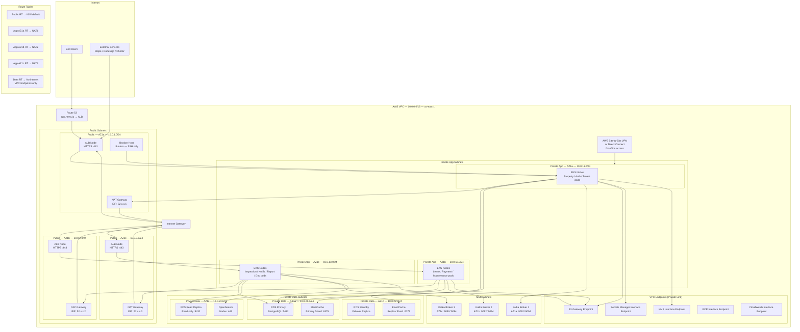

# Network Infrastructure — Real Estate Management System

## Overview

REMS is deployed within a dedicated **AWS Virtual Private Cloud (VPC)** spanning three Availability Zones in `us-east-1`. The network is segmented into public, private application, and private data subnets. All workloads run in private subnets with no direct internet exposure; inbound traffic flows exclusively through CloudFront → WAF → ALB. Outbound traffic from private subnets routes via NAT Gateways in each AZ.

---

## VPC Design

| Network Component | CIDR Block | Purpose |
|---|---|---|
| VPC | `10.0.0.0/16` | Main REMS VPC — 65,536 addresses |
| **Public Subnet — AZ1a** | `10.0.1.0/24` | ALB, NAT Gateway, Bastion Host |
| **Public Subnet — AZ1b** | `10.0.2.0/24` | ALB secondary, NAT Gateway |
| **Public Subnet — AZ1c** | `10.0.3.0/24` | ALB tertiary, NAT Gateway |
| **Private App Subnet — AZ1a** | `10.0.11.0/24` | EKS worker nodes — AZ1a |
| **Private App Subnet — AZ1b** | `10.0.12.0/24` | EKS worker nodes — AZ1b |
| **Private App Subnet — AZ1c** | `10.0.13.0/24` | EKS worker nodes — AZ1c |
| **Private Data Subnet — AZ1a** | `10.0.21.0/24` | RDS primary, ElastiCache primary shard |
| **Private Data Subnet — AZ1b** | `10.0.22.0/24` | RDS standby, ElastiCache replica |
| **Private Data Subnet — AZ1c** | `10.0.23.0/24` | RDS read replica, OpenSearch, MSK broker |
| **MSK Subnet — AZ1a** | `10.0.31.0/24` | Kafka broker — AZ1a |
| **MSK Subnet — AZ1b** | `10.0.32.0/24` | Kafka broker — AZ1b |
| **MSK Subnet — AZ1c** | `10.0.33.0/24` | Kafka broker — AZ1c |

---

## Network Topology Diagram

---

## Security Groups

### Security Group Rules Table

| Security Group | Attached To | Inbound Rule | Source | Port | Protocol |
|---|---|---|---|---|---|
| `sg-alb` | Application Load Balancer | Allow HTTPS | `0.0.0.0/0` | 443 | TCP |
| `sg-alb` | Application Load Balancer | Allow HTTP (redirect only) | `0.0.0.0/0` | 80 | TCP |
| `sg-eks-nodes` | EKS Worker Nodes | Allow from ALB | `sg-alb` | 8080 | TCP |
| `sg-eks-nodes` | EKS Worker Nodes | Allow node-to-node | `sg-eks-nodes` | All | TCP/UDP |
| `sg-eks-nodes` | EKS Worker Nodes | Allow from Bastion SSH | `sg-bastion` | 22 | TCP |
| `sg-rds` | RDS PostgreSQL | Allow from EKS nodes | `sg-eks-nodes` | 5432 | TCP |
| `sg-rds` | RDS PostgreSQL | Allow from Bastion | `sg-bastion` | 5432 | TCP |
| `sg-redis` | ElastiCache Redis | Allow from EKS nodes | `sg-eks-nodes` | 6379 | TCP |
| `sg-msk` | MSK Kafka Brokers | Allow from EKS nodes (plaintext) | `sg-eks-nodes` | 9092 | TCP |
| `sg-msk` | MSK Kafka Brokers | Allow from EKS nodes (TLS) | `sg-eks-nodes` | 9094 | TCP |
| `sg-opensearch` | OpenSearch Domain | Allow from EKS nodes | `sg-eks-nodes` | 443 | TCP |
| `sg-bastion` | Bastion Host | Allow SSH from corporate VPN | Corporate IP range | 22 | TCP |
| `sg-vpn` | VPN Gateway | Allow from office CIDR | Office CIDR | 500, 4500 | UDP |

All security groups have **deny-all outbound by default** except for explicitly allowed outbound rules:
- `sg-eks-nodes` outbound: `0.0.0.0/0` on port 443 (for external API calls via NAT Gateway)
- `sg-rds` outbound: None (database never initiates connections)
- `sg-redis` outbound: None
- `sg-msk` outbound: Allow to `sg-eks-nodes` on 9092/9094 only

---

## Network Access Control Lists (NACLs)

### Public Subnet NACL
| Rule # | Type | Protocol | Port Range | Source | Action |
|---|---|---|---|---|---|
| 100 | HTTPS | TCP | 443 | 0.0.0.0/0 | ALLOW |
| 110 | HTTP | TCP | 80 | 0.0.0.0/0 | ALLOW |
| 120 | Custom TCP | TCP | 1024–65535 | 0.0.0.0/0 | ALLOW (ephemeral) |
| 200 | SSH | TCP | 22 | Corporate CIDR | ALLOW |
| 32766 | All Traffic | All | All | 0.0.0.0/0 | DENY |

### Private App Subnet NACL
| Rule # | Type | Protocol | Port Range | Source | Action |
|---|---|---|---|---|---|
| 100 | Custom TCP | TCP | 8080 | 10.0.0.0/16 | ALLOW (from ALB) |
| 110 | Custom TCP | TCP | 1024–65535 | 10.0.0.0/16 | ALLOW (ephemeral) |
| 120 | HTTPS | TCP | 443 | 0.0.0.0/0 | ALLOW (egress to ext APIs via NAT) |
| 200 | SSH | TCP | 22 | 10.0.1.0/24 | ALLOW (from bastion public subnet) |
| 32766 | All Traffic | All | All | 0.0.0.0/0 | DENY |

### Private Data Subnet NACL
| Rule # | Type | Protocol | Port Range | Source | Action |
|---|---|---|---|---|---|
| 100 | PostgreSQL | TCP | 5432 | 10.0.11.0/24 | ALLOW |
| 101 | PostgreSQL | TCP | 5432 | 10.0.12.0/24 | ALLOW |
| 102 | PostgreSQL | TCP | 5432 | 10.0.13.0/24 | ALLOW |
| 110 | Redis | TCP | 6379 | 10.0.11.0/24 | ALLOW |
| 111 | Redis | TCP | 6379 | 10.0.12.0/24 | ALLOW |
| 120 | Custom TCP | TCP | 1024–65535 | 10.0.0.0/16 | ALLOW (ephemeral) |
| 32766 | All Traffic | All | All | 0.0.0.0/0 | DENY |

---

## NAT Gateways

Three NAT Gateways are deployed — one per public subnet, one per AZ — each with a dedicated Elastic IP address. This design ensures:
- No single NAT Gateway is a cross-AZ traffic bottleneck
- AZ-level isolation: if AZ1a NAT fails, AZ1b and AZ1c traffic is unaffected
- Each private app subnet's route table points to the NAT Gateway in the same AZ

---

## Route 53 DNS Configuration

| Record | Type | Value | TTL | Notes |
|---|---|---|---|---|
| `app.rems.io` | A (Alias) | ALB DNS name | 60s | PM / Owner web app |
| `api.rems.io` | A (Alias) | ALB DNS name | 60s | API Gateway endpoint |
| `tenant.rems.io` | A (Alias) | ALB DNS name | 60s | Tenant PWA portal |
| `webhooks.rems.io` | A (Alias) | ALB DNS name | 60s | Stripe / DocuSign / Checkr webhooks |
| `*.rems.io` | A (Alias) | CloudFront distribution | 300s | Wildcard fallback |

Route 53 health checks are configured for both ALB endpoints. Route 53 **failover routing policy** is configured to switch `api.rems.io` to the DR region (`us-west-2`) if the primary health check fails for 3 consecutive 30-second intervals.

---

## VPN / Direct Connect

A **Site-to-Site VPN** connects the corporate office network (CIDR `172.16.0.0/12`) to the REMS VPC, enabling:
- Direct database access for the DBA team via Bastion Host
- CI/CD agent communication without traversing the public internet
- Secure access to AWS Systems Manager and Parameter Store from internal tooling

For production, **AWS Direct Connect** (1 Gbps dedicated connection) is recommended to replace the VPN for improved latency and throughput in CI/CD pipeline artefact pushes and disaster recovery data replication.

---

*Last updated: 2025 | Real Estate Management System v1.0*
