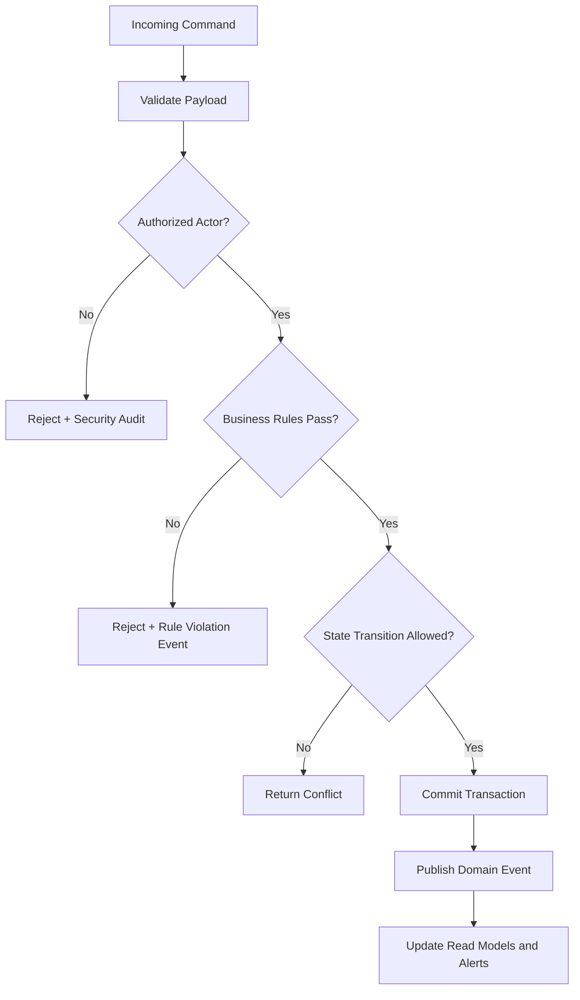

# Business Rules

This document defines enforceable policy rules for **Rental Management System** so command processing, asynchronous jobs, and operational actions behave consistently under normal and exceptional conditions.

## Context
- Domain focus: rental management workflows.
- Rule categories: lifecycle transitions, authorization, compliance, and resilience.
- Enforcement points: APIs, workflow/state engines, background processors, and administrative consoles.

## Enforceable Rules
1. Every state-changing command must pass authentication, authorization, and schema validation before processing.
2. Lifecycle transitions must follow the configured state graph; invalid transitions are rejected with explicit reason codes.
3. High-impact operations (financial, security, or regulated data actions) require additional approval evidence.
4. Manual overrides must include approver identity, rationale, and expiration timestamp.
5. Retries and compensations must be idempotent and must not create duplicate business effects.

## Rule Evaluation Pipeline

## Exception and Override Handling
- Overrides are restricted to approved exception classes and require dual logging (business + security audit).
- Override windows automatically expire and trigger follow-up verification tasks.
- Repeated override patterns are reviewed for policy redesign and automation improvements.
## Implementation-Specific Addendum: Rule precedence and override policy

### Domain-level decisions
- Document deterministic priority: legal/compliance > safety/maintenance > financial > promotional.
- Capture booking lifecycle transition metadata (`actor`, `reason_code`, `request_id`, `policy_version`) for auditability.
- Keep pricing and deposit calculations reproducible from immutable snapshots to support dispute handling.

### Failure handling and recovery
- Define explicit compensation steps for payment success + booking write failure, including replay and operator tooling.
- Record availability conflict outcomes with deterministic winner selection and customer alternative suggestions.
- For maintenance interruptions, document swap/refund decision matrix with SLA-based customer communications.

### Implementation test vectors
- Concurrency: 50+ parallel hold requests on same asset/time window with deterministic outcomes.
- Financial: partial deposit capture + late fee + damage adjustment with tax correctness.
- Operations: offline check-in/check-out replay with out-of-order events and final state convergence.
