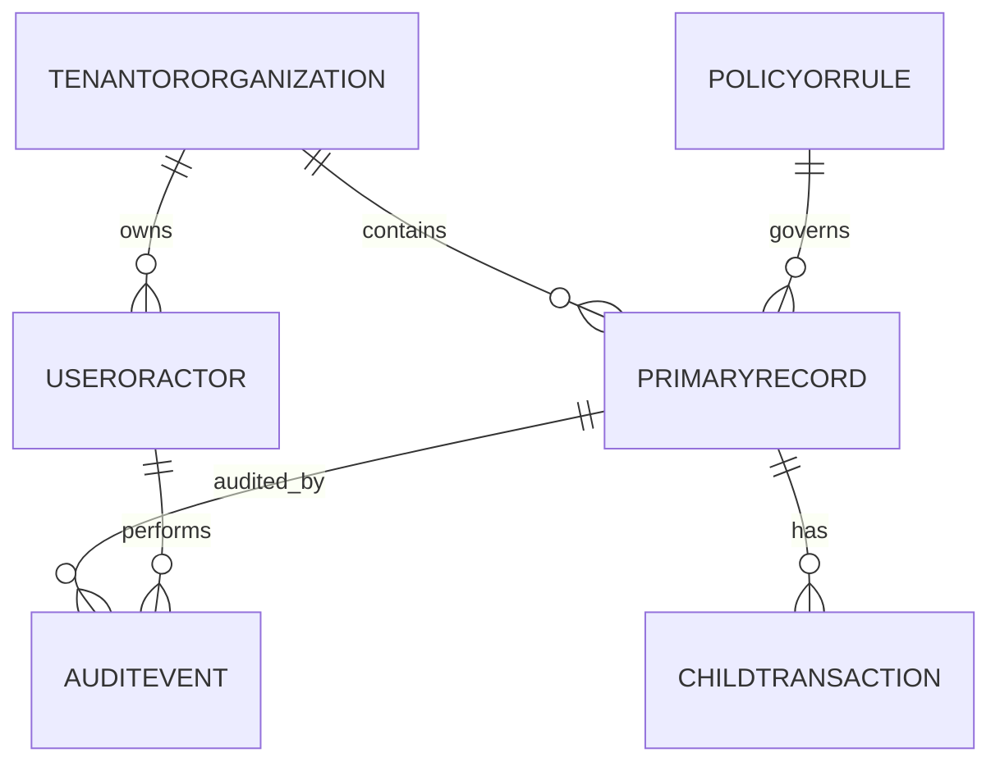

# Data Dictionary

This data dictionary is the canonical reference for **Rental Management System**. It defines shared terminology, entity semantics, and governance controls required to keep rental management workflows consistent across teams and services.

## Scope and Goals
- Establish a stable vocabulary for architecture, API, analytics, and operations teams.
- Define minimum required fields for core entities and expected relationship boundaries.
- Document data quality and retention controls needed for production readiness.

## Core Entities
| Entity | Description | Required Attributes |
|---|---|---|
| TenantOrOrganization | Top-level ownership boundary for data segregation | `org_id, name, status, region, created_at` |
| UserOrActor | Human/system principal that performs actions | `actor_id, org_id, role, status, last_active_at` |
| PrimaryRecord | Main lifecycle object handled by the platform | `record_id, org_id, state, owner_id, created_at, updated_at` |
| ChildTransaction | Operational transaction or sub-step linked to primary record | `txn_id, record_id, txn_type, amount_or_value, occurred_at` |
| PolicyOrRule | Versioned policy configuration that influences decisions | `policy_id, scope, version, effective_from, effective_to` |
| AuditEvent | Append-only evidence for state changes and controls | `audit_id, record_id, actor_id, action, reason_code, occurred_at` |

## Canonical Relationship Diagram

## Data Quality Controls
1. All write paths enforce required-field validation and referential integrity for mandatory foreign keys.
2. External imports must include provenance metadata (`source_system`, `source_ref`, `ingested_at`).
3. Status/state fields use controlled vocabularies and reject unknown values.
4. Duplicate detection runs on natural keys where business identity collisions are likely.
5. Sensitive fields carry classification tags to drive masking, encryption, and export behavior.

## Retention and Audit
- Operational records remain online for active workflow windows and support forensic queries.
- Historical records move to archive tiers by policy without breaking traceability.
- Audit events are immutable and linked through correlation ids for incident analysis.
## Implementation-Specific Addendum: Canonical entity constraints

### Domain-level decisions
- Define required fields, nullability expectations, and immutable fields once booking is confirmed.
- Capture booking lifecycle transition metadata (`actor`, `reason_code`, `request_id`, `policy_version`) for auditability.
- Keep pricing and deposit calculations reproducible from immutable snapshots to support dispute handling.

### Failure handling and recovery
- Define explicit compensation steps for payment success + booking write failure, including replay and operator tooling.
- Record availability conflict outcomes with deterministic winner selection and customer alternative suggestions.
- For maintenance interruptions, document swap/refund decision matrix with SLA-based customer communications.

### Implementation test vectors
- Concurrency: 50+ parallel hold requests on same asset/time window with deterministic outcomes.
- Financial: partial deposit capture + late fee + damage adjustment with tax correctness.
- Operations: offline check-in/check-out replay with out-of-order events and final state convergence.
