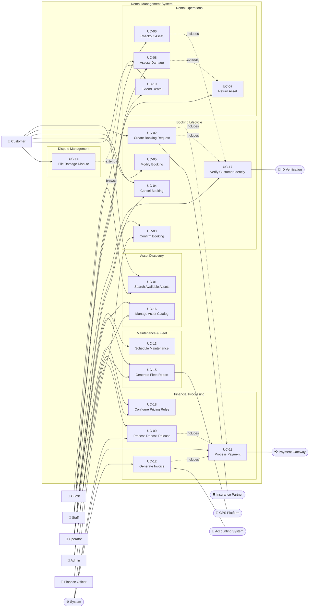

# Use Case Diagram — Rental Management System

## Overview

This document defines the complete use case model for the Rental Management System (RMS). It captures all functional interactions between external actors and the system, grouped by domain area: Asset Discovery, Booking Lifecycle, Rental Operations, Financial Processing, Maintenance, Fleet Management, and Administration.

---

## Actor Definitions

| Actor | Type | Description |
|---|---|---|
| **Customer** | Primary | Registered end-user who searches, books, and rents assets |
| **Guest** | Primary | Unauthenticated visitor browsing availability |
| **Staff** | Primary | Frontline employee handling checkouts, returns, and assessments |
| **Operator** | Primary | Business owner or manager configuring the system and reviewing reports |
| **Admin** | Primary | System administrator managing platform configuration and user access |
| **Finance Officer** | Primary | Accounts team member handling deposit releases and billing reconciliation |
| **System** | Secondary | Automated system processes (schedulers, event handlers, rule engines) |
| **Payment Gateway** | External | Stripe/PayPal handling card pre-auth, capture, and refunds |
| **Insurance Partner** | External | Third-party insurance API providing coverage products |
| **ID Verification Service** | External | Jumio/Onfido scanning and verifying government IDs |
| **GPS Tracking Platform** | External | Telematics provider supplying real-time vehicle location and telemetry |
| **Accounting System** | External | QuickBooks/Xero receiving revenue and invoice exports |

---

## Use Case Diagram



---

## Use Case Catalogue

### UC-01 — Search Available Assets

| Field | Value |
|---|---|
| **ID** | UC-01 |
| **Name** | Search Available Assets |
| **Primary Actor** | Customer, Guest |
| **Description** | User searches the asset catalog by date range, location, category, and optional filters (price range, features, vehicle type). System returns matching available assets with real-time pricing. |
| **Preconditions** | System is operational. Asset catalog is populated. Availability calendar is up to date. |
| **Postconditions** | A ranked list of available assets with pricing is displayed. Search parameters are retained for booking initiation. |

---

### UC-02 — Create Booking Request

| Field | Value |
|---|---|
| **ID** | UC-02 |
| **Name** | Create Booking Request |
| **Primary Actor** | Customer |
| **Secondary Actors** | System, Payment Gateway, Insurance Partner |
| **Description** | Authenticated customer selects an asset, specifies rental dates, chooses optional add-ons (insurance, GPS, child seat), provides payment method for deposit pre-authorization, and submits the booking. System validates availability, calculates pricing, runs pre-auth, generates a booking reference, and queues confirmation. |
| **Preconditions** | Customer is authenticated. Asset is available for selected dates. Customer identity is verified (UC-17). Payment method is on file or provided. |
| **Postconditions** | Booking record created in PENDING_CONFIRMATION state. Deposit pre-authorized. Booking confirmation email and SMS sent. |

---

### UC-03 — Confirm Booking

| Field | Value |
|---|---|
| **ID** | UC-03 |
| **Name** | Confirm Booking |
| **Primary Actor** | System (automated), Operator (manual override) |
| **Description** | System automatically confirms bookings that pass all validation rules. Operator can manually confirm or reject bookings that are flagged for review. On confirmation, rental contract is generated and sent to customer. |
| **Preconditions** | Booking exists in PENDING_CONFIRMATION state. Deposit pre-auth is valid. Customer identity is verified. |
| **Postconditions** | Booking transitions to CONFIRMED state. Rental contract PDF generated and delivered. Customer notified via email and SMS. Asset marked as reserved for booking window. |

---

### UC-04 — Cancel Booking

| Field | Value |
|---|---|
| **ID** | UC-04 |
| **Name** | Cancel Booking |
| **Primary Actor** | Customer, Operator |
| **Secondary Actors** | System, Payment Gateway |
| **Description** | Customer or Operator initiates cancellation of a confirmed or pending booking. System applies the cancellation policy to determine refund amount, voids or partially refunds the deposit pre-auth, updates asset availability, and sends cancellation notification. |
| **Preconditions** | Booking exists in CONFIRMED or PENDING_CONFIRMATION state. Cancellation window and policy are defined for the booking category. |
| **Postconditions** | Booking transitions to CANCELLED state. Refund processed according to policy. Deposit pre-auth voided or partial charge captured. Asset availability restored. Customer notified. |

---

### UC-05 — Modify Booking

| Field | Value |
|---|---|
| **ID** | UC-05 |
| **Name** | Modify Booking |
| **Primary Actor** | Customer, Staff/Agent |
| **Secondary Actors** | System, Payment Gateway |
| **Description** | Customer or agent modifies booking attributes (dates, asset swap, add-on changes). System recalculates pricing, adjusts deposit pre-auth if needed, and generates an updated confirmation. |
| **Preconditions** | Booking is in CONFIRMED state. Modification is requested before rental start time. New dates or asset are available. |
| **Postconditions** | Booking updated with new attributes. Pricing difference charged or refunded. Updated confirmation and contract sent. Audit log entry created. |

---

### UC-06 — Checkout Asset

| Field | Value |
|---|---|
| **ID** | UC-06 |
| **Name** | Checkout Asset |
| **Primary Actor** | Staff |
| **Secondary Actors** | System, ID Verification Service |
| **Description** | Staff completes asset checkout by verifying the customer's identity and driving license, confirming booking details, capturing pre-rental condition photos, recording odometer/fuel level, and handing over the asset. System transitions booking to ACTIVE and marks asset as RENTED. |
| **Preconditions** | Booking is in CONFIRMED state. Customer is present. Identity documents are available. Deposit pre-auth is active. |
| **Postconditions** | Booking transitions to ACTIVE state. Asset status set to RENTED. Pre-rental condition record created with photos. Checkout timestamp recorded. Rental agreement signed (digitally or physically). |

---

### UC-07 — Return Asset

| Field | Value |
|---|---|
| **ID** | UC-07 |
| **Name** | Return Asset |
| **Primary Actor** | Staff |
| **Secondary Actors** | System, Customer |
| **Description** | Staff processes the return of a rented asset. Staff records return timestamp, mileage, fuel level, and conducts a condition inspection. If damage is detected, UC-08 is triggered. System calculates final rental fees including any late return or fuel surcharges. |
| **Preconditions** | Booking is in ACTIVE state. Asset is physically returned to designated location. |
| **Postconditions** | Return record created. Final fees calculated. If no damage, deposit release process initiated (UC-09). Asset status set to RETURNED pending inspection or AVAILABLE if clean. Customer notified of return status and charges. |

---

### UC-08 — Assess Damage

| Field | Value |
|---|---|
| **ID** | UC-08 |
| **Name** | Assess Damage |
| **Primary Actor** | Staff |
| **Secondary Actors** | System, Customer, Insurance Partner |
| **Description** | Staff documents damage discovered during return inspection or reported during rental. Staff captures photos, describes damage, selects damage type and location, and enters repair cost estimate. System notifies customer, initiates dispute window, and prepares deposit deduction schedule. |
| **Preconditions** | Asset has been returned or damage has been reported during rental. Staff is authenticated with damage assessment role. |
| **Postconditions** | Damage report created and linked to booking. Photos stored in document storage. Customer notified of damage and estimated charges. Dispute window opened (configurable, default 48 hours). Deposit hold maintained pending resolution. |

---

### UC-09 — Process Deposit Release

| Field | Value |
|---|---|
| **ID** | UC-09 |
| **Name** | Process Deposit Release |
| **Primary Actor** | System (automated), Finance Officer (manual) |
| **Secondary Actors** | Payment Gateway |
| **Description** | After rental completion and damage assessment window closes without dispute or after dispute resolution, system calculates the net deposit to release (total deposit minus any assessed damage fees). Payment gateway is instructed to release the pre-auth hold or process partial capture. |
| **Preconditions** | Booking is in RETURNED state. Damage assessment is complete (or none required). Dispute window has expired or dispute has been resolved. |
| **Postconditions** | Deposit pre-auth voided (clean return) or partial capture processed (damage case). Customer notified of deposit release or deduction. Financial record updated. Invoice generated (UC-12). |

---

### UC-10 — Extend Rental

| Field | Value |
|---|---|
| **ID** | UC-10 |
| **Name** | Extend Rental |
| **Primary Actor** | Customer, Staff |
| **Secondary Actors** | System, Payment Gateway |
| **Description** | During an active rental, customer or staff requests an extension of the return date. System checks asset availability beyond the current end date, calculates extension fees, charges the customer's payment method, and updates the booking end date. |
| **Preconditions** | Booking is in ACTIVE state. Extension is requested before current end date. Asset is not reserved for another booking immediately following. Payment method is valid. |
| **Postconditions** | Booking end date updated. Extension fee charged. Customer notified. Conflicting future bookings (if any) are flagged. |

---

### UC-11 — Process Payment

| Field | Value |
|---|---|
| **ID** | UC-11 |
| **Name** | Process Payment |
| **Primary Actor** | System |
| **Secondary Actors** | Payment Gateway, Customer |
| **Description** | System initiates payment transactions for deposit pre-authorization, charge capture, refunds, partial captures, and extension fees. All payment events are logged with gateway transaction IDs and reconciliation data forwarded to the accounting system. |
| **Preconditions** | Valid payment method (tokenized card) on file. Payment amount is calculated and verified. Gateway is reachable. |
| **Postconditions** | Payment transaction recorded with status (SUCCESS, FAILED, PENDING). Gateway transaction ID stored. Accounting system notified. Customer receives payment receipt. |

---

### UC-12 — Generate Invoice

| Field | Value |
|---|---|
| **ID** | UC-12 |
| **Name** | Generate Invoice |
| **Primary Actor** | System |
| **Secondary Actors** | Customer, Accounting System |
| **Description** | System generates a detailed invoice at rental completion covering base rental fees, extra mileage charges, fuel surcharges, damage fees, insurance premiums, and applicable taxes. Invoice is delivered via email as PDF and exported to the accounting system. |
| **Preconditions** | Rental is complete. All charges are calculated and finalized. Customer email is on file. |
| **Postconditions** | Invoice PDF generated and stored in document storage. Invoice emailed to customer. Invoice record exported to accounting system. Invoice linked to booking record. |

---

### UC-13 — Schedule Maintenance

| Field | Value |
|---|---|
| **ID** | UC-13 |
| **Name** | Schedule Maintenance |
| **Primary Actor** | Operator, Staff |
| **Secondary Actors** | System |
| **Description** | Operator or Staff creates a maintenance job for an asset, specifying type (routine, damage repair, recall), scheduled date, estimated duration, and assigned technician. System marks asset as unavailable for the maintenance window and removes it from availability search results. |
| **Preconditions** | Asset exists in the system. No active rental is in progress for the asset (or maintenance is scheduled after return). User has Operator or Staff role. |
| **Postconditions** | Maintenance job created and linked to asset. Asset status set to MAINTENANCE for the scheduled window. Availability calendar updated. Technician notified. Affected future bookings flagged for re-accommodation. |

---

### UC-14 — File Damage Dispute

| Field | Value |
|---|---|
| **ID** | UC-14 |
| **Name** | File Damage Dispute |
| **Primary Actor** | Customer |
| **Secondary Actors** | System, Operator, Insurance Partner |
| **Description** | Customer disputes a damage charge assessed after return. Customer submits a dispute with supporting evidence (photos, description). System logs the dispute, notifies the Operator, pauses the deposit deduction, and initiates a review workflow. Operator reviews and issues a resolution (uphold charge, reduce charge, waive charge). |
| **Preconditions** | Damage report has been created and customer has been notified. Customer is within the dispute window (default 48 hours from notification). Customer is authenticated. |
| **Postconditions** | Dispute record created and linked to damage report and booking. Deposit deduction paused. Operator notified. Resolution workflow initiated. Customer receives dispute acknowledgement. |

---

### UC-15 — Generate Fleet Report

| Field | Value |
|---|---|
| **ID** | UC-15 |
| **Name** | Generate Fleet Report |
| **Primary Actor** | Operator, Admin |
| **Secondary Actors** | System, GPS Tracking Platform |
| **Description** | Operator or Admin generates fleet utilization, revenue, maintenance, or damage reports for a specified time period. Reports include asset-level detail and aggregate metrics. GPS telemetry data is incorporated for mileage accuracy and location history. |
| **Preconditions** | User has Operator or Admin role. At least one completed rental exists for the report period. System and GPS platform are connected. |
| **Postconditions** | Report generated in PDF or CSV format. Report delivered to requesting user. Report archived in document storage. |

---

### UC-16 — Manage Asset Catalog

| Field | Value |
|---|---|
| **ID** | UC-16 |
| **Name** | Manage Asset Catalog |
| **Primary Actor** | Operator, Admin |
| **Description** | Operator adds, updates, deactivates, and manages asset records including specifications, photos, pricing overrides, availability settings, and maintenance history. |
| **Preconditions** | User has Operator or Admin role. |
| **Postconditions** | Asset catalog updated. Availability search reflects changes immediately. Pricing engine uses updated asset data. |

---

### UC-17 — Verify Customer Identity

| Field | Value |
|---|---|
| **ID** | UC-17 |
| **Name** | Verify Customer Identity |
| **Primary Actor** | Staff, System |
| **Secondary Actors** | ID Verification Service |
| **Description** | Customer's government-issued ID and/or driving license is scanned and verified against the ID Verification Service. Verification result is stored against the customer profile. Unverified customers cannot proceed to booking confirmation. |
| **Preconditions** | Customer profile exists. Customer has not yet been verified or re-verification is required. |
| **Postconditions** | Verification result recorded (VERIFIED, FAILED, MANUAL_REVIEW). Customer profile updated with verification status and expiry. Verified customers are permitted to proceed with bookings. |

---

### UC-18 — Configure Pricing Rules

| Field | Value |
|---|---|
| **ID** | UC-18 |
| **Name** | Configure Pricing Rules |
| **Primary Actor** | Operator, Admin |
| **Description** | Operator or Admin configures the pricing rule engine: base rates by asset category, seasonal surcharge bands, extra mileage rates, fuel surcharges, late return penalties, discount codes, and long-rental rate tiers. Rules are version-controlled and take effect from a specified date. |
| **Preconditions** | User has Operator or Admin role. Pricing module is initialized. |
| **Postconditions** | Pricing rules saved with effective date. Existing confirmed bookings are not retroactively affected. New quotes use updated rules from the effective date. Audit log entry created for rule change. |

---

## Use Case Dependency Summary

```
UC-02 (Create Booking)
  └── includes → UC-11 (Process Payment)     [deposit pre-auth]
  └── includes → UC-17 (Verify Identity)     [identity gate]

UC-06 (Checkout Asset)
  └── includes → UC-17 (Verify Identity)     [re-verify at pickup]

UC-07 (Return Asset)
  └── extends  → UC-08 (Assess Damage)       [if damage found]

UC-08 (Assess Damage)
  └── extends  → UC-14 (File Damage Dispute) [if customer disputes]

UC-09 (Process Deposit Release)
  └── includes → UC-11 (Process Payment)     [void or capture]

UC-12 (Generate Invoice)
  └── includes → UC-11 (Process Payment)     [final charge]
```

---

*Document version: 1.0 | Last updated: 2025 | System: Rental Management System*
