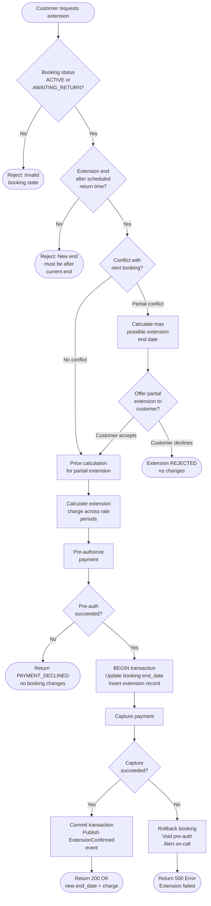
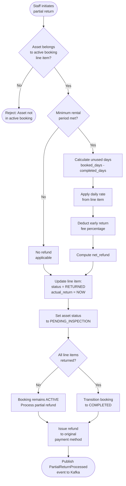

# Edge Cases: Booking Extensions and Partial Returns

**Domain:** Booking Lifecycle  
**Owner:** Booking Engineering  
**Criticality Summary:** 2× P0, 5× P1  
**Related Services:** Booking Service, Pricing Service, Payment Service, Inventory Service

---

## 1. Overview

Booking extensions and partial returns are among the most complex post-confirmation mutations in a rental system. They interact with pricing engines, availability windows, payment captures, and asset state machines simultaneously. Every extension is a potential double-booking; every partial return is a potential refund calculation error. This document exhaustively covers each failure mode.

---

## 2. EC-EXT-001 — Extension Conflicts with Next Confirmed Booking

### Scenario
Customer A has asset `VAN-012` booked Mon–Wed. Customer B has the same asset booked Thu–Sat. Customer A requests an extension to Thu. The system must detect the conflict before the extension is approved.

### Conflict Detection Query
```sql
SELECT b.booking_id,
       b.customer_id,
       b.start_date,
       b.end_date
FROM   bookings b
WHERE  b.asset_id  = :assetId
  AND  b.booking_id != :currentBookingId
  AND  b.status    NOT IN ('CANCELLED', 'COMPLETED', 'NO_SHOW')
  AND  b.start_date < :requestedNewEndDate
  AND  b.end_date   > :currentEndDate
ORDER BY b.start_date ASC
LIMIT  1;
```

### Resolution Decision Tree
```
IF conflict_booking EXISTS:
  next_available_end = conflict_booking.start_date - buffer_hours(asset.category)
  IF requested_extension_end <= next_available_end:
    APPROVE extension up to next_available_end
    -- Customer may get a shorter extension than requested
  ELSE:
    REJECT extension
    Response: {
      "error": "EXTENSION_CONFLICT",
      "message": "Asset is booked from {conflict_start}. Max extension to {next_available_end}.",
      "max_extension_end": next_available_end,
      "conflicting_booking_id": conflict_booking.booking_id  -- Only shown to staff
    }
ELSE:
  APPROVE full extension as requested
```

### Partial Extension Approval
If the customer requests +3 days but only +1 day is available before next booking:
- Offer partial approval: extend by 1 day at the correct rate.
- Customer must explicitly accept the partial extension via API `PATCH /bookings/{id}/extension?action=accept_partial`.
- If customer does not respond within 2 hours, extension request expires.

---

## 3. EC-EXT-002 — Extension Spans a Rate Period Boundary

### Scenario
Asset daily rate is $80/day on weekdays and $120/day on weekends. Booking ends Friday; customer requests 2-day extension through Sunday. The pricing must be calculated correctly across the rate boundary.

### Rate Period Schema
```sql
CREATE TABLE pricing_rules (
    rule_id       UUID PRIMARY KEY DEFAULT gen_random_uuid(),
    category_id   UUID NOT NULL REFERENCES asset_categories(category_id),
    day_of_week   INTEGER[],        -- 0=Sun, 1=Mon ... 6=Sat; NULL = all days
    valid_from    DATE,
    valid_until   DATE,
    daily_rate    NUMERIC(10,2) NOT NULL,
    priority      INTEGER NOT NULL DEFAULT 0
);
```

### Extension Pricing Calculation
```python
def calculate_extension_price(asset_id, extension_start, extension_end, category_id):
    """
    Calculates total cost for an extension period, applying correct daily rates
    for each calendar day in the extension window.
    """
    total = Decimal("0.00")
    current_day = extension_start.date()
    end_day = extension_end.date()

    while current_day < end_day:
        rate = get_applicable_rate(
            category_id=category_id,
            date=current_day
        )
        total += rate
        current_day += timedelta(days=1)

    # Apply partial-day billing for last day if extension ends mid-day
    last_day_hours = (extension_end - datetime.combine(end_day, time(0,0))).seconds / 3600
    if last_day_hours > 0:
        hourly_rate = get_applicable_rate(category_id, end_day) / 24
        total += Decimal(str(round(hourly_rate * last_day_hours, 2)))

    return total
```

### Example Calculation
| Day | Rate Applied | Amount |
|-----|-------------|--------|
| Saturday | Weekend rate: $120/day | $120.00 |
| Sunday | Weekend rate: $120/day | $120.00 |
| **Total extension charge** | | **$240.00** |

### Pricing Locked at Extension Approval Time
- The extension charge is calculated and locked at the moment the extension is approved.
- Future rate changes do not affect a confirmed extension.
- A `pricing_snapshot` JSONB column on the `booking_extensions` table stores the rate breakdown.

---

## 4. EC-EXT-003 — Partial Return: One Asset from a Multi-Asset Booking

### Scenario
A booking contains 3 assets: Excavator, Generator, Water Pump. The customer returns the Generator early (day 3 of 7). The remaining assets continue until day 7. A partial refund must be calculated for the Generator's unused days.

### Multi-Asset Booking Schema
```sql
CREATE TABLE booking_line_items (
    line_item_id  UUID PRIMARY KEY DEFAULT gen_random_uuid(),
    booking_id    UUID NOT NULL REFERENCES bookings(booking_id),
    asset_id      UUID NOT NULL REFERENCES assets(asset_id),
    daily_rate    NUMERIC(10,2) NOT NULL,
    start_date    TIMESTAMPTZ NOT NULL,
    end_date      TIMESTAMPTZ NOT NULL,      -- Updated on partial return
    actual_return TIMESTAMPTZ,               -- Set when asset physically returned
    status        TEXT NOT NULL DEFAULT 'ACTIVE'
                  CHECK (status IN ('ACTIVE', 'RETURNED', 'EXTENDED'))
);
```

### Partial Return Workflow
```
1. Staff scans/selects returning asset → identifies line_item_id
2. System validates: asset is part of an ACTIVE booking
3. System calculates partial refund (see formula in §5)
4. System updates:
   - booking_line_items.actual_return = NOW()
   - booking_line_items.status = 'RETURNED'
   - assets.status = 'PENDING_INSPECTION'
5. Partial refund is processed immediately (or as credit)
6. Parent booking remains ACTIVE until all line items returned
7. Parent booking transitions to COMPLETED when last line_item RETURNED
```

### Asset Status After Partial Return
- Returned asset → `PENDING_INSPECTION` (staff must inspect before re-listing).
- Returned asset → `AVAILABLE` after inspection passes (manual trigger or auto after 1 hour).
- Parent booking remains open; customer is NOT charged the extension fee.

---

## 5. Pro-Rated Refund Calculation Formula

### Formula
```
booked_days      = (original_end_date - original_start_date).days
completed_days   = (actual_return_date - original_start_date).days  [minimum 1]
unused_days      = booked_days - completed_days
daily_rate       = line_item.daily_rate (locked at booking creation)

gross_refund     = unused_days × daily_rate
early_return_fee = gross_refund × early_return_fee_pct   [default: 10%]
net_refund       = gross_refund - early_return_fee

-- Minimum rental period enforcement
IF completed_days < minimum_rental_days:
    net_refund = 0   [no refund within minimum rental period]
```

### Example 1 — Standard Partial Return
| Parameter | Value |
|-----------|-------|
| Booked days | 7 |
| Actual return | Day 3 |
| Daily rate | $85/day |
| Early return fee | 10% |
| Gross refund | (7 - 3) × $85 = **$340.00** |
| Early return fee | 10% × $340 = **$34.00** |
| **Net refund** | $340 - $34 = **$306.00** |

### Example 2 — Within Minimum Rental Period
| Parameter | Value |
|-----------|-------|
| Booked days | 14 |
| Minimum rental days | 3 |
| Actual return | Day 2 |
| Net refund | **$0** (minimum period not met) |

### Example 3 — Multi-Asset Partial Return
| Asset | Daily Rate | Booked Days | Returned Day | Net Refund |
|-------|-----------|-------------|--------------|------------|
| Excavator | $450/day | 7 | Still active | — |
| Generator | $120/day | 7 | Day 3 | (7-3)×$120 × 0.9 = **$432.00** |
| Water Pump | $60/day | 7 | Still active | — |

---

## 6. EC-EXT-004 — Extension Approved but Payment Fails → Rollback

### Scenario
Customer requests 2-day extension. System approves (no conflict), creates extension record, and attempts to charge the additional $160. The payment fails (card declined). The extension must be rolled back atomically.

### Two-Phase Extension Commit
```
Phase 1 — Pre-authorize:
  1. Call payment service: pre-authorize $160 on customer's card
  2. IF pre-auth fails:
     - Return PAYMENT_DECLINED error to customer
     - No booking changes made
     - STOP

Phase 2 — Commit (only if pre-auth succeeded):
  1. BEGIN transaction
  2. UPDATE bookings SET end_date = new_end_date WHERE booking_id = :id
  3. INSERT INTO booking_extensions (...) VALUES (...)
  4. COMMIT
  5. Capture the pre-authorized payment
  6. IF capture fails:
     - Rollback booking changes (compensating transaction)
     - Void the pre-authorization
     - Notify customer: "Extension could not be processed"
     - Alert on-call engineer (payment/booking state mismatch risk)
```

### State Machine for Extensions
```
EXTENSION_REQUESTED → PAYMENT_PRE_AUTHORIZED → COMMITTED
                                              ↘ PAYMENT_CAPTURE_FAILED → ROLLED_BACK
                    ↘ PAYMENT_DECLINED → REJECTED
```

### Rollback Implementation
```sql
-- Compensating transaction if capture fails after commit
BEGIN;
UPDATE bookings
SET    end_date    = :originalEndDate,
       updated_at  = NOW(),
       version     = version + 1
WHERE  booking_id  = :bookingId
  AND  version     = :expectedVersion;

UPDATE booking_extensions
SET    status      = 'ROLLED_BACK',
       rolled_back_at = NOW()
WHERE  extension_id = :extensionId;
COMMIT;
```

---

## 7. EC-EXT-005 — Extension Request After Actual Return Time

### Scenario
Customer's booking officially ended at 2:00 PM. Customer calls at 3:30 PM claiming they still have the asset and need to extend. The booking is already in `AWAITING_RETURN` state (grace period still active) or has been auto-closed.

### Case A: Within Return Grace Period (default: 2 hours after end)
- Booking is still `AWAITING_RETURN`.
- Extension can be processed retroactively from the original end time.
- Late fee from 2:00 PM to 3:30 PM is automatically added to extension charge.
- Staff must confirm asset is physically still with customer before processing.

### Case B: After Grace Period — Booking Auto-Closed
- Booking status is `LATE_RETURN` or `COMPLETED` (auto-closed by scheduler).
- Extension cannot be processed; must create a NEW booking.
- System checks if asset is still assigned to this customer (GPS/RFID).
- If confirmed: create new booking from 3:30 PM; apply surcharge rate (1.5× daily).
- Late fee for the gap period (2:00 PM – 3:30 PM) is calculated separately.

### Late Fee Formula
```
late_hours        = (actual_return_time - scheduled_end_time).hours
hourly_rate       = daily_rate / 24
late_multiplier   = 1.5   [configurable per category]
late_fee          = late_hours × hourly_rate × late_multiplier

-- Cap late fee at 1 full daily rate (prevent excessive charges)
late_fee          = min(late_fee, daily_rate)
```

---

## 8. EC-EXT-006 — Multiple Consecutive Extensions

### Scenario
Customer extends the same booking 4 times. Each extension is independent but the cumulative effect on pricing, availability, and the next customer's booking must be tracked correctly.

### Data Model
```sql
CREATE TABLE booking_extensions (
    extension_id     UUID PRIMARY KEY DEFAULT gen_random_uuid(),
    booking_id       UUID NOT NULL REFERENCES bookings(booking_id),
    sequence_number  INTEGER NOT NULL,           -- 1, 2, 3, 4...
    previous_end     TIMESTAMPTZ NOT NULL,
    new_end          TIMESTAMPTZ NOT NULL,
    extension_days   INTEGER NOT NULL,
    daily_rate       NUMERIC(10,2) NOT NULL,
    total_charge     NUMERIC(10,2) NOT NULL,
    payment_id       UUID REFERENCES payments(payment_id),
    status           TEXT NOT NULL DEFAULT 'ACTIVE'
                     CHECK (status IN ('ACTIVE', 'ROLLED_BACK', 'SUPERSEDED')),
    created_at       TIMESTAMPTZ NOT NULL DEFAULT NOW()
);
```

### Consecutive Extension Rules
1. Maximum 5 extensions per booking (configurable).
2. Maximum total rental period = 90 days (configurable per category).
3. Each extension's `previous_end` must equal the current booking's `end_date` at time of request.
4. Concurrent extension requests are rejected: lock booking row before processing.
5. If extension #3 is rolled back, extensions #4 and #5 are automatically `SUPERSEDED`.

### Cumulative Pricing Audit
```sql
SELECT
    b.booking_id,
    b.start_date,
    b.end_date AS current_end,
    SUM(be.total_charge) AS total_extension_charges,
    b.base_amount + SUM(be.total_charge) AS total_booking_value
FROM bookings b
JOIN booking_extensions be ON be.booking_id = b.booking_id
WHERE b.booking_id = :bookingId
  AND be.status = 'ACTIVE'
GROUP BY b.booking_id, b.start_date, b.end_date, b.base_amount;
```

---

## 9. EC-EXT-007 — Pro-Rated Refund Calculated Incorrectly

### Common Bugs
1. **Timezone error**: Using `DATE` type instead of `TIMESTAMPTZ` causes off-by-one errors near midnight.
2. **Leap year**: February 29 included in day count incorrectly.
3. **DST transition**: 23-hour day during spring-forward counted as full day.
4. **Rounding**: Floating-point arithmetic used instead of `NUMERIC`/`Decimal`.

### Correct Implementation Rules
- All datetime arithmetic uses UTC internally; display converts to customer timezone.
- Day count uses `EXTRACT(EPOCH FROM (end_date - start_date)) / 86400` for fractional days.
- All monetary calculations use `NUMERIC(12,4)` with explicit `ROUND(..., 2)` at display time.
- Refund amount stored as integer cents in the database to avoid floating-point issues.

---

## 10. Extension Decision Flowchart



---

## 11. Partial Return Calculation Flowchart



---

## 12. Monitoring & Alerting

| Metric | Threshold | Alert | Action |
|--------|-----------|-------|--------|
| Extension conflict rate | > 20% of requests | Slack #bookings | Review fleet utilization |
| Extension rollback rate | > 2% | PagerDuty P2 | Investigate payment service |
| Partial refund errors | > 0 per day | PagerDuty P1 | Audit refund calculations |
| Extensions beyond limit | Any | Slack #bookings | Manual review required |
| Late extension requests | > 5% | Slack #ops | Review grace period policy |

---

*Owner: Booking Engineering | Review: Quarterly | Last updated: 2025*
