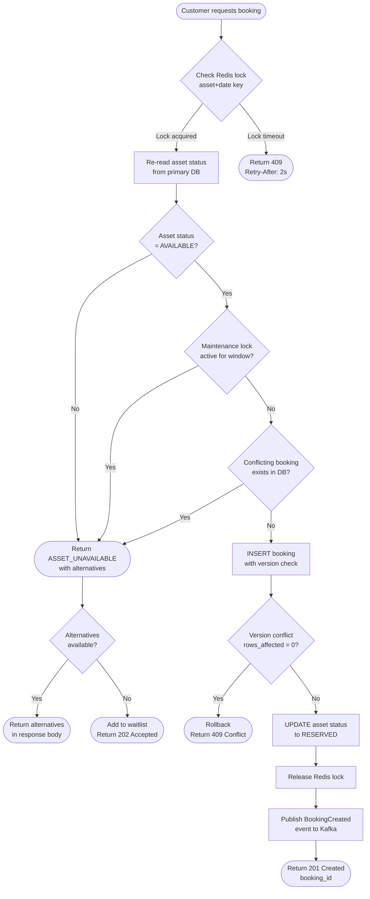

# Edge Cases: Inventory Availability Conflicts

**Domain:** Inventory Management  
**Owner:** Backend Engineering  
**Criticality Summary:** 3× P0, 4× P1  
**Related Services:** Booking Service, Inventory Service, Notification Service

---

## 1. Overview

Inventory availability is the single most contested resource in a rental system. Every confirmed booking reserves capacity; every return releases it. The window between a customer checking availability and actually confirming a booking is a race condition. This document covers every failure mode in that window, plus downstream conflicts when asset state diverges from booking state.

---

## 2. EC-INV-001 — Concurrent Booking Requests for the Same Asset

### Scenario
Two customers simultaneously view asset `ASSET-042` as available. Both submit a booking request within 200ms of each other. Without proper locking, both bookings may be confirmed, resulting in a double-booking.

### Root Cause
- Availability check and booking insertion are not atomic.
- Read-then-write pattern without an exclusive lock allows interleaving.

### Database-Level Prevention

**Optimistic Locking (preferred for read-heavy workloads):**
```sql
-- Assets table has a version column
UPDATE assets
SET    status = 'RESERVED',
       version = version + 1,
       updated_at = NOW()
WHERE  asset_id = :assetId
  AND  status = 'AVAILABLE'
  AND  version = :expectedVersion;

-- If rows_affected = 0 → version mismatch → another transaction won → retry or reject
```

**Pessimistic Locking (for write-heavy contention windows):**
```sql
BEGIN;
SELECT asset_id, status
FROM   assets
WHERE  asset_id = :assetId
FOR UPDATE NOWAIT;           -- NOWAIT raises error immediately if locked

-- Proceed only if status = 'AVAILABLE'
INSERT INTO bookings (...) VALUES (...);
UPDATE assets SET status = 'RESERVED' WHERE asset_id = :assetId;
COMMIT;
```

### Application-Level Prevention
- Use a Redis distributed lock keyed on `lock:asset:{assetId}:{date}` with TTL = 5 seconds.
- Acquire lock before checking availability; release after write completes.
- If lock acquisition fails (another holder), return HTTP 409 Conflict with `Retry-After: 2`.

### Resolution Strategy
- First-write wins: the booking that acquires the lock is confirmed.
- Second writer receives `ASSET_UNAVAILABLE` error with suggested alternatives.
- If no alternative exists, add customer to waitlist (see EC-INV-007).

### Test Cases
| Test | Expected Outcome |
|------|-----------------|
| Two concurrent requests, 0ms apart | Only one booking confirmed |
| Lock acquisition timeout (5s exceeded) | HTTP 503 with retry hint |
| Optimistic lock version mismatch | Transaction rolled back, retry attempted |

---

## 3. EC-INV-002 — Double-Booking Despite Row-Level Lock

### Scenario
A bug in the application layer acquires the lock but does not check the asset status within the locked transaction, leading to a booking being created against an already-reserved asset.

### Root Cause
- Lock is acquired on the `assets` row but the `bookings` table insert does not re-validate asset status post-lock.
- Application reads availability from a cache that has not been invalidated.

### Prevention
1. **Re-validate inside the transaction**: After acquiring lock, re-read asset status from the primary database (not read replica or cache).
2. **Unique constraint on bookings table**:
```sql
CREATE UNIQUE INDEX uq_asset_active_booking
ON bookings (asset_id, start_date, end_date)
WHERE status NOT IN ('CANCELLED', 'COMPLETED');
```
3. **Conflict detection query** (run before INSERT):
```sql
SELECT COUNT(*) AS conflict_count
FROM   bookings
WHERE  asset_id    = :assetId
  AND  status      NOT IN ('CANCELLED', 'COMPLETED')
  AND  start_date  < :requestedEndDate
  AND  end_date    > :requestedStartDate;
-- If conflict_count > 0 → reject booking
```

### Resolution
- If double-booking is detected post-confirmation (data integrity audit finds it), escalate immediately.
- Notify affected customers; offer asset substitute or full refund.
- Apply compensating transaction to cancel the lower-priority booking (later-created booking is cancelled).

---

## 4. EC-INV-003 — Asset Locked for Pickup but Not Checked Out Within Grace Period

### Scenario
A booking transitions to `AWAITING_PICKUP` at the scheduled start time. The asset is locked (not available for other bookings). The customer does not arrive. After the grace period (default: 2 hours), the booking should be handled — but no automated process runs.

### State Transition

```
CONFIRMED → AWAITING_PICKUP → [grace period expires] → NO_SHOW
```

### Grace Period Policy
- Default grace period: **2 hours** from scheduled pickup time.
- Configurable per asset category (e.g., vehicles: 30 minutes; equipment: 4 hours).
- Stored in `asset_categories.pickup_grace_minutes`.

### Automated Resolution (Scheduled Job)
```sql
-- Run every 15 minutes via cron / ECS scheduled task
UPDATE bookings
SET    status     = 'NO_SHOW',
       updated_at = NOW(),
       no_show_at = NOW()
WHERE  status     = 'AWAITING_PICKUP'
  AND  start_date + INTERVAL '1 minute' * (
           SELECT pickup_grace_minutes
           FROM   asset_categories ac
           JOIN   assets a ON a.category_id = ac.id
           WHERE  a.asset_id = bookings.asset_id
       ) < NOW();
```

After marking `NO_SHOW`:
1. Release asset back to `AVAILABLE`.
2. Apply no-show fee per pricing policy.
3. Notify next waitlisted customer if any.
4. Send customer notification (no-show recorded, fee charged).

### Deposit Handling on No-Show
- No-show fee = minimum of (`no_show_fee_pct` × rental amount) or full deposit.
- Remaining deposit is released.
- If deposit pre-auth only (not captured), capture the no-show fee amount.

---

## 5. EC-INV-004 — Asset Marked Available but Actually in Maintenance

### Scenario
A maintenance work order is created for asset `TRUCK-017` in the maintenance system, but the inventory service is not notified (integration failure), so the asset remains `AVAILABLE` in the booking system. A customer books it successfully. Staff attempt checkout and discover the asset is physically unavailable.

### Root Cause
- Maintenance system and inventory service are loosely coupled via a message queue.
- Queue message dropped or consumer was offline when the maintenance work order was created.

### Prevention
1. **Dual-write with saga**: When creating a maintenance work order, the maintenance service publishes an event AND calls the inventory service synchronously as part of a distributed transaction.
2. **Reconciliation job**: Every 5 minutes, compare `assets.status` against open work orders in the maintenance system. Any mismatch triggers an alert and auto-correction.
3. **Maintenance lock field**: Add `maintenance_locked_until TIMESTAMP` to assets table. Any booking query excludes assets where `maintenance_locked_until > NOW()`.

### SQL: Maintenance-Safe Availability Query
```sql
SELECT a.asset_id, a.name, a.category_id
FROM   assets a
WHERE  a.status = 'AVAILABLE'
  AND  (a.maintenance_locked_until IS NULL OR a.maintenance_locked_until <= NOW())
  AND  a.asset_id NOT IN (
           SELECT asset_id
           FROM   bookings
           WHERE  status NOT IN ('CANCELLED', 'COMPLETED', 'NO_SHOW')
             AND  start_date < :requestedEndDate
             AND  end_date   > :requestedStartDate
       )
ORDER BY a.name;
```

### Resolution at Checkout
1. Staff cannot check out — system blocks checkout for maintenance-locked assets.
2. System automatically searches for substitute asset (same category, available window).
3. If substitute found: offer upgrade/same-category swap to customer, no charge.
4. If no substitute: cancel booking with full refund + $25 inconvenience credit.
5. Alert sent to operations team to investigate maintenance system sync failure.

---

## 6. EC-INV-005 — Asset Breaks Down After Booking Confirmed but Before Pickup

### Scenario
A vehicle (`CAR-089`) has a confirmed booking for tomorrow. Today, during a pre-rental inspection, staff discover the engine warning light is on. The asset cannot be rented until repaired.

### Workflow
1. Staff reports breakdown → creates emergency maintenance work order.
2. System sets `assets.status = 'MAINTENANCE'` and `maintenance_locked_until = repair_estimated_completion`.
3. System queries all future confirmed bookings for `CAR-089` where `start_date > NOW()`.
4. For each affected booking, initiate the **Breakdown Displacement Workflow**.

### Breakdown Displacement Workflow
```
For each affected_booking:
  1. Find substitute_asset WHERE:
     - category_id = affected_booking.asset.category_id
     - status = 'AVAILABLE'
     - NOT IN conflicting bookings for the same window
  2. IF substitute_asset found:
     a. Offer customer: same-category asset, same price, no action required
     b. If customer accepts: re-assign booking to substitute_asset
     c. If customer declines: full refund, booking CANCELLED
  3. IF no substitute_asset:
     a. Notify customer: breakdown, no substitute available
     b. Options: reschedule (if future dates open) OR full refund + $50 credit
     c. Booking remains PENDING_CUSTOMER_RESPONSE for 24h
     d. If no response in 24h: auto-cancel with full refund
```

### Notification Templates
- **With substitute**: "Your booking for [Asset Name] has been updated. We've arranged an equivalent [Category]. No action needed."
- **Without substitute**: "We regret that [Asset Name] is temporarily unavailable. Please select: Reschedule | Refund."

---

## 7. EC-INV-006 — Fleet-Wide Availability with Maintenance Windows

### Scenario
Customer searches for "any sedan available from Friday 2pm to Sunday 2pm." The system must calculate availability across the entire sedan fleet, accounting for: existing bookings, maintenance windows, and assets reserved for specific corporate clients.

### Availability Calculation Algorithm

```sql
-- Step 1: Find all sedans not in active bookings during requested window
WITH requested AS (
    SELECT
        :startDate::TIMESTAMPTZ AS window_start,
        :endDate::TIMESTAMPTZ   AS window_end
),
booked_assets AS (
    SELECT DISTINCT b.asset_id
    FROM   bookings b, requested r
    WHERE  b.status NOT IN ('CANCELLED', 'COMPLETED', 'NO_SHOW')
      AND  b.start_date < r.window_end
      AND  b.end_date   > r.window_start
),
maintenance_assets AS (
    SELECT DISTINCT a.asset_id
    FROM   assets a, requested r
    WHERE  a.maintenance_locked_until IS NOT NULL
      AND  a.maintenance_locked_until > r.window_start
),
reserved_assets AS (
    SELECT DISTINCT ar.asset_id
    FROM   asset_reservations ar, requested r
    WHERE  ar.client_id != :requestingClientId
      AND  ar.reserved_from < r.window_end
      AND  ar.reserved_until > r.window_start
)
SELECT a.asset_id, a.name, a.daily_rate
FROM   assets a
WHERE  a.category_id = :categoryId
  AND  a.status      = 'AVAILABLE'
  AND  a.asset_id    NOT IN (SELECT asset_id FROM booked_assets)
  AND  a.asset_id    NOT IN (SELECT asset_id FROM maintenance_assets)
  AND  a.asset_id    NOT IN (SELECT asset_id FROM reserved_assets)
ORDER BY a.daily_rate ASC;
```

### Edge Cases in Fleet Calculation
- **Maintenance window spans partial booking period**: Asset available Mon–Thu, maintenance Thu–Sat, booking requested Mon–Fri → asset is unavailable for the full request.
- **Buffer time between rentals**: Insert a minimum 1-hour buffer after each return before the asset becomes available again (cleaning/inspection time). Enforced by: `end_date + INTERVAL '1 hour' > :requestedStartDate`.
- **Asset in transit**: Asset being moved between locations is locked; queried by `assets.location_id = :requestedLocationId` to prevent cross-location mismatch.

---

## 8. EC-INV-007 — No Substitute Asset Available for Displaced Booking

### Scenario
Asset breaks down, booking is displaced, but no same-category substitute exists in the fleet for that time window. Customer is placed on a waitlist.

### Waitlist Schema
```sql
CREATE TABLE booking_waitlist (
    waitlist_id   UUID PRIMARY KEY DEFAULT gen_random_uuid(),
    customer_id   UUID NOT NULL REFERENCES customers(customer_id),
    category_id   UUID NOT NULL REFERENCES asset_categories(category_id),
    location_id   UUID NOT NULL REFERENCES locations(location_id),
    desired_start TIMESTAMPTZ NOT NULL,
    desired_end   TIMESTAMPTZ NOT NULL,
    max_wait_hrs  INTEGER NOT NULL DEFAULT 24,
    status        TEXT NOT NULL DEFAULT 'WAITING'
                  CHECK (status IN ('WAITING', 'NOTIFIED', 'CONVERTED', 'EXPIRED')),
    created_at    TIMESTAMPTZ NOT NULL DEFAULT NOW(),
    notified_at   TIMESTAMPTZ,
    expires_at    TIMESTAMPTZ NOT NULL
);
```

### Waitlist Processing
```
Trigger: Any booking CANCELLED or asset becomes AVAILABLE
  1. Query waitlist WHERE:
     - category_id matches newly-available asset
     - desired_start/end overlaps with available window
     - status = 'WAITING'
     - expires_at > NOW()
  2. Order by: created_at ASC (first-in-first-out)
  3. Notify first matching customer:
     - Push notification + email
     - Hold asset for customer for 30 minutes
     - If customer books within 30 min: convert waitlist entry, create booking
     - If customer does not respond: notify next customer, release hold
  4. Mark notified entry as NOTIFIED
```

---

## 9. Conflict Detection Flowchart



---

## 10. Resolution Strategy Matrix

| Scenario | Primary Resolution | Fallback | Customer Communication |
|----------|--------------------|----------|------------------------|
| Double-book race (prevented) | First-write-wins via DB lock | Retry with new availability | Show alternatives |
| Asset in maintenance | Substitute same-category | Reschedule or full refund | Proactive notification |
| Breakdown before pickup | Auto-substitute assignment | Full refund + $50 credit | Email + push within 15 min |
| No-show grace period | Mark NO_SHOW, release asset | Charge no-show fee | SMS alert at grace period start |
| No substitute for waitlist | Add to waitlist (FIFO) | Manual operations team override | Confirmation email with waitlist position |

---

## 11. Monitoring & Alerting

| Metric | Alert Threshold | Alert Channel | Runbook |
|--------|----------------|---------------|---------|
| Booking conflict rate | > 5% of attempts | PagerDuty P2 | Check lock contention |
| Double-booking incidents | > 0 per day | PagerDuty P0 | Immediate DB audit |
| No-show rate | > 15% | Slack #ops | Review grace period policy |
| Maintenance sync lag | > 5 minutes | Slack #inventory | Check queue consumer |
| Availability query p95 | > 100ms | PagerDuty P2 | Check query plan + indexes |

---

*Owner: Inventory Engineering | Review: Quarterly | Last updated: 2025*
