# Domain Model — Rental Management System

This document defines the core domain entities, their attributes, methods, and
relationships for the Rental Management System. The model follows Domain-Driven
Design (DDD) principles with clearly bounded contexts, rich domain objects, and
explicit aggregate boundaries.

---

## Bounded Contexts

| Context | Aggregates |
|---|---|
| **Catalogue** | Asset, AssetCategory, RentalRate, RateModifier |
| **Booking** | BookingRequest, Customer |
| **Operations** | Rental, RentalContract, SecurityDeposit |
| **Condition** | Damage, ConditionReport |
| **Finance** | Payment, Invoice |
| **Maintenance** | MaintenanceJob |

---

## Class Diagram

```mermaid
classDiagram
    direction TB

    class Asset {
        +UUID id
        +String name
        +String description
        +AssetStatus status
        +String make
        +String model
        +Int year
        +String licensePlate
        +String vin
        +Decimal dailyRate
        +Decimal hourlyRate
        +Decimal depositPct
        +Decimal declaredValue
        +Boolean requiresInsurance
        +Int minRenterAge
        +UUID categoryId
        +String locationId
        +DateTime lastMaintenanceAt
        +Int currentMileage
        +isAvailable(start DateTime, end DateTime) Boolean
        +calculateRate(duration Duration) Decimal
        +lockForPickup(bookingId UUID) void
        +release() void
        +scheduleMaintenace(at DateTime) MaintenanceJob
        +markUnderMaintenance() void
    }

    class AssetCategory {
        +UUID id
        +String name
        +String slug
        +String iconUrl
        +String policy
        +Decimal defaultDepositPct
        +Int minRentalHours
        +Int maxRentalDays
        +Boolean insuranceMandatory
        +Int minRenterAge
        +getDefaultRate() Decimal
        +applyPolicy(rental Rental) PolicyResult
    }

    class RentalRate {
        +UUID id
        +UUID assetId
        +RateType type
        +Decimal rate
        +String currency
        +Date validFrom
        +Date validTo
        +Boolean isActive
        +isCurrent() Boolean
        +overlaps(other RentalRate) Boolean
    }

    class RateModifier {
        +UUID id
        +UUID assetId
        +ModifierType type
        +Decimal factor
        +String applicableCondition
        +Date startDate
        +Date endDate
        +Int priority
        +String description
        +isApplicable(context RateContext) Boolean
        +apply(baseRate Decimal) Decimal
    }

    class Customer {
        +UUID id
        +String email
        +String phoneNumber
        +String firstName
        +String lastName
        +Date dateOfBirth
        +LoyaltyTier tier
        +Int loyaltyPoints
        +Boolean idVerified
        +Boolean blacklisted
        +String blacklistReason
        +UUID defaultPaymentMethodId
        +DateTime createdAt
        +canRent() Boolean
        +getApplicableDiscount() Decimal
        +verifyAge(minAge Int) Boolean
        +addLoyaltyPoints(points Int) void
        +redeemLoyaltyPoints(points Int) Boolean
        +suspend(reason String) void
    }

    class BookingRequest {
        +UUID id
        +UUID customerId
        +UUID assetId
        +DateTime requestedStart
        +DateTime requestedEnd
        +BookingStatus status
        +UUID quoteId
        +Decimal quotedAmount
        +Decimal depositAmount
        +String promoCode
        +String preAuthId
        +DateTime expiresAt
        +DateTime confirmedAt
        +DateTime cancelledAt
        +String cancellationReason
        +confirm(preAuthId String) void
        +cancel(reason String) void
        +expire() void
        +convertToRental() Rental
        +isExpired() Boolean
        +calculateCancellationFee() Decimal
    }

    class Rental {
        +UUID id
        +UUID bookingId
        +UUID customerId
        +UUID assetId
        +RentalStatus status
        +DateTime actualStart
        +DateTime scheduledEnd
        +DateTime actualEnd
        +Int startMileage
        +Int endMileage
        +String startFuelLevel
        +String endFuelLevel
        +Decimal baseAmount
        +Decimal taxAmount
        +Decimal totalAmount
        +Decimal lateFeeCharged
        +UUID contractId
        +UUID conditionReportPreId
        +UUID conditionReportPostId
        +extend(newEnd DateTime) ExtensionResult
        +initiateReturn(staffId UUID) ReturnSession
        +calculateLateFee() Decimal
        +close() void
        +calculateTotalOwed() Decimal
    }

    class RentalContract {
        +UUID id
        +UUID rentalId
        +String contractUrl
        +String contractHash
        +DateTime generatedAt
        +DateTime signedAt
        +String signatureData
        +String signerIpAddress
        +String signerUserAgent
        +Boolean isVoided
        +String voidReason
        +verify() Boolean
        +void(reason String) void
        +getSignedPdf() Blob
    }

    class SecurityDeposit {
        +UUID id
        +UUID rentalId
        +UUID customerId
        +Decimal amount
        +DepositStatus status
        +String preAuthId
        +String captureId
        +DateTime heldAt
        +DateTime releasedAt
        +DateTime assessmentDeadline
        +Decimal deductedAmount
        +String deductionReason
        +hold() void
        +capture() void
        +release() void
        +deduct(amount Decimal, reason String) void
        +forfeiture(reason String) void
        +startAssessmentWindow(hours Int) void
        +isAssessmentWindowOpen() Boolean
    }

    class ConditionReport {
        +UUID id
        +UUID rentalId
        +UUID assetId
        +UUID staffId
        +ReportType type
        +String[] photoUrls
        +String notes
        +Int mileageReading
        +String fuelLevel
        +Boolean hasDamage
        +DateTime capturedAt
        +String geoLocation
        +compare(other ConditionReport) Delta
        +addPhoto(url String) void
        +finalise() void
    }

    class Damage {
        +UUID id
        +UUID rentalId
        +UUID conditionReportId
        +UUID assetId
        +DamageType type
        +Severity severity
        +String description
        +String[] photoUrls
        +Decimal repairCostEstimate
        +Decimal repairCostActual
        +DamageStatus status
        +Boolean isDisputed
        +DateTime reportedAt
        +DateTime resolvedAt
        +UUID insuranceClaimId
        +assess(cost Decimal) void
        +dispute(reason String) void
        +resolve(outcome String) void
        +raiseInsuranceClaim() InsuranceClaim
        +calculateCustomerLiability() Decimal
    }

    class Payment {
        +UUID id
        +UUID rentalId
        +UUID customerId
        +Decimal amount
        +String currency
        +PaymentStatus status
        +PaymentType type
        +String gatewayReference
        +String gatewayProvider
        +DateTime initiatedAt
        +DateTime completedAt
        +Int retryCount
        +String failureReason
        +process() void
        +refund(amount Decimal, reason String) Refund
        +capture() void
        +void() void
        +retry() void
    }

    class Invoice {
        +UUID id
        +UUID rentalId
        +UUID customerId
        +String invoiceNumber
        +Decimal subtotal
        +Decimal taxAmount
        +Decimal total
        +InvoiceStatus status
        +DateTime issuedAt
        +DateTime dueAt
        +String pdfUrl
        +LineItem[] lineItems
        +generate() void
        +markPaid(paymentId UUID) void
        +void(reason String) void
    }

    class MaintenanceJob {
        +UUID id
        +UUID assetId
        +UUID assignedTechnicianId
        +JobStatus status
        +MaintenanceType type
        +String description
        +DateTime scheduledAt
        +DateTime startedAt
        +DateTime completedAt
        +Decimal estimatedCost
        +Decimal actualCost
        +String[] photoUrls
        +String resolutionNotes
        +start() void
        +complete(notes String, cost Decimal) void
        +cancel(reason String) void
        +reschedule(newDate DateTime) void
        +isOverdue() Boolean
    }

    %% ── Catalogue Context ──────────────────────────────────────────────────
    AssetCategory "1" --> "many" Asset : classifies
    Asset "1" --> "many" RentalRate : has
    Asset "1" --> "many" RateModifier : modified by

    %% ── Booking Context ────────────────────────────────────────────────────
    Customer "1" --> "many" BookingRequest : submits
    Asset "1" --> "many" BookingRequest : subject of

    %% ── Operations Context ─────────────────────────────────────────────────
    BookingRequest "1" --> "0..1" Rental : converts to
    Customer "1" --> "many" Rental : undertakes
    Asset "1" --> "many" Rental : rented via
    Rental "1" --> "1" RentalContract : governed by
    Rental "1" --> "1" SecurityDeposit : secured by
    Rental "1" --> "0..2" ConditionReport : documented by

    %% ── Condition & Finance ────────────────────────────────────────────────
    Rental "1" --> "many" Damage : may have
    ConditionReport "1" --> "many" Damage : surfaces
    Rental "1" --> "many" Payment : settled by
    Rental "1" --> "1" Invoice : billed via

    %% ── Maintenance ────────────────────────────────────────────────────────
    Asset "1" --> "many" MaintenanceJob : requires
```



---

## Enumeration Types

### `AssetStatus`
| Value | Description |
|---|---|
| `AVAILABLE` | Ready for rental |
| `RESERVED` | Locked by a confirmed booking |
| `RENTED` | Currently on an active rental |
| `UNDER_MAINTENANCE` | Off-fleet for servicing |
| `DECOMMISSIONED` | Permanently retired from fleet |

### `BookingStatus`
| Value | Description |
|---|---|
| `PENDING_PAYMENT` | Created, awaiting deposit pre-auth |
| `CONFIRMED` | Deposit pre-authorised, asset locked |
| `CHECKED_OUT` | Rental is active |
| `COMPLETED` | Rental closed successfully |
| `CANCELLED` | Cancelled before checkout |
| `EXPIRED` | Quote or hold timed out |
| `NO_SHOW` | Customer did not appear for pickup |

### `RentalStatus`
| Value | Description |
|---|---|
| `ACTIVE` | Rental in progress |
| `EXTENDED` | End date has been pushed out |
| `OVERDUE` | Past scheduled return, not yet returned |
| `RETURNED` | Asset handed back, in assessment window |
| `CLOSED` | All charges settled, deposit resolved |
| `DISPUTED` | Customer has raised a formal dispute |

### `DepositStatus`
| Value | Description |
|---|---|
| `PRE_AUTHORISED` | Card hold placed, not captured |
| `CAPTURED` | Funds captured (damage or overdue) |
| `RELEASED` | Full refund issued to customer |
| `PARTIALLY_RELEASED` | Portion deducted, remainder refunded |
| `FORFEITED` | Full deposit retained |

### `LoyaltyTier`
| Value | Discount | Points Multiplier |
|---|---|---|
| `BRONZE` | 0% | 1× |
| `SILVER` | 5% | 1.5× |
| `GOLD` | 10% | 2× |
| `PLATINUM` | 15% | 3× |

### `DamageType`
`SCRATCH` · `DENT` · `BROKEN_GLASS` · `INTERIOR_STAIN` · `MECHANICAL_FAILURE`
`TYRE_DAMAGE` · `MISSING_ACCESSORY` · `FLOOD_DAMAGE` · `COLLISION`

### `Severity`
`COSMETIC` · `MINOR` · `MODERATE` · `SEVERE` · `TOTAL_LOSS`

### `RateType`
`HOURLY` · `DAILY` · `WEEKLY` · `MONTHLY` · `WEEKEND` · `PEAK` · `OFF_PEAK`

### `ModifierType`
`SEASONAL_SURCHARGE` · `LOYALTY_DISCOUNT` · `LONG_TERM_DISCOUNT`
`PROMO_CODE` · `LAST_MINUTE_SURCHARGE` · `INSURANCE_BUNDLE`

### `MaintenanceType`
`ROUTINE_SERVICE` · `CORRECTIVE_REPAIR` · `DAMAGE_REPAIR` · `TYRE_CHANGE`
`CLEANING` · `RECALL_FIX` · `ANNUAL_INSPECTION`

### `JobStatus`
`SCHEDULED` · `IN_PROGRESS` · `COMPLETED` · `CANCELLED` · `OVERDUE`

### `PaymentType`
`RENTAL_CHARGE` · `DEPOSIT_PRE_AUTH` · `DEPOSIT_CAPTURE` · `DEPOSIT_RELEASE`
`LATE_FEE` · `DAMAGE_CHARGE` · `EXTENSION_CHARGE` · `REFUND`

---

## Entity Descriptions

### Asset
The central domain object representing a rentable physical item (vehicle, equipment,
property, etc.). An asset belongs to exactly one `AssetCategory` and transitions
between statuses through well-defined state machine transitions. It owns its rate
schedule (`RentalRate`) and can have multiple `RateModifier` records that the
`PricingEngine` evaluates at quote time.

Business rules:
- An asset cannot be booked if its status is not `AVAILABLE`.
- `lockForPickup()` is idempotent: calling it on an already-reserved asset returns
  the existing reservation.
- `declaredValue` drives the insurance requirement threshold; if the value exceeds
  the category threshold, `requiresInsurance` is automatically set `true`.

---

### AssetCategory
Groups assets with shared rental policies. Categories define default deposit
percentages, minimum rental durations, and insurance mandates. Individual assets
may override category defaults.

---

### RentalRate
A time-bounded price record for an asset. Multiple records may exist per asset
(e.g., a peak-season rate and an off-peak rate), but only one rate of each `RateType`
may be active for a given date. The `PricingEngine` selects the most specific
applicable rate at quote time.

---

### RateModifier
A multiplicative factor applied on top of the base rate. Modifiers are evaluated
in `priority` order. A `PROMO_CODE` modifier is validated by the `BookingService`
before being passed to the `PricingEngine`.

---

### Customer
Represents a registered renter. A customer must be `idVerified` to create their
first booking. The `blacklisted` flag blocks all new bookings. Loyalty tier
progression is computed nightly by a batch job based on cumulative rental spend.

Business rules:
- `canRent()` returns `false` if `blacklisted = true`, `idVerified = false`, or
  there is an open unpaid balance.
- `verifyAge(minAge)` compares `dateOfBirth` against today minus `minAge` years.

---

### BookingRequest
An intent to rent expressed by a customer. It is created in `PENDING_PAYMENT` state
and advances to `CONFIRMED` once the deposit pre-auth succeeds. An unconfirmed
booking expires automatically after the `expiresAt` timestamp (default: 15 minutes).
On expiry the asset lock is released.

---

### Rental
The authoritative record of an active or closed rental engagement. A `Rental` is
created from a `BookingRequest` at checkout. It records the physical state of the
asset at pickup (`startMileage`, `startFuelLevel`) and at return. Late-fee
calculation uses the formula:

> `lateFee = ceil((actualEnd − scheduledEnd).hours) × (dailyRate / 24) × 1.5`

---

### RentalContract
A PDF document generated at checkout, containing all rental terms, pricing,
conditions, and the customer's digital signature. The document is stored immutably
in S3. `contractHash` (SHA-256) is used to verify document integrity. A contract
may be voided only before the rental becomes `ACTIVE`.

---

### SecurityDeposit
Tracks the lifecycle of the customer's security deposit from pre-authorisation
through to release or deduction. The `assessmentDeadline` is set to 48 hours after
the asset is returned. If no `Damage` record is raised before the deadline, the
`DepositService` automatically calls `release()`.

---

### ConditionReport
A structured checklist and photo record of the asset's physical state at a given
point in time. There are two reports per rental: `PRE_RENTAL` (captured at checkout)
and `POST_RENTAL` (captured at return). The `compare()` method produces a structured
delta that drives the `DamageService`.

---

### Damage
A record of a specific defect identified at return. Each `Damage` belongs to a
`Rental` and references the `ConditionReport` that surfaced it. Customers may raise
a `dispute` within the assessment window. If an insurance policy applies, a claim
is raised automatically.

---

### Payment
Represents a single monetary transaction. Supports the full payment lifecycle:
pre-auth → capture → void/refund. The `retryCount` and `failureReason` fields are
populated by the `DunningEngine` during automated retry cycles.

---

### Invoice
A formal billing document issued per rental. Line items include the base rental
charge, taxes, late fees, and any damage deductions. The invoice is sealed as a
PDF and attached to the closing email notification.

---

### MaintenanceJob
Tracks a maintenance work order for an asset. While a job is `IN_PROGRESS` or
`SCHEDULED`, the asset status is `UNDER_MAINTENANCE` and cannot be booked. On
`complete()`, the asset status reverts to `AVAILABLE` and `lastMaintenanceAt` is
updated.

---

## Aggregate Boundaries

```
Aggregate Root: Asset
  └── RentalRate (value objects)
  └── RateModifier (value objects)

Aggregate Root: BookingRequest
  (references Customer.id and Asset.id — no direct object references)

Aggregate Root: Rental
  └── RentalContract
  └── SecurityDeposit
  └── ConditionReport (pre)
  └── ConditionReport (post)
  └── Damage[]
  └── Payment[]
  └── Invoice

Aggregate Root: Customer
  (references Rental.id list — loaded lazily)

Aggregate Root: MaintenanceJob
  (references Asset.id)
```

Cross-aggregate references are by identity (UUID) only. Aggregate roots are the
sole entry points for state mutation; no external service modifies internal
entities directly.
