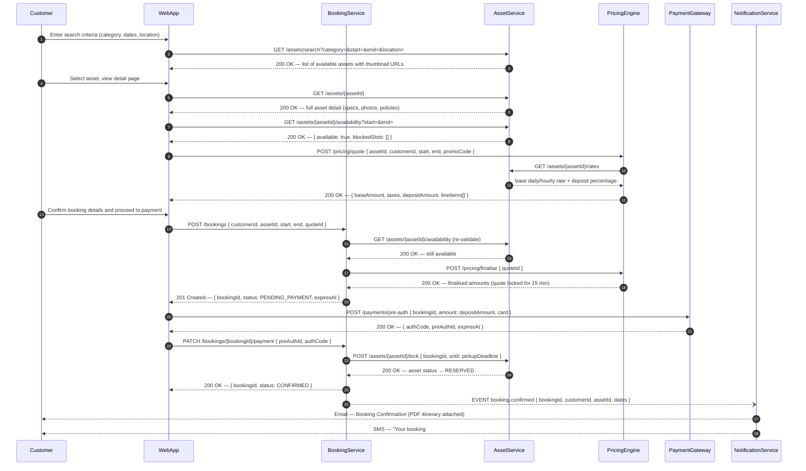
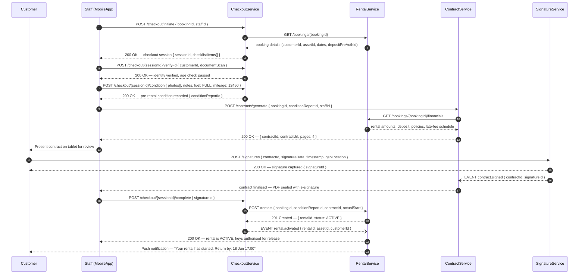
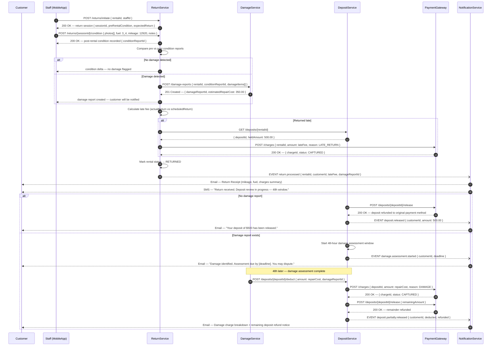
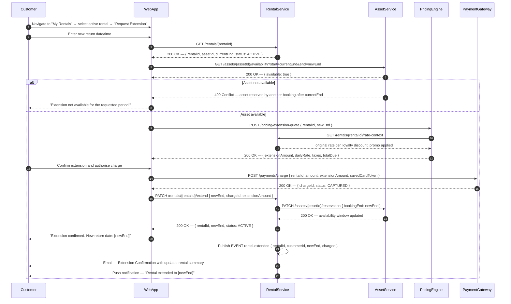
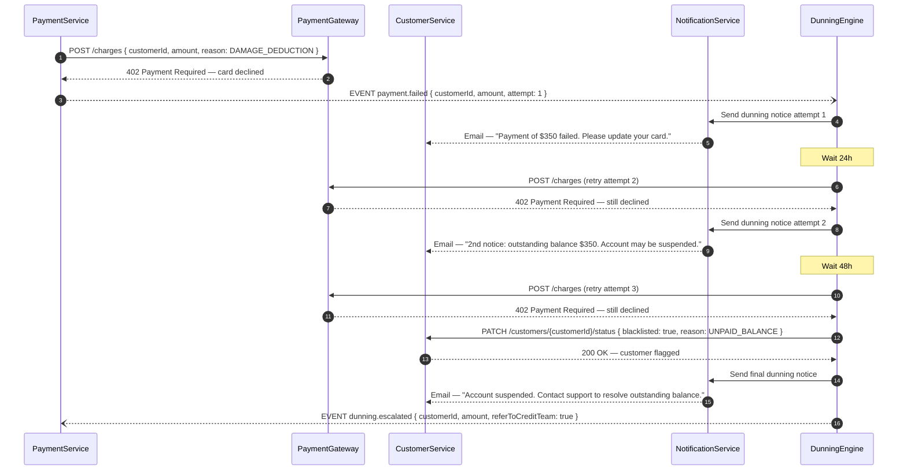

# System Sequence Diagrams — Rental Management System

This document captures the key interaction flows between actors and system components
for the Rental Management System. Each diagram uses UML sequence notation and
represents production-level behaviour including error paths, asynchronous events,
and compensating transactions.

---

## 1. Online Booking Flow

A registered customer searches for available assets, selects one, receives a dynamic
price quote, creates a booking, and pays a pre-authorised security deposit. The asset
is then locked for the customer's window and a confirmation is dispatched.

---

## 2. Asset Checkout Flow

Staff uses the mobile app to walk through the checkout process: they verify the
booking, record the asset's pre-rental condition, capture mileage and fuel readings,
generate a legally-binding rental contract, collect the customer's digital signature,
and activate the rental.

---

## 3. Asset Return and Deposit Release Flow

Staff processes the return: checks condition against the pre-rental report, records
closing mileage and fuel, raises damage claims if defects are found, charges any late
fees, notifies the customer, and manages the deposit release or deduction within the
48-hour damage assessment window.

---

## 4. Rental Extension Flow

A customer requests to extend an active rental from the web app. The system verifies
the asset is not reserved by another booking, recalculates the price for the
additional period, charges the stored payment method, updates the rental end date,
and notifies the customer.

---

## 5. Late Payment and Dunning Flow

When a charge fails post-rental (e.g., damage deduction), the system retries the
payment, escalates to dunning, and eventually blocks the customer if the debt
remains unresolved.

---

## Notes on Diagram Conventions

| Symbol | Meaning |
|--------|---------|
| `->>` | Synchronous request |
| `-->>` | Synchronous response |
| `-)` | Asynchronous fire-and-forget event |
| `Note over` | Contextual annotation or timer |
| `alt / else / end` | Conditional branching |

All services communicate over HTTPS REST internally via the API Gateway.
Asynchronous events (`->>`) are published to Apache Kafka topics and consumed by
subscriber services.

Error responses follow RFC 7807 `application/problem+json` format throughout.
